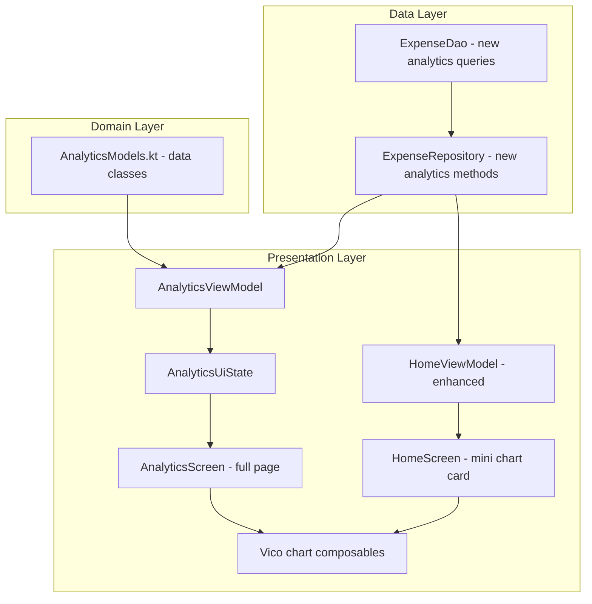
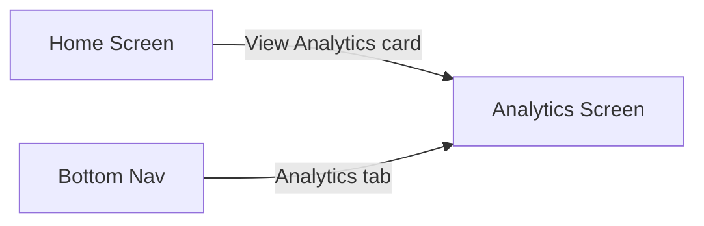
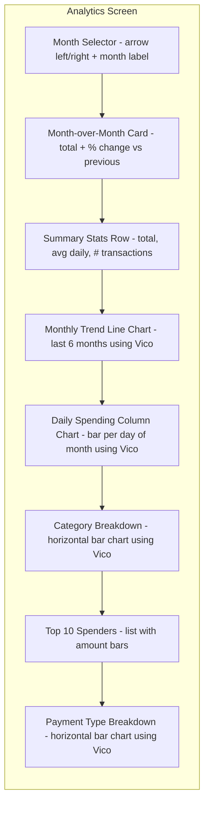

# PesaTrack — Expense Charts & Analytics Plan

## Overview

Add expense analytics with charts to PesaTrack using the **Vico** charting library. The feature consists of:

1. **Home Screen summary** — A compact spending-trend mini-chart + "View Analytics" card
2. **Dedicated Analytics Screen** — Full analytics with month selector, category breakdown bar chart, daily spending column chart, top spenders list, payment type breakdown, and month-over-month comparison

### Scope Decisions

| Include | Exclude |
|---------|---------|
| Category breakdown (horizontal bar chart) | Pie/donut charts |
| Monthly trend line (last 6 months) | Daily heatmap |
| Daily spending column chart (selected month) | Budget vs actual |
| Top spenders (recipients) list | Income vs expense |
| Payment type breakdown (bar chart) | |
| Month-over-month comparison (% change) | |

---

## Architecture

### Data Flow



### Navigation



The bottom nav will gain a third tab: **Home | Analytics | Expenses**

---

## New Files

| File | Purpose |
|------|---------|
| `domain/models/AnalyticsModels.kt` | Data classes for analytics results |
| `presentation/screens/analytics/AnalyticsScreen.kt` | Full analytics UI |
| `presentation/screens/analytics/AnalyticsViewModel.kt` | Analytics data loading + month selection |
| `presentation/screens/analytics/AnalyticsUiState.kt` | UI state model |

## Modified Files

| File | Changes |
|------|---------|
| `app/build.gradle.kts` | Add Vico dependency |
| `data/local/database/dao/ExpenseDao.kt` | Add 5 new analytics queries |
| `data/repository/ExpenseRepository.kt` | Add analytics repository methods |
| `presentation/navigation/Screen.kt` | Add `Analytics` route + bottom nav item |
| `presentation/navigation/NavGraph.kt` | Register analytics composable |
| `presentation/screens/home/HomeScreen.kt` | Add mini spending-trend card |
| `presentation/screens/home/HomeViewModel.kt` | Load last-6-months trend data |
| `presentation/screens/home/HomeUiState.kt` | Add `monthlyTrend` field |

---

## Detailed Design

### 1. Vico Dependency

Add to `app/build.gradle.kts`:

```kotlin
// Vico charting library (Compose)
implementation("com.patrykandpatrick.vico:compose-m3:2.0.1")
```

Vico 2.x is Compose-native and integrates with Material 3. No additional transitive dependencies needed.

### 2. New DAO Queries

Add to [`ExpenseDao.kt`](../android/app/src/main/java/com/pesatrack/data/local/database/dao/ExpenseDao.kt):

#### a) Monthly totals for last N months

```kotlin
@Query("""
    SELECT
        strftime('%Y-%m', timestamp / 1000, 'unixepoch', 'localtime') AS monthKey,
        COALESCE(SUM(amount), 0.0) AS total
    FROM expenses
    WHERE isExcluded = 0
      AND timestamp >= :sinceTimestamp
    GROUP BY monthKey
    ORDER BY monthKey ASC
""")
suspend fun getMonthlyTotals(sinceTimestamp: Long): List<MonthlyTotal>
```

#### b) Category totals for a month

```kotlin
@Query("""
    SELECT
        c.id AS categoryId,
        COALESCE(c.name, 'Uncategorized') AS categoryName,
        c.color AS categoryColor,
        c.parentId AS parentId,
        COALESCE(SUM(e.amount), 0.0) AS total,
        COUNT(e.id) AS transactionCount
    FROM expenses e
    LEFT JOIN categories c ON e.categoryId = c.id
    WHERE e.isExcluded = 0
      AND e.timestamp >= :startOfMonth AND e.timestamp < :endOfMonth
    GROUP BY e.categoryId
    ORDER BY total DESC
""")
suspend fun getCategoryTotalsForMonth(
    startOfMonth: Long,
    endOfMonth: Long
): List<CategoryTotal>
```

#### c) Daily totals for a month

```kotlin
@Query("""
    SELECT
        strftime('%d', timestamp / 1000, 'unixepoch', 'localtime') AS dayOfMonth,
        COALESCE(SUM(amount), 0.0) AS total
    FROM expenses
    WHERE isExcluded = 0
      AND timestamp >= :startOfMonth AND timestamp < :endOfMonth
    GROUP BY dayOfMonth
    ORDER BY dayOfMonth ASC
""")
suspend fun getDailyTotalsForMonth(
    startOfMonth: Long,
    endOfMonth: Long
): List<DailyTotal>
```

#### d) Top spenders for a month

```kotlin
@Query("""
    SELECT
        COALESCE(recipientName, recipient) AS recipientKey,
        COALESCE(SUM(amount), 0.0) AS total,
        COUNT(*) AS transactionCount
    FROM expenses
    WHERE isExcluded = 0
      AND timestamp >= :startOfMonth AND timestamp < :endOfMonth
    GROUP BY recipientKey
    ORDER BY total DESC
    LIMIT :limit
""")
suspend fun getTopSpendersForMonth(
    startOfMonth: Long,
    endOfMonth: Long,
    limit: Int = 10
): List<TopSpender>
```

#### e) Payment type breakdown for a month

```kotlin
@Query("""
    SELECT
        paymentType,
        COALESCE(SUM(amount), 0.0) AS total,
        COUNT(*) AS transactionCount
    FROM expenses
    WHERE isExcluded = 0
      AND timestamp >= :startOfMonth AND timestamp < :endOfMonth
    GROUP BY paymentType
    ORDER BY total DESC
""")
suspend fun getPaymentTypeBreakdownForMonth(
    startOfMonth: Long,
    endOfMonth: Long
): List<PaymentTypeTotal>
```

### 3. Domain Models

New file `domain/models/AnalyticsModels.kt`:

```kotlin
// DAO result classes (used by Room queries)
data class MonthlyTotal(val monthKey: String, val total: Double)
data class CategoryTotal(
    val categoryId: Long?,
    val categoryName: String,
    val categoryColor: String?,
    val parentId: Long?,
    val total: Double,
    val transactionCount: Int
)
data class DailyTotal(val dayOfMonth: String, val total: Double)
data class TopSpender(val recipientKey: String, val total: Double, val transactionCount: Int)
data class PaymentTypeTotal(val paymentType: String, val total: Double, val transactionCount: Int)

// Computed analytics model (ViewModel output)
data class MonthComparison(
    val currentMonthTotal: Double,
    val previousMonthTotal: Double,
    val percentageChange: Double,  // positive = increase, negative = decrease
    val currentMonthLabel: String, // e.g. "March 2026"
    val previousMonthLabel: String
)
```

### 4. Repository Methods

Add to [`ExpenseRepository.kt`](../android/app/src/main/java/com/pesatrack/data/repository/ExpenseRepository.kt):

```kotlin
suspend fun getMonthlyTotals(monthsBack: Int = 6): List<MonthlyTotal>
suspend fun getCategoryTotalsForMonth(year: Int, month: Int): List<CategoryTotal>
suspend fun getDailyTotalsForMonth(year: Int, month: Int): List<DailyTotal>
suspend fun getTopSpendersForMonth(year: Int, month: Int, limit: Int = 10): List<TopSpender>
suspend fun getPaymentTypeBreakdownForMonth(year: Int, month: Int): List<PaymentTypeTotal>
fun getMonthRange(year: Int, month: Int): Pair<Long, Long>  // helper
```

### 5. Analytics UI State

```kotlin
data class AnalyticsUiState(
    val isLoading: Boolean = true,
    val selectedYear: Int = currentYear,
    val selectedMonth: Int = currentMonth,
    val selectedMonthLabel: String = "",

    // Charts data
    val monthlyTrend: List<MonthlyTotal> = emptyList(),
    val categoryBreakdown: List<CategoryTotal> = emptyList(),
    val dailySpending: List<DailyTotal> = emptyList(),
    val topSpenders: List<TopSpender> = emptyList(),
    val paymentTypeBreakdown: List<PaymentTypeTotal> = emptyList(),

    // Month-over-month
    val monthComparison: MonthComparison? = null,

    // Summary stats
    val totalForMonth: Double = 0.0,
    val transactionCountForMonth: Int = 0,
    val avgDailySpend: Double = 0.0
)
```

### 6. Analytics Screen Layout

The analytics screen is a vertically scrolling `LazyColumn` with these sections:



#### Month Selector
- Left/right arrow buttons to navigate months
- Displays "March 2026" format
- Caps at current month (no future navigation)

#### Month-over-Month Card
- Shows current month total prominently
- Shows `↑ 12%` or `↓ 8%` compared to previous month
- Color-coded: green for decrease (spending less), red for increase

#### Monthly Trend Line Chart (Vico)
- Line chart showing last 6 months of total spending
- X-axis: month abbreviations (Oct, Nov, Dec, Jan, Feb, Mar)
- Y-axis: KES amounts
- Current month highlighted

#### Daily Spending Column Chart (Vico)
- Column/bar chart, one bar per day of the selected month
- X-axis: day numbers (1-31)
- Y-axis: KES amounts
- Useful for spotting high-spend days

#### Category Breakdown (Vico)
- Horizontal bar chart
- Bars sorted by total descending
- Each bar uses the category's hex color
- Shows category name + amount label
- Groups sub-categories under parent groups for cleaner display

#### Top 10 Spenders
- Simple list (no Vico needed)
- Recipient name, total amount, transaction count
- Inline progress bar showing proportion of total spend

#### Payment Type Breakdown (Vico)
- Horizontal bar chart
- One bar per PaymentType (Send Money, Buy Goods, etc.)
- Sorted by total descending

### 7. Home Screen Enhancement

Add a compact **spending trend card** to [`HomeScreen.kt`](../android/app/src/main/java/com/pesatrack/presentation/screens/home/HomeScreen.kt) between the Monthly Summary Card and the Add Expense Card:

```
┌─────────────────────────────────┐
│  Spending Trend                 │
│  ┌───────────────────────────┐  │
│  │  📈 Mini line chart       │  │
│  │  (last 6 months)          │  │
│  └───────────────────────────┘  │
│  ↑12% vs last month    View → │
└─────────────────────────────────┘
```

- Uses the same `MonthlyTotal` data as the analytics screen
- Compact Vico line chart (no axis labels, just the trend line)
- Shows month-over-month % change
- "View" link navigates to the full Analytics screen

### 8. Navigation Changes

#### [`Screen.kt`](../android/app/src/main/java/com/pesatrack/presentation/navigation/Screen.kt)

Add:
```kotlin
object Analytics : Screen("analytics")
```

Update `BottomNavItem`:
```kotlin
enum class BottomNavItem(...) {
    HOME(Screen.Home.route, "Home", "home"),
    ANALYTICS(Screen.Analytics.route, "Analytics", "bar_chart"),
    EXPENSES(Screen.Expenses.route, "Expenses", "receipt_long")
}
```

#### [`NavGraph.kt`](../android/app/src/main/java/com/pesatrack/presentation/navigation/NavGraph.kt)

Add composable for analytics route.

#### [`HomeScreen.kt`](../android/app/src/main/java/com/pesatrack/presentation/screens/home/HomeScreen.kt)

Add `onNavigateToAnalytics` callback parameter.

---

## Implementation Order

1. **Add Vico dependency** to `build.gradle.kts`
2. **Add DAO queries** — 5 new Room queries + result data classes
3. **Add domain models** — `AnalyticsModels.kt`
4. **Add repository methods** — wrapper functions with month range calculation
5. **Create AnalyticsUiState** — state data class
6. **Create AnalyticsViewModel** — load all analytics data, month navigation
7. **Create AnalyticsScreen** — full UI with Vico charts
8. **Update navigation** — add route, bottom nav tab, NavGraph entry
9. **Enhance HomeScreen** — add mini trend chart card + "View Analytics" navigation
10. **Update implementation status** — mark analytics as complete

---

## Vico Chart Examples (Reference)

### Line Chart (Monthly Trend)

```kotlin
CartesianChartHost(
    chart = rememberCartesianChart(
        rememberLineCartesianLayer(
            lineProvider = LineCartesianLayer.LineProvider.series(
                LineCartesianLayer.rememberLine(
                    fill = LineCartesianLayer.LineFill.single(fill(MaterialTheme.colorScheme.primary))
                )
            )
        ),
        startAxis = VerticalAxis.rememberStart(),
        bottomAxis = HorizontalAxis.rememberBottom(),
    ),
    modelProducer = modelProducer,
)
```

### Column Chart (Daily Spending)

```kotlin
CartesianChartHost(
    chart = rememberCartesianChart(
        rememberColumnCartesianLayer(
            columnProvider = ColumnCartesianLayer.ColumnProvider.series(
                rememberLineComponent(
                    fill = fill(MaterialTheme.colorScheme.primary),
                    thickness = 8.dp,
                )
            )
        ),
        startAxis = VerticalAxis.rememberStart(),
        bottomAxis = HorizontalAxis.rememberBottom(),
    ),
    modelProducer = modelProducer,
)
```

---

## Risk & Considerations

| Risk | Mitigation |
|------|-----------|
| Large data sets slow down queries | All queries filter by month range; indexed on `timestamp` |
| Category grouping complexity | Group by `parentId` in ViewModel, not in SQL |
| Vico API changes | Pin to specific version 2.0.1 |
| Empty months in trend | Fill gaps with zero values in ViewModel |
| ProGuard stripping Vico | Add keep rules if needed for release builds |
