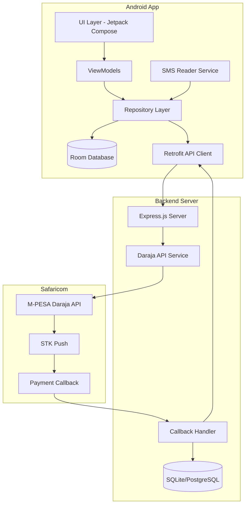
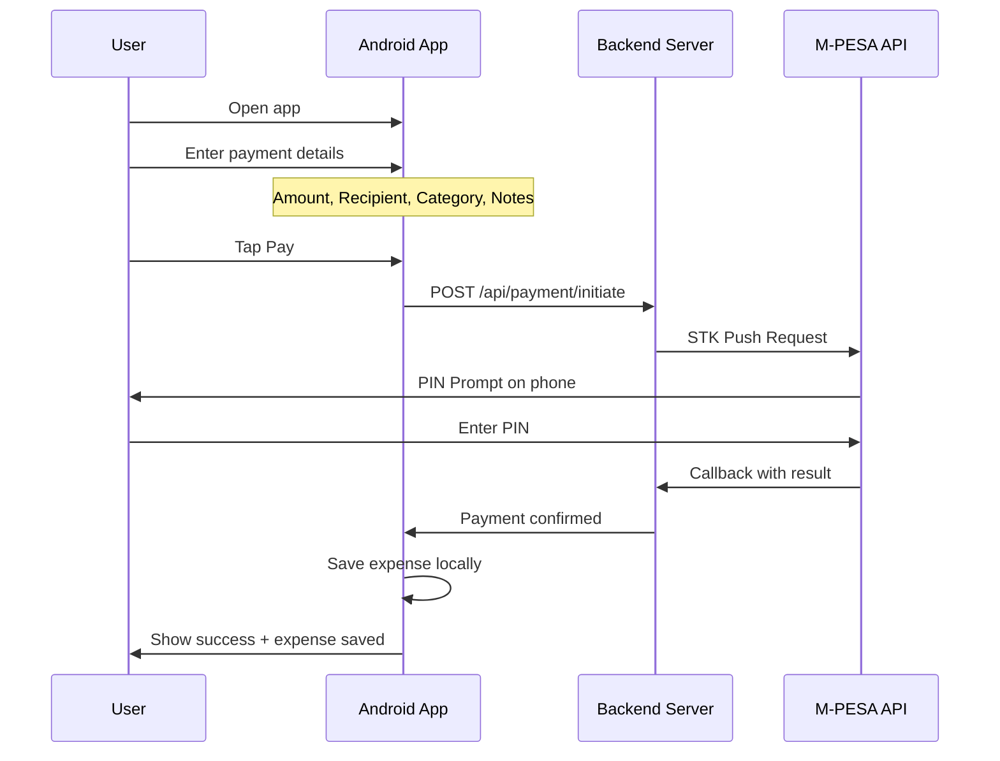
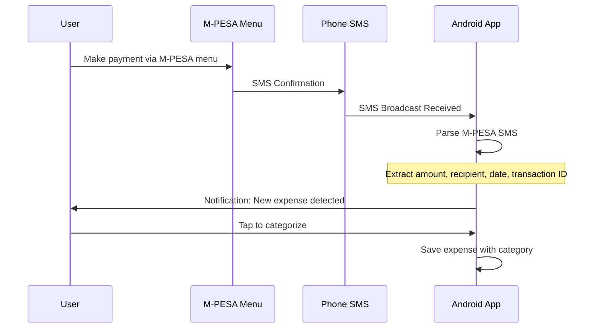

# PesaTrack - M-PESA Expense Tracking App

## Overview

PesaTrack is an Android application that integrates with M-PESA to provide intelligent expense tracking. The app serves as the starting point for payments, allowing users to categorize expenses before initiating transactions via STK Push, with SMS parsing as a fallback for external M-PESA transactions.

## Requirements Summary

| Requirement | Decision |
|-------------|----------|
| Platform | Android (Native) |
| Language | Kotlin |
| Backend | Node.js with Express (lightweight, easy M-PESA integration) |
| Database (Mobile) | Room (SQLite) - Local storage only |
| Database (Backend) | SQLite or PostgreSQL |
| Authentication | None (local-only app) |
| M-PESA Integration | Daraja API (STK Push) |
| Payment Types | Send Money, Buy Goods, Pay Bill |
| Fallback Tracking | SMS Parsing |

---

## System Architecture

### High-Level Architecture Diagram



---

## User Flow Diagrams

### Flow 1: STK Push Payment (Primary)



### Flow 2: SMS Parsing (Fallback)



---

## Component Architecture

### Android App Structure

```
app/
├── src/main/java/com/pesatrack/
│   ├── PesaTrackApp.kt                 # Application class
│   ├── di/                              # Dependency Injection
│   │   └── AppModule.kt
│   ├── data/
│   │   ├── local/
│   │   │   ├── database/
│   │   │   │   ├── PesaTrackDatabase.kt
│   │   │   │   ├── dao/
│   │   │   │   │   ├── ExpenseDao.kt
│   │   │   │   │   └── CategoryDao.kt
│   │   │   │   └── entities/
│   │   │   │       ├── ExpenseEntity.kt
│   │   │   │       └── CategoryEntity.kt
│   │   │   └── preferences/
│   │   │       └── AppPreferences.kt
│   │   ├── remote/
│   │   │   ├── api/
│   │   │   │   └── PesaTrackApi.kt
│   │   │   └── dto/
│   │   │       ├── PaymentRequest.kt
│   │   │       └── PaymentResponse.kt
│   │   └── repository/
│   │       ├── ExpenseRepository.kt
│   │       └── PaymentRepository.kt
│   ├── domain/
│   │   ├── models/
│   │   │   ├── Expense.kt
│   │   │   ├── Category.kt
│   │   │   └── PaymentType.kt
│   │   └── usecases/
│   │       ├── InitiatePaymentUseCase.kt
│   │       ├── ParseSmsUseCase.kt
│   │       └── GetExpensesUseCase.kt
│   ├── presentation/
│   │   ├── navigation/
│   │   │   └── NavGraph.kt
│   │   ├── screens/
│   │   │   ├── home/
│   │   │   │   ├── HomeScreen.kt
│   │   │   │   └── HomeViewModel.kt
│   │   │   ├── payment/
│   │   │   │   ├── PaymentScreen.kt
│   │   │   │   └── PaymentViewModel.kt
│   │   │   ├── expenses/
│   │   │   │   ├── ExpenseListScreen.kt
│   │   │   │   └── ExpenseViewModel.kt
│   │   │   └── categorize/
│   │   │       ├── CategorizeScreen.kt
│   │   │       └── CategorizeViewModel.kt
│   │   ├── components/
│   │   │   ├── ExpenseCard.kt
│   │   │   ├── CategoryChip.kt
│   │   │   └── PaymentTypeSelector.kt
│   │   └── theme/
│   │       └── Theme.kt
│   ├── services/
│   │   └── SmsReceiver.kt               # BroadcastReceiver for SMS
│   └── utils/
│       ├── SmsParser.kt                  # M-PESA SMS parsing logic
│       └── Constants.kt
└── src/main/res/
    └── ...
```

### Backend Structure

```
backend/
├── src/
│   ├── index.js                    # Entry point
│   ├── config/
│   │   └── daraja.js              # M-PESA credentials config
│   ├── routes/
│   │   ├── payment.js             # Payment endpoints
│   │   └── callback.js            # M-PESA callback handler
│   ├── services/
│   │   ├── darajaService.js       # Daraja API integration
│   │   └── paymentService.js      # Business logic
│   ├── models/
│   │   └── Transaction.js         # Transaction model
│   ├── middleware/
│   │   └── validation.js          # Request validation
│   └── utils/
│       └── helpers.js
├── package.json
└── .env.example
```

---

## Database Schema

### Android Room Database

```kotlin
// ExpenseEntity.kt
@Entity(tableName = "expenses")
data class ExpenseEntity(
    @PrimaryKey(autoGenerate = true)
    val id: Long = 0,
    val transactionId: String?,        // M-PESA transaction ID
    val amount: Double,
    val recipient: String,              // Phone number, till, or paybill
    val recipientName: String?,         // Parsed from SMS or user input
    val categoryId: Long,
    val paymentType: String,            // SEND_MONEY, BUY_GOODS, PAY_BILL
    val source: String,                 // STK_PUSH, SMS_PARSED
    val notes: String?,
    val timestamp: Long,
    val createdAt: Long = System.currentTimeMillis()
)

// CategoryEntity.kt
@Entity(tableName = "categories")
data class CategoryEntity(
    @PrimaryKey(autoGenerate = true)
    val id: Long = 0,
    val name: String,                   // Food, Transport, Rent, etc.
    val icon: String,                   // Material icon name
    val color: String,                  // Hex color code
    val isDefault: Boolean = false
)
```

### Default Categories

| ID | Name | Icon | Color |
|----|------|------|-------|
| 1 | Food & Dining | restaurant | #FF5722 |
| 2 | Transport | directions_car | #2196F3 |
| 3 | Shopping | shopping_bag | #9C27B0 |
| 4 | Bills & Utilities | receipt | #4CAF50 |
| 5 | Entertainment | movie | #E91E63 |
| 6 | Health | local_hospital | #00BCD4 |
| 7 | Rent | home | #795548 |
| 8 | Other | more_horiz | #607D8B |

---

## API Design

### Backend Endpoints

#### POST /api/payment/initiate
Initiates an STK Push payment request.

**Request:**
```json
{
  "phoneNumber": "254712345678",
  "amount": 1000,
  "paymentType": "SEND_MONEY",
  "recipient": "254798765432",
  "accountReference": "PesaTrack",
  "transactionDesc": "Payment via PesaTrack"
}
```

**Response:**
```json
{
  "success": true,
  "checkoutRequestId": "ws_CO_123456789",
  "merchantRequestId": "12345-67890",
  "responseDescription": "Success. Request accepted for processing"
}
```

#### POST /api/callback/mpesa
Receives M-PESA callback after payment completion.

**Callback Payload (from Safaricom):**
```json
{
  "Body": {
    "stkCallback": {
      "MerchantRequestID": "12345-67890",
      "CheckoutRequestID": "ws_CO_123456789",
      "ResultCode": 0,
      "ResultDesc": "The service request is processed successfully.",
      "CallbackMetadata": {
        "Item": [
          { "Name": "Amount", "Value": 1000 },
          { "Name": "MpesaReceiptNumber", "Value": "ABC123XYZ" },
          { "Name": "TransactionDate", "Value": 20240115123456 },
          { "Name": "PhoneNumber", "Value": 254712345678 }
        ]
      }
    }
  }
}
```

#### GET /api/payment/status/:checkoutRequestId
Query payment status.

**Response:**
```json
{
  "success": true,
  "status": "COMPLETED",
  "transactionId": "ABC123XYZ",
  "amount": 1000,
  "timestamp": "2024-01-15T12:34:56Z"
}
```

---

## M-PESA Daraja Integration

### Getting Daraja API Access

1. **Register on Daraja Portal**
   - Go to [developer.safaricom.co.ke](https://developer.safaricom.co.ke)
   - Create an account
   - Verify your email

2. **Create an App**
   - Navigate to My Apps > Create New App
   - Select APIs: Lipa Na M-PESA Online (STK Push)
   - Get your Consumer Key and Consumer Secret

3. **Sandbox Testing**
   - Use sandbox credentials for development
   - Test phone number: 254708374149
   - Sandbox URL: `https://sandbox.safaricom.co.ke`

4. **Go Live**
   - Apply for production credentials
   - Provide business documentation
   - Get production Consumer Key/Secret
   - Production URL: `https://api.safaricom.co.ke`

### STK Push Implementation Notes

- **Shortcode Types:**
  - **Send Money**: Uses B2C API (different flow)
  - **Buy Goods (Till)**: Uses STK Push with Till number
  - **Pay Bill**: Uses STK Push with Paybill number

**Important:** Direct Send Money (P2P) via Daraja requires B2C API which needs a business shortcode. For MVP, consider:
- Supporting Buy Goods and Pay Bill via STK Push
- Using SMS parsing for Send Money tracking

---

## SMS Parsing Logic

### M-PESA SMS Formats

**Send Money:**
```
ABC123XYZ Confirmed. Ksh1,000.00 sent to John Doe 0712345678 on 15/1/24 at 12:34 PM. New M-PESA balance is Ksh5,000.00.
```

**Buy Goods:**
```
ABC123XYZ Confirmed. Ksh500.00 paid to SHOP NAME. on 15/1/24 at 2:30 PM. New M-PESA balance is Ksh4,500.00.
```

**Pay Bill:**
```
ABC123XYZ Confirmed. Ksh2,000.00 paid to COMPANY NAME for account 12345 on 15/1/24 at 3:00 PM. New M-PESA balance is Ksh2,500.00.
```

### Parsing Regex Patterns

```kotlin
object SmsParser {
    // Transaction ID pattern
    private val TRANSACTION_ID = Regex("^([A-Z0-9]{10})")
    
    // Amount pattern
    private val AMOUNT = Regex("Ksh([\\d,]+\\.\\d{2})")
    
    // Send Money pattern
    private val SEND_MONEY = Regex("sent to (.+?) (\\d{10})")
    
    // Buy Goods pattern  
    private val BUY_GOODS = Regex("paid to (.+?)\\. on")
    
    // Pay Bill pattern
    private val PAY_BILL = Regex("paid to (.+?) for account (.+?) on")
    
    // Date pattern
    private val DATE = Regex("on (\\d{1,2}/\\d{1,2}/\\d{2}) at (\\d{1,2}:\\d{2} [AP]M)")
}
```

---

## Technology Stack Summary

### Android App
- **Language**: Kotlin
- **UI**: Jetpack Compose
- **Architecture**: MVVM + Clean Architecture
- **DI**: Hilt
- **Database**: Room
- **Networking**: Retrofit + OkHttp
- **Async**: Kotlin Coroutines + Flow

### Backend
- **Runtime**: Node.js
- **Framework**: Express.js
- **Database**: SQLite (dev) / PostgreSQL (prod)
- **M-PESA SDK**: Custom Daraja service
- **Validation**: Joi

### DevOps
- **Backend Hosting**: Railway, Render, or Heroku (free tier options)
- **Version Control**: Git

---

## MVP Feature Scope

### Phase 1: Core Features
- [ ] Payment initiation via STK Push (Buy Goods, Pay Bill)
- [ ] Expense categorization before payment
- [ ] Local expense storage with Room
- [ ] Simple expense list view
- [ ] SMS parsing for external M-PESA transactions
- [ ] Manual expense entry

### Phase 2: Enhanced Features (Future)
- [ ] Expense charts and analytics
- [ ] Monthly/weekly expense summaries
- [ ] Category-based budgets
- [ ] Export to CSV
- [ ] Cloud sync (optional)
- [ ] Recurring expense tracking

---

## Security Considerations

1. **SMS Permissions**: Request `READ_SMS` and `RECEIVE_SMS` permissions with clear user explanation
2. **Network Security**: Use HTTPS for all API calls
3. **No Sensitive Storage**: Never store M-PESA PIN or credentials
4. **Callback Validation**: Validate M-PESA callbacks using IP whitelist
5. **Environment Variables**: Store Daraja credentials in `.env`, never commit

---

## Next Steps

1. Set up Android project with required dependencies
2. Create backend project with Express.js
3. Register for Daraja sandbox access
4. Implement STK Push flow
5. Implement SMS parsing
6. Build UI screens
7. Test end-to-end flow
8. Apply for Daraja production access
