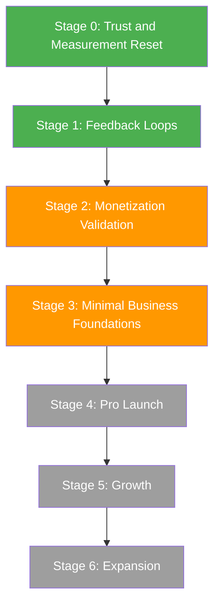

# PesaTrack — Business Transition Plan

## From Polished Product to Fully Defined Business

> **Premise:** PesaTrack is a strong Kenya-first finance utility with real differentiation, but it currently behaves more like a polished product than a fully defined business. This plan sequences the work needed to close that gap.

---

## Measurement Model — What We Can and Cannot Know

Before defining stages, it is critical to be honest about what each signal tier can actually tell us. **Local instrumentation is directional, not decision-grade.** It cannot replace server-side cohort analytics and should never be treated as if it can.

### Signal Classification

| Tier | Examples | Confidence | Use For |
|------|----------|------------|---------|
| **Reliable** | Play Console installs, country mix, crash rates, retention cohorts, ratings count | High — Google's infrastructure, large sample | Business decisions, trend tracking, actual retention measurement |
| **Directional** | Local DataStore counters — app opens, first-use milestones, feature usage, teaser taps | Medium — single-device, no cohort comparison, fragile to reinstall | Product heuristics, individual user context, interview prep |
| **Qualitative** | User interviews, feedback emails, Play Store reviews, support conversations | Variable — small sample, self-selected | Understanding *why* behind the numbers, discovering unmet needs |

### What "Retention" Means in This Plan

PesaTrack cannot measure retention in the strict analytics sense (D1/D7/D30 cohort curves) from local instrumentation. `MainActivity.onCreate()` timestamps are a weak proxy — they track individual return signals, not population-level retention rates.

| Term Used | What It Actually Means | Source |
|-----------|----------------------|--------|
| **Return signal** | This specific user opened the app on day N after install | Local DataStore timestamp |
| **Retention rate** | Percentage of an install cohort that returns on day N | Play Console Statistics → Retention |
| **Engagement pattern** | How often and which features a specific user touches | Local DataStore counters |

**Rule:** All stage exit criteria that reference retention use Play Console as the reliable source, with local instrumentation as supporting directional evidence only.

---

## The Core Tension

PesaTrack has **no INTERNET permission**. This is a deliberate, publicly-committed trust signal:

- Privacy policy states: *"PesaTrack has no backend server, no cloud sync, no analytics SDK, and no internet permission."*
- About screen states: *"No internet permission — PesaTrack cannot send data anywhere"*
- Play Store Data Safety: *"No data shared with third parties"*

**This means traditional analytics are off the table.** All measurement is constrained to the three tiers above.

**Important nuance:** Adding local usage counters means PesaTrack *does* collect usage data — it just never transmits it. The current privacy wording uses absolute language ("no analytics") that needs to distinguish between "no collection" and "no transmission." This is addressed in Stage 0.

---

## Stage-Based Roadmap



---

## Current Implementation Progress (As of 2026-04-24)

| Item | Status | Notes |
|------|--------|-------|
| Stage 0: Trust and Measurement Reset | ✅ Implemented | Trust language updated in policy/About; metric precision model documented |
| Stage 1A: Local Milestone Tracking | ✅ Implemented | Milestones/counters wired into preferences + key flows |
| Stage 1G: Share PesaTrack | ✅ Implemented | Share CTA added in About screen |
| Stage 1B: In-App Review Prompt | ✅ Implemented | Play In-App Review wired with eligibility/throttling |
| Stage 1C: Usage Summary Piggybacking | ✅ Implemented | `UsageSummaryGenerator` + About email + backup metadata integration |
| Stage 1D: Structured Feedback Prompt | ✅ Implemented | Home inline prompt card + prefilled editable email draft |
| Stage 1E: Low-Engagement Feedback Lane | ✅ Implemented | Home friction prompt + local reason capture + email draft |

---

## Stage 0: Trust and Measurement Reset

**Goal:** Make sure the product story and measurement model are honest before adding any instrumentation.

### 0A. Trust Language Audit

Review and revise every surface where PesaTrack makes claims about data handling. The current absolute language ("no analytics") becomes technically inaccurate once local counters exist. The distinction to draw:

| Claim Type | Example | Status |
|-----------|---------|--------|
| **No automatic transmission** | "PesaTrack cannot send data anywhere — no INTERNET permission" | ✅ Remains true — keep |
| **No collection** | "No analytics, no cloud sync" | ⚠️ Needs revision — local counters *are* a form of analytics, even if they never leave the device |
| **User-initiated sharing** | "Your usage summary is included in feedback emails you choose to send" | 🆕 New category to explain |
| **Google-controlled flows** | "Google Play may show a review prompt" and "Purchase history is managed by Google Play" | 🆕 New category to explain |

#### Surfaces to Audit

| Surface | File | Current Language | Revision Needed |
|---------|------|-----------------|----------------|
| Privacy policy | `docs/privacy-policy.html` | "No crash reporting or usage analytics are collected" | Change to: "PesaTrack tracks anonymous usage counters locally on your device to improve the product. This data never leaves your device unless you explicitly share it. No data is transmitted to any server — PesaTrack has no INTERNET permission." |
| About screen | `AboutScreen.kt` | "No cloud sync, no analytics, no ads" | Change to: "No cloud sync, no ads, no data transmission" |
| Play Store listing | Play Console | "No account needed. No internet required." | ✅ Remains accurate — no change needed |
| Data Safety form | Play Console | "No data shared with third parties" | ⚠️ Re-verify in Play Console before release; expected outcome remains "no data shared" because metrics are local-only and outbound is user-initiated |

### 0B. Define Key Terms

Before instrumenting anything, define what "activation," "return," and "engaged user" mean for PesaTrack:

| Term | Definition | How Measured |
|------|-----------|-------------|
| **Activated user** | Completed onboarding AND (first SMS parsed OR first import completed OR first manual entry) | Local milestone timestamps |
| **Return signal** | App opened on a calendar day different from the previous open | Local `last_app_open` timestamp comparison |
| **Engaged user** | Activated + at least 3 qualified sessions in the first 14 days | Local qualified session count + Play Console retention |
| **Qualified session** | One app open after being backgrounded for >= 5 minutes (avoids task-switch bounces) | Local timestamp delta |
| **Raw launch** | Any `MainActivity.onCreate()` event | Debug-only diagnostic metric, never used for business decisions |

### 0C. Metric Precision Labels

Every metric referenced later in this plan carries a precision label:

- 🟢 **Reliable** — Play Console data, large sample, trustworthy for decisions
- 🟡 **Directional** — Local instrumentation, useful for product heuristics and individual context
- 🔵 **Qualitative** — Interviews and feedback, small sample, explains the "why"

### Exit Criteria for Stage 0

- [x] No internal contradiction between product behavior and privacy/trust claims
- [x] All surfaces audited and revision language drafted
- [x] Key terms defined and documented
- [x] No metric in the plan pretends to be more precise than its source allows

---

## Stage 1: Feedback Loops

**Goal:** Learn where value is created and where users drop off.

### Core Question: "What creates first-week value?"

### 1A. Local Milestone Tracking

Add lightweight event tracking to `AppPreferences` (DataStore). No new tables, no schema migration, no network — just timestamp/counter keys that accumulate locally.

**These are directional product signals, not decision-grade analytics.**

#### Events to Track

```
FUNNEL MILESTONES (timestamps — millis since epoch, 0L = never happened)
──────────────────────────────────────────────────────────────────────
install_timestamp          — set once in Application.onCreate if not already set
onboarding_started         — set when onboarding page 1 is shown
onboarding_sms_granted     — set when SMS permission granted during onboarding
onboarding_sms_skipped     — set when user skips SMS permission page
onboarding_import_chosen   — set when user taps Import Now on page 4
onboarding_import_skipped  — set when user skips import
onboarding_completed       — already exists as KEY_ONBOARDING_COMPLETED
first_sms_parsed           — set in SmsReceiver on first successful parse
first_import_completed     — set in SmsImportService on first import
first_manual_entry         — set in ManualEntryViewModel on first save
first_categorization       — set in CategorizeViewModel on first category apply
first_budget_created       — set in BudgetViewModel on first budget save
first_analytics_viewed     — set in AnalyticsViewModel on first load

RE-ENGAGEMENT MARKERS (timestamps — last occurrence)
──────────────────────────────────────────────────────────────────────
last_app_open              — updated in MainActivity.onCreate every launch
qualified_session_count    — incremented only if background gap >= 5 minutes
raw_launch_count           — incremented on every MainActivity.onCreate (diagnostic only)
last_app_open_day_1        — set on first open where calendar day > install day
last_app_open_day_7        — set on first open where calendar day >= install + 7
last_app_open_day_30       — set on first open where calendar day >= install + 30

FEATURE USAGE COUNTERS (integers — running totals)
──────────────────────────────────────────────────────────────────────
count_sms_parsed           — incremented in SmsReceiver for each parsed expense
count_imports              — incremented in SmsImportService for each import run
count_manual_entries       — incremented in ManualEntryViewModel
count_categorizations      — incremented in CategorizeViewModel
count_budgets_created      — incremented in BudgetViewModel
count_analytics_views      — incremented in AnalyticsViewModel
count_forecast_views       — incremented in HomeViewModel when forecast card shown
count_excel_imports        — incremented in ExcelImportViewModel
count_exports              — incremented in DataManagementService
count_backups              — incremented in DataManagementService
```

#### Implementation

| Component | Change |
|-----------|--------|
| `AppPreferences.kt` | Add ~25 new DataStore keys (Long timestamps + Int counters) with getter/setter methods |
| `MainActivity.kt` | Track `last_app_open`, `qualified_session_count` (>=5 min gap), `raw_launch_count` (diagnostic only), and re-engagement day markers |
| `SmsReceiver.kt` | Increment `count_sms_parsed`, set `first_sms_parsed` |
| `SmsImportService.kt` | Increment `count_imports`, set `first_import_completed` |
| `OnboardingScreen.kt` | Set `onboarding_started`, `onboarding_sms_granted/skipped`, `onboarding_import_chosen/skipped` |
| `CategorizeViewModel.kt` | Increment `count_categorizations`, set `first_categorization` |
| `BudgetViewModel.kt` | Increment `count_budgets_created`, set `first_budget_created` |
| `AnalyticsViewModel.kt` | Increment `count_analytics_views`, set `first_analytics_viewed` |
| `ManualEntryViewModel.kt` | Increment `count_manual_entries`, set `first_manual_entry` |
| `HomeViewModel.kt` | Increment `count_forecast_views` |
| `ExcelImportViewModel.kt` | Increment `count_excel_imports` |
| `DataManagementService.kt` | Increment `count_exports`, `count_backups` |

**No new files needed for instrumentation.** Each addition is a single line calling an `AppPreferences` method.

#### How to Read the Data

Three approaches, none requiring INTERNET:

1. **Developer inspection** — Connect via ADB and pull DataStore, or use backup/restore to examine
2. **Piggybacked on user actions** — Usage summary included in feedback emails and backup files (see 1C)
3. **Play Console** — For 🟢 reliable metrics (installs, retention cohorts, crashes)

### 1B. In-App Rating Prompt

Use the Google Play In-App Review API (`ReviewManager`). Does NOT require INTERNET permission — uses Google Play Services IPC.

#### Trigger Logic

Show the review prompt when ALL conditions are met:

- App installed >= 14 days
- User has >= 20 categorized expenses
- User has >= 10 qualified sessions
- Prompt not shown in last 90 days
- Total prompt count < 2

#### Implementation

| Component | Change |
|-----------|--------|
| `build.gradle.kts` | Add `implementation 'com.google.android.play:review-ktx:2.0.2'` |
| `AppPreferences.kt` | Add `last_review_prompt_timestamp`, `review_prompt_count` |
| `HomeViewModel.kt` | Check conditions on home screen load; expose `shouldShowReview` state |
| `HomeScreen.kt` | Launch `ReviewManager` flow when `shouldShowReview` is true |

**Goal of review prompting:** Improve ratings volume and review freshness. Google does not expose whether the user actually submitted a review, so there is no measurable "submission rate." Success is measured by observing an increase in organic review velocity in Play Console after rollout.

### 1C. Usage Summary — Contextual Piggybacking

The usage summary is **piggybacked onto existing user-initiated actions** where the user is already engaged. No standalone screen or button.

#### The Usage Summary Block

`UsageSummaryGenerator.generate()` formats the local funnel data as a compact text block:

```
--- PesaTrack Usage Context ---
v1.2.0 | Installed 34d ago | 87 opens
Onboarding: SMS=granted, Import=completed
Activity: 342 SMS parsed, 12 manual, 289 categorized, 5 budgets, 41 analytics views
Return signals: D1=yes D7=yes D30=yes
Features: SMS, Budgets, Analytics, Forecasting, Excel
```

**The user sees it before sending and can remove it.**

#### Surfaces Where It Appears

| Surface | Trigger | Discovery |
|---------|---------|----------|
| **Feedback prompt email** — 1D | User submits "What would make PesaTrack more useful?" | High — proactively shown on Home |
| **Bug report email** | User taps "Contact & Feedback" in About | Medium — motivated users include context |
| **Backup file** | User creates SAF backup | High — every backup captures funnel state |
| **Post-review follow-up** | After in-app review completes | Medium — self-selects engaged users |

#### Implementation

| Component | Change |
|-----------|--------|
| `UsageSummaryGenerator.kt` (new) | Single utility object: reads DataStore keys, formats text block |
| `AboutScreen.kt` | Modify "Contact & Feedback" email intent to include usage summary |
| `DataManagementService.kt` | Add `usageMetrics` section to backup `settings.json` |
| `HomeScreen.kt` | Post-review follow-up card |

### 1D. Structured Feedback Prompt

A one-question survey shown inline on the Home screen after the user has experienced value.

**Question:** "What would make PesaTrack more useful to you?"

**Options (single-select + open text):**

1. Smarter spending advice
2. Track income, not just expenses
3. Share reports with someone
4. Sync across devices
5. Track more banks
6. Something else: [free text]

On "Submit," opens a pre-filled email intent with the structured response + usage summary block. User chooses to send or dismiss.

#### Implementation

| Component | Change |
|-----------|--------|
| `AppPreferences.kt` | Add `feedback_prompt_shown`, `feedback_response` keys |
| `HomeScreen.kt` | New `FeedbackPromptCard` composable, inline below existing cards |

### 1E. Low-Engagement Feedback Lane

Prevent survivorship bias by explicitly collecting feedback from users who do not activate or do not return.

#### Trigger Conditions

Show a short friction prompt when any condition is true:

- Onboarding completed but SMS permission not granted after 24 hours
- SMS permission granted but no first-value event after 72 hours
- No return signal by day 3

#### Prompt

Question: "What blocked setup for you?"

Options:

1. I do not want to grant SMS permission
2. I did not understand what to do next
3. I expected different features
4. The app felt too complex
5. Technical issue/bug
6. Other: [free text]

On submit, open an editable pre-filled email draft (same channel as 1D). Store the selected reason locally for directional analysis.

#### Implementation

| Component | Change |
|-----------|--------|
| `AppPreferences.kt` | Add `low_engagement_prompt_shown`, `low_engagement_reason`, `first_value_deadline_checked` |
| `HomeViewModel.kt` | Evaluate trigger conditions and expose prompt state |
| `HomeScreen.kt` | Render `LowEngagementFeedbackCard` inline when eligible |

### 1F. External Signals (No Code Required)

| Signal | Source | Action |
|--------|--------|--------|
| Install count and trend | 🟢 Play Console → Statistics | Check weekly |
| Country breakdown | 🟢 Play Console → Statistics | Confirm Kenya-first hypothesis |
| Retention cohorts (D1/D7/D30) | 🟢 Play Console → Statistics | **This is the reliable retention source** |
| Crash reports | 🟢 Play Console → Android Vitals | Monitor ANRs and crashes |
| Ratings and reviews | 🟢 Play Console → Ratings | Read every review; respond to negative ones |
| Acquisition search terms | 🟢 Play Console → Acquisition | See what terms drive installs |
| User interviews | 🔵 WhatsApp/email outreach | Target 10–20 users via About screen contact |

### 1G. Share PesaTrack (Minimal Growth Now)

Add a "Share PesaTrack" button in the About screen. Near-zero effort, passive referral channel:

```
I use PesaTrack to automatically track my M-PESA expenses — it reads SMS and categorizes everything offline. Free on Play Store: https://play.google.com/store/apps/details?id=com.pesatrack
```

### Exit Criteria for Stage 1

- [ ] 10–20 real user conversations completed (🔵 qualitative)
- [ ] Clear top 2 user-value themes identified from interviews + feedback emails
- [ ] Clear top 2 low-engagement friction themes identified (permission/setup/return blockers)
- [ ] Directional signal on onboarding completion and first-value milestones (🟡 local)
- [ ] Play Console retention cohorts show directional return behavior (🟢 reliable)
- [ ] At least some organic reviews appearing (🟢 reliable)

---

## Stage 2: Monetization Validation

**Goal:** Test willingness to pay without infrastructure cost.

### 2A. Narrow Fake-Door Test

Test only **1–2 specific Pro value propositions**, not a broad "Pro" concept. First ask "Do users want this?" — separate from "At what price?"

#### Recommended Value Props to Test

Based on the existing Pro plan and what creates differentiation:

1. **Personalized spending advice** — "Cut daily discretionary spending by KES 480 to stay on track"
2. **PDF/shareable financial report** — branded monthly summary for sharing with spouse, accountant, chama

These are chosen because they represent two different buyer motivations:
- Advice = paying for **clarity** (understanding what to do)
- Reports = paying for **utility** (sharing with others)

#### Test Implementation

Add a single non-functional teaser card on the Home screen. One value prop at a time. When tapped, show a "Coming Soon" dialog. Record tap count in DataStore.

```
┌──────────────────────────────────────────┐
│  ⭐ Get Personalized Spending Advice      │
│                                          │
│  Know exactly how much to cut to stay    │
│  on budget this month.                   │
│                                          │
│  [Coming Soon — Notify Me]               │
└──────────────────────────────────────────┘
```

**Metric (🟡 directional):** Tap rate on teaser card. This tells you relative interest, not absolute conversion.

**Do NOT test pricing and feature breadth at the same time.** Price testing comes only after one value prop shows clear interest.

| Component | Change |
|-----------|--------|
| `AppPreferences.kt` | Add `pro_teaser_tap_count`, `pro_teaser_value_prop` |
| `HomeScreen.kt` | Add `ProTeaserCard` composable below forecast card |
| No billing code | Zero Play Billing dependency |

### 2B. Interview-Based Validation

Using the interview channel from Stage 1:

- Show the winning value prop and ask: "Would you pay for this?"
- Do NOT anchor on a specific price — ask open-ended: "What would you pay?"
- Only after you have a demand signal, test price ranges

### Exit Criteria for Stage 2

- [ ] One winning Pro value proposition identified (🔵 qualitative + 🟡 directional)
- [ ] One plausible entry price range (🔵 qualitative — from interviews, not from tap rates)
- [ ] Enough evidence that billing infrastructure is worth building

---

## Stage 3: Minimal Business Foundations

**Goal:** Remove structural blockers before revenue starts. Keep this lean — do not let it stall product learning.

### Now (Before Pro Launch)

| Task | Status | Notes |
|------|--------|-------|
| Confirm business entity/naming | Check if "JMumo Technologies" is registered | Required for business bank account and invoicing |
| Verify Play Console merchant setup | Check bank details and KRA PIN association | Required for payouts |
| Update privacy policy | Apply Stage 0 trust language revisions | Must be live before v1.2.0 ships |
| Draft Terms of Service outline | Simple HTML on GitHub Pages alongside privacy policy | Standard license, liability, disputes |
| Define customer support channel | Email is fine for now; document response posture | Must exist before taking money |
| Define refund/cancellation posture | Google Play handles subscription cancellation; decide edge case handling | Document before Pro launch |

### Later (After Pro is Live)

| Task | Notes |
|------|-------|
| Full ToS publication with legal review | After Pro launch validates revenue |
| Accounting/bookkeeping process | After meaningful transaction volume |
| Subscription invoicing infrastructure | If needed beyond Google Play receipts |

### Exit Criteria for Stage 3

- [ ] Can take money cleanly (merchant verified, entity confirmed)
- [ ] Can explain data handling clearly (privacy policy updated, trust language clean)
- [ ] Can support paying users without improvising (support channel, refund posture defined)

---

## Stage 4: Pro Launch (Deferred)

**Goal:** Monetize the strongest proven outcome from Stage 2.

Build per `plans/pro-launch-plan.md`, but start with the **smallest bundle that feels valuable** — not the full Pro feature set.

### Minimum Viable Pro

- Play Billing integration (`BillingService.kt`, `ProGatekeeper.kt`)
- **One narrow Pro bundle** based on the winning Stage 2 value prop
- Simple upgrade surfaces (Home card, Settings section)
- Basic cancellation/recovery UX

### Do NOT Launch With

- All 6 Pro features from the original plan simultaneously
- Complex onboarding flows for Pro
- Multiple subscription tiers

### Exit Criteria for Stage 4

- [ ] First paid conversions observed
- [ ] Support burden manageable
- [ ] No trust backlash from users (reviews, uninstall spike)

---

## Stage 5: Growth (Deferred)

**Goal:** Pour effort into acquisition only after retention and conversion are credible.

### Signals That Unlock Growth

- 🟢 Play Console D7 retention stable and healthy
- 🟢 Play Console D30 retention not collapsing
- Pro conversion rate > 0 (any signal that the model works)
- Clear acquisition message that converts installs into active users

### Channels to Evaluate

| Channel | Cost | Fit |
|---------|------|-----|
| ASO optimization | Free | High — "mpesa tracker" is high-intent Kenya search |
| Kenya fintech Twitter/X | Free | Medium |
| M-PESA WhatsApp groups | Free | High — direct target user access |
| YouTube tutorials | Free | High — "how to track M-PESA expenses" |
| Kenyan finance blogger partnerships | Low | High — trusted endorsement |
| Play Store Ads (Kenya) | KES 5K/mo | Medium — test small |

---

## Stage 6: Expansion (Deferred)

Expansion follows demand, not precedes it.

### Possible Paths (In Order)

1. **More Kenyan banks** — Equity, KCB, Cooperative (biggest gap for existing users)
2. **Optional identity / Drive backup** — per `plans/account-identity-policy.md` Phase 2
3. **East Africa M-PESA** — Tanzania, Uganda (different SMS formats)
4. **West Africa mobile money** — MTN MoMo, Airtel Money (different ecosystem entirely)

### Do Not Expand Until

- [ ] Kenya D30 retention healthy (🟢 Play Console)
- [ ] > 1,000 monthly active users in Kenya (🟢 Play Console)
- [ ] Pro conversion rate established
- [ ] User interviews reveal demand from specific non-Kenya markets

---

## Do Not Build Yet (Explicit)

To maintain discipline, these items are explicitly deferred:

| Item | Reason |
|------|--------|
| Play Billing implementation | No evidence of willingness to pay yet |
| Account/identity system | No feature requires it yet |
| Backend analytics | Contradicts trust brand; Play Console covers reliable metrics |
| New country expansion | Kenya not won yet |
| Major bank parser expansion | Only add what current users are already asking for |
| Google Drive backup | Requires identity, INTERNET permission, and policy changes |
| Server-side AI features | Requires identity + backend + per-user cost |

---

## Implementation Scope: v1.2.0

### What Ships Now

Completed code changes in this stage rollout:

```mermaid
flowchart TD
    subgraph v1.2.0 [v1.2.0 — Implemented]
        A[Trust language audit: privacy policy + About screen] --> B[Local milestone tracking in AppPreferences]
        B --> C[Wire milestones/counters into app flows]
        C --> D[Qualified session vs raw launch tracking]
        D --> E[Onboarding SMS-skip capture on all exits]
        E --> F[Share PesaTrack button in About]
        F --> G[In-app review prompt with Stage 1B gating]
        G --> H[Usage summary piggybacking in About and backup]
        H --> I[Structured + low-engagement feedback cards on Home]
    end

    style v1.2.0 fill:#e8f5e9,stroke:#4caf50
```



### Files Changed

| File | Type | Changes |
|------|------|---------|
| `AppPreferences.kt` | Modified | Milestones + counters + re-engagement keys; qualified sessions and raw launches tracked separately |
| `UsageSummaryGenerator.kt` | Added | Generates compact local usage context block + JSON payload |
| `PesaTrackApp.kt` | Modified | Install timestamp recorded once on app startup |
| `MainActivity.kt` | Modified | Track `last_app_open`, `qualified_session_count` (>=5 min gap), `raw_launch_count` (diagnostic), re-engagement day markers |
| `SmsReceiver.kt` | Modified | +1 line: increment `count_sms_parsed`, set `first_sms_parsed` |
| `SmsImportService.kt` | Modified | +1 line: increment `count_imports`, set `first_import_completed` |
| `OnboardingScreen.kt` | Modified | Onboarding milestone hooks + SMS-skip capture on Next/Skip/Get Started paths |
| `CategorizeViewModel.kt` | Modified | +1 line: increment counter, set first timestamp |
| `BudgetViewModel.kt` | Modified | +1 line: increment counter, set first timestamp |
| `AnalyticsViewModel.kt` | Modified | +1 line: increment counter, set first timestamp |
| `ManualEntryViewModel.kt` | Modified | +1 line: increment counter |
| `HomeViewModel.kt` | Modified | Forecast counter + Stage 1B review gating + Stage 1D/1E feedback eligibility and draft handling |
| `HomeScreen.kt` | Modified | Stage 1B review launch + Stage 1D structured card + Stage 1E low-engagement card + email draft launcher |
| `ExcelImportViewModel.kt` | Modified | +1 line: increment counter |
| `DataManagementService.kt` | Modified | Export/backup counters + embed `usageMetrics` JSON in backup metadata |
| `AboutScreen.kt` | Modified | "Share PesaTrack" + contact email now prefilled with editable usage summary |
| `docs/privacy-policy.html` | Modified | Trust language revision: distinguish collection vs transmission |

### What Ships in v1.3.0 (Stage 2)

| File | Type | Changes |
|------|------|---------|
| `AppPreferences.kt` | Modified | Add `pro_teaser_tap_count` |
| `HomeScreen.kt` | Modified | Add `ProTeaserCard` — single value prop fake-door test |

### Still Pending from Stage 1

- No code items pending.
- Remaining Stage 1 work is operational: run the 30-day checklist, collect interviews, and synthesize top themes.

### What Is NOT Changed in Any Near-Term Release

- No INTERNET permission added
- No new database tables or schema migration
- No new full screens (all additions are inline cards on existing screens)
- No backend changes
- No new outbound data transmission; Data Safety classification must be re-verified in Play Console before release
- No account/identity system

---

## Metrics and Exit Criteria Summary

### Stage 1 Exit (After ~30 Days)

| Metric | Source | What It Tells Us |
|--------|--------|-----------------|
| Onboarding direction | 🟡 Local milestones | Do users reach first value? |
| Feature repeat usage | 🟡 Local counters | What feature gets repeated use? |
| Retention cohorts | 🟢 Play Console | Are users actually coming back? |
| Review velocity | 🟢 Play Console | Is review prompting working? |
| Interview themes | 🔵 10–20 conversations | What do engaged users want next? |
| Feedback emails | 🔵 Email inbox | What specific improvements are requested? |

### Stage 2 Exit (After ~60 Days)

| Metric | Source | What It Tells Us |
|--------|--------|-----------------|
| Teaser tap interest | 🟡 Local counter | Which value prop gets attention? |
| Interview demand signal | 🔵 Conversations | Would users pay? For what? At what price? |
| Play Console MAU | 🟢 Play Console | Is the user base large enough for Pro to matter? |

### Stage 3 Exit (Before Pro Launch)

| Check | Source |
|-------|--------|
| Entity and merchant verified | Manual |
| Privacy policy updated | Manual |
| Support channel defined | Manual |

---

## Weekly Operating Checklist (Stage 1-2)

Use this cadence to turn raw signals into decisions without overreacting to noise.

### Monday Review Cadence (45-60 min)

| Step | Owner | Inputs | Output |
|------|-------|--------|--------|
| 1. Reliable metrics check | Product lead | Play Console: installs, retention cohorts, ratings, crashes | "What changed this week" summary |
| 2. Directional metrics check | Product/engineering | Local counters and milestones from usage summaries/backups | Candidate friction/value hypotheses |
| 3. Qualitative synthesis | Product/research | Feedback emails, reviews, interview notes | Top 3 user themes (value + friction) |
| 4. Priority decision | Product lead | Steps 1-3 | One primary focus for this week |
| 5. Change log update | Product lead | Decision and rationale | 3-5 line weekly decision log entry |

### Decision Rules (Guardrails)

1. Do not ship roadmap pivots from directional metrics alone.
2. Any monetization decision must reference at least one reliable signal and one qualitative signal.
3. If reliable and qualitative signals conflict, investigate first; do not "average" them.
4. Keep one core hypothesis per week; avoid parallel major bets.

### Trigger -> Action Playbook

| Trigger | Source Tier | Action This Week |
|--------|-------------|------------------|
| D7 retention drops for 2 consecutive weeks | 🟢 Reliable | Pause new monetization experiments; run setup-friction review and fix top onboarding blocker |
| First-value milestones are low but installs are rising | 🟢 + 🟡 | Tighten onboarding/import guidance and SMS permission recovery surfaces |
| Low-engagement prompt clusters on "did not understand next step" | 🔵 + 🟡 | Add clearer post-onboarding CTA and simplify first-run path |
| Pro teaser tap rate is high but interview willingness is weak | 🟡 + 🔵 | Rework value proposition messaging before any billing work |
| Review velocity increases but retention stays flat | 🟢 | Treat as sentiment win only; prioritize activation/retention fixes |
| Crash/ANR spike appears in Android Vitals | 🟢 | Declare stability week; defer feature work until resolved |

### Minimum Weekly Artifacts

1. One-page weekly dashboard screenshot/export (Play Console + local summary highlights)
2. Interview/feedback theme notes (max 10 bullets)
3. One explicit "continue / stop / start" decision
4. One rollback condition for the current experiment

### Monthly Gate Review (End of Month)

At month end, evaluate whether to advance stages:

- Stage 1 -> Stage 2: only if first-value and retention direction are stable and top user themes are clear.
- Stage 2 -> Stage 3: only if one monetization value proposition wins consistently.
- Stage 3 -> Stage 4: only if legal/merchant/support foundations are complete.

---

## Summary

The shortest path from "polished product" to "fully defined business":

1. **Reset trust language** — make privacy claims match planned behavior
2. **Instrument the funnel directionally** — know roughly who gets value and where
3. **Talk to 10–20 real users** — understand the demand signal qualitatively
4. **Read Play Console** — get reliable retention and acquisition data
5. **Test one monetization concept with a fake door** — no billing code
6. **Clean up legal** — privacy policy, entity, support posture
7. **Launch Pro only after evidence** — smallest viable bundle
8. **Grow only after retention is proven** — acquisition without retention is waste
9. **Expand only after Kenya is won** — depth before breadth

Everything ships without INTERNET permission, without Data Safety changes, and without breaking the trust brand.
