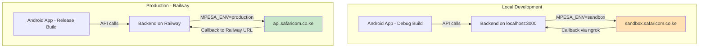

# Daraja API: Sandbox → Production Migration Plan

## Overview

PesaTrack currently uses Safaricom Daraja API in **sandbox mode** with the default test shortcode `174379`. This plan covers migrating to **production** using a Till Number (Buy Goods) shortcode `9955604`, while keeping sandbox working for local development.

**Key principle:** The same codebase serves both environments — the only difference is environment variables.

---

## Current State vs Target State

| Aspect | Sandbox (Current) | Production (Target) |
|--------|-------------------|---------------------|
| Base URL | `https://sandbox.safaricom.co.ke` | `https://api.safaricom.co.ke` |
| Shortcode | `174379` | `9955604` |
| Passkey | Sandbox default | Production passkey from Safaricom |
| Consumer Key | Sandbox app credentials | Production app credentials |
| Consumer Secret | Sandbox app credentials | Production app credentials |
| TransactionType | `CustomerPayBillOnline` | `CustomerBuyGoodsOnline` |
| Callback URL | ngrok tunnel | `https://pesatrack-production.up.railway.app/api/callback/mpesa` |
| `MPESA_ENV` | `sandbox` | `production` |

---

## Critical Change: TransactionType

This is the most important code change. The current code hardcodes `CustomerPayBillOnline` in [`darajaService.js`](../backend/src/services/darajaService.js:170). Since the production shortcode `9955604` is a **Till Number (Buy Goods)**, the transaction type must change to `CustomerBuyGoodsOnline` when in production.

For Buy Goods transactions:
- `PartyB` should be the **Till Number** (not the shortcode used for PayBill)
- `TransactionType` must be `CustomerBuyGoodsOnline`

This needs to be **environment-driven**, not hardcoded.

---

## Architecture



---

## File Changes

### 1. [`backend/src/config/daraja.js`](../backend/src/config/daraja.js) — Add TransactionType config

**What changes:**
- Add `transactionType` getter that returns the correct type based on environment
- For sandbox: `CustomerPayBillOnline` (sandbox shortcode 174379 is a PayBill)
- For production: `CustomerBuyGoodsOnline` (shortcode 9955604 is a Till/Buy Goods)
- Also allow override via `MPESA_TRANSACTION_TYPE` env var for flexibility

```javascript
// New computed property
get transactionType() {
    return process.env.MPESA_TRANSACTION_TYPE || 
      (this.environment === 'production' ? 'CustomerBuyGoodsOnline' : 'CustomerPayBillOnline');
}
```

- Enhance `validateConfig()` to warn about production-specific requirements
- Add `shortcode` and `passkey` to required list (no fallback defaults in production)

### 2. [`backend/src/services/darajaService.js`](../backend/src/services/darajaService.js:170) — Use dynamic TransactionType

**What changes:**
- Line 170: Replace hardcoded `TransactionType: 'CustomerPayBillOnline'` with `TransactionType: config.transactionType`
- This single change makes the STK Push work for both PayBill and Buy Goods

### 3. [`backend/.env.example`](../backend/.env.example) — Document all production variables

**What changes:**
- Add clear sections for sandbox vs production
- Add `MPESA_TRANSACTION_TYPE` variable documentation
- Update callback URL example to use Railway domain
- Add notes about which values to change for production

### 4. [`backend/.env`](../backend/.env) — Keep as sandbox for local dev

**What changes:**
- Keep current sandbox values (this is the local dev config)
- Ensure `MPESA_ENV=sandbox` stays as default
- ngrok callback URL stays for local testing

### 5. Railway Environment Variables (Dashboard Config)

**What to set in Railway dashboard:**

| Variable | Value |
|----------|-------|
| `NODE_ENV` | `production` |
| `MPESA_ENV` | `production` |
| `MPESA_CONSUMER_KEY` | Production consumer key |
| `MPESA_CONSUMER_SECRET` | Production consumer secret |
| `MPESA_SHORTCODE` | `9955604` |
| `MPESA_PASSKEY` | Production passkey from Safaricom |
| `MPESA_CALLBACK_URL` | `https://pesatrack-production.up.railway.app/api/callback/mpesa` |
| `MPESA_TRANSACTION_TYPE` | `CustomerBuyGoodsOnline` (optional - auto-detected) |
| `DATABASE_URL` | `file:./data/pesatrack.db` |

### 6. [`backend/src/index.js`](../backend/src/index.js:60) — Enhance startup logging

**What changes:**
- Log which Daraja environment is active on startup
- Log the callback URL being used (masked for security)
- Warn if production env is detected but critical vars are missing
- Show shortcode and transaction type in startup info

### 7. Android App — Already Configured ✅

The Android app at [`build.gradle.kts`](../android/app/build.gradle.kts:25) already points to `https://pesatrack-production.up.railway.app` for both debug and release builds. The app calls the backend which then talks to Daraja — the app does NOT need to know whether backend is using sandbox or production Daraja credentials. **No Android changes needed.**

---

## Security Considerations

1. **Never commit production keys to `.env`** — The local `.env` should only have sandbox keys. Production keys go in Railway dashboard environment variables.

2. **`.env` is already in `.gitignore`** — Verified at [`backend/.gitignore`](../backend/.gitignore). Production secrets stay in Railway only.

3. **Callback URL validation** — Consider adding a check in the callback route to validate the request origin (Safaricom IP whitelist) for production. This is optional but recommended for security.

4. **Passkey protection** — The production passkey should NEVER be in source code. The current code already reads it from `process.env.MPESA_PASSKEY` with a sandbox fallback — in production, the fallback won't be used because Railway will have the real passkey set.

---

## Testing Checklist

### Local (Sandbox)
- [ ] Start backend locally with `npm run dev`
- [ ] Verify `/health` endpoint shows `environment: sandbox`
- [ ] Initiate STK Push with sandbox phone number (254708374149)
- [ ] Verify callback URL points to ngrok

### Production (Railway)  
- [ ] Set all production env vars in Railway dashboard
- [ ] Deploy to Railway
- [ ] Verify `/health` endpoint shows `environment: production`
- [ ] Initiate STK Push with a real phone number
- [ ] Verify the STK Push prompt appears on the real phone
- [ ] Complete payment and verify callback is received at Railway URL
- [ ] Check transaction is stored in production database

---

## Summary of Code Changes

Only **3 files** need code changes. Everything else is configuration:

| File | Change | Lines Affected |
|------|--------|---------------|
| [`daraja.js`](../backend/src/config/daraja.js) | Add `transactionType` getter, enhance validation | ~10 lines added |
| [`darajaService.js`](../backend/src/services/darajaService.js:170) | Use `config.transactionType` instead of hardcoded value | 1 line changed |
| [`index.js`](../backend/src/index.js:60) | Enhanced startup logging for environment awareness | ~5 lines added |
| [`.env.example`](../backend/.env.example) | Better documentation of sandbox vs production vars | Documentation only |

**No Android app changes required.**
