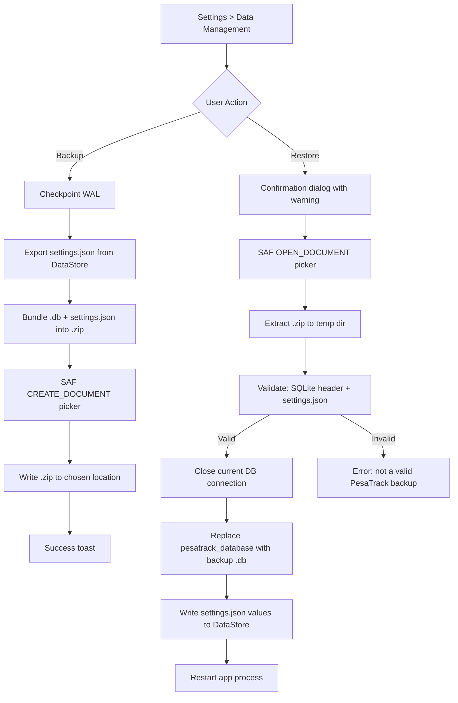

# Database Backup & Restore Plan

## Problem

PesaTrack stores all data locally (Room database + DataStore preferences). When a user:
- **Uninstalls the app** — all data is permanently deleted
- **Migrates from debug APK to Play Store** — must uninstall first (different signing keys), losing all data
- **Gets a new phone** — no way to transfer data

The CSV export preserves expense data with categories, but there is no CSV import. Users lose all categorization work, budgets, auto-rules, recipient mappings, and income records.

## Solution: Database File Backup & Restore

Export the Room database + key preferences as a `.zip` archive to user-accessible storage via SAF (Storage Access Framework). On restore, extract and import back, replacing the current database and restoring settings. This preserves **100% of data** with zero re-categorization.

## Architecture



## What Gets Backed Up

### Backup File Format: `.zip` archive

The backup is a **single `.zip` file** containing:

```
PesaTrack_Backup_20260401_200000.zip
├── pesatrack_database.db    ← Room database, all 6 tables
└── settings.json            ← Selected preferences
```

### Room Database (pesatrack_database.db)

| Table | Data |
|-------|------|
| `expenses` | All transactions with amounts, recipients, dates, categories, notes, isExcluded |
| `categories` | Default + custom categories and sub-categories |
| `recipient_category_mapping` | Learned recipient→category auto-categorization mappings |
| `budgets` | All budget limits (group, sub-category, total) with periods |
| `category_rules` | User-defined auto-categorization rules |
| `income` | Monthly income records |

### Settings JSON (settings.json)

Selected preferences that affect data computation:

```json
{
  "monthStartDay": 25,
  "bankTrackingEnabled": true,
  "enabledBanks": ["NCBA Bank"]
}
```

### DataStore Preferences — Inclusion Decision

| Preference | Included | Reason |
|------------|----------|--------|
| Month start day | ✅ Yes | Directly affects budget period calculations — wrong value misaligns all budgets |
| Bank tracking enabled | ✅ Yes | Determines which SMS parsers are active |
| Enabled banks set | ✅ Yes | Per-bank granular toggles |
| PIN hash + salt | ❌ No | **Security** — if someone gets backup file, they shouldn't get PIN |
| Biometric / timeout | ❌ No | Device-specific hardware feature |
| Onboarding completed | ❌ No | User sees onboarding once more (harmless) |
| Budget prompt dismissed | ❌ No | Cosmetic only |

## Detailed Implementation

### 1. DataManagementService — Backup

**File:** [`DataManagementService.kt`](../android/app/src/main/java/com/pesatrack/services/DataManagementService.kt)

New dependencies to inject: `PesaTrackDatabase` (for WAL checkpoint) and `AppPreferences` (for reading settings).

```kotlin
@Singleton
class DataManagementService @Inject constructor(
    private val database: PesaTrackDatabase,     // NEW — for WAL checkpoint
    private val appPreferences: AppPreferences,  // NEW — for settings backup
    private val expenseDao: ExpenseDao,
    private val categoryDao: CategoryDao,
    private val categoryRuleDao: CategoryRuleDao
)
```

**Backup flow:**

```kotlin
suspend fun backupDatabase(context: Context, destinationUri: Uri): Boolean {
    return try {
        // 1. Checkpoint WAL to merge all writes into the main .db file
        database.openHelper.writableDatabase.execSQL("PRAGMA wal_checkpoint(TRUNCATE)")

        // 2. Read settings to include
        val monthStartDay = appPreferences.getMonthStartDay()
        val bankTrackingEnabled = appPreferences.bankTrackingEnabled.first()
        val enabledBanks = appPreferences.enabledBanks.first()

        val settingsJson = JSONObject().apply {
            put("monthStartDay", monthStartDay)
            put("bankTrackingEnabled", bankTrackingEnabled)
            put("enabledBanks", JSONArray(enabledBanks.toList()))
        }

        // 3. Create .zip in cache dir
        val dbFile = context.getDatabasePath("pesatrack_database")
        val zipFile = File(context.cacheDir, "backup_temp.zip")

        ZipOutputStream(zipFile.outputStream()).use { zip ->
            // Add database file
            zip.putNextEntry(ZipEntry("pesatrack_database.db"))
            dbFile.inputStream().use { it.copyTo(zip) }
            zip.closeEntry()

            // Add settings JSON
            zip.putNextEntry(ZipEntry("settings.json"))
            zip.write(settingsJson.toString(2).toByteArray())
            zip.closeEntry()
        }

        // 4. Copy .zip to SAF destination
        context.contentResolver.openOutputStream(destinationUri)?.use { output ->
            zipFile.inputStream().use { input -> input.copyTo(output) }
        } ?: return false

        zipFile.delete()
        true
    } catch (e: Exception) {
        Log.e(TAG, "Backup failed", e)
        false
    }
}
```

**Key detail:** The WAL checkpoint is critical. Room uses WAL (Write-Ahead Logging) mode by default, meaning recent writes may be in the `-wal` file, not the main `.db`. `PRAGMA wal_checkpoint(TRUNCATE)` flushes everything to the main file so we only need to copy one file.

### 2. DataManagementService — Restore

```kotlin
suspend fun restoreDatabase(context: Context, sourceUri: Uri): Boolean {
    return try {
        val tempDir = File(context.cacheDir, "restore_temp")
        tempDir.mkdirs()

        // 1. Extract .zip contents
        context.contentResolver.openInputStream(sourceUri)?.use { input ->
            ZipInputStream(input).use { zip ->
                var entry = zip.nextEntry
                while (entry != null) {
                    val outFile = File(tempDir, entry.name)
                    outFile.outputStream().use { output -> zip.copyTo(output) }
                    zip.closeEntry()
                    entry = zip.nextEntry
                }
            }
        } ?: return false

        val dbBackup = File(tempDir, "pesatrack_database.db")
        val settingsFile = File(tempDir, "settings.json")

        // 2. Validate — database file must exist and be valid SQLite
        if (!dbBackup.exists() || !isValidSqliteFile(dbBackup)) {
            tempDir.deleteRecursively()
            return false
        }

        // 3. Close the current database connection
        database.close()

        // 4. Replace the database files
        val dbPath = context.getDatabasePath("pesatrack_database")
        val walFile = File(dbPath.path + "-wal")
        val shmFile = File(dbPath.path + "-shm")

        walFile.delete()
        shmFile.delete()
        dbBackup.copyTo(dbPath, overwrite = true)

        // 5. Restore settings if present
        if (settingsFile.exists()) {
            val json = JSONObject(settingsFile.readText())
            if (json.has("monthStartDay")) {
                appPreferences.setMonthStartDay(json.getInt("monthStartDay"))
            }
            if (json.has("bankTrackingEnabled")) {
                appPreferences.setBankTrackingEnabled(json.getBoolean("bankTrackingEnabled"))
            }
            if (json.has("enabledBanks")) {
                val banksArray = json.getJSONArray("enabledBanks")
                val banks = (0 until banksArray.length()).map { banksArray.getString(it) }.toSet()
                // Restore each bank's enabled state
                for (bankName in banks) {
                    appPreferences.setBankEnabled(bankName, true)
                }
            }
        }

        // 6. Clean up temp files
        tempDir.deleteRecursively()

        true
    } catch (e: Exception) {
        Log.e(TAG, "Restore failed", e)
        false
    }
}

private fun isValidSqliteFile(file: File): Boolean {
    if (file.length() < 100) return false
    val header = ByteArray(16)
    file.inputStream().use { it.read(header) }
    // SQLite files start with "SQLite format 3\000"
    return String(header, 0, 15) == "SQLite format 3"
}
```

**Critical detail:** After restore, the app MUST be restarted because:
- Room's singleton `PesaTrackDatabase` instance holds a connection to the old (now-replaced) database
- Hilt singletons (DAOs, Repositories, ViewModels) all reference the old database instance
- The cleanest solution is killing and restarting the process

### 3. App Restart After Restore

Two options:

**Option A: Kill and restart the process (recommended)**
```kotlin
// After successful restore:
val intent = context.packageManager.getLaunchIntentForPackage(context.packageName)
intent?.addFlags(Intent.FLAG_ACTIVITY_CLEAR_TOP or Intent.FLAG_ACTIVITY_NEW_TASK)
context.startActivity(intent)
Runtime.getRuntime().exit(0) // Kill current process — system restarts from the intent
```

**Option B: Recreate Activity**
```kotlin
// Less clean — DAOs may still reference old connection
(context as? Activity)?.recreate()
```

Option A is more reliable — it forces Hilt to re-create all singletons including the database.

### 4. SettingsUiState Changes

**File:** [`SettingsUiState.kt`](../android/app/src/main/java/com/pesatrack/presentation/screens/settings/SettingsUiState.kt)

Add:
```kotlin
val isBackingUp: Boolean = false,
val isRestoring: Boolean = false,
```

The existing `dataManagementMessage` field handles success/error messages for all data management operations.

### 5. SettingsViewModel Changes

**File:** [`SettingsViewModel.kt`](../android/app/src/main/java/com/pesatrack/presentation/screens/settings/SettingsViewModel.kt)

Add two functions:
- `backupDatabase(context: Context, uri: Uri)` — calls service, updates UI state
- `restoreDatabase(context: Context, uri: Uri)` — calls service, triggers app restart on success

The SAF file picker launchers (`ActivityResultContracts.CreateDocument` for backup, `ActivityResultContracts.OpenDocument` for restore) live in the Composable, not the ViewModel. The ViewModel receives the URI after the user picks a location.

### 6. SettingsScreen UI Changes

**File:** [`SettingsScreen.kt`](../android/app/src/main/java/com/pesatrack/presentation/screens/settings/SettingsScreen.kt)

Add two rows to the existing Data Management section (before Export Data):

```
┌──────────────────────────────────────────┐
│  📊 Data Management                      │
│                                          │
│  💾 Backup Data                     ▸    │
│  Save a backup of all your data          │
│                                          │
│  📥 Restore Data                    ▸    │
│  Restore from a previous backup          │
│  ─────────────────────────────────────   │
│  📤 Export Data                     ▸    │
│  Export all expenses as CSV              │
│  ─────────────────────────────────────   │
│  🔄 Reset Categories                     │
│  Remove custom categories & rules...     │
└──────────────────────────────────────────┘
```

**Restore confirmation dialog:**
```
┌──────────────────────────────────────────┐
│  ⚠️ Restore Backup?                      │
│                                          │
│  This will REPLACE all current data:     │
│  • All expenses and categories           │
│  • Budgets and income records            │
│  • Auto-categorization rules             │
│  • Recipient mappings                    │
│                                          │
│  This cannot be undone.                  │
│  The app will restart after restore.     │
│                                          │
│         [Cancel]    [Restore]            │
└──────────────────────────────────────────┘
```

### 7. SAF Integration

**Backup — CreateDocument:**
```kotlin
val backupLauncher = rememberLauncherForActivityResult(
    contract = ActivityResultContracts.CreateDocument("application/zip")
) { uri ->
    uri?.let { viewModel.backupDatabase(context, it) }
}

// On click:
val fileName = "PesaTrack_Backup_${dateFormat.format(Date())}.zip"
backupLauncher.launch(fileName)
```

**Restore — OpenDocument:**
```kotlin
val restoreLauncher = rememberLauncherForActivityResult(
    contract = ActivityResultContracts.OpenDocument()
) { uri ->
    uri?.let { viewModel.restoreDatabase(context, it) }
}

// On click (after confirmation dialog):
restoreLauncher.launch(arrayOf("application/zip", "*/*"))
```

Using `*/*` in addition to `application/zip` ensures users can pick `.zip` files from any file manager (some don't recognize the MIME type).

### 8. AppPreferences — Add Snapshot Reader

**File:** [`AppPreferences.kt`](../android/app/src/main/java/com/pesatrack/data/local/preferences/AppPreferences.kt)

Need a suspend function to read `monthStartDay` as a snapshot (not a Flow) for the backup:

```kotlin
suspend fun getMonthStartDay(): Int {
    val prefs = context.dataStore.data.first()
    return prefs[KEY_MONTH_START_DAY] ?: 1
}
```

If this already exists, no change needed. Otherwise add it.

## Backup File Format

- **File extension:** `.zip`
- **Suggested filename:** `PesaTrack_Backup_20260401_200000.zip`
- **Contents:** `pesatrack_database.db` + `settings.json`
- **Size:** Typically 50KB–1MB (SQLite compresses well in zip)
- **Compatibility:** Same schema version as the app that created it. Room migrations handle version differences if restoring into a newer app version.

## Edge Cases

| Scenario | Handling |
|----------|----------|
| File is not a valid .zip | ZipInputStream fails → catch → error message |
| .zip missing pesatrack_database.db | `dbBackup.exists()` check → error message |
| .zip missing settings.json | Settings restore skipped — uses current defaults |
| Backup is from older schema version | Room auto-runs migrations on first open (e.g. v10→v14) |
| Backup is from newer schema version | `fallbackToDestructiveMigration()` in AppModule — wipes and recreates (acceptable edge case) |
| Backup during active writes | WAL checkpoint ensures consistency |
| Disk full during backup | IOException caught → error message |
| Restore with PIN lock active | PIN is in DataStore (not in backup) — user must re-set PIN after restore |
| User cancels SAF picker | URI is null → no-op |

## Files to Modify

| File | Change |
|------|--------|
| [`DataManagementService.kt`](../android/app/src/main/java/com/pesatrack/services/DataManagementService.kt) | Add `backupDatabase()`, `restoreDatabase()`, `isValidSqliteFile()`. Inject `PesaTrackDatabase` + `AppPreferences`. |
| [`SettingsUiState.kt`](../android/app/src/main/java/com/pesatrack/presentation/screens/settings/SettingsUiState.kt) | Add `isBackingUp`, `isRestoring` fields |
| [`SettingsViewModel.kt`](../android/app/src/main/java/com/pesatrack/presentation/screens/settings/SettingsViewModel.kt) | Add `backupDatabase()`, `restoreDatabase()` functions |
| [`SettingsScreen.kt`](../android/app/src/main/java/com/pesatrack/presentation/screens/settings/SettingsScreen.kt) | Add Backup/Restore rows + SAF launchers + restore confirmation dialog |
| [`AppPreferences.kt`](../android/app/src/main/java/com/pesatrack/data/local/preferences/AppPreferences.kt) | Add `getMonthStartDay()` snapshot reader (if not already present) |

**No new files needed. No database migration. No manifest changes.**
