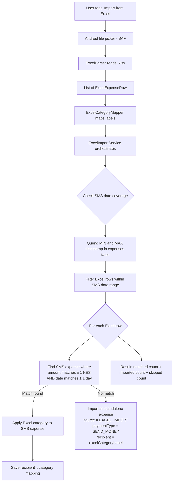

# Excel Import Feature — Implementation Plan

## Overview

Import historical expense data from an Excel (.xlsx) spreadsheet to:
1. **Match & categorize** existing SMS-imported expenses (amount + date matching)
2. **Import unmatched** Excel rows as standalone expenses within the SMS-covered date range
3. **Learn** recipient→category mappings from successful matches

## Excel File Structure

Your spreadsheet: `Expenses 2024.xlsx`

- **12 monthly sheets**: `Jan-2024` through `Dec-2024` (plus `MoM` summary — skip)
- **3 data columns**: Date (A), Expense/Category (B), Amount (C)
- **Right-side pivot summary** (E-F): ignored
- **Mixed date formats**: `yyyy-MM-dd` and `dd/MM/yyyy` within same sheet
- **~1700 rows** across all months
- **No recipient/payee info** — column B is a category label (e.g. "Food", "Fuel")

## Architecture



## Excel Category → PesaTrack Category Mapping

All 55+ unique labels from the Excel are mapped to PesaTrack's category tree.
See `ExcelCategoryMapper.kt` for the full hardcoded map.

Key mappings:

| Excel Label | PesaTrack ID | PesaTrack Name | Group |
|---|---|---|---|
| Give | 503 | Give | Faith & Giving |
| Seed | 505 | Seed | Faith & Giving |
| Tithe | 506 | Tithe | Faith & Giving |
| Offering | 504 | Offering | Faith & Giving |
| Fuel | 1712 | Fuel | Vehicle |
| Shopping | 1505 | General Shopping | Shopping |
| Internet | 1007 | Home WiFi | Home & Utilities |
| Internet Bundles | 205 | Data Bundles | Digital & Tech |
| Mpesa Transaction Cost | 606 | Mpesa Transaction Cost | Financial |
| Entertainment | 405 | Other Entertainment | Entertainment |
| Rent | 1009 | Rent | Home & Utilities |
| Invest | 602 | Investments | Financial |
| (55+ total — see ExcelCategoryMapper.kt) | | |

## Matching Strategy

### Amount + Date Match

For each Excel row `(date, category, amount)`:
1. Query DB: `SELECT * FROM expenses WHERE ABS(amount - :excelAmount) < 1.0 AND timestamp BETWEEN :dayStart AND :dayEnd AND isCategorized = 0`
2. If **exactly 1** uncategorized match → apply Excel category, save recipient mapping
3. If **multiple** uncategorized matches → apply to the first closest-amount match
4. If **no** uncategorized match but categorized match exists → skip (already handled)
5. If **no** match at all → import as standalone (if within SMS date range)

### Date Range Guardrail

- Query `MIN(timestamp)` and `MAX(timestamp)` from expenses table (SMS-imported only)
- Only import unmatched Excel rows whose date falls within `[minTimestamp, maxTimestamp]`
- Excel rows outside this range are skipped with a count reported to the user
- This prevents importing expenses for periods where SMS hasn't been imported yet

## File Changes

### New Files

| File | Purpose |
|---|---|
| `utils/excel/ExcelCategoryMapper.kt` | Hardcoded mapping: Excel label → PesaTrack category ID |
| `utils/excel/ExcelParser.kt` | Parse `.xlsx` using Apache POI → `List<ExcelExpenseRow>` |
| `services/ExcelImportService.kt` | Orchestration: parse, match, import, save mappings |
| `screens/excel_import/ExcelImportScreen.kt` | UI: file picker, progress, results |
| `screens/excel_import/ExcelImportUiState.kt` | State: phases, progress, results |
| `screens/excel_import/ExcelImportViewModel.kt` | ViewModel: drives import flow |

### Modified Files

| File | Changes |
|---|---|
| `domain/models/Expense.kt` | Add `EXCEL_IMPORT` to `ExpenseSource` enum |
| `app/build.gradle.kts` | Add Apache POI dependency |
| `app/proguard-rules.pro` | Add keep rules for POI classes |
| `dao/ExpenseDao.kt` | Add queries: `getSmsCoveredDateRange()`, `findMatchByAmountAndDate()` |
| `repository/ExpenseRepository.kt` | Add repository methods for new DAO queries |
| `navigation/Screen.kt` | Add `ExcelImport` route |
| `navigation/NavGraph.kt` | Add composable for ExcelImport screen |
| `screens/import_history/ImportScreen.kt` | Add "Import from Excel" button |
| `_docs/implementation-status.md` | Update with Excel import feature |

## Data Classes

```kotlin
// ExcelParser.kt
data class ExcelExpenseRow(
    val date: Long,          // timestamp in millis
    val categoryLabel: String, // raw label from Excel (e.g. "Food", "Seed")
    val amount: Double,
    val sheetName: String    // source sheet (e.g. "Jan-2024")
)

// ExcelImportService.kt  
data class ExcelImportResult(
    val totalExcelRows: Int,
    val rowsMatchedToSms: Int,         // Excel row matched an SMS expense → category applied
    val rowsImportedAsStandalone: Int,  // Excel row imported as new expense
    val rowsSkippedOutOfRange: Int,     // Excel row date outside SMS coverage
    val rowsSkippedDuplicate: Int,      // Excel row already matched a categorized expense
    val recipientMappingsLearned: Int,  // recipient→category mappings saved
    val parseErrors: Int
)
```

## DAO Queries Needed

```sql
-- Get the min/max timestamp of SMS-imported expenses (to determine covered range)
SELECT MIN(timestamp) as minTs, MAX(timestamp) as maxTs
FROM expenses
WHERE source IN ('SMS_PARSED', 'SMS_BANK')

-- Find uncategorized expenses matching amount (±1) and date (±1 day)
SELECT * FROM expenses
WHERE isCategorized = 0
  AND ABS(amount - :amount) < 1.0
  AND timestamp >= :dayStartMs
  AND timestamp <= :dayEndMs
ORDER BY ABS(amount - :amount) ASC
LIMIT 1

-- Check if any expense exists at a given amount+date (to avoid standalone import duplicates)
SELECT EXISTS(
  SELECT 1 FROM expenses
  WHERE ABS(amount - :amount) < 1.0
  AND timestamp >= :dayStartMs
  AND timestamp <= :dayEndMs
)
```

## UI Flow

### Import Screen Addition

On the existing Import History screen, add an "Import from Excel" card/button below the SMS import section.

### Excel Import Screen (new)

```
┌─────────────────────────────┐
│ ← Import from Excel         │
├─────────────────────────────┤
│ ┌─────────────────────────┐ │
│ │ 📊 Import Excel History │ │
│ │                         │ │
│ │ Upload your expense     │ │
│ │ tracking spreadsheet.   │ │
│ │ PesaTrack will match    │ │
│ │ entries to your SMS     │ │
│ │ transactions and        │ │
│ │ auto-categorize them.   │ │
│ └─────────────────────────┘ │
│                             │
│ [📁 Select Excel File]      │
│                             │
│ ─── After file selected ─── │
│                             │
│ File: Expenses 2024.xlsx    │
│ Sheets found: 12           │
│ Total rows: 1,682          │
│                             │
│ [▶ Start Import]            │
│                             │
│ ─── During processing ───── │
│                             │
│ ████████░░░░ 65%            │
│ Processing: Mar-2024        │
│ Matched: 142 | Imported: 38 │
│                             │
│ ─── After completion ────── │
│                             │
│ ✅ Import Complete           │
│ ├ Total Excel rows: 1,682  │
│ ├ Matched to SMS: 847      │
│ ├ Imported as new: 312     │
│ ├ Skipped (out of range): 0│
│ ├ Skipped (duplicate): 523 │
│ └ Mappings learned: 847    │
│                             │
│ [Categorize Expenses]       │
│ [Done]                      │
└─────────────────────────────┘
```

## Dependencies

```kotlin
// Apache POI for .xlsx parsing (~8MB)
implementation("org.apache.poi:poi-ooxml:5.2.5")
```

Alternative: If APK size is a concern, we could use a lighter XLSX reader library. But POI is battle-tested and handles the date format issues well.

## ProGuard Rules

```
# Apache POI
-keep class org.apache.poi.** { *; }
-keep class org.apache.xmlbeans.** { *; }
-dontwarn org.apache.poi.**
-dontwarn org.apache.xmlbeans.**
-dontwarn org.openxmlformats.**
```

## Edge Cases

1. **Duplicate Excel rows**: Same amount on same date (e.g. two "Give 100" on Jan 21). Each will try to match a different SMS expense.
2. **Mixed date formats**: Parser handles both `yyyy-MM-dd` and `dd/MM/yyyy` per row.
3. **Right-side pivot columns**: Detected by gap (empty column D) and skipped.
4. **MoM sheet**: Detected by name and skipped entirely.
5. **Sheet header row**: First row of each sheet (`Date | Expense | Amount`) is skipped.
6. **Trailing whitespace**: Category labels trimmed (e.g. `"Food "` → `"Food"`).
7. **Already-categorized SMS expenses**: If an SMS expense already has a category, skip matching (don't override).
8. **Amount tolerance**: ±1 KES accounts for rounding differences between Excel and SMS parsing.
9. **Date tolerance**: ±1 day accounts for timezone differences and late SMS delivery.
10. **Re-import safety**: Standalone Excel imports get a synthetic `transactionId` like `EXCEL_2024-01-15_Food_1155` to prevent duplicates on re-import.

## Implementation Order

1. Domain model change (`EXCEL_IMPORT` enum value)
2. Build config (POI dependency, ProGuard)
3. `ExcelCategoryMapper` (pure mapping logic)
4. `ExcelParser` (file reading)
5. DAO queries (date range, amount match)
6. Repository methods
7. `ExcelImportService` (business logic)
8. UI state + ViewModel
9. Screen + navigation
10. Integration: button on Import screen
11. Docs update
12. Commit & push
