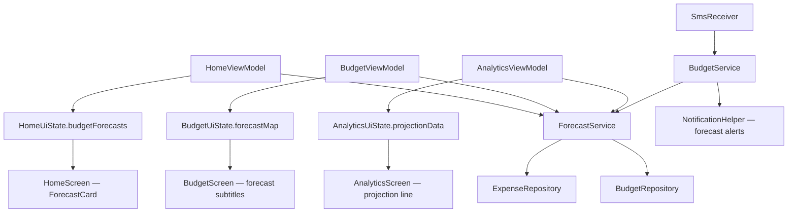

# Forecasting Implementation Plan

> **Status:** Ready to implement
> **Prerequisite:** M7 Category Budgets ✅ Complete, Budget adoption validated ✅

---

## Overview

Implement budget burn rate forecasting across 4 phases:
- **Phase A** — Core forecast engine + Home screen card (MVP)
- **Phase B** — Budget screen per-card forecast subtitles
- **Phase C** — Proactive forecast notifications after expense save
- **Phase D** — Analytics daily chart projection line + budget ceiling

**Key constraint:** No new database tables. No schema migration. Pure computation on existing data.

---

## Architecture



---

## Phase A: Core Forecast Engine + Home Card

### A1. Domain Model — `BudgetForecast.kt`

**New file:** `domain/models/BudgetForecast.kt`

```kotlin
data class BudgetForecast(
    val budget: Budget,
    val spent: Double,
    val dailyBurnRate: Double,
    val exhaustionDate: Long?,        // null if on track
    val projectedTotal: Double,
    val projectedPercentage: Double,
    val safeDailyBudget: Double,
    val daysRemaining: Int,
    val daysElapsed: Int
) {
    val isProjectedOverBudget: Boolean
        get() = projectedPercentage > 100.0

    val isExhaustionImminent: Boolean
        get() = exhaustionDate != null && daysRemaining > 0 &&
                (exhaustionDate - System.currentTimeMillis()) < 5 * 86_400_000L
}
```

No changes to existing models. `BudgetForecast` wraps a `Budget` + `BudgetProgress` with projection math.

### A2. ForecastService — `services/ForecastService.kt`

**New file:** `services/ForecastService.kt`

**Injected dependencies:** `BudgetRepository` (existing `@Singleton`)

**Key methods:**

| Method | Input | Output | Description |
|--------|-------|--------|-------------|
| `getForecastsForActiveBudgets()` | — | `List<BudgetForecast>` | Compute forecasts for all active budgets in their current period |
| `getForecastForBudget(budget, spent, periodStart, periodEnd)` | Budget + spending + range | `BudgetForecast` | Core linear burn rate computation |
| `getForecastsForPeriod(period, calendar)` | BudgetPeriod + Calendar | `List<BudgetForecast>` | Forecasts filtered by period type for Budget screen |

**Algorithm (linear burn rate):**
```
daysElapsed = (now - periodStart) / MS_PER_DAY
if daysElapsed < 5 → return null (insufficient data)
dailyBurnRate = spent / daysElapsed
totalDaysInPeriod = (periodEnd - periodStart) / MS_PER_DAY
projectedTotal = dailyBurnRate × totalDaysInPeriod
daysRemaining = totalDaysInPeriod - daysElapsed
safeDailyBudget = max(0, (budget.amount - spent) / daysRemaining)
exhaustionDate = if projectedTotal > budget.amount:
    periodStart + (budget.amount / dailyBurnRate) × MS_PER_DAY
else: null
```

**Relies on existing:**
- `BudgetRepository.getBudgetProgressList()` → gets active budgets + current spending
- `BudgetRepository.getPeriodRange()` → gets period start/end timestamps
- `BudgetRepository.getBudgetProgressListForPeriod()` → period-filtered variant

**No new DAO queries.** All data already available from `BudgetProgress`.

### A3. DI — No changes to `AppModule.kt`

`ForecastService` is `@Singleton` with `@Inject constructor` — Hilt auto-provides it. No manual `@Provides` needed (same pattern as `BudgetService`).

### A4. HomeUiState Changes

**Modified file:** `presentation/screens/home/HomeUiState.kt`

Add new fields:
```kotlin
/** Budget forecasts for active budgets (sorted by projected overspend) */
val budgetForecasts: List<BudgetForecast> = emptyList(),
/** Whether to show the forecast card (≥1 budget + ≥5 days elapsed) */
val showForecastCard: Boolean = false
```

### A5. HomeViewModel Changes

**Modified file:** `presentation/screens/home/HomeViewModel.kt`

- Inject `ForecastService` via constructor
- Add `loadForecastData()` called from `loadBudgetData()` when `hasBudgets == true`
- Forecast loading logic:
  1. Call `forecastService.getForecastsForActiveBudgets()`
  2. Filter to those with `daysElapsed >= 5`
  3. Sort by `projectedPercentage` descending
  4. Take top 4 (same as budget progress)
  5. Set `showForecastCard = forecasts.isNotEmpty()`
- Also call `loadForecastData()` from `refresh()`

### A6. HomeScreen — ForecastCard Composable

**Modified file:** `presentation/screens/home/HomeScreen.kt`

Add a `ForecastCard` composable below the `BudgetSummaryCard`:
- Header: "🔮 {Month} Forecast"
- Total forecast line: "Projected: KES X / KES Y (Z%)" with color coding
- Safe daily spend: "KES N/day to stay on track"
- Per-category rows (top 3-4 by projected overspend):
  - 🔴 "Food — runs out ~Mar 25th" (if `exhaustionDate` exists)
  - 🟡 "Transport — on track at 85%" (warning zone)
  - 🟢 "Shopping — comfortable at 62%" (under)
- Tap navigates to Budget screen

**Show condition:** `uiState.showForecastCard == true` (placed after BudgetSummaryCard)

---

## Phase B: Budget Screen Per-Card Forecasts

### B1. BudgetUiState Changes

**Modified file:** `presentation/screens/budget/BudgetUiState.kt`

Add:
```kotlin
/** Map of budget ID → BudgetForecast for the selected period */
val forecastMap: Map<Long, BudgetForecast> = emptyMap()
```

### B2. BudgetViewModel Changes

**Modified file:** `presentation/screens/budget/BudgetViewModel.kt`

- Inject `ForecastService` via constructor
- In `loadBudgetsForPeriod()`, after getting `progressList`:
  1. Call `forecastService.getForecastsForPeriod(periodType, periodCalendar)`
  2. Build `forecastMap = forecasts.associateBy { it.budget.id }`
  3. Update state: `forecastMap = forecastMap`
- Forecasts update when period changes (navigatePeriod, setPeriodType)

### B3. BudgetScreen — Forecast Subtitles

**Modified file:** `presentation/screens/budget/BudgetScreen.kt`

Each budget progress card gets a subtitle below the progress bar:
- If `daysElapsed < 5`: *"Not enough data for forecast"* (muted)
- If `isProjectedOverBudget`: *"⚠️ Projected 118% — runs out ~Mar 25"* (amber/red)
- If on track: *"On track — projected 72% by month-end"* (green)
- Always show: *"Safe: KES N/day for M remaining days"*

---

## Phase C: Proactive Forecast Notifications

### C1. AppPreferences — Throttle Key

**Modified file:** `data/local/preferences/AppPreferences.kt`

Add:
```kotlin
/** Last forecast notification timestamp per budget ID: "budget_{id}_last_forecast_notif" */
private fun forecastNotifKey(budgetId: Long) = 
    longPreferencesKey("forecast_notif_$budgetId")
```

Methods:
- `getLastForecastNotifTime(budgetId: Long): Long`
- `setLastForecastNotifTime(budgetId: Long, timestamp: Long)`

**Throttle rule:** Max 1 forecast notification per budget per 24 hours. Skip if a 80%/100% budget alert already fired today.

### C2. NotificationHelper — Forecast Notification

**Modified file:** `services/NotificationHelper.kt`

Add `showForecastNotification()`:
- Reuses the existing `BUDGET_CHANNEL_ID` (Budget Alerts channel)
- Two message templates:
  - **Projected overspend:** "📊 Food & Dining: On track for KES 18,600 (124%). KES 240/day to stay on budget."
  - **Exhaustion imminent:** "⏰ Food & Dining budget runs out in ~4 days. KES 2,400 remaining."
- Priority: `PRIORITY_DEFAULT` (lower than budget exceeded which is `PRIORITY_HIGH`)
- Notification ID: `budgetId * 10 + 5` (distinct from threshold 80/100 IDs)

### C3. BudgetService — Forecast Check

**Modified file:** `services/BudgetService.kt`

Add `checkForecastsAfterExpense(expenseCategoryId)`:
1. Get affected budgets (same logic as `checkBudgetAlerts`)
2. For each, compute forecast via `ForecastService`
3. Check throttle (skip if notified in last 24h)
4. Check if actual 80%/100% alert already firing → skip forecast (redundant)
5. Fire notification if `isProjectedOverBudget` or `isExhaustionImminent`
6. Record notification timestamp

### C4. SmsReceiver — Trigger Forecast Check

**Modified file:** `services/SmsReceiver.kt`

After the existing budget alert check block (line ~145), add:
```kotlin
// Check forecast alerts (proactive warnings)
try {
    val forecastAlerts = budgetService.checkForecastsAfterExpense(
        context, mainExpense.categoryId
    )
} catch (e: Exception) {
    Log.e(TAG, "Error checking forecast alerts", e)
}
```

---

## Phase D: Analytics Projection Line

### D1. AnalyticsUiState Changes

**Modified file:** `presentation/screens/analytics/AnalyticsUiState.kt`

Add:
```kotlin
/** Projected daily cumulative spending from today to month-end (for projection line) */
val projectionLine: List<DailyTotal> = emptyList(),
/** Budget ceiling value for the total budget (null if no total budget) */
val budgetCeiling: Double? = null
```

### D2. AnalyticsViewModel Changes

**Modified file:** `presentation/screens/analytics/AnalyticsViewModel.kt`

In `loadMonthData()`, after computing daily spending:
1. If viewing the current month and active budgets exist:
   a. Get total spending budget (if exists) → `budgetCeiling`
   b. Compute cumulative sum of `dailySpending` up to today
   c. Calculate daily burn rate from cumulative total
   d. Project forward: for each remaining day, add `dailyBurnRate` to running total
   e. Emit as `projectionLine: List<DailyTotal>` (day numbers + projected cumulative amounts)
2. If not current month or no budgets → clear projection data

### D3. AnalyticsScreen — Projection Overlay

**Modified file:** `presentation/screens/analytics/AnalyticsScreen.kt`

On the existing daily spending Vico chart:
- **Solid line (blue):** Actual cumulative daily spending (existing data)
- **Dashed line (gray):** Projected cumulative spending from today → month-end (from `projectionLine`)
- **Horizontal line (red, dashed):** Budget ceiling (from `budgetCeiling`)
- Where the projection crosses the ceiling is the visual "danger zone"

Implementation uses Vico's `rememberLineCartesianLayer()` with multiple line specs — one solid, one dashed via `DashedPathEffect`.

---

## File Change Summary

| Phase | File | Change Type |
|-------|------|-------------|
| **A** | `domain/models/BudgetForecast.kt` | **NEW** |
| **A** | `services/ForecastService.kt` | **NEW** |
| **A** | `presentation/screens/home/HomeUiState.kt` | MODIFY — add 2 fields |
| **A** | `presentation/screens/home/HomeViewModel.kt` | MODIFY — inject ForecastService, add loadForecastData() |
| **A** | `presentation/screens/home/HomeScreen.kt` | MODIFY — add ForecastCard composable |
| **B** | `presentation/screens/budget/BudgetUiState.kt` | MODIFY — add forecastMap field |
| **B** | `presentation/screens/budget/BudgetViewModel.kt` | MODIFY — inject ForecastService, load forecasts |
| **B** | `presentation/screens/budget/BudgetScreen.kt` | MODIFY — add forecast subtitle to budget cards |
| **C** | `data/local/preferences/AppPreferences.kt` | MODIFY — add forecast throttle keys |
| **C** | `services/NotificationHelper.kt` | MODIFY — add showForecastNotification() |
| **C** | `services/BudgetService.kt` | MODIFY — add checkForecastsAfterExpense() |
| **C** | `services/SmsReceiver.kt` | MODIFY — trigger forecast check |
| **D** | `presentation/screens/analytics/AnalyticsUiState.kt` | MODIFY — add projection fields |
| **D** | `presentation/screens/analytics/AnalyticsViewModel.kt` | MODIFY — compute projection data |
| **D** | `presentation/screens/analytics/AnalyticsScreen.kt` | MODIFY — render projection line |
| — | `_docs/implementation-status.md` | MODIFY — update status |

**Total: 2 new files, 14 modified files, 0 database migrations**

---

## Edge Cases

| Edge Case | Handling |
|-----------|---------|
| < 5 days into period | Don't show forecast. "Not enough data yet." |
| Zero spending so far | Show "No spending recorded yet this period" |
| Large one-time expense inflates rate | Mitigated in Phase B subtitle showing "Safe: KES N/day" which auto-adjusts. Full fix requires recurring expense detection (future). |
| Weekly budgets | Same algorithm, shorter period. Forecast usable by Wednesday. |
| User changes budget mid-period | Recompute with new amount. Spent stays the same. |
| Investment group in Total budget | All expenses count — consistent with existing budget behavior. |
| CUSTOM period budgets (legacy) | Use budget's customStartDate/customEndDate for range. |
| Forecast + actual alert overlap | Phase C: skip forecast notification if 80%/100% alert already fired today |

---

## Implementation Order

Execute phases sequentially (A → B → C → D). Each phase is independently shippable:
- **Phase A alone** delivers the core value: Home screen forecast card
- **Phase B** enriches the Budget screen with per-budget projections  
- **Phase C** adds proactive push notifications
- **Phase D** adds visual analytics overlay

Phase A is the highest priority. Phases B–D can be done in any order after A.
