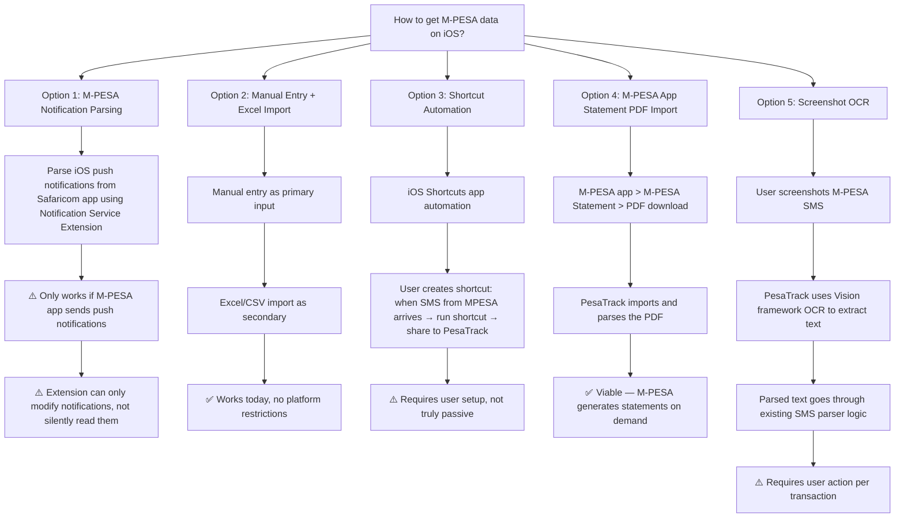
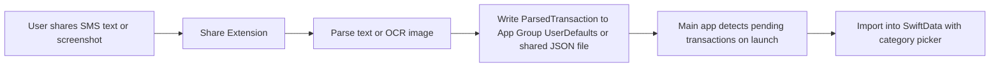

# PesaTrack iOS Implementation Plan

## Overview

This plan covers porting PesaTrack from Android (native Kotlin + Jetpack Compose) to iOS (native Swift + SwiftUI). The Android app is a **passive M-PESA expense tracker** that intercepts SMS, parses transactions, and stores everything locally. Some features port directly; others face fundamental iOS platform restrictions.

---

## Executive Summary: What Works, What Changes, What Breaks

### ✅ Ports Directly (logic reusable, just translate Kotlin → Swift)

| Feature | Android Source | iOS Equivalent | Notes |
|---------|---------------|----------------|-------|
| SMS regex parsing logic | `MpesaSmsParser.kt`, `NcbaBankParser.kt` | Swift `NSRegularExpression` or `Regex` (Swift 5.7+) | All regex patterns and parsing logic translate 1:1 |
| Parser strategy pattern | `SmsParserStrategy.kt`, `SmsParserRegistry.kt` | Swift protocols + registry class | Clean port |
| Category system (18 groups, 90+ subcategories) | `CategoryEntity.kt` DefaultCategories | Core Data or SwiftData entities | Data-only, direct translation |
| KeywordRulesEngine (100+ business names) | `KeywordRulesEngine.kt` | Swift dictionary + string matching | Pure logic, no platform dependencies |
| Budget model + progress calculation | `BudgetRepository.kt`, `Budget.kt` | Swift equivalent | Pure math/logic |
| Forecast service (linear burn rate) | `ForecastService.kt` | Swift equivalent | Pure computation |
| Recurring expense detection | `RecurringExpenseService.kt` | Swift equivalent | Pure computation (interval analysis) |
| Excel import (Apache POI) | `ExcelParser.kt`, `ExcelCategoryMapper.kt` | CoreXLSX (Swift library) or xlsxwriter | Different library, same logic |
| PIN lock + hashing | `PinManager.kt` | Swift CryptoKit (SHA-256) + Keychain | Keychain replaces DataStore for secrets |
| Domain models | `Expense.kt`, `Category.kt`, `Budget.kt`, etc. | Swift structs/enums | Direct translation |
| Currency formatting | `Constants.kt` `formatAsCurrency()` | `NumberFormatter` with KES locale | Trivial |
| Analytics computation | `AnalyticsViewModel.kt` | Swift equivalent | MoM, YoY, CV detection — pure math |

### 🟡 Needs Significant Rework (same goal, different implementation)

| Feature | Android Approach | iOS Approach | Impact |
|---------|-----------------|-------------|--------|
| **SMS interception (LIVE)** | `BroadcastReceiver` with `SMS_RECEIVED` | **Not possible on iOS** — see detailed section below | 🔴 **CRITICAL** — requires alternative strategy |
| **Historical SMS import** | `ContentResolver` reads SMS inbox | **Not possible on iOS** — no SMS inbox access | 🔴 **CRITICAL** — requires alternative strategy |
| Local database | Room (SQLite) | Core Data, SwiftData, or GRDB (SQLite) | Same concept, different ORM |
| Preferences/settings | Jetpack DataStore | `UserDefaults` or `@AppStorage` | Simpler on iOS |
| Dependency injection | Hilt (Dagger) | Swift native DI (manual), Swinject, or `@Environment` | SwiftUI has built-in patterns |
| Background tasks | WorkManager | `BGTaskScheduler` (BGAppRefreshTask / BGProcessingTask) | More restrictive on iOS |
| Notifications | NotificationHelper + channels | `UNUserNotificationCenter` | No channels on iOS, but categories work |
| Biometric auth | AndroidX Biometric (BiometricPrompt) | LocalAuthentication (LAContext — Face ID / Touch ID) | Simpler API on iOS |
| Charts | Vico (Compose) | Swift Charts (iOS 16+) or Charts by Daniel Gindi | Swift Charts is native and excellent |
| File sharing/export | `Intent.ACTION_SEND` + FileProvider | `UIActivityViewController` / ShareLink (SwiftUI) | Simpler on iOS |
| App lifecycle (PIN lock) | `ProcessLifecycleOwner` | `ScenePhase` (SwiftUI) or `UIApplication` notifications | Cleaner on iOS |
| In-app purchases (Pro) | Google Play Billing | StoreKit 2 | Different API, same concepts |
| PDF report | Android Canvas + PdfDocument | iOS `UIGraphicsPDFRenderer` | Native on both platforms |

### 🔴 Cannot Port (iOS Platform Restrictions)

| Feature | Why It Breaks on iOS | Alternative |
|---------|---------------------|-------------|
| **Live SMS interception** | iOS does not allow apps to read incoming SMS. Period. No API, no permission, no workaround. Apple's privacy model prohibits it. | See alternatives section below |
| **Historical SMS import** | iOS does not expose the SMS inbox to third-party apps. No `ContentResolver` equivalent. | See alternatives section below |
| **SMS BroadcastReceiver** | No equivalent concept on iOS. Apps cannot register for SMS delivery broadcasts. | See alternatives section below |
| **`RECEIVE_SMS` / `READ_SMS` permissions** | These permissions don't exist on iOS | N/A |

---

## The SMS Problem: The Biggest Challenge

### Why This Matters

PesaTrack's **entire value proposition** on Android is passive SMS tracking — the app intercepts M-PESA SMS in real-time, parses them, and saves expenses automatically with zero user effort. On iOS, this is **fundamentally impossible**.

Apple does not allow third-party apps to:
1. Read the SMS inbox
2. Receive notifications when an SMS arrives
3. Access SMS content in any way

The only SMS-related API on iOS is `MessageFilterExtension` (iOS 11+), which is for **spam filtering** — it can classify unknown-sender messages as junk/transaction/promotion but **cannot read the message content back to the host app**.

### Alternative Strategies for iOS



### Recommended iOS Strategy: Hybrid Approach

**Primary input methods (ranked by user effort):**

1. **M-PESA Statement PDF Import** (lowest effort, batch) — **[Full spec: `plans/mpesa-statement-parser-spec.md`](../plans/mpesa-statement-parser-spec.md)**
   - M-PESA app generates password-protected PDF statements on demand
   - User opens M-PESA app → Statement → Download → Share to PesaTrack
   - PesaTrack unlocks PDF with user's National ID, parses all transactions
   - Can be done weekly/monthly — covers all transactions at once
   - Statement format is well-structured: Receipt No, Completion Time, Details (multi-line), Status, Paid In, Withdrawn, Balance
   - 13+ transaction types identified and documented with regex patterns
   - Charges/fees linked to parent transactions via shared Receipt No.
   - **Also valuable on Android** — enables bulk historical import without SMS access

2. **Manual Entry** (per-transaction)
   - Already built on Android — port directly
   - Quick entry form with amount, recipient, category
   - Good for real-time tracking when user remembers

3. **Excel/CSV Import** (batch, existing feature)
   - Port existing Excel import logic
   - User can export from M-PESA or bank apps and import into PesaTrack

4. **Screenshot OCR** (semi-automated, per-transaction)
   - User screenshots the M-PESA confirmation SMS
   - Shares screenshot with PesaTrack via Share Sheet
   - PesaTrack uses Apple Vision framework (VNRecognizeTextRequest) to OCR the image
   - Extracted text goes through existing regex parsing logic
   - Pre-fills the expense form for user confirmation

5. **iOS Shortcuts Integration** (advanced, power users)
   - PesaTrack exposes App Intents (iOS 16+)
   - User creates a Personal Automation: "When I receive SMS from MPESA → Run PesaTrack Shortcut"
   - The shortcut can forward the SMS text to PesaTrack
   - ⚠️ Requires initial user setup and iOS will ask for confirmation each time (iOS 17+ may run some automations without asking)

6. **Clipboard Paste** (simple, low-friction)
   - User copies M-PESA SMS text → opens PesaTrack → app detects clipboard content and offers to parse it
   - Simple, no API restrictions, works today
   - iOS 16+ shows a paste permission prompt

---

## iOS Technology Stack

| Layer | Technology | Rationale |
|-------|-----------|-----------|
| **Language** | Swift 5.9+ | Modern, type-safe, Apple-native |
| **UI** | SwiftUI (iOS 17+) | Direct parallel to Jetpack Compose — declarative UI |
| **Architecture** | MVVM | Same pattern as Android — ViewModels with `@Observable` (iOS 17) or `ObservableObject` |
| **Database** | SwiftData (iOS 17+) or Core Data | SwiftData is the modern Apple equivalent of Room — schema, migrations, queries |
| **Preferences** | `UserDefaults` / `@AppStorage` | Simpler than DataStore — no async needed for basic prefs |
| **Secure Storage** | Keychain (via KeychainAccess library) | For PIN hash + salt, biometric secrets |
| **DI** | Manual injection or swift-dependencies | SwiftUI `@Environment` handles most cases; no Hilt needed |
| **Charts** | Swift Charts (iOS 16+) | Apple's native charting framework — better than any 3rd party |
| **Async** | Swift Concurrency (async/await, actors) | Direct equivalent of Kotlin Coroutines + Flow |
| **Excel Parsing** | CoreXLSX | Swift library for reading .xlsx files |
| **PDF Parsing** | PDFKit + Vision framework | For M-PESA statement import |
| **OCR** | Vision framework (VNRecognizeTextRequest) | For screenshot OCR feature |
| **Biometric** | LocalAuthentication (LAContext) | Face ID / Touch ID |
| **Background Tasks** | BGTaskScheduler | For recurring expense reminders |
| **Notifications** | UNUserNotificationCenter | Budget alerts, reminders |
| **In-App Purchase** | StoreKit 2 | For Pro tier — replaces Google Play Billing |
| **Minimum iOS** | iOS 17.0 | SwiftData + @Observable macro + modern APIs |

---

## Architecture Mapping: Android → iOS

```
Android (Kotlin)                          iOS (Swift)
─────────────────                         ──────────────
PesaTrackApp.kt (Application)        →   PesaTrackApp.swift (@main App)
MainActivity.kt                       →   ContentView.swift (root view)
NavGraph.kt                           →   NavigationStack + TabView
Screen.kt (sealed class)              →   enum Route: Hashable
Hilt @Module + @Inject                →   @Environment + manual DI container
Room Database                         →   SwiftData ModelContainer
Room @Entity                          →   @Model class
Room @Dao                             →   ModelContext queries
Room migrations                       →   SwiftData SchemaMigrationPlan
DataStore                             →   UserDefaults / @AppStorage
Kotlin Coroutines + Flow              →   async/await + AsyncSequence / Combine
ViewModel (Hilt)                      →   @Observable class (iOS 17)
Jetpack Compose                       →   SwiftUI
Material 3                            →   Native iOS design language
BroadcastReceiver                     →   ❌ No equivalent
ContentResolver (SMS)                 →   ❌ No equivalent
WorkManager                           →   BGTaskScheduler
NotificationHelper (channels)         →   UNNotificationCategory + actions
BiometricPrompt                       →   LAContext
ProcessLifecycleOwner                 →   ScenePhase
Apache POI                            →   CoreXLSX
Vico Charts                           →   Swift Charts
Google Play Billing                   →   StoreKit 2
```

---

## Feature-by-Feature Implementation Plan

### Phase 1: Core Data Layer + Manual Entry (MVP)

Get the database, models, and manual expense entry working first — this is the foundation that everything else builds on and doesn't depend on SMS.

| Task | Description |
|------|-------------|
| Project setup | Xcode project, Swift Package Manager, folder structure mirroring Android's clean architecture |
| Domain models | Port `Expense`, `Category`, `Budget`, `BudgetForecast`, `RecurringExpense`, `AnalyticsModels` to Swift structs/enums |
| SwiftData schema | Port all 6 entities: Expense, Category, CategoryRule, Budget, Income, RecipientCategoryMapping |
| Default categories | Port 18 groups + 90+ subcategories as seed data |
| Category repository | CRUD + default seeding + expense count checks |
| Expense repository | CRUD + month range queries + duplicate detection |
| Manual entry screen | Port ManualEntryScreen with SwiftUI form |
| Home screen | Monthly summary, recent expenses, uncategorized alert |
| Expense list screen | Full history with category colors and search |
| Categorize screen | Grouped hierarchical category picker |
| Batch categorize | Recipient grouping + multi-select |
| Navigation | TabView (Home, Analytics, Expenses) + NavigationStack |
| Theme | Port color palette and typography to iOS design language |

### Phase 2: M-PESA Data Import (iOS-specific)

Build the iOS-specific data ingestion pipelines that replace Android's SMS interception.

| Task | Description |
|------|-------------|
| M-PESA statement parser | Build PDF parser per [`mpesa-statement-parser-spec.md`](../plans/mpesa-statement-parser-spec.md) — PDFKit unlock + text extraction + regex matching for 13+ transaction types. **Also build for Android** (Apache PDFBox). |
| Statement import screen | File picker (UIDocumentPickerViewController) + password prompt for locked PDFs + import progress + results summary |
| Screenshot OCR | Vision framework integration — capture text from M-PESA SMS screenshots |
| OCR → parser pipeline | Feed OCR text through existing regex parsers (MpesaSmsParser logic) |
| Share Extension | iOS Share Sheet extension — receive text or images from other apps |
| Clipboard detection | On app foreground, detect M-PESA text in clipboard and offer to parse |
| Excel/CSV import | Port ExcelImportService using CoreXLSX library |
| App Intents | Expose "Log Expense" and "Parse M-PESA Text" as Shortcuts actions |
| SMS parser logic | Port all regex patterns from MpesaSmsParser + NcbaBankParser |
| Parser registry | Port SmsParserRegistry as protocol-based dispatcher |

### Phase 3: Intelligence Layer

Port the analytics, budgeting, forecasting, and recurring expense features.

| Task | Description |
|------|-------------|
| Analytics screen | Monthly/Yearly tabs with Swift Charts |
| Budget screen | Period-first flow with Weekly/Monthly/Yearly |
| Budget repository | Period range computation, spending aggregation, progress/alerts |
| Income tracking | Manual monthly income entry |
| Forecast service | Port linear burn rate projections |
| Recurring expense detection | Port interval analysis engine |
| Recurring reminders | BGTaskScheduler daily task for upcoming/overdue alerts |
| Notifications | Budget alerts at 80%/100%, forecast warnings, recurring reminders |
| Category management | Custom groups/subcategories CRUD + auto-rules |
| KeywordRulesEngine | Port 100+ business name rules |

### Phase 4: Security + Settings + Polish

| Task | Description |
|------|-------------|
| PIN lock | 4-digit PIN with SHA-256 + Keychain storage |
| Biometric unlock | Face ID / Touch ID via LAContext |
| App lock lifecycle | ScenePhase-based background detection + lock timeout |
| Onboarding flow | 4-page walkthrough adapted for iOS data import flow |
| Settings screen | All toggles, month start day, security settings |
| About screen | Version, privacy policy, contact |
| Backup/restore | iCloud document backup or local file export |
| Data management | Export CSV, reset categories |

### Phase 5: Pro Tier + App Store

| Task | Description |
|------|-------------|
| StoreKit 2 integration | Subscription products (monthly/yearly/lifetime) |
| Pro gating | Same soft/hard gate pattern as Android |
| Insight engine | Port RecommendationEngine + InsightEngine |
| Insights screen | Financial coaching feed |
| Custom date range analytics | Date picker for arbitrary periods |
| PDF report | UIGraphicsPDFRenderer for branded monthly report |
| App Store submission | Screenshots, description, review guidelines |

---

## Key Differences to Watch Out For

### 1. iOS Design Language ≠ Material Design

Do **not** port Material 3 components 1:1. iOS users expect native iOS patterns:

| Android (Material 3) | iOS Equivalent |
|----------------------|----------------|
| NavigationBar (bottom) | TabView (bottom tabs) |
| TopAppBar | NavigationStack title + toolbar |
| FloatingActionButton | Toolbar button or `.toolbar { }` item |
| Snackbar | Alert, banner, or toast (custom) |
| BottomSheet | `.sheet()` modifier |
| AlertDialog | `.alert()` modifier |
| DropdownMenu | Menu or Picker |
| ExposedDropdownMenu | Picker with `.pickerStyle(.menu)` |
| Material 3 color system | iOS dynamic colors + asset catalog |
| Ripple effect | Highlight effect (automatic in SwiftUI) |

### 2. Data Persistence Differences

| Concern | Android (Room) | iOS (SwiftData) |
|---------|---------------|-----------------|
| Schema definition | `@Entity` annotations | `@Model` macro |
| Queries | `@Query` SQL strings in DAO | `#Predicate` macro + `FetchDescriptor` |
| Migrations | Manual `Migration` objects with SQL | `SchemaMigrationPlan` with stage definitions |
| Reactive updates | `Flow<List<Entity>>` | `@Query` macro in SwiftUI or `ModelContext` fetch |
| Thread safety | Room handles threading | `ModelActor` for background operations |

### 3. Background Execution is More Restricted on iOS

| Android | iOS | Limitation |
|---------|-----|------------|
| WorkManager — guaranteed periodic execution | BGTaskScheduler — best-effort, system decides when | iOS may delay or skip tasks based on battery, usage patterns |
| BroadcastReceiver — instant SMS processing | No equivalent | Cannot react to SMS |
| Foreground service | No equivalent needed (no SMS processing) | N/A |

For recurring reminders: Schedule them as local notifications (`UNNotificationRequest` with `UNCalendarNotificationTrigger`) instead of relying on a background worker. This is **more reliable** on iOS than BGTaskScheduler for time-sensitive reminders.

### 4. App Store Review Considerations

| Concern | Notes |
|---------|-------|
| **No SMS access claim** | Unlike Google Play, Apple will never approve an app that claims to read SMS. Marketing copy must focus on manual entry, statement import, and OCR. |
| **Privacy nutrition labels** | Must accurately declare data usage in App Store Connect. PesaTrack collects no data — declare accordingly. |
| **In-app purchase review** | Apple takes 30% (15% for small businesses < $1M). Factor into pricing. |
| **Guideline 4.2 (minimum functionality)** | Without SMS automation, ensure the app provides enough standalone value through manual entry + statement import + analytics. |
| **Share Extension review** | Share extensions face additional scrutiny. Keep the extension simple and focused. |

### 5. Keychain vs DataStore for Secrets

Android stores PIN hash in DataStore (encrypted preferences). On iOS, use **Keychain** for the PIN hash + salt — it's hardware-backed, survives app reinstalls (optionally), and integrates with biometric auth.

### 6. M-PESA Statement Format Research Needed

Before building the statement parser, you need to:
1. Download several M-PESA statements (PDF format) from the Safaricom app
2. Analyze the exact format — table structure, field positions, date formats
3. Check if M-PESA also offers CSV export (simpler to parse)
4. Build test fixtures from real statement samples

### 7. Share Extension Architecture

The iOS Share Extension runs in a **separate process** with limited memory (120MB). It must:
- Accept text (shared SMS text) or images (screenshots)
- Process quickly (Apple recommends < 2 seconds)
- Write to an **App Group** shared container (not the main app's SwiftData store directly)
- The main app picks up shared data on next launch



---

## Proposed iOS Project Structure

```
PesaTrack/
├── PesaTrackApp.swift                    # @main App entry point
├── ContentView.swift                     # Root TabView + NavigationStack
├── Models/
│   ├── Expense.swift                     # SwiftData @Model
│   ├── Category.swift                    # SwiftData @Model + DefaultCategories
│   ├── Budget.swift                      # SwiftData @Model
│   ├── Income.swift                      # SwiftData @Model
│   ├── CategoryRule.swift                # SwiftData @Model
│   ├── RecipientCategoryMapping.swift    # SwiftData @Model
│   └── Enums/
│       ├── PaymentType.swift
│       ├── ExpenseSource.swift
│       ├── BudgetPeriod.swift
│       └── ForecastStatus.swift
├── Services/
│   ├── Parsers/
│   │   ├── SmsParserProtocol.swift       # Strategy protocol
│   │   ├── SmsParserRegistry.swift       # Dispatcher
│   │   ├── MpesaSmsParser.swift          # M-PESA regex parser
│   │   ├── NcbaBankParser.swift          # NCBA regex parser
│   │   └── MpesaStatementParser.swift    # NEW: PDF statement parser
│   ├── KeywordRulesEngine.swift          # 100+ business name rules
│   ├── CategorizationService.swift       # Two-pass categorization
│   ├── ForecastService.swift             # Linear burn rate projections
│   ├── RecurringExpenseService.swift     # Interval analysis detection
│   ├── BudgetService.swift               # Threshold checking after expense save
│   ├── PinManager.swift                  # SHA-256 + Keychain
│   ├── OCRService.swift                  # NEW: Vision framework text recognition
│   ├── ExcelImportService.swift          # CoreXLSX-based import
│   ├── DataManagementService.swift       # Export, backup, restore
│   └── NotificationService.swift         # UNUserNotificationCenter wrapper
├── Repositories/
│   ├── ExpenseRepository.swift
│   ├── CategoryRepository.swift
│   ├── BudgetRepository.swift
│   ├── CategoryRuleRepository.swift
│   └── RecipientMappingRepository.swift
├── Views/
│   ├── Home/
│   │   ├── HomeView.swift
│   │   └── HomeViewModel.swift
│   ├── Expenses/
│   │   ├── ExpenseListView.swift
│   │   └── ExpensesViewModel.swift
│   ├── Analytics/
│   │   ├── AnalyticsView.swift
│   │   └── AnalyticsViewModel.swift
│   ├── Categorize/
│   │   ├── CategorizeView.swift
│   │   └── CategorizeViewModel.swift
│   ├── BatchCategorize/
│   │   ├── BatchCategorizeView.swift
│   │   └── BatchCategorizeViewModel.swift
│   ├── ManualEntry/
│   │   ├── ManualEntryView.swift
│   │   └── ManualEntryViewModel.swift
│   ├── Import/
│   │   ├── StatementImportView.swift     # NEW: M-PESA statement import
│   │   ├── ExcelImportView.swift
│   │   ├── ScreenshotImportView.swift    # NEW: OCR-based import
│   │   └── ImportViewModel.swift
│   ├── Budget/
│   │   ├── BudgetView.swift
│   │   └── BudgetViewModel.swift
│   ├── Settings/
│   │   ├── SettingsView.swift
│   │   └── SettingsViewModel.swift
│   ├── CategoryManagement/
│   │   ├── CategoryManagementView.swift
│   │   └── CategoryManagementViewModel.swift
│   ├── Onboarding/
│   │   └── OnboardingView.swift
│   ├── Pin/
│   │   ├── PinLockView.swift
│   │   └── PinSetupView.swift
│   └── Components/
│       ├── ExpenseCard.swift
│       ├── CategoryChip.swift
│       ├── GroupedCategoryPicker.swift
│       └── BudgetProgressCard.swift
├── Extensions/
│   ├── Double+Currency.swift
│   └── Date+Extensions.swift
├── ShareExtension/                       # NEW: iOS Share Extension target
│   ├── ShareViewController.swift
│   └── Info.plist
└── Resources/
    ├── Assets.xcassets
    └── Localizable.strings
```

---

## Onboarding Flow Adaptation for iOS

The Android onboarding is 4 pages: Welcome, How It Works, SMS Permission, Import History.

The iOS onboarding needs to be different because there's no SMS permission to grant:

| Page | Android | iOS Adaptation |
|------|---------|----------------|
| 1 | Welcome — what the app does | Same |
| 2 | How It Works — SMS parsing | **Changed:** "How to add expenses" — manual entry, statement import, screenshot OCR, clipboard paste |
| 3 | SMS Permission grant | **Replaced:** Notification permission grant (for budget alerts + reminders) |
| 4 | Import History (SMS import) | **Replaced:** "Import Your Data" — M-PESA statement import or Excel file import |

---

## Risk Assessment

| Risk | Severity | Mitigation |
|------|----------|------------|
| No passive SMS tracking reduces the core value proposition | 🔴 High | Invest heavily in making statement import + OCR + clipboard frictionless. Market as "privacy-first expense tracker" |
| M-PESA statement format may change | 🟡 Medium | Build parser with loose coupling; version the format detection |
| OCR accuracy on M-PESA SMS screenshots | 🟡 Medium | Vision framework is excellent for printed text; validate with real screenshots from different iPhone models |
| iOS Share Extension memory limits | 🟡 Medium | Keep extension lightweight; defer heavy processing to main app |
| App Store rejection for unclear value without SMS | 🟡 Medium | Strong standalone value through budgeting, analytics, forecasting. Many successful iOS expense trackers are manual-entry only |
| SwiftData maturity (relatively new framework) | 🟡 Medium | iOS 17+ has stabilized SwiftData significantly. Fallback to Core Data if issues arise |
| Smaller Kenya iOS market share | 🟡 Medium | Kenya is ~85% Android. iOS version serves a smaller but higher-income demographic. Consider cross-platform (KMP) in future |

---

## Cross-Platform Future Consideration

If maintaining two separate native codebases becomes burdensome, consider:

1. **Kotlin Multiplatform (KMP)** — Share domain models, parsers, business logic, and repositories between Android and iOS. Only UI layer is platform-specific (Compose / SwiftUI). The current Android codebase's clean separation of `domain/`, `services/`, `utils/` from `presentation/` makes this feasible.

2. **Flutter rewrite** — Single codebase for both platforms, but loses native feel and requires rewriting everything.

**Recommendation:** Build native iOS first to learn the platform constraints. Evaluate KMP after iOS v1 ships if code duplication is painful.

---

## App Store Pricing (Adjusted for Apple's Cut)

Apple takes 30% (15% for revenue under $1M/year via Small Business Program).

| Plan | Android Price | iOS Price (same KES) | Apple's Cut (15%) | Net Revenue |
|------|--------------|---------------------|-------------------|-------------|
| Monthly | KES 149 | KES 149 | KES 22 | KES 127 |
| Yearly | KES 999 | KES 999 | KES 150 | KES 849 |
| Lifetime | KES 2,499 | KES 2,499 | KES 375 | KES 2,124 |

Apple requires prices to use their price tiers. The closest App Store price points:
- Monthly: Tier 2 (~$0.99 / KES 149)
- Yearly: Tier 8 (~$7.99 / KES 999)
- Lifetime: Tier 19 (~$19.99 / KES 2,499)

---

## Summary

The iOS port is **fully viable** but requires a fundamentally different data ingestion strategy. The app's value shifts from "passive SMS tracking" to "smart expense management with easy import tools." All the intelligence (budgets, forecasts, recurring detection, analytics, categorization) ports directly — it's the **data input method** that changes.

The biggest risk is user friction: Android users get expenses automatically; iOS users must take an action (import statement, take screenshot, paste text, or enter manually). Invest in making every import path as frictionless as possible, and the iOS app can stand on its own.
