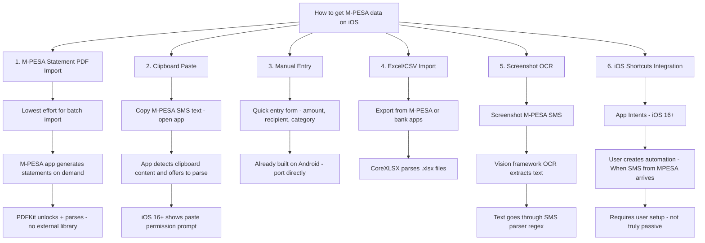
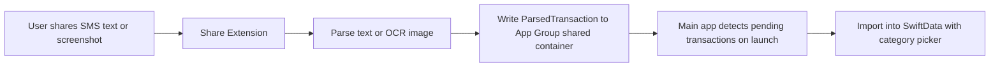

# PesaTrack iOS Implementation Plan

## Overview

This plan covers porting PesaTrack from Android (native Kotlin + Jetpack Compose) to iOS (native Swift + SwiftUI). The Android app is a **passive M-PESA expense tracker** that intercepts SMS, parses transactions, and stores everything locally. Some features port directly; others face fundamental iOS platform restrictions.

**Current constraint:** No Mac hardware or Apple Developer account available yet. This plan sequences everything from hardware acquisition through App Store submission.

---

## Strategic Context

Before diving into implementation, it is critical to acknowledge the business context:

| Factor | Reality |
|--------|---------|
| Android app status | Published on Play Store (v1.1.0), all planned features complete |
| Business validation | Stage 1 (Feedback Loops) implemented; exit criteria not yet met |
| Pro monetization | Not yet validated (Stage 2 not started) |
| Kenya market share | ~85% Android, ~15% iOS |
| iOS SMS limitation | Cannot passively intercept SMS — the core Android value proposition |

**Why proceed anyway:** The user has a specific reason to build iOS now (portfolio, investor demo, personal use, early market presence for higher-income Kenyan iOS demographic).

**Risk mitigation:** Build the smallest viable iOS app first (MVP), validate it locally, then expand. Do not attempt full feature parity until the Android business model is proven.

---

## Phase 0: Prerequisites — Hardware and Accounts

### 0A. Mac Hardware Options

Xcode only runs on macOS. These are your options, ranked by cost-effectiveness for a Kenya-based developer:

| Option | Approximate Cost in KES | Pros | Cons |
|--------|------------------------|------|------|
| **Mac Mini M2 (refurbished)** | KES 70,000–90,000 ($550–700) | Cheapest real Mac; plenty of power for Xcode; small form factor | Need external monitor, keyboard, mouse |
| **Mac Mini M4 (new)** | KES 85,000–110,000 ($650–850) | Latest chip; excellent Xcode performance; 10-year lifespan | Need peripherals |
| **MacBook Air M2 (refurbished)** | KES 100,000–130,000 ($800–1,000) | Portable; built-in screen; good for dev | Battery degrades; screen is small for Xcode |
| **MacBook Air M3 (new)** | KES 160,000–190,000 ($1,200–1,500) | Best balance of portability and power | Premium price |
| **Cloud Mac (MacStadium / AWS EC2 Mac)** | KES 5,000–15,000/month ($40–120/mo) | No upfront cost; cancel anytime; remote | Latency from Kenya; ongoing cost; not great for UI work |
| **Hackintosh on existing PC** | Free (software) | Zero hardware cost | Legally grey; unstable; Xcode updates break things; not recommended |

**Recommendation:** **Mac Mini M2 refurbished** is the highest value option. Pair it with your existing monitor, keyboard, and mouse. If you need portability, go MacBook Air M2 refurbished.

**Where to buy in Kenya:**
- **Apple authorized resellers:** iStore Kenya (Village Market, Westgate), Connected (Sarit Centre)
- **Refurbished/used:** Jiji Kenya (verified sellers only), Facebook Marketplace Nairobi, Jumia (check seller ratings)
- **International refurbished:** Apple Refurbished Store (ships to Kenya via mail forwarding), Amazon Renewed

### 0B. Apple Developer Account

| Item | Cost | Notes |
|------|------|-------|
| Apple Developer Program | $99/year (approximately KES 12,800) | Required for App Store submission AND testing on physical devices |
| Payment method | Credit/debit card (Visa/Mastercard) | M-PESA not accepted; use Equity Visa or NCBA card |
| Enrollment | [developer.apple.com/programs](https://developer.apple.com/programs) | Individual enrollment; takes 24–48 hours to approve |
| D-U-N-S Number | Free (optional) | Only needed for Organization enrollment; skip for Individual |

**Timing:** Enroll AFTER you have a Mac and Xcode installed — Apple requires agreeing to terms from the developer portal.

### 0C. Development Environment Setup

Once you have a Mac:

| Step | Action |
|------|--------|
| 1 | Install **Xcode 16+** from the Mac App Store (approximately 12 GB download) |
| 2 | Install **Xcode Command Line Tools**: `xcode-select --install` |
| 3 | Install **Swift Package Manager** (comes with Xcode) |
| 4 | Install **Homebrew**: `/bin/bash -c "$(curl -fsSL https://raw.githubusercontent.com/Homebrew/install/HEAD/install.sh)"` |
| 5 | Install **SwiftLint** (optional linter): `brew install swiftlint` |
| 6 | Install **SF Symbols** app (Apple's icon library): download from developer.apple.com |
| 7 | Sign in to your Apple Developer account in Xcode: Xcode → Settings → Accounts → Add |
| 8 | Create a new Xcode project: iOS App → SwiftUI → Swift → SwiftData |

### 0D. Test Device

| Option | Notes |
|--------|-------|
| **iPhone Simulator** (in Xcode) | Free, adequate for most development; no App Store distribution testing |
| **Physical iPhone** | Required for testing biometrics (Face ID), notifications, Share Extension, and real-world performance |
| **Minimum recommended** | iPhone 12 or newer running iOS 17+ (for SwiftData compatibility) |

**Tip:** You can test on a physical device for free using your Apple ID — App Store submission requires the paid Developer Program.

### Phase 0 Exit Criteria

- [ ] Mac hardware acquired and powered on
- [ ] Xcode 16+ installed and launches successfully
- [ ] Apple Developer account enrolled (individual, $99/year)
- [ ] Signed into developer account in Xcode
- [ ] Can create and run a "Hello World" SwiftUI app in the simulator
- [ ] Test device available (simulator is acceptable for Phase 1)

---

## Executive Summary: What Works, What Changes, What Breaks

### Ports Directly — logic reusable, just translate Kotlin to Swift

| Feature | Android Source | iOS Equivalent | Notes |
|---------|---------------|----------------|-------|
| SMS regex parsing logic | `MpesaSmsParser.kt`, `NcbaBankParser.kt` | Swift `Regex` (Swift 5.7+) | All regex patterns and parsing logic translate 1:1 |
| Parser strategy pattern | `SmsParserStrategy.kt`, `SmsParserRegistry.kt` | Swift protocols + registry class | Clean port |
| Category system (18 groups, 90+ subcategories) | `CategoryEntity.kt` DefaultCategories | SwiftData `@Model` entities | Data-only, direct translation |
| KeywordRulesEngine (100+ business names) | `KeywordRulesEngine.kt` | Swift dictionary + string matching | Pure logic, no platform dependencies |
| Budget model + progress calculation | `BudgetRepository.kt`, `Budget.kt` | Swift equivalent | Pure math/logic |
| Forecast service (linear burn rate) | `ForecastService.kt` | Swift equivalent | Pure computation |
| Recurring expense detection | `RecurringExpenseService.kt` | Swift equivalent | Pure computation (interval analysis) |
| Excel import (Apache POI) | `ExcelParser.kt`, `ExcelCategoryMapper.kt` | CoreXLSX (Swift library) | Different library, same logic |
| PIN lock + hashing | `PinManager.kt` | Swift CryptoKit (SHA-256) + Keychain | Keychain replaces DataStore for secrets |
| Domain models | `Expense.kt`, `Category.kt`, `Budget.kt`, etc. | Swift structs/enums | Direct translation |
| Currency formatting | `Constants.kt` `formatAsCurrency()` | `NumberFormatter` with KES locale | Trivial |
| Analytics computation | `AnalyticsViewModel.kt` | Swift equivalent | MoM, YoY, CV detection — pure math |

### Needs Significant Rework — same goal, different implementation

| Feature | Android Approach | iOS Approach | Impact |
|---------|-----------------|-------------|--------|
| **SMS interception (LIVE)** | `BroadcastReceiver` with `SMS_RECEIVED` | **Not possible on iOS** — see detailed section below | CRITICAL — requires alternative strategy |
| **Historical SMS import** | `ContentResolver` reads SMS inbox | **Not possible on iOS** — no SMS inbox access | CRITICAL — requires alternative strategy |
| Local database | Room (SQLite) | SwiftData (iOS 17+) | Same concept, different ORM |
| Preferences/settings | Jetpack DataStore | `UserDefaults` or `@AppStorage` | Simpler on iOS |
| Dependency injection | Hilt (Dagger) | Swift native DI (manual) or `@Environment` | SwiftUI has built-in patterns |
| Background tasks | WorkManager | `BGTaskScheduler` | More restrictive on iOS |
| Notifications | NotificationHelper + channels | `UNUserNotificationCenter` | No channels on iOS, but categories work |
| Biometric auth | AndroidX Biometric (BiometricPrompt) | LocalAuthentication (LAContext — Face ID / Touch ID) | Simpler API on iOS |
| Charts | Vico (Compose) | Swift Charts (iOS 16+) | Swift Charts is native and excellent |
| File sharing/export | `Intent.ACTION_SEND` + FileProvider | `UIActivityViewController` / ShareLink (SwiftUI) | Simpler on iOS |
| App lifecycle (PIN lock) | `ProcessLifecycleOwner` | `ScenePhase` (SwiftUI) | Cleaner on iOS |
| PDF parsing | Apache PDFBox | PDFKit (native) | Lighter on iOS — no external library |

### Cannot Port — iOS Platform Restrictions

| Feature | Why It Breaks on iOS | Alternative |
|---------|---------------------|-------------|
| **Live SMS interception** | iOS does not allow apps to read incoming SMS. No API, no permission, no workaround. | M-PESA statement import, manual entry, clipboard paste, screenshot OCR |
| **Historical SMS import** | iOS does not expose the SMS inbox to third-party apps. | M-PESA statement import, Excel import |
| **SMS BroadcastReceiver** | No equivalent concept on iOS. | See alternatives section |

---

## The SMS Problem: iOS Data Ingestion Strategy

### Why This Matters

PesaTrack Android's core value is **zero-effort passive tracking** via SMS interception. On iOS, this is fundamentally impossible. The iOS app must provide equivalent value through **low-friction active import** methods.

### Recommended iOS Data Input Methods — ranked by user effort



### MVP Input Methods (Phase 1)

For the fastest path to a working iOS app, implement only these three:

1. **Manual Entry** — port directly from Android, zero platform risk
2. **M-PESA Statement PDF Import** — highest value per user-effort; uses native PDFKit
3. **Clipboard Paste** — nearly zero implementation effort; parses copied SMS text

Everything else (OCR, Shortcuts, Share Extension) is deferred to Phase 3+.

---

## iOS Technology Stack

| Layer | Technology | Rationale |
|-------|-----------|-----------|
| **Language** | Swift 5.9+ | Modern, type-safe, Apple-native |
| **UI** | SwiftUI (iOS 17+) | Direct parallel to Jetpack Compose — declarative UI |
| **Architecture** | MVVM | Same pattern as Android — ViewModels with `@Observable` (iOS 17) |
| **Database** | SwiftData (iOS 17+) | Apple's modern equivalent of Room — schema, migrations, queries |
| **Preferences** | `UserDefaults` / `@AppStorage` | Simpler than DataStore — no async needed for basic prefs |
| **Secure Storage** | Keychain (via KeychainAccess library) | For PIN hash + salt, biometric secrets |
| **DI** | Manual injection via `@Environment` | SwiftUI has built-in patterns; no Hilt equivalent needed |
| **Charts** | Swift Charts (iOS 16+) | Apple's native charting framework |
| **Async** | Swift Concurrency (async/await, actors) | Direct equivalent of Kotlin Coroutines + Flow |
| **Excel Parsing** | CoreXLSX | Swift library for reading .xlsx files |
| **PDF Parsing** | PDFKit (native) | For M-PESA statement import — no external dependency |
| **OCR** | Vision framework (VNRecognizeTextRequest) | For screenshot OCR feature (Phase 3) |
| **Biometric** | LocalAuthentication (LAContext) | Face ID / Touch ID |
| **Background Tasks** | BGTaskScheduler | For recurring expense reminders |
| **Notifications** | UNUserNotificationCenter | Budget alerts, reminders |
| **Minimum iOS** | iOS 17.0 | SwiftData + `@Observable` macro + modern APIs |

---

## Architecture Mapping: Android to iOS

```
Android (Kotlin)                          iOS (Swift)
─────────────────                         ──────────────
PesaTrackApp.kt (Application)        →   PesaTrackApp.swift (@main App)
MainActivity.kt                       →   ContentView.swift (root view)
NavGraph.kt                           →   NavigationStack + TabView
Screen.kt (sealed class)              →   enum Route: Hashable
Hilt @Module + @Inject                →   @Environment + manual DI container
Room Database                         →   SwiftData ModelContainer
Room @Entity                          →   @Model class
Room @Dao                             →   ModelContext queries
Room migrations                       →   SwiftData SchemaMigrationPlan
DataStore                             →   UserDefaults / @AppStorage
Kotlin Coroutines + Flow              →   async/await + AsyncSequence
ViewModel (Hilt)                      →   @Observable class (iOS 17)
Jetpack Compose                       →   SwiftUI
Material 3                            →   Native iOS design language
BroadcastReceiver                     →   N/A — not possible
ContentResolver (SMS)                 →   N/A — not possible
WorkManager                           →   BGTaskScheduler
NotificationHelper (channels)         →   UNNotificationCategory + actions
BiometricPrompt                       →   LAContext
ProcessLifecycleOwner                 →   ScenePhase
Apache POI                            →   CoreXLSX
Apache PDFBox                         →   PDFKit (native)
Vico Charts                           →   Swift Charts
```

---

## Implementation Phases

### Phase 1: Core Foundation — iOS MVP

Get the database, models, manual entry, and M-PESA statement import working. This is the minimum app that provides standalone value on iOS.

| # | Task | Description | Android Source Reference |
|---|------|-------------|------------------------|
| 1.1 | Xcode project setup | Create iOS app target, configure Swift Package Manager, folder structure | N/A |
| 1.2 | Domain models | Port `Expense`, `Category`, `PaymentType`, `ExpenseSource` to Swift structs/enums | `Expense.kt`, `Category.kt` |
| 1.3 | SwiftData schema | Create `@Model` classes: ExpenseModel, CategoryModel, RecipientCategoryMapping | `ExpenseEntity.kt`, `CategoryEntity.kt` |
| 1.4 | Default categories seed | Port 18 groups + 90+ subcategories as seed data loaded on first launch | `CategoryEntity.kt` DefaultCategories |
| 1.5 | Expense repository | CRUD + month range queries + duplicate detection via ModelContext | `ExpenseRepository.kt`, `ExpenseDao.kt` |
| 1.6 | Category repository | CRUD + default seeding + expense count checks | `CategoryRepository.kt`, `CategoryDao.kt` |
| 1.7 | SMS parser logic | Port all regex patterns — MpesaSmsParser + NcbaBankParser as Swift Regex | `MpesaSmsParser.kt`, `NcbaBankParser.kt` |
| 1.8 | Parser registry | Protocol-based dispatcher (SmsParserProtocol + SmsParserRegistry) | `SmsParserStrategy.kt`, `SmsParserRegistry.kt` |
| 1.9 | M-PESA statement parser | Port PDF parser using native PDFKit (no external library needed) | `MpesaStatementParser.kt` |
| 1.10 | KeywordRulesEngine | Port 100+ business name rules for auto-categorization | `KeywordRulesEngine.kt` |
| 1.11 | CategorizationService | Two-pass: user rules first, then built-in engine | `AiCategorizationService.kt` |
| 1.12 | Navigation shell | TabView with 3 tabs (Home, Analytics, Expenses) + NavigationStack | `NavGraph.kt`, `Screen.kt` |
| 1.13 | Home screen | Monthly summary, investment %, recent expenses, uncategorized alert | `HomeScreen.kt`, `HomeViewModel.kt` |
| 1.14 | Expense list screen | Full history with category colors, search/filter | `ExpenseListScreen.kt` |
| 1.15 | Manual entry screen | Form: amount, recipient, payment type, date, category, notes | `ManualEntryScreen.kt` |
| 1.16 | Categorize screen | Grouped hierarchical category picker | `CategorizeScreen.kt`, `GroupedCategoryPicker.kt` |
| 1.17 | Batch categorize | Recipient grouping + multi-select bulk categorization | `BatchCategorizeScreen.kt` |
| 1.18 | Statement import screen | File picker for PDFs + password dialog + progress + results | `StatementImportScreen.kt` |
| 1.19 | Clipboard paste | On app foreground, detect M-PESA text in clipboard and offer to parse | NEW — iOS-specific |
| 1.20 | Theme and styling | Port color palette + typography to iOS design language (not Material 3) | `Color.kt`, `Theme.kt`, `Type.kt` |
| 1.21 | Currency formatting | `NumberFormatter` with KES locale | `Constants.kt` |

**Phase 1 exit criteria:**
- [ ] User can manually enter expenses
- [ ] User can import M-PESA statement PDFs (including password-protected)
- [ ] User can paste M-PESA SMS text from clipboard
- [ ] Expenses are stored locally in SwiftData
- [ ] Home screen shows monthly summary
- [ ] Expense list displays with category colors
- [ ] Auto-categorization works for known recipients/keywords
- [ ] App runs on simulator and physical device

### Phase 2: Intelligence Layer

Port analytics, budgeting, forecasting, and recurring expense features.

| # | Task | Description | Android Source Reference |
|---|------|-------------|------------------------|
| 2.1 | Analytics screen | Monthly/Yearly tabs with Swift Charts — trend line, category bars, daily columns, top spenders, payment type breakdown | `AnalyticsScreen.kt`, `AnalyticsViewModel.kt` |
| 2.2 | MoM and YoY computation | Month-over-month and year-over-year comparison logic | `AnalyticsModels.kt` |
| 2.3 | Budget data model | SwiftData `@Model` for BudgetModel + IncomeModel | `BudgetEntity.kt`, `IncomeEntity.kt` |
| 2.4 | Budget repository | Period range computation (with month-start-day offset), spending aggregation, progress/alerts | `BudgetRepository.kt` |
| 2.5 | Budget screen | Period-first flow: PeriodSelector (Weekly/Monthly/Yearly tabs + nav), income card, budget list, searchable category picker | `BudgetScreen.kt` |
| 2.6 | Income tracking | Manual monthly income entry per period | `IncomeEntity.kt` |
| 2.7 | Forecast service | Port linear burn rate projections (pure computation, no DB) | `ForecastService.kt` |
| 2.8 | Recurring expense detection | Port interval analysis engine (pure computation, 15-min cache) | `RecurringExpenseService.kt` |
| 2.9 | Budget alerts | Local notifications at 80% and 100% thresholds after expense save | `BudgetService.kt`, `NotificationHelper.kt` |
| 2.10 | Forecast notifications | Proactive notifications for at-risk budgets | `BudgetService.kt` |
| 2.11 | Recurring reminders | Local scheduled notifications for upcoming/overdue recurring expenses | `RecurringReminderWorker.kt` |
| 2.12 | Notification permission | Request `UNUserNotificationCenter` authorization | `MainActivity.kt` |

**Phase 2 exit criteria:**
- [ ] Analytics shows charts for monthly and yearly data
- [ ] Budgets can be created, edited, deleted for any period
- [ ] Budget progress bars and alerts work
- [ ] Forecasting shows exhaustion dates and projected totals
- [ ] Recurring expenses detected and displayed
- [ ] Notifications fire for budget thresholds and recurring reminders

### Phase 3: Data Import Expansion + Category Management

Add more data input methods and power-user features.

| # | Task | Description | Android Source Reference |
|---|------|-------------|------------------------|
| 3.1 | Excel/CSV import | Port Excel import using CoreXLSX library | `ExcelParser.kt`, `ExcelImportService.kt` |
| 3.2 | Excel category mapper | Port 55+ label-to-category mappings | `ExcelCategoryMapper.kt` |
| 3.3 | Screenshot OCR | Vision framework (VNRecognizeTextRequest) to extract text from M-PESA SMS screenshots | NEW — iOS-specific |
| 3.4 | OCR to parser pipeline | Feed OCR text through existing regex parsers | NEW — iOS-specific |
| 3.5 | Share Extension | iOS Share Sheet extension — receive text or images from other apps, write to App Group shared container | NEW — iOS-specific |
| 3.6 | Category management | Custom groups/subcategories CRUD + icon/color pickers | `CategoryManagementScreen.kt` |
| 3.7 | Category rule model | SwiftData `@Model` for CategoryRuleModel | `CategoryRuleEntity.kt` |
| 3.8 | Auto-categorization rules | User-defined rules (EXACT/CONTAINS/STARTS_WITH) | `CategoryRuleRepository.kt` |
| 3.9 | App Intents | Expose "Log Expense" and "Parse M-PESA Text" as iOS Shortcuts actions | NEW — iOS-specific |

**Phase 3 exit criteria:**
- [ ] User can import Excel files
- [ ] User can share screenshots to PesaTrack and get OCR-parsed expenses
- [ ] Share Extension receives text and images from other apps
- [ ] Custom categories can be created/edited/deleted
- [ ] Auto-categorization rules work

### Phase 4: Security + Settings + Polish

| # | Task | Description | Android Source Reference |
|---|------|-------------|------------------------|
| 4.1 | PIN lock | 4-digit PIN with SHA-256 + Keychain storage | `PinManager.kt`, `PinLockScreen.kt` |
| 4.2 | Biometric unlock | Face ID / Touch ID via LAContext | `PinViewModel.kt` |
| 4.3 | App lock lifecycle | ScenePhase-based background detection + lock timeout | `AppLockLifecycleObserver.kt` |
| 4.4 | Onboarding flow | Adapted 4-page walkthrough: Welcome, How to Add Expenses, Notification Permission, Import Data | `OnboardingScreen.kt` |
| 4.5 | Settings screen | All toggles, month start day, security settings | `SettingsScreen.kt` |
| 4.6 | About screen | Version, privacy policy, contact | `AboutScreen.kt` |
| 4.7 | Backup/restore | iCloud document backup or local file export/import | `DataManagementService.kt` |
| 4.8 | Data management | Export CSV, reset categories | `DataManagementService.kt` |
| 4.9 | Exclude expenses | Toggle to exclude pass-through expenses from totals | Expense `isExcluded` flag |

**Phase 4 exit criteria:**
- [ ] PIN lock and biometric unlock work
- [ ] Onboarding flow guides new users through setup
- [ ] Settings screen is complete
- [ ] Backup and restore functional
- [ ] CSV export works

### Phase 5: App Store Submission

| # | Task | Description |
|---|------|-------------|
| 5.1 | App icon | Design iOS app icon following Apple Human Interface Guidelines (1024x1024 + all sizes) |
| 5.2 | Screenshots | Capture App Store screenshots on iPhone 15 Pro Max (6.7 inch) and iPhone SE (4.7 inch) simulators |
| 5.3 | Store listing | Write App Store title, subtitle, keywords, description, promotional text |
| 5.4 | Privacy nutrition labels | Complete App Store privacy questionnaire — PesaTrack collects no data |
| 5.5 | App Review preparation | Ensure compliance with App Store Review Guidelines (especially 4.2 minimum functionality) |
| 5.6 | TestFlight beta | Upload to TestFlight for internal testing before public submission |
| 5.7 | Submit for review | Submit to App Store Connect for review |

---

## Onboarding Flow Adaptation for iOS

The Android onboarding is 4 pages: Welcome, How It Works, SMS Permission, Import History.

The iOS onboarding must be different because there is no SMS permission:

| Page | Android | iOS Adaptation |
|------|---------|----------------|
| 1 | Welcome — what the app does | Same |
| 2 | How It Works — SMS parsing | Changed: "How to add expenses" — manual entry, statement import, clipboard paste |
| 3 | SMS Permission grant | Replaced: Notification permission grant (for budget alerts + reminders) |
| 4 | Import History (SMS import) | Replaced: "Import Your Data" — M-PESA statement import or Excel file import |

---

## iOS Design Guidelines — Do NOT Clone Material 3

iOS users expect native iOS patterns. Do not port Material 3 components 1:1:

| Android (Material 3) | iOS Equivalent |
|----------------------|----------------|
| NavigationBar (bottom) | TabView (bottom tabs) |
| TopAppBar | NavigationStack title + toolbar |
| FloatingActionButton | Toolbar button or `.toolbar { }` item |
| Snackbar | Alert, banner, or custom toast |
| BottomSheet | `.sheet()` modifier |
| AlertDialog | `.alert()` modifier |
| DropdownMenu | Menu or Picker |
| ExposedDropdownMenu | Picker with `.pickerStyle(.menu)` |
| Material 3 color system | iOS dynamic colors + asset catalog |
| Ripple effect | Highlight effect (automatic in SwiftUI) |

---

## Share Extension Architecture

The iOS Share Extension runs in a **separate process** with limited memory (120MB). It must:
- Accept text (shared SMS text) or images (screenshots)
- Process quickly (Apple recommends less than 2 seconds)
- Write to an **App Group** shared container (not the main app SwiftData store directly)
- The main app picks up shared data on next launch



---

## Proposed iOS Project Structure

```
PesaTrack/
├── PesaTrackApp.swift                    # @main App entry point
├── ContentView.swift                     # Root TabView + NavigationStack
├── Models/
│   ├── ExpenseModel.swift                # SwiftData @Model
│   ├── CategoryModel.swift               # SwiftData @Model + DefaultCategories
│   ├── BudgetModel.swift                 # SwiftData @Model
│   ├── IncomeModel.swift                 # SwiftData @Model
│   ├── CategoryRuleModel.swift           # SwiftData @Model
│   ├── RecipientMappingModel.swift       # SwiftData @Model
│   └── Enums/
│       ├── PaymentType.swift
│       ├── ExpenseSource.swift
│       ├── BudgetPeriod.swift
│       └── ForecastStatus.swift
├── Services/
│   ├── Parsers/
│   │   ├── SmsParserProtocol.swift       # Strategy protocol
│   │   ├── SmsParserRegistry.swift       # Dispatcher
│   │   ├── MpesaSmsParser.swift          # M-PESA regex parser
│   │   ├── NcbaBankParser.swift          # NCBA regex parser
│   │   └── MpesaStatementParser.swift    # PDF statement parser (PDFKit)
│   ├── KeywordRulesEngine.swift          # 100+ business name rules
│   ├── CategorizationService.swift       # Two-pass categorization
│   ├── ForecastService.swift             # Linear burn rate projections
│   ├── RecurringExpenseService.swift     # Interval analysis detection
│   ├── BudgetService.swift               # Threshold checking after expense save
│   ├── PinManager.swift                  # SHA-256 + Keychain
│   ├── OCRService.swift                  # Vision framework text recognition (Phase 3)
│   ├── ExcelImportService.swift          # CoreXLSX-based import (Phase 3)
│   ├── DataManagementService.swift       # Export, backup, restore
│   ├── ClipboardService.swift            # Clipboard detection + parsing
│   └── NotificationService.swift         # UNUserNotificationCenter wrapper
├── Repositories/
│   ├── ExpenseRepository.swift
│   ├── CategoryRepository.swift
│   ├── BudgetRepository.swift
│   ├── CategoryRuleRepository.swift
│   └── RecipientMappingRepository.swift
├── Views/
│   ├── Home/
│   │   ├── HomeView.swift
│   │   └── HomeViewModel.swift
│   ├── Expenses/
│   │   ├── ExpenseListView.swift
│   │   └── ExpensesViewModel.swift
│   ├── Analytics/
│   │   ├── AnalyticsView.swift
│   │   └── AnalyticsViewModel.swift
│   ├── Categorize/
│   │   ├── CategorizeView.swift
│   │   └── CategorizeViewModel.swift
│   ├── BatchCategorize/
│   │   ├── BatchCategorizeView.swift
│   │   └── BatchCategorizeViewModel.swift
│   ├── ManualEntry/
│   │   ├── ManualEntryView.swift
│   │   └── ManualEntryViewModel.swift
│   ├── Import/
│   │   ├── StatementImportView.swift
│   │   ├── ExcelImportView.swift          # Phase 3
│   │   ├── ScreenshotImportView.swift     # Phase 3
│   │   └── ImportViewModel.swift
│   ├── Budget/
│   │   ├── BudgetView.swift
│   │   └── BudgetViewModel.swift
│   ├── Settings/
│   │   ├── SettingsView.swift
│   │   └── SettingsViewModel.swift
│   ├── CategoryManagement/
│   │   ├── CategoryManagementView.swift
│   │   └── CategoryManagementViewModel.swift
│   ├── Onboarding/
│   │   └── OnboardingView.swift
│   ├── Pin/
│   │   ├── PinLockView.swift
│   │   └── PinSetupView.swift
│   └── Components/
│       ├── ExpenseCard.swift
│       ├── CategoryChip.swift
│       ├── GroupedCategoryPicker.swift
│       └── BudgetProgressCard.swift
├── Extensions/
│   ├── Double+Currency.swift
│   └── Date+Extensions.swift
├── ShareExtension/                        # Phase 3 — iOS Share Extension target
│   ├── ShareViewController.swift
│   └── Info.plist
└── Resources/
    ├── Assets.xcassets
    └── Localizable.strings
```

---

## Key Differences to Watch

### 1. Background Execution Is More Restricted on iOS

| Android | iOS | Limitation |
|---------|-----|------------|
| WorkManager — guaranteed periodic execution | BGTaskScheduler — best-effort, system decides when | iOS may delay or skip tasks |
| BroadcastReceiver — instant SMS processing | No equivalent | Cannot react to SMS |

For recurring reminders: Schedule them as **local notifications** (`UNNotificationRequest` with `UNCalendarNotificationTrigger`) instead of relying on a background worker. This is more reliable on iOS than BGTaskScheduler for time-sensitive reminders.

### 2. App Store Review Considerations

| Concern | Notes |
|---------|-------|
| **No SMS access claim** | Apple will never approve an app that claims to read SMS. Marketing must focus on manual entry, statement import, and OCR. |
| **Privacy nutrition labels** | Must accurately declare data usage. PesaTrack collects no data — declare accordingly. |
| **Guideline 4.2 (minimum functionality)** | Without SMS automation, ensure the app provides enough standalone value through manual entry + statement import + analytics + budgeting. |
| **Share Extension review** | Share extensions face additional scrutiny. Keep the extension simple and focused. |

### 3. Keychain vs DataStore for Secrets

Android stores PIN hash in DataStore (encrypted preferences). On iOS, use **Keychain** for the PIN hash + salt — it is hardware-backed, survives app reinstalls (optionally), and integrates with biometric auth.

### 4. SwiftData vs Room

| Concern | Android (Room) | iOS (SwiftData) |
|---------|---------------|-----------------|
| Schema definition | `@Entity` annotations | `@Model` macro |
| Queries | `@Query` SQL strings in DAO | `#Predicate` macro + `FetchDescriptor` |
| Migrations | Manual `Migration` objects with SQL | `SchemaMigrationPlan` with stage definitions |
| Reactive updates | `Flow<List<Entity>>` | `@Query` macro in SwiftUI or `ModelContext` fetch |
| Thread safety | Room handles threading | `ModelActor` for background operations |

---

## Risk Assessment

| Risk | Severity | Mitigation |
|------|----------|------------|
| No passive SMS tracking reduces the core value proposition | High | Invest in making statement import + clipboard paste frictionless. Market as "privacy-first expense tracker with M-PESA statement import" |
| M-PESA statement format may change | Medium | Build parser with loose coupling; version the format detection |
| OCR accuracy on M-PESA SMS screenshots | Medium | Vision framework is excellent for printed text; validate with real screenshots |
| iOS Share Extension memory limits | Medium | Keep extension lightweight; defer heavy processing to main app |
| App Store rejection for unclear value without SMS | Medium | Strong standalone value through budgeting, analytics, forecasting. Many successful iOS expense trackers are manual-entry only |
| SwiftData maturity (relatively new framework) | Medium | iOS 17+ has stabilized SwiftData significantly. Fallback to Core Data if issues arise |
| Smaller Kenya iOS market share | Medium | iOS version serves a smaller but higher-income demographic. Also valuable for portfolio/demo purposes |
| Mac hardware cost | Medium | Mac Mini M2 refurbished is the minimum viable investment |

---

## Cost Summary

| Item | One-Time Cost | Recurring Cost |
|------|--------------|----------------|
| Mac Mini M2 (refurbished) | KES 70,000–90,000 ($550–700) | — |
| External peripherals (if needed) | KES 5,000–15,000 ($40–120) | — |
| Apple Developer Program | — | $99/year (KES 12,800/year) |
| Test iPhone (if no iOS device) | KES 30,000–50,000 ($230–390) | — |
| **Total minimum (with peripherals)** | **KES 105,000–155,000 ($810–1,200)** | **KES 12,800/year ($99/year)** |
| **Total minimum (own monitor/keyboard)** | **KES 70,000–90,000 ($550–700)** | **KES 12,800/year ($99/year)** |

---

## Cross-Platform Future Consideration

If maintaining two separate native codebases becomes burdensome after iOS v1 ships:

1. **Kotlin Multiplatform (KMP)** — Share domain models, parsers, business logic, and repositories between Android and iOS. Only the UI layer remains platform-specific (Compose / SwiftUI). The Android codebase's clean separation of `domain/`, `services/`, `utils/` from `presentation/` makes this feasible.

2. **Recommended approach:** Build native iOS first to learn the platform constraints. Evaluate KMP after iOS v1 ships if code duplication is painful.

---

## Summary

The iOS port is **fully viable** but requires:

1. **Hardware investment** — Mac Mini M2 refurbished is the minimum viable option
2. **Apple Developer account** — $99/year, required for App Store submission
3. **Different data ingestion strategy** — Statement import + clipboard paste + manual entry replace passive SMS tracking
4. **5 implementation phases** — Core MVP first, then intelligence, then expanded import methods, then security/polish, then App Store
5. **Native iOS design** — SwiftUI with iOS conventions, not a Material 3 clone

The app's value shifts from "passive SMS tracking" to "smart expense management with easy import tools." All the intelligence (budgets, forecasts, recurring detection, analytics, categorization) ports directly — it is the **data input method** that changes.
