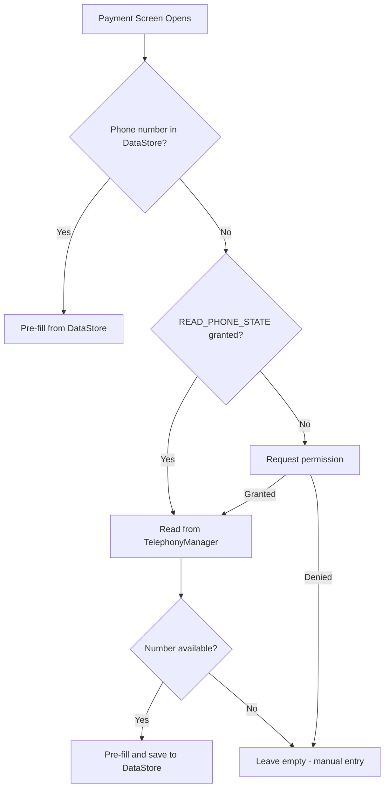

# PesaTrack Live-Readiness Plan

## Overview

This plan covers the bug fixes, corrections, and remaining features needed before PesaTrack is live-ready. It is organized into three sections: **Bug Fixes & Corrections** (user-reported issues), **MVP Gaps** (missing features for launch), and **Deployment** (going live).

---

## Section A: Bug Fixes & Corrections

### A1. Move "Seed" category from Shopping to Faith & Giving

**Problem:** "Seed" (as in sowing/giving) is currently under the Shopping group (parentId = 5, id = 506) but belongs under Faith & Giving (parentId = 9).

**Files to change:**
- [`CategoryEntity.kt`](../android/app/src/main/java/com/pesatrack/data/local/database/entities/CategoryEntity.kt:142) — Move the Seed entry from `shoppingCategories` to `faithCategories`

**Changes:**
- Remove `CategoryEntity(id = 506, name = "Seed", ...)` from `shoppingCategories` list
- Add `CategoryEntity(id = 905, name = "Seed", icon = "grass", color = "#673AB7", parentId = 9, isDefault = true, sortOrder = 5)` to `faithCategories` list
- Since default categories are seeded on first launch, users with existing data will need a DB migration or a "reset categories" mechanism. Bump the database version and add a migration that updates `parentId` for the Seed row.

**Database migration note:**
- In [`PesaTrackDatabase.kt`](../android/app/src/main/java/com/pesatrack/data/local/database/PesaTrackDatabase.kt:1), add a migration (version 2 → 3) that executes:
  ```sql
  UPDATE categories SET parentId = 9, color = '#673AB7', id = 905 WHERE name = 'Seed' AND parentId = 5
  ```
  Or alternatively use `fallbackToDestructiveMigration` if this is pre-launch.

---

### A2. Fix Recent Expenses View — Show expense name instead of phone number

**Problem:** In the recent expenses view, the [`ExpenseCard`](../android/app/src/main/java/com/pesatrack/presentation/components/ExpenseCard.kt:78) currently shows `expense.recipientName ?: expense.recipient` as the title. For Send Money transactions, `recipient` is a phone number and `recipientName` is the person's name. But the user wants to see **what the expense was for** (the category or notes), not who received the money.

**Current behavior at line 78:**
```kotlin
text = expense.recipientName ?: expense.recipient,
```

**Proposed fix — Show category name as primary text:**

The title should prioritize showing what the expense was for (category), NOT notes (which can be lengthy):
1. If `categoryName` is available → show category name
2. If `recipientName` is present → show recipient name
3. Fallback → show recipient (phone/till/paybill number)

**Files to change:**
- [`ExpenseCard.kt`](../android/app/src/main/java/com/pesatrack/presentation/components/ExpenseCard.kt:29) — Update the composable to accept and display expense description logic
- [`HomeScreen.kt`](../android/app/src/main/java/com/pesatrack/presentation/screens/home/HomeScreen.kt:112) — The HomeScreen passes `Expense` objects without category info. Need to update `HomeUiState` and `HomeViewModel` to include category data.
- [`HomeUiState.kt`](../android/app/src/main/java/com/pesatrack/presentation/screens/home/HomeUiState.kt:1) — Change `recentExpenses` from `List<Expense>` to `List<ExpenseWithCategory>` (same type used in ExpensesUiState)
- [`HomeViewModel.kt`](../android/app/src/main/java/com/pesatrack/presentation/screens/home/HomeViewModel.kt:1) — Load categories alongside expenses, map to `ExpenseWithCategory`

**ExpenseCard title logic:**
```kotlin
// New title resolution — NO notes (can be lengthy), prioritize category
val title = categoryName
    ?: expense.recipientName
    ?: expense.recipient

// Subtitle: show payment type + recipient info
val subtitle = buildString {
    append(expense.paymentType.displayName())
    if (categoryName != null) {
        // If title is category, show who received the money as secondary info
        append(" • ")
        append(expense.recipientName ?: expense.recipient)
    }
}
```

The card shows **category name** as the primary text (what the expense was for), with payment type and recipient as secondary info. Notes are deliberately excluded from the title since they can be lengthy.

---

### A3. Fix payment type label — Show "Buy Goods" or "Pay Bill" instead of always "Send Money"

**Problem:** The [`ExpenseCard`](../android/app/src/main/java/com/pesatrack/presentation/components/ExpenseCard.kt:88) already calls `expense.paymentType.displayName()` which should show the correct type. However, the issue might be in how expenses are saved from SMS parsing.

**Root cause analysis:**

Looking at [`SmsParser.kt`](../android/app/src/main/java/com/pesatrack/utils/SmsParser.kt:115), the `extractRecipientInfo()` method correctly identifies all three types. But in [`ExpenseRepository.kt`](../android/app/src/main/java/com/pesatrack/data/repository/ExpenseRepository.kt:124), the `fromString()` mapping in `PaymentType` at [`Expense.kt`](../android/app/src/main/java/com/pesatrack/domain/models/Expense.kt:30) uses display names:

```kotlin
fun fromString(value: String): PaymentType {
    return when (value) {
        "Send Money" -> SEND_MONEY
        "Buy Goods" -> BUY_GOODS
        "Pay Bill" -> PAY_BILL
        else -> SEND_MONEY // Default fallback!
    }
}
```

But in [`ExpenseRepository.toEntity()`](../android/app/src/main/java/com/pesatrack/data/repository/ExpenseRepository.kt:140), paymentType is stored as `paymentType.name` (i.e., `"SEND_MONEY"`, `"BUY_GOODS"`, `"PAY_BILL"` — the enum names, NOT the display names).

When reading back via [`toDomain()`](../android/app/src/main/java/com/pesatrack/data/repository/ExpenseRepository.kt:124), it calls `PaymentType.fromString(paymentType)` with the enum name `"BUY_GOODS"` which does **not match** any case in `fromString()`, so it falls through to the `else -> SEND_MONEY` default.

**This is the bug.** The `fromString()` method needs to handle both formats.

**Files to change:**
- [`Expense.kt`](../android/app/src/main/java/com/pesatrack/domain/models/Expense.kt:29) — Fix `PaymentType.fromString()` to handle enum names:

```kotlin
fun fromString(value: String): PaymentType {
    return try {
        valueOf(value) // Try enum name first: SEND_MONEY, BUY_GOODS, PAY_BILL
    } catch (e: Exception) {
        when (value) {
            "Send Money" -> SEND_MONEY
            "Buy Goods" -> BUY_GOODS
            "Pay Bill" -> PAY_BILL
            else -> SEND_MONEY
        }
    }
}
```

---

### A4. Auto-fetch phone number from device SIM

**Problem:** Users have to manually type their phone number in the payment form. It should be auto-populated from the device's SIM card.

**Approach:** Use Android's `TelephonyManager` to read the SIM phone number. This requires the `READ_PHONE_STATE` permission (and `READ_PHONE_NUMBERS` on Android 12+).

**Important caveat:** Not all carriers populate the phone number on the SIM card. The API may return `null` or empty on some devices. So we should try to fetch it but still allow manual entry as fallback, and persist the user's number in DataStore/SharedPreferences for future use.

**Files to change:**

1. [`AndroidManifest.xml`](../android/app/src/main/AndroidManifest.xml:1) — Add permissions:
   ```xml
   <uses-permission android:name="android.permission.READ_PHONE_STATE" />
   <uses-permission android:name="android.permission.READ_PHONE_NUMBERS" />
   ```

2. **New file:** `android/app/src/main/java/com/pesatrack/utils/PhoneNumberHelper.kt`
   - Create a utility that uses `TelephonyManager.getLine1Number()` to read the SIM number
   - Handle permission checks
   - Format the number (strip country code prefix if needed, or normalize to 07... format)

3. [`AppModule.kt`](../android/app/src/main/java/com/pesatrack/di/AppModule.kt:1) — Provide `TelephonyManager` via Hilt

4. [`PaymentViewModel.kt`](../android/app/src/main/java/com/pesatrack/presentation/screens/payment/PaymentViewModel.kt:1) — On init, attempt to auto-fill the phone number from the helper

5. [`PaymentScreen.kt`](../android/app/src/main/java/com/pesatrack/presentation/screens/payment/PaymentScreen.kt:141) — Add runtime permission request for phone state before auto-filling

6. **New file:** `android/app/src/main/java/com/pesatrack/data/local/preferences/AppPreferences.kt`
   - DataStore-based preferences to persist the phone number once fetched/entered
   - On subsequent launches, use stored number instead of re-querying SIM

**Flow diagram:**



---

### A5. Contact Picker for Send Money Recipient

**Problem:** When sending money, users must manually type the recipient's phone number. They should be able to pick a contact from their phone's address book.

**Approach:** Use Android's contact picker intent (`ACTION_PICK` with `ContactsContract`) to let users select a contact, then extract the phone number.

**Files to change:**

1. [`AndroidManifest.xml`](../android/app/src/main/AndroidManifest.xml:1) — Add permission:
   ```xml
   <uses-permission android:name="android.permission.READ_CONTACTS" />
   ```

2. [`PaymentScreen.kt`](../android/app/src/main/java/com/pesatrack/presentation/screens/payment/PaymentScreen.kt:166) — Add a contact picker icon button next to the "Recipient Phone Number" field for `SEND_MONEY` type. Use `rememberLauncherForActivityResult` with `ActivityResultContracts.PickContact()` to launch the contact picker and extract the phone number.

3. [`PaymentViewModel.kt`](../android/app/src/main/java/com/pesatrack/presentation/screens/payment/PaymentViewModel.kt:51) — Add a method to update recipient from contact data (name + phone number).

**UI:**
- Show a contacts icon button (📇) at the trailing end of the recipient phone field
- Only visible when payment type is `SEND_MONEY`
- When tapped, opens the system contact picker
- On selection, fills in the phone number field and optionally stores the recipient name

---

## Section B: MVP Gaps for Live Readiness

### B1. Notification System for SMS-parsed expenses

**Problem:** When an M-PESA SMS is parsed and an expense auto-saved, the user gets no feedback. They should see a notification.

**Files to change:**
- [`SmsReceiver.kt`](../android/app/src/main/java/com/pesatrack/services/SmsReceiver.kt:1) — After saving expense, show a notification
- **New file:** `android/app/src/main/java/com/pesatrack/services/NotificationHelper.kt` — Utility to create notification channel and show notifications
- [`AndroidManifest.xml`](../android/app/src/main/AndroidManifest.xml:1) — Already has `POST_NOTIFICATIONS` permission ✅

**Notification behavior:**
- Show notification with expense amount, recipient, and payment type
- Tapping notification navigates to the categorize screen for that expense (deep link)
- Notification channel: "Expense Tracking" with default importance

### B2. SMS Permission Runtime Request

**Current state:** SMS permissions are declared in manifest but there is no runtime permission request flow in the app. On Android 6+, these must be requested at runtime.

**Files to change:**
- [`HomeScreen.kt`](../android/app/src/main/java/com/pesatrack/presentation/screens/home/HomeScreen.kt:1) or [`MainActivity.kt`](../android/app/src/main/java/com/pesatrack/presentation/MainActivity.kt:1) — Add permission request on first launch
- Show a rationale dialog explaining why SMS access is needed

### B3. Historical SMS Import (Deferred)

**Current state:** The `SmsReceiver` only captures **new** SMS messages going forward. Existing M-PESA SMSes from before app install are not imported.

**Status:** Deferred to a future release. Not needed for initial launch.

---

## Section C: Deployment & Production

### C1. Backend Deployment

- Deploy the Node.js backend to a cloud provider (Railway, Render, or Fly.io)
- Set up environment variables for Daraja API credentials
- Configure the callback URL to the production domain
- Set up HTTPS

### C2. Production API URL

- Update [`build.gradle.kts`](../android/app/build.gradle.kts:38) release `buildConfigField` from placeholder to actual production URL
- Remove/update the ngrok debug URL

### C3. App Signing & Release Build

- Generate a release signing key
- Configure signing in `build.gradle.kts`
- Build a signed APK or AAB for distribution

---

## Priority Order for Implementation

### Critical (Must fix before any testing)
1. **A3** — Fix `PaymentType.fromString()` bug (expenses show wrong type)
2. **A1** — Move Seed category to Faith & Giving
3. **A2** — Fix ExpenseCard to show category name as title
4. **A4** — Auto-fetch phone number from SIM
5. **A5** — Contact picker for Send Money recipient

### Important (Needed for good UX)
6. **B2** — Runtime permission requests (SMS, notifications, phone, contacts)
7. **B1** — Notification system for parsed expenses

### Deployment (Going live)
8. **C1** — Deploy backend
9. **C2** — Set production API URL
10. **C3** — Build signed release APK

---

## Summary of File Changes

| File | Change Type | Description |
|------|-------------|-------------|
| [`Expense.kt`](../android/app/src/main/java/com/pesatrack/domain/models/Expense.kt) | **Bug Fix** | Fix `PaymentType.fromString()` to handle enum names |
| [`CategoryEntity.kt`](../android/app/src/main/java/com/pesatrack/data/local/database/entities/CategoryEntity.kt) | **Correction** | Move Seed from Shopping to Faith & Giving |
| [`PesaTrackDatabase.kt`](../android/app/src/main/java/com/pesatrack/data/local/database/PesaTrackDatabase.kt) | **Migration** | Add migration for Seed category move |
| [`ExpenseCard.kt`](../android/app/src/main/java/com/pesatrack/presentation/components/ExpenseCard.kt) | **UI Fix** | Show expense purpose as title, recipient as subtitle |
| [`HomeUiState.kt`](../android/app/src/main/java/com/pesatrack/presentation/screens/home/HomeUiState.kt) | **Refactor** | Change recentExpenses to include category info |
| [`HomeViewModel.kt`](../android/app/src/main/java/com/pesatrack/presentation/screens/home/HomeViewModel.kt) | **Refactor** | Load categories with recent expenses |
| [`HomeScreen.kt`](../android/app/src/main/java/com/pesatrack/presentation/screens/home/HomeScreen.kt) | **UI Fix** | Pass category info to ExpenseCard |
| [`AndroidManifest.xml`](../android/app/src/main/AndroidManifest.xml) | **Permission** | Add READ_PHONE_STATE, READ_PHONE_NUMBERS, READ_CONTACTS |
| `PhoneNumberHelper.kt` | **New** | SIM phone number reader utility |
| `AppPreferences.kt` | **New** | DataStore preferences for persisting phone number |
| [`AppModule.kt`](../android/app/src/main/java/com/pesatrack/di/AppModule.kt) | **DI** | Provide TelephonyManager and AppPreferences |
| [`PaymentViewModel.kt`](../android/app/src/main/java/com/pesatrack/presentation/screens/payment/PaymentViewModel.kt) | **Feature** | Auto-fill phone number on init |
| [`PaymentScreen.kt`](../android/app/src/main/java/com/pesatrack/presentation/screens/payment/PaymentScreen.kt) | **Feature** | Runtime permission, contact picker for Send Money |
| `NotificationHelper.kt` | **New** | Notification channel and display utility |
| [`SmsReceiver.kt`](../android/app/src/main/java/com/pesatrack/services/SmsReceiver.kt) | **Feature** | Show notification after SMS parse |
| [`MainActivity.kt`](../android/app/src/main/java/com/pesatrack/presentation/MainActivity.kt) | **Permission** | SMS and notification runtime permission requests |
| [`build.gradle.kts`](../android/app/build.gradle.kts) | **Config** | Update production API URL |
