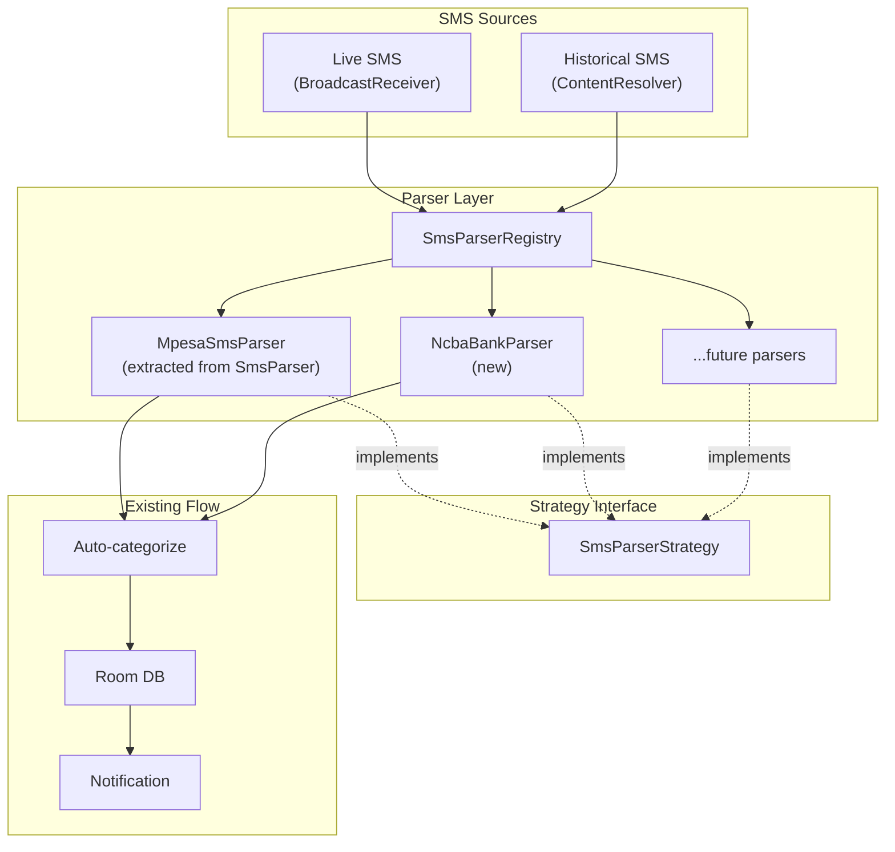
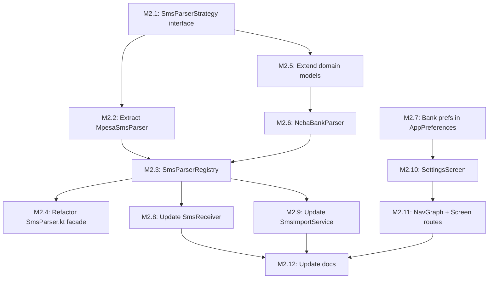

# Milestone 2: Bank SMS Tracking — Implementation Plan

## Goal

Refactor the SMS parsing system into a **strategy pattern** and add NCBA Bank SMS parsing as the first bank integration. This makes the architecture extensible for adding any future bank parser as a simple plug-in.

---

## NCBA SMS Analysis (Real Samples)

NCBA sends **paired SMS messages** for each transaction — a generic debit notification + a detailed confirmation. Only the **detailed confirmation** should be parsed as an expense; the generic debit is a **duplicate** of the same transaction.

### SMS Type 1: Account Debit Notification (SKIP — duplicate, less info)

```
Your account 763****018 has been debited with KES 20,000.00 on 12/03/2026 at 08:43.
Ref: FTC260312CMTW. For queries, call 0711056444 / 0732156444 or WhatsApp: 0717804444.
```

**Fields:** amount, date, ref. **Missing:** recipient name, transaction type. **Verdict:** Skip in favour of the detailed SMS below.

### SMS Type 2: MPESA Send Money (via NCBA banking app)

```
Dear Joel Mumo Ngei, your MPESA transfer of KES. 20000.00 to Mary Nduta Kungu (254790518661)
has been processed successfully. MPESA ref number UCCOO8W1AW. NCBA, Go for it.
```

**Fields:**
- Amount: `KES. 20000.00`
- Recipient Name: `Mary Nduta Kungu`
- Recipient Phone: `254790518661`
- Transaction ID: `UCCOO8W1AW` (M-PESA ref)
- Type: **Send Money** (MPESA transfer to person)

### SMS Type 3: MPESA Transfer to Own Phone (SKIP — not an expense)

```
Dear Joel Mumo Ngei, your MPESA transfer of KES. 15000.00
has been processed successfully. MPESA ref number UCB048VYQ9. NCBA, Go for it.
```

**Fields:**
- Amount: `KES. 15000.00`
- Transaction ID: `UCB048VYQ9`
- **Verdict:** SKIP — this is a transfer to the owner's own M-PESA (no recipient details = self-transfer from bank to M-PESA wallet). Not an expense.

### SMS Type 4: MPESA Till Payment (Buy Goods)

```
Mpesa Till transfer of KES 3660 to 8933372 THE FIG AND OLIVE LIMITED 1
BANK REF. FTX26067ECFBF MPESA REF. UC8SG99R4R was successful. NCBA, Go for it.
```

**Fields:**
- Amount: `KES 3660`
- Till Number: `8933372`
- Recipient Name: `THE FIG AND OLIVE LIMITED 1`
- Bank Ref: `FTX26067ECFBF`
- M-PESA Ref: `UC8SG99R4R`
- Type: **Buy Goods** (Till)

### SMS Type 5: MPESA Paybill Payment

```
Mpesa Paybill transfer of KES 1000 to AFRICAN INLAND CHURCH KINOO 87
account number Offering BANK REF. FTX26067EBVON MPESA REF. UC8SG99MT1
was successful. NCBA, Go for it.
```

**Fields:**
- Amount: `KES 1000`
- Recipient Name: `AFRICAN INLAND CHURCH KINOO`
- Paybill Number: `87`
- Account Number: `Offering`
- Bank Ref: `FTX26067EBVON`
- M-PESA Ref: `UC8SG99MT1`
- Type: **Pay Bill**

---

## Key Design Decisions

| Decision | Choice | Rationale |
|----------|--------|-----------|
| NCBA debit SMS vs detailed SMS | **Parse detailed only, skip debit** | Debit notification lacks recipient/type info and would create duplicates |
| NCBA sender ID | **"NCBA_BANK"** | Confirmed from real device |
| Transaction ID source | **Use M-PESA ref when present, bank ref as fallback** | M-PESA ref enables deduplication against direct M-PESA SMS |
| NCBA M-PESA transfer duplicates | **Deduplicate by M-PESA ref** | NCBA sends its own SMS for M-PESA transactions that MPESA also sends |
| ExpenseSource for NCBA | **SMS_BANK** | Distinguishes from direct M-PESA SMS parsing |
| PaymentType reuse | **Reuse SEND_MONEY, BUY_GOODS, PAY_BILL** | NCBA triggers M-PESA transactions — same types apply |
| New PaymentType: BANK_DEBIT | **Add for generic debits** | For bank debits that arent M-PESA (future use) |

### Critical: Deduplication Between NCBA + M-PESA

NCBA bank app triggers M-PESA transactions. Both NCBA **and** MPESA send SMS for the same transaction:

```
NCBA: "...MPESA ref number UCCOO8W1AW..."
MPESA: "UCCOO8W1AW Confirmed. Ksh20,000.00 sent to..."
```

Both share the **same M-PESA transaction ID** (`UCCOO8W1AW`). The existing `transactionId` uniqueness constraint in [`ExpenseEntity.kt`](android/app/src/main/java/com/pesatrack/data/local/database/entities/ExpenseEntity.kt:24) handles this automatically — whichever SMS arrives first gets recorded. The duplicate insert is ignored via `OnConflictStrategy.IGNORE`.

---

## Architecture



---

## Implementation Steps

### Step 1: Create `SmsParserStrategy` Interface

**File:** `android/app/src/main/java/com/pesatrack/utils/parsers/SmsParserStrategy.kt`

```kotlin
interface SmsParserStrategy {
    /** Human-readable name (e.g., "M-PESA", "NCBA Bank") */
    val displayName: String

    /** SMS sender IDs this parser handles (e.g., "MPESA", "NCBA") */
    val senderIds: List<String>

    /** ExpenseSource to tag parsed expenses with */
    val expenseSource: ExpenseSource

    /** Check if this parser can handle the given SMS */
    fun canHandle(sender: String, body: String): Boolean

    /** Parse the SMS body into a ParsedTransaction (or null if not parseable) */
    fun parse(body: String): SmsParser.ParsedTransaction?
}
```

### Step 2: Extract `MpesaSmsParser`

**File:** `android/app/src/main/java/com/pesatrack/utils/parsers/MpesaSmsParser.kt`

- Move all regex patterns and parsing logic from [`SmsParser.kt`](android/app/src/main/java/com/pesatrack/utils/SmsParser.kt:56) into this class
- Implement `SmsParserStrategy`
- `senderIds = listOf("MPESA", "M-PESA", "Safaricom")`
- `expenseSource = ExpenseSource.SMS_PARSED`
- `canHandle()` checks sender ID + "Confirmed" keyword
- `parse()` = current `SmsParser.parseSms()` logic

### Step 3: Create `SmsParserRegistry`

**File:** `android/app/src/main/java/com/pesatrack/utils/parsers/SmsParserRegistry.kt`

```kotlin
object SmsParserRegistry {
    private val parsers: List<SmsParserStrategy> = listOf(
        MpesaSmsParser(),
        NcbaBankParser(),
    )

    /** Find a parser that can handle this SMS */
    fun findParser(sender: String, body: String): SmsParserStrategy? {
        return parsers.firstOrNull { it.canHandle(sender, body) }
    }

    /** Parse a transaction from any supported source */
    fun parseTransaction(sender: String, body: String): SmsParser.ParsedTransaction? {
        return findParser(sender, body)?.parse(body)
    }

    /** Get all known sender IDs (for ContentResolver queries during import) */
    fun getAllSenderIds(): List<String> {
        return parsers.flatMap { it.senderIds }.distinct()
    }

    /** Get sender IDs for enabled parsers only */
    fun getEnabledSenderIds(enabledParsers: Set<String>): List<String> {
        return parsers
            .filter { it.displayName in enabledParsers }
            .flatMap { it.senderIds }
            .distinct()
    }
}
```

### Step 4: Refactor `SmsParser.kt` (Backward Compatibility)

Keep [`SmsParser.kt`](android/app/src/main/java/com/pesatrack/utils/SmsParser.kt:56) as a **facade** that delegates to `SmsParserRegistry`:

```kotlin
object SmsParser {
    // Keep existing constants
    const val MPESA_TRANSACTION_COST_CATEGORY_ID = 606L

    // Keep the ParsedTransaction data class (shared by all parsers)
    data class ParsedTransaction(
        val expense: Expense,
        val transactionCost: Expense?
    )

    // Delegate to registry
    fun isMpesaSms(sender: String?): Boolean { ... }      // keep for backward compat
    fun isTransactionSms(message: String): Boolean { ... } // keep for backward compat
    fun parseSms(message: String): ParsedTransaction? {
        // Delegate to MpesaSmsParser directly for backward compat
        return MpesaSmsParser().parse(message)
    }
}
```

This ensures [`SmsImportService.kt`](android/app/src/main/java/com/pesatrack/services/SmsImportService.kt:116) and any other existing callers continue to work unchanged during the refactor.

### Step 5: Extend Domain Models

**File:** [`Expense.kt`](android/app/src/main/java/com/pesatrack/domain/models/Expense.kt)

```kotlin
enum class PaymentType {
    // Existing M-PESA types
    SEND_MONEY, BUY_GOODS, PAY_BILL, WITHDRAW, AIRTIME, MPESA_CARD, TRANSACTION_COST,
    // New bank types
    BANK_DEBIT;     // Generic bank debit (for future non-MPESA bank transactions)

    companion object {
        fun fromString(value: String): PaymentType {
            return try {
                valueOf(value)
            } catch (e: Exception) {
                when (value) {
                    // ... existing mappings ...
                    "Bank Debit" -> BANK_DEBIT
                    else -> SEND_MONEY
                }
            }
        }
    }

    fun displayName(): String {
        return when (this) {
            // ... existing ...
            BANK_DEBIT -> "Bank Debit"
        }
    }
}

enum class ExpenseSource {
    STK_PUSH,    // legacy
    SMS_PARSED,  // M-PESA SMS
    SMS_BANK,    // Bank SMS (NCBA, etc.)
    MANUAL;      // Manual entry

    companion object {
        fun fromString(value: String): ExpenseSource {
            return try {
                valueOf(value)
            } catch (e: Exception) {
                MANUAL
            }
        }
    }
}
```

No DB migration needed — `paymentType` and `source` are stored as `String` in Room.

### Step 6: Implement `NcbaBankParser`

**File:** `android/app/src/main/java/com/pesatrack/utils/parsers/NcbaBankParser.kt`

Handles 3 NCBA expense SMS types (skips debit notifications and self-transfers):

| Pattern | PaymentType | Regex |
|---------|-------------|-------|
| "MPESA transfer of KES... to NAME (PHONE)" | SEND_MONEY | `MPESA transfer of KES\.?\s*([\d,]+(?:\.\d{2})?).*?to\s+(.+?)\s*\((\d+)\)` |
| "Mpesa Till transfer of KES... to TILL NAME" | BUY_GOODS | `Mpesa Till transfer of KES\s*([\d,]+(?:\.\d{2})?).*?to\s+(\d+)\s+(.+?)\s+BANK REF` |
| "Mpesa Paybill transfer of KES... to NAME PAYBILL" | PAY_BILL | `Mpesa Paybill transfer of KES\s*([\d,]+(?:\.\d{2})?).*?to\s+(.+?)\s+(\d+)\s+account` |

**Skip patterns:**
- "Your account ... has been debited" → skip (duplicate, less info)
- "has been credited" → skip (income, not expense)
- "MPESA transfer of KES... processed" WITHOUT "to NAME (PHONE)" → skip (self-transfer to own M-PESA)

**Transaction ID extraction:**
- Primary: M-PESA ref (`MPESA REF\.\s*([A-Z0-9]+)` or `MPESA ref number\s*([A-Z0-9]+)`)
- Fallback: Bank ref (`BANK REF\.\s*([A-Z0-9]+)` or `Ref:\s*([A-Z0-9]+)`)

**NCBA sender IDs:** `listOf("NCBA_BANK")`

### Step 7: Add Bank Preferences

**File:** [`AppPreferences.kt`](android/app/src/main/java/com/pesatrack/data/local/preferences/AppPreferences.kt)

Add preferences for:
- `track_mpesa` (Boolean, default: true)
- `track_ncba` (Boolean, default: false)

```kotlin
companion object {
    private val KEY_PHONE_NUMBER = stringPreferencesKey("user_phone_number")
    private val KEY_TRACK_MPESA = booleanPreferencesKey("track_mpesa")
    private val KEY_TRACK_NCBA = booleanPreferencesKey("track_ncba")
}

val trackMpesa: Flow<Boolean> = context.dataStore.data.map { it[KEY_TRACK_MPESA] ?: true }
val trackNcba: Flow<Boolean> = context.dataStore.data.map { it[KEY_TRACK_NCBA] ?: false }

suspend fun setTrackMpesa(enabled: Boolean) { ... }
suspend fun setTrackNcba(enabled: Boolean) { ... }
```

### Step 8: Update `SmsReceiver`

**File:** [`SmsReceiver.kt`](android/app/src/main/java/com/pesatrack/services/SmsReceiver.kt)

Replace hardcoded M-PESA checks with registry-based dispatch:

```kotlin
// Before:
if (SmsParser.isMpesaSms(sender) && SmsParser.isTransactionSms(body)) {
    processTransaction(context, body)
}

// After:
val parser = SmsParserRegistry.findParser(sender, body)
if (parser != null) {
    processTransaction(context, body, parser)
}
```

The `processTransaction` method gets a `parser` parameter to use for parsing. Auto-categorization logic remains unchanged.

### Step 9: Update `SmsImportService`

**File:** [`SmsImportService.kt`](android/app/src/main/java/com/pesatrack/services/SmsImportService.kt)

Change `readMpesaSmsFromInbox()` to query **all enabled sender IDs**:

```kotlin
// Before:
private const val MPESA_SENDER = "MPESA"

// After:
private fun getEnabledSenders(): List<String> {
    return SmsParserRegistry.getAllSenderIds()
    // Or use preferences to filter: getEnabledSenderIds(enabledBanks)
}
```

Update the ContentResolver query to use `address IN (?, ?, ?)` instead of `address = ?`.

Update SMS parsing to use `SmsParserRegistry.parseTransaction(sender, body)` instead of `SmsParser.parseSms(body)`.

### Step 10: Settings Screen

**Files:**
- `android/app/src/main/java/com/pesatrack/presentation/screens/settings/SettingsScreen.kt`
- `android/app/src/main/java/com/pesatrack/presentation/screens/settings/SettingsViewModel.kt`
- `android/app/src/main/java/com/pesatrack/presentation/screens/settings/SettingsUiState.kt`

Minimal settings screen with:
- **SMS Tracking** section
  - Toggle: Track M-PESA transactions ✅ (default on)
  - Toggle: Track NCBA Bank transactions ☐ (default off)
- **Data** section
  - Button: Import Historical SMS → navigates to ImportScreen

### Step 11: Navigation Updates

**File:** [`Screen.kt`](android/app/src/main/java/com/pesatrack/presentation/navigation/Screen.kt)

```kotlin
object Settings : Screen("settings")
```

**File:** [`NavGraph.kt`](android/app/src/main/java/com/pesatrack/presentation/navigation/NavGraph.kt)

Add settings composable route.

Add settings icon to bottom nav or top app bar.

---

## File Changes Summary

### New Files (6)

| File | Purpose |
|------|---------|
| `utils/parsers/SmsParserStrategy.kt` | Parser strategy interface |
| `utils/parsers/MpesaSmsParser.kt` | Extracted M-PESA parser |
| `utils/parsers/NcbaBankParser.kt` | NCBA Bank SMS parser |
| `utils/parsers/SmsParserRegistry.kt` | Parser dispatch registry |
| `presentation/screens/settings/SettingsScreen.kt` | Settings UI |
| `presentation/screens/settings/SettingsViewModel.kt` | Settings state management |

### Modified Files (7)

| File | Changes |
|------|---------|
| [`SmsParser.kt`](android/app/src/main/java/com/pesatrack/utils/SmsParser.kt) | Keep as facade, delegate to MpesaSmsParser |
| [`Expense.kt`](android/app/src/main/java/com/pesatrack/domain/models/Expense.kt) | Add BANK_DEBIT PaymentType, SMS_BANK ExpenseSource |
| [`SmsReceiver.kt`](android/app/src/main/java/com/pesatrack/services/SmsReceiver.kt) | Use SmsParserRegistry instead of hardcoded M-PESA |
| [`SmsImportService.kt`](android/app/src/main/java/com/pesatrack/services/SmsImportService.kt) | Multi-source sender IDs, registry-based parsing |
| [`AppPreferences.kt`](android/app/src/main/java/com/pesatrack/data/local/preferences/AppPreferences.kt) | Add bank tracking toggle preferences |
| [`Screen.kt`](android/app/src/main/java/com/pesatrack/presentation/navigation/Screen.kt) | Add Settings route |
| [`NavGraph.kt`](android/app/src/main/java/com/pesatrack/presentation/navigation/NavGraph.kt) | Add Settings composable |

### No DB Migration Needed

`paymentType` and `source` are stored as `String` in [`ExpenseEntity.kt`](android/app/src/main/java/com/pesatrack/data/local/database/entities/ExpenseEntity.kt:47). Adding `BANK_DEBIT` and `SMS_BANK` to the enums requires no schema change.

---

## NCBA Regex Patterns (Detailed)

### Pattern 1: MPESA Transfer with recipient

```
Dear Joel Mumo Ngei, your MPESA transfer of KES. 20000.00 to Mary Nduta Kungu (254790518661)
has been processed successfully. MPESA ref number UCCOO8W1AW. NCBA, Go for it.
```

**Regex:** `MPESA transfer of KES\.?\s*([\d,]+(?:\.\d{2})?)\s+to\s+(.+?)\s*\((\d+)\).*?MPESA ref number\s*([A-Z0-9]+)`

| Group | Value |
|-------|-------|
| 1 | Amount: `20000.00` |
| 2 | Recipient Name: `Mary Nduta Kungu` |
| 3 | Phone: `254790518661` |
| 4 | M-PESA Ref: `UCCOO8W1AW` |

### Pattern 2: MPESA Transfer to Own Phone (SKIP)

```
Dear Joel Mumo Ngei, your MPESA transfer of KES. 15000.00
has been processed successfully. MPESA ref number UCB048VYQ9. NCBA, Go for it.
```

**Action:** Return null — this is a self-transfer from bank to own M-PESA wallet (not an expense). Detected by matching "MPESA transfer" + "processed" but WITHOUT the "to NAME (PHONE)" pattern.

### Pattern 3: Till Payment (Buy Goods)

```
Mpesa Till transfer of KES 3660 to 8933372 THE FIG AND OLIVE LIMITED 1
BANK REF. FTX26067ECFBF MPESA REF. UC8SG99R4R was successful.
```

**Regex:** `Mpesa Till transfer of KES\s*([\d,]+(?:\.\d{2})?)\s+to\s+(\d+)\s+(.+?)\s+BANK REF\.\s*(\S+)\s+MPESA REF\.\s*([A-Z0-9]+)`

| Group | Value |
|-------|-------|
| 1 | Amount: `3660` |
| 2 | Till Number: `8933372` |
| 3 | Recipient Name: `THE FIG AND OLIVE LIMITED 1` |
| 4 | Bank Ref: `FTX26067ECFBF` |
| 5 | M-PESA Ref: `UC8SG99R4R` |

### Pattern 4: Paybill Payment

```
Mpesa Paybill transfer of KES 1000 to AFRICAN INLAND CHURCH KINOO 87
account number Offering BANK REF. FTX26067EBVON MPESA REF. UC8SG99MT1
```

**Regex:** `Mpesa Paybill transfer of KES\s*([\d,]+(?:\.\d{2})?)\s+to\s+(.+?)\s+(\d+)\s+account\s+(?:number\s+)?(.+?)\s+BANK REF\.\s*(\S+)\s+MPESA REF\.\s*([A-Z0-9]+)`

| Group | Value |
|-------|-------|
| 1 | Amount: `1000` |
| 2 | Recipient Name: `AFRICAN INLAND CHURCH KINOO` |
| 3 | Paybill Number: `87` |
| 4 | Account: `Offering` |
| 5 | Bank Ref: `FTX26067EBVON` |
| 6 | M-PESA Ref: `UC8SG99MT1` |

### Skip Pattern: Generic Account Debit

```
Your account 763****018 has been debited with KES 20,000.00 on 12/03/2026 at 08:43.
Ref: FTC260312CMTW.
```

**Regex:** `Your account.*has been debited` → return null (skip)

---

## Execution Order



**Dependency-free starting points (can be done in parallel):**
- M2.1 (SmsParserStrategy interface)
- M2.5 (Extend domain models)
- M2.7 (Bank preferences)

**Critical path:**
M2.1 → M2.2 → M2.6 → M2.3 → M2.4 → M2.8/M2.9
