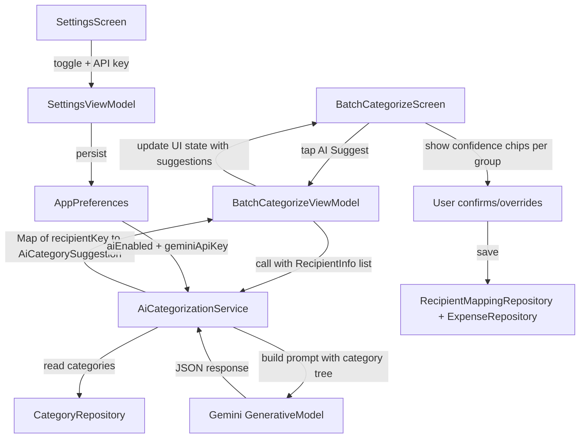
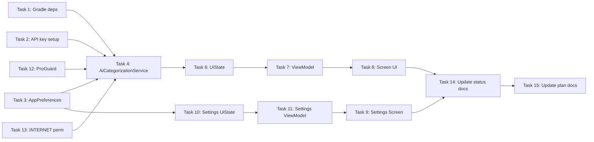

# PesaTrack Phase 2 — Milestone 3: AI-Powered Categorization

## Implementation Plan

### Overview

Add Gemini AI-powered expense categorization to PesaTrack. When users have uncategorized expenses grouped by recipient in the Batch Categorize screen, they can tap "AI Suggest" to get category suggestions from Gemini API based on recipient names, payment types, and amounts. Users confirm or override suggestions before saving.

---

### Architecture



---

### Task Breakdown

#### Task 1: Add Gemini SDK dependency to build.gradle.kts

**File:** [`build.gradle.kts`](../android/app/build.gradle.kts:65)

Add Google Generative AI SDK dependency:
```kotlin
// Google Generative AI SDK - Gemini
implementation("com.google.ai.client.generativeai:generativeai:0.9.0")
```

Also enable `BuildConfig` generation for the API key (already enabled — `buildConfig = true` at line 51) and add the `buildConfigField` to `defaultConfig`:
```kotlin
// In defaultConfig block
val properties = java.util.Properties()
val localPropsFile = rootProject.file("local.properties")
if (localPropsFile.exists()) {
    properties.load(localPropsFile.inputStream())
}
buildConfigField(
    "String",
    "GEMINI_API_KEY",
    "\"${properties.getProperty("GEMINI_API_KEY", "")}\""
)
```

**Proguard:** Add keep rules for Gemini SDK in [`proguard-rules.pro`](../android/app/proguard-rules.pro:1).

---

#### Task 2: Secure API key storage via local.properties + BuildConfig

- Add `GEMINI_API_KEY=` placeholder to a `.gitignore`-tracked `local.properties` pattern
- The `buildConfigField` from Task 1 exposes `BuildConfig.GEMINI_API_KEY`
- Users can also enter their API key at runtime through Settings (stored in DataStore) — the runtime key takes priority over the build-time key

**Priority logic in AiCategorizationService:**
1. Check `AppPreferences.geminiApiKey` (user-entered at runtime)
2. Fall back to `BuildConfig.GEMINI_API_KEY` (developer build-time key)
3. If both empty → throw descriptive error / return empty suggestions

---

#### Task 3: Update AppPreferences with AI-related preferences

**File:** [`AppPreferences.kt`](../android/app/src/main/java/com/pesatrack/data/local/preferences/AppPreferences.kt:34)

Add new preference keys and accessors:
```kotlin
// New keys in companion object
private val KEY_AI_CATEGORIZATION_ENABLED = booleanPreferencesKey("ai_categorization_enabled")
private val KEY_GEMINI_API_KEY = stringPreferencesKey("gemini_api_key")

// New flows + setters
val aiCategorizationEnabled: Flow<Boolean>  // default: true
suspend fun setAiCategorizationEnabled(enabled: Boolean)

val geminiApiKey: Flow<String?>  // default: null (falls back to BuildConfig)
suspend fun saveGeminiApiKey(key: String)
suspend fun clearGeminiApiKey()
suspend fun getGeminiApiKeySnapshot(): String?
```

---

#### Task 4: Create AiCategorizationService

**New file:** `android/app/src/main/java/com/pesatrack/services/AiCategorizationService.kt`

```kotlin
@Singleton
class AiCategorizationService @Inject constructor(
    private val categoryRepository: CategoryRepository,
    private val appPreferences: AppPreferences
)
```

**Key design decisions:**

1. **Input model** — `RecipientInfo` data class:
   ```kotlin
   data class RecipientInfo(
       val recipientKey: String,       // normalized key
       val displayName: String,        // human-readable name
       val paymentType: String,        // PaymentType enum name
       val totalAmount: Double,        // sum of all transactions
       val transactionCount: Int       // number of transactions
   )
   ```

2. **Output model** — `AiCategorySuggestion` data class:
   ```kotlin
   data class AiCategorySuggestion(
       val categoryId: Long,
       val categoryName: String,
       val groupName: String,
       val confidence: Float       // 0.0–1.0 from AI
   )
   ```

3. **Prompt construction:**
   - System instruction: "You are a Kenyan expense categorizer for a personal finance app."
   - Provide the full category tree as structured context (17 groups, all subcategories with IDs)
   - Send batch of recipients with context (name, PaymentType, total amount, count)
   - Request JSON array response: `[{"recipientKey": "...", "categoryId": N, "confidence": 0.95}]`
   - Parse the JSON response and validate category IDs exist in the database

4. **API key resolution:** Runtime DataStore key → BuildConfig key → error

5. **Error handling:** Network errors, malformed JSON, invalid category IDs → return empty map with error message

6. **Batching:** Send up to 20 recipients per API call. If more than 20, chunk and make multiple calls.

---

#### Task 5: Provide AiCategorizationService via Hilt

**File:** [`AppModule.kt`](../android/app/src/main/java/com/pesatrack/di/AppModule.kt:22)

The service uses `@Inject constructor` with `@Singleton`, so Hilt auto-discovers it — no manual `@Provides` needed. However, we need to ensure `CategoryRepository` is available (it is — it's `@Singleton @Inject constructor`).

No changes to AppModule needed — Hilt handles constructor injection.

---

#### Task 6: Update BatchCategorizeUiState with AI state

**File:** [`BatchCategorizeUiState.kt`](../android/app/src/main/java/com/pesatrack/presentation/screens/batch_categorize/BatchCategorizeUiState.kt:15)

Add new fields:
```kotlin
/** AI suggestion results — Map<recipientKey, AiCategorySuggestion> */
val aiSuggestions: Map<String, AiCategorySuggestion> = emptyMap(),

/** Whether AI suggestion request is in progress */
val isAiLoading: Boolean = false,

/** AI-specific error message */
val aiError: String? = null,

/** Whether AI categorization is enabled in preferences */
val aiEnabled: Boolean = false
```

---

#### Task 7: Update BatchCategorizeViewModel with AI logic

**File:** [`BatchCategorizeViewModel.kt`](../android/app/src/main/java/com/pesatrack/presentation/screens/batch_categorize/BatchCategorizeViewModel.kt:29)

Changes:
1. Inject `AiCategorizationService` and `AppPreferences`
2. On init, check `appPreferences.aiCategorizationEnabled` to set `aiEnabled` in state
3. Add `requestAiSuggestions()` method:
   - Collects current `recipientGroups` and maps them to `RecipientInfo` objects
   - Calls `aiCategorizationService.suggestCategories(recipients)`
   - Updates `aiSuggestions` map in state
4. Add `applyAiSuggestion(recipientKey: String)` method:
   - Looks up the suggestion for the recipient key
   - Finds the matching `RecipientGroup`
   - Calls the existing `applyCategory()` logic with the suggested category
5. Add `applyAllAiSuggestions()` method:
   - Iterates all suggestions and applies them
6. Add `dismissAiError()` method

---

#### Task 8: Update BatchCategorizeScreen with AI UI

**File:** [`BatchCategorizeScreen.kt`](../android/app/src/main/java/com/pesatrack/presentation/screens/batch_categorize/BatchCategorizeScreen.kt:41)

Changes:

1. **Add "AI Suggest" button** in the header area (after the SummaryCard), visible only when `aiEnabled` is true and there are uncategorized groups:
   ```
   Button: "✨ AI Suggest All" → calls viewModel.requestAiSuggestions()
   ```

2. **Loading state** — When `isAiLoading`, show a LinearProgressIndicator below the button with "Analyzing recipients..."

3. **Per-group AI suggestion chip** — In each `RecipientGroupCard`, if an AI suggestion exists for that recipient:
   - Show a `SuggestionChip` with the category name + confidence percentage
   - Color-coded: green (≥90%), amber (70-89%), red (<70%)
   - Tapping the chip applies the suggestion (calls `viewModel.applyAiSuggestion(...)`)
   - Still shows "Categorize All" button as override option

4. **"Apply All AI Suggestions" button** — When suggestions exist, show a prominent button to accept all at once

5. **Error handling** — Show `aiError` as a Snackbar or inline error card

---

#### Task 9: Update SettingsScreen with AI section

**File:** [`SettingsScreen.kt`](../android/app/src/main/java/com/pesatrack/presentation/screens/settings/SettingsScreen.kt:59)

Add a new section below SMS Sources:

```
AI Categorization
├── Toggle: "AI-Powered Suggestions" (enabled/disabled)
│   └── Description: "Use Google Gemini to suggest categories for unknown recipients"
├── Text Field: "Gemini API Key" (password field, only shown when toggle is on)
│   └── Hint: "Enter your Gemini API key or leave empty to use built-in key"
│   └── "Get API Key" link text → opens https://aistudio.google.com/apikey
└── Info text: "Your API key is stored locally and never shared"
```

---

#### Task 10: Update SettingsUiState with AI fields

**File:** [`SettingsUiState.kt`](../android/app/src/main/java/com/pesatrack/presentation/screens/settings/SettingsUiState.kt:10)

Add:
```kotlin
val aiCategorizationEnabled: Boolean = true,
val geminiApiKey: String = "",
val hasBuiltInApiKey: Boolean = false  // true if BuildConfig.GEMINI_API_KEY is non-empty
```

---

#### Task 11: Update SettingsViewModel with AI preference methods

**File:** [`SettingsViewModel.kt`](../android/app/src/main/java/com/pesatrack/presentation/screens/settings/SettingsViewModel.kt:26)

Add:
1. Collect `appPreferences.aiCategorizationEnabled` and `appPreferences.geminiApiKey` flows
2. `setAiCategorizationEnabled(enabled: Boolean)` method
3. `saveGeminiApiKey(key: String)` method
4. Check `BuildConfig.GEMINI_API_KEY` for `hasBuiltInApiKey` state

---

#### Task 12: Add ProGuard rules for Gemini SDK

**File:** [`proguard-rules.pro`](../android/app/proguard-rules.pro:1)

Add keep rules to prevent obfuscation of Gemini SDK classes:
```
-keep class com.google.ai.client.generativeai.** { *; }
-keep class com.google.ai.client.generativeai.type.** { *; }
```

---

#### Task 13: Add INTERNET permission

**File:** [`AndroidManifest.xml`](../android/app/src/main/AndroidManifest.xml:1)

Add `<uses-permission android:name="android.permission.INTERNET" />` if not already present. This is required for Gemini API calls.

---

#### Task 14: Update implementation-status.md

**File:** [`_docs/implementation-status.md`](../_docs/implementation-status.md:25)

Update M3 status from ⏳ Pending to ✅ Complete, add details about new files and changes.

---

#### Task 15: Update phase2-implementation-plan.md

**File:** [`plans/phase2-implementation-plan.md`](../plans/phase2-implementation-plan.md:277)

Mark M3 section as ✅ COMPLETE with summary of implemented sub-tasks.

---

### Files Summary

| Action | File | Description |
|--------|------|-------------|
| **Modify** | `android/app/build.gradle.kts` | Add Gemini SDK dep + BuildConfig field |
| **Modify** | `android/app/proguard-rules.pro` | Add Gemini SDK keep rules |
| **Modify** | `android/app/src/main/AndroidManifest.xml` | Add INTERNET permission |
| **Modify** | `AppPreferences.kt` | Add AI toggle + API key prefs |
| **Create** | `services/AiCategorizationService.kt` | Gemini API integration service |
| **Modify** | `BatchCategorizeUiState.kt` | Add AI suggestion fields |
| **Modify** | `BatchCategorizeViewModel.kt` | Add AI suggest/apply logic |
| **Modify** | `BatchCategorizeScreen.kt` | Add AI Suggest button + suggestion chips |
| **Modify** | `SettingsUiState.kt` | Add AI preference fields |
| **Modify** | `SettingsViewModel.kt` | Add AI preference methods |
| **Modify** | `SettingsScreen.kt` | Add AI settings section |
| **Modify** | `_docs/implementation-status.md` | Update M3 status |
| **Modify** | `plans/phase2-implementation-plan.md` | Mark M3 complete |

### Implementation Order



Optimal execution: Tasks 1, 2, 3, 12, 13 first (parallel, no dependencies), then Task 4, then Tasks 6+10 (parallel), then Tasks 7+11 (parallel), then Tasks 8+9 (parallel), then Tasks 14+15.
