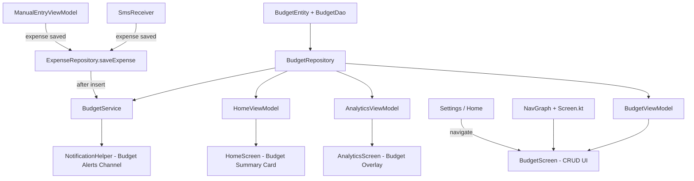
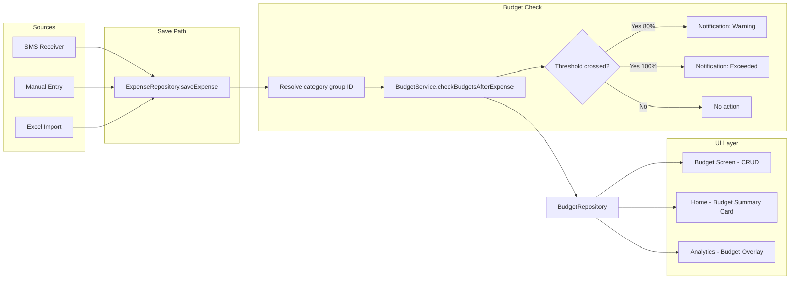
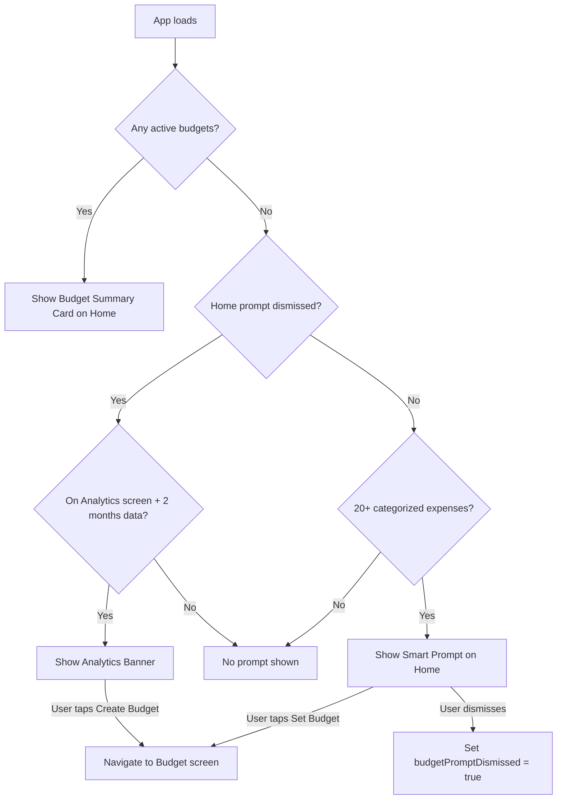

# M7: Category-Based Budgets — Implementation Plan

## Scope Summary

| Decision | Choice |
|----------|--------|
| **Budget periods** | Weekly, Monthly, Yearly |
| **Budget levels** | Total spending + Group-level (18 category groups) |
| **Rollover** | No — fresh budget each period |
| **Investments** | Included in total budget (user budgets for them too) |
| **Sub-category budgets** | Deferred to future iteration |
| **Alert thresholds** | 80% and 100% (hardcoded defaults) |
| **Budget prompts** | Data-driven Home card (≥20 categorized expenses) + Analytics banner (≥2 months data) |

---

## Architecture Overview



---

## Step 1: BudgetEntity + BudgetDao + DB Migration v8→v9

### BudgetEntity

New file: [`BudgetEntity.kt`](../android/app/src/main/java/com/pesatrack/data/local/database/entities/BudgetEntity.kt)

```kotlin
@Entity(
    tableName = "budgets",
    foreignKeys = [
        ForeignKey(
            entity = CategoryEntity::class,
            parentColumns = ["id"],
            childColumns = ["categoryGroupId"],
            onDelete = ForeignKey.CASCADE
        )
    ],
    indices = [
        Index(value = ["categoryGroupId"]),
        Index(value = ["isActive"])
    ]
)
data class BudgetEntity(
    @PrimaryKey(autoGenerate = true)
    val id: Long = 0,
    
    // null = "Total" budget; otherwise the group category ID (1-18)
    val categoryGroupId: Long? = null,
    
    // Budget limit in KES
    val amount: Double,
    
    // WEEKLY, MONTHLY, YEARLY
    val period: String,
    
    val isActive: Boolean = true,
    val createdAt: Long = System.currentTimeMillis(),
    val updatedAt: Long = System.currentTimeMillis()
)
```

**Key design choices:**
- `categoryGroupId` is nullable — `null` means "Total spending" budget
- `period` stored as String enum name (same pattern as `paymentType` in expenses)
- No `alertAt` column — hardcode 80%/100% thresholds to keep v1 simple
- No rollover columns — deferred
- FK to `categories` table ensures referential integrity
- Unique constraint NOT added on `categoryGroupId+period` to allow the user to delete and recreate (but the UI should prevent duplicates)

### BudgetDao

New file: [`BudgetDao.kt`](../android/app/src/main/java/com/pesatrack/data/local/database/dao/BudgetDao.kt)

```kotlin
@Dao
interface BudgetDao {
    @Insert(onConflict = OnConflictStrategy.REPLACE)
    suspend fun insert(budget: BudgetEntity): Long

    @Update
    suspend fun update(budget: BudgetEntity)

    @Delete 
    suspend fun delete(budget: BudgetEntity)

    @Query("SELECT * FROM budgets WHERE isActive = 1 ORDER BY categoryGroupId ASC")
    fun getActiveBudgets(): Flow<List<BudgetEntity>>

    @Query("SELECT * FROM budgets WHERE id = :id")
    suspend fun getById(id: Long): BudgetEntity?

    @Query("SELECT * FROM budgets WHERE categoryGroupId IS NULL AND period = :period AND isActive = 1 LIMIT 1")
    suspend fun getTotalBudgetForPeriod(period: String): BudgetEntity?

    @Query("SELECT * FROM budgets WHERE categoryGroupId = :groupId AND period = :period AND isActive = 1 LIMIT 1")
    suspend fun getGroupBudgetForPeriod(groupId: Long, period: String): BudgetEntity?

    // Get all active budgets that could be affected by an expense in a specific category group
    @Query("""
        SELECT * FROM budgets 
        WHERE isActive = 1 
        AND (categoryGroupId IS NULL OR categoryGroupId = :groupId)
    """)
    suspend fun getBudgetsAffectedByGroup(groupId: Long): List<BudgetEntity>
}
```

### DB Migration v8→v9

In [`PesaTrackDatabase.kt`](../android/app/src/main/java/com/pesatrack/data/local/database/PesaTrackDatabase.kt):

- Add `BudgetEntity::class` to `@Database(entities = [...])`
- Bump `version = 9`
- Add `abstract fun budgetDao(): BudgetDao`
- Add `MIGRATION_8_9`:

```kotlin
val MIGRATION_8_9 = object : Migration(8, 9) {
    override fun migrate(database: SupportSQLiteDatabase) {
        database.execSQL("""
            CREATE TABLE IF NOT EXISTS budgets (
                id INTEGER PRIMARY KEY AUTOINCREMENT NOT NULL,
                categoryGroupId INTEGER DEFAULT NULL,
                amount REAL NOT NULL,
                period TEXT NOT NULL,
                isActive INTEGER NOT NULL DEFAULT 1,
                createdAt INTEGER NOT NULL DEFAULT 0,
                updatedAt INTEGER NOT NULL DEFAULT 0,
                FOREIGN KEY (categoryGroupId) REFERENCES categories(id) ON DELETE CASCADE
            )
        """)
        database.execSQL("CREATE INDEX IF NOT EXISTS index_budgets_categoryGroupId ON budgets(categoryGroupId)")
        database.execSQL("CREATE INDEX IF NOT EXISTS index_budgets_isActive ON budgets(isActive)")
    }
}
```

Register in [`AppModule.kt`](../android/app/src/main/java/com/pesatrack/di/AppModule.kt) `.addMigrations(...)`.

---

## Step 2: Budget Domain Model + BudgetPeriod Enum

New file: [`Budget.kt`](../android/app/src/main/java/com/pesatrack/domain/models/Budget.kt)

```kotlin
data class Budget(
    val id: Long = 0,
    val categoryGroupId: Long?,     // null = Total
    val categoryGroupName: String?, // resolved from categories; null = "Total Spending"
    val categoryGroupColor: String?, // for UI bar coloring
    val amount: Double,
    val period: BudgetPeriod,
    val isActive: Boolean = true,
    val createdAt: Long = System.currentTimeMillis(),
    val updatedAt: Long = System.currentTimeMillis()
)

enum class BudgetPeriod {
    WEEKLY, MONTHLY, YEARLY;

    fun displayName(): String = when (this) {
        WEEKLY -> "Weekly"
        MONTHLY -> "Monthly"
        YEARLY -> "Yearly"
    }

    companion object {
        fun fromString(value: String): BudgetPeriod =
            try { valueOf(value) } catch (_: Exception) { MONTHLY }
    }
}
```

Also add a **BudgetProgress** data class used by the UI:

```kotlin
data class BudgetProgress(
    val budget: Budget,
    val spent: Double,          // actual spending in current period
    val percentage: Double,     // spent / budget.amount * 100
    val status: BudgetStatus
)

enum class BudgetStatus {
    UNDER,    // < 80%
    WARNING,  // 80-99%
    EXCEEDED  // >= 100%
}
```

---

## Step 3: BudgetRepository

New file: [`BudgetRepository.kt`](../android/app/src/main/java/com/pesatrack/data/repository/BudgetRepository.kt)

**Responsibilities:**
- CRUD operations (entity↔domain mapping)
- Period date range computation (start/end for current week/month/year)
- Compute spending for a budget (delegates to `ExpenseDao` queries)
- Assemble `BudgetProgress` objects for UI

**Key methods:**

```kotlin
@Singleton
class BudgetRepository @Inject constructor(
    private val budgetDao: BudgetDao,
    private val expenseDao: ExpenseDao,
    private val categoryDao: CategoryDao
) {
    // CRUD
    suspend fun saveBudget(budget: Budget): Long
    suspend fun updateBudget(budget: Budget)
    suspend fun deleteBudget(budget: Budget)
    fun getActiveBudgets(): Flow<List<Budget>>
    
    // Period range helpers
    fun getCurrentPeriodRange(period: BudgetPeriod): Pair<Long, Long>
    
    // Spending queries
    suspend fun getSpendingForBudget(budget: Budget): Double
    
    // Progress computation
    suspend fun getBudgetProgressList(): List<BudgetProgress>
    
    // Alert check — returns list of budgets that just crossed a threshold
    suspend fun checkBudgetAlerts(expenseCategoryGroupId: Long?): List<BudgetAlert>
}

data class BudgetAlert(
    val budget: Budget,
    val spent: Double,
    val percentage: Double,
    val threshold: Int  // 80 or 100
)
```

**Period range logic:**
- **WEEKLY**: Monday 00:00 → following Monday 00:00 (ISO week)
- **MONTHLY**: 1st of month 00:00 → 1st of next month 00:00 (existing `getMonthRange()` pattern from `ExpenseRepository`)
- **YEARLY**: Jan 1 00:00 → Jan 1 next year 00:00 (existing `getYearRange()` pattern)

**Spending computation for "Total" budget:**
- Sum ALL non-excluded expenses in the period range (investments included per user request)
- Reuse existing `ExpenseDao.getTotalForMonth()` pattern but make it period-aware

**Spending computation for group budgets:**
- Sum expenses where `categoryId` belongs to the group (i.e., `parentId = groupId` in categories table)
- Need a new DAO query that sums expenses by category parent group

---

## Step 4: New ExpenseDao Queries for Budget Checking

Add to [`ExpenseDao.kt`](../android/app/src/main/java/com/pesatrack/data/local/database/dao/ExpenseDao.kt):

```kotlin
// Total spending in a date range (all non-excluded expenses)
@Query("""
    SELECT COALESCE(SUM(amount), 0.0) FROM expenses
    WHERE isExcluded = 0
    AND timestamp >= :startMs AND timestamp < :endMs
""")
suspend fun getTotalSpendingInRange(startMs: Long, endMs: Long): Double

// Spending for a specific category group in a date range
// Joins categories to find all sub-categories belonging to a group
@Query("""
    SELECT COALESCE(SUM(e.amount), 0.0)
    FROM expenses e
    INNER JOIN categories c ON e.categoryId = c.id
    WHERE e.isExcluded = 0
    AND e.timestamp >= :startMs AND e.timestamp < :endMs
    AND (c.parentId = :groupId OR c.id = :groupId)
""")
suspend fun getGroupSpendingInRange(groupId: Long, startMs: Long, endMs: Long): Double
```

The `(c.parentId = :groupId OR c.id = :groupId)` clause handles the case where an expense is categorized directly to the group (unlikely but safe).

---

## Step 5: Hilt DI

Update [`AppModule.kt`](../android/app/src/main/java/com/pesatrack/di/AppModule.kt):

```kotlin
@Provides
@Singleton
fun provideBudgetDao(database: PesaTrackDatabase): BudgetDao {
    return database.budgetDao()
}
```

`BudgetRepository` uses `@Inject constructor` with `@Singleton` — Hilt auto-provides it.

---

## Step 6: BudgetService — Threshold Checking

New file: [`BudgetService.kt`](../android/app/src/main/java/com/pesatrack/services/BudgetService.kt)

Called after every expense save to check if any budget crossed 80% or 100%.

```kotlin
@Singleton
class BudgetService @Inject constructor(
    private val budgetRepository: BudgetRepository
) {
    // Called after an expense is saved
    // Returns alerts (if any) for budgets that just crossed a threshold
    suspend fun checkBudgetsAfterExpense(
        expenseCategoryGroupId: Long?
    ): List<BudgetAlert> {
        if (expenseCategoryGroupId == null) return emptyList()
        return budgetRepository.checkBudgetAlerts(expenseCategoryGroupId)
    }
}
```

**How `checkBudgetAlerts` works:**
1. Get all active budgets affected by this category group (`getBudgetsAffectedByGroup`)
2. For each budget, compute current spending via `getSpendingForBudget`
3. Calculate percentage = spent / budget.amount * 100
4. If percentage ≥ 100 → alert with threshold=100
5. Else if percentage ≥ 80 → alert with threshold=80
6. Return the list of alerts

**Notification deduplication:** To avoid spamming the same alert, we could track "last alerted threshold" in a DataStore preference keyed by budget ID. For v1, we'll accept that the notification fires on every expense that keeps the budget above the threshold — Android's notification ID (budget ID + threshold) ensures only one notification is visible per budget per threshold.

---

## Step 7: NotificationHelper — Budget Alerts Channel

Update [`NotificationHelper.kt`](../android/app/src/main/java/com/pesatrack/services/NotificationHelper.kt):

```kotlin
private const val BUDGET_CHANNEL_ID = "pesatrack_budget_alerts"
private const val BUDGET_CHANNEL_NAME = "Budget Alerts"

fun createBudgetAlertChannel(context: Context) { ... }

fun showBudgetAlertNotification(
    context: Context,
    budgetId: Long,
    categoryName: String,  // "Food & Dining" or "Total Spending"
    spent: Double,
    budgetAmount: Double,
    percentage: Int,        // e.g. 80, 101
    threshold: Int          // 80 or 100
) {
    // Notification ID = budgetId * 10 + threshold (unique per budget per threshold)
    // Title: "⚠️ Food & Dining: 80% of budget used" or "🚨 Budget exceeded!"
    // Body: "KES 12,100 / KES 15,000 (81%)"
    // Tap opens Budget screen
}
```

---

## Step 8: Budget Alert Integration in Expense Save Path

Two integration points where expenses are saved:

### 8a. SmsReceiver

In [`SmsReceiver.kt`](../android/app/src/main/java/com/pesatrack/services/SmsReceiver.kt), after `expenseRepository.saveExpense(mainExpense)`:

```kotlin
// Check budget alerts
if (mainExpense.categoryId != null) {
    val groupId = categoryRepository.getGroupIdForCategory(mainExpense.categoryId)
    val alerts = budgetService.checkBudgetsAfterExpense(groupId)
    for (alert in alerts) {
        NotificationHelper.showBudgetAlertNotification(context, ...)
    }
}
```

Need to inject `BudgetService` and `CategoryRepository` into `SmsReceiver`.

### 8b. Manual Entry / Excel Import

Add the same check in `ExpenseRepository.saveExpense()` — but since the repository doesn't have a `Context` for notifications, we need a different approach.

**Recommended approach:** Create a `BudgetCheckCallback` interface or use a suspend function in `BudgetService` that returns alerts, and let the caller (ViewModel / SmsReceiver) decide how to handle them.

For ViewModels (ManualEntryViewModel, ExcelImportViewModel), we can show a Snackbar or in-app alert instead of a notification.

---

## Step 9: BudgetScreen UI

New file: [`BudgetScreen.kt`](../android/app/src/main/java/com/pesatrack/presentation/screens/budget/BudgetScreen.kt)

### Layout

```
┌─────────────────────────────────────────────┐
│  ← Budgets                          + Add   │
├─────────────────────────────────────────────┤
│                                             │
│  📊 Total Spending          Monthly         │
│  ████████████░░░░  KES 62,400 / 80,000      │
│                                    78%      │
│                                   [Edit ⋮]  │
│─────────────────────────────────────────────│
│  🍽️ Food & Dining           Monthly         │
│  ████████████████  KES 14,800 / 15,000      │
│                                    99% ⚠️    │
│                                   [Edit ⋮]  │
│─────────────────────────────────────────────│
│  🚗 Transport & Travel      Monthly         │
│  ██████░░░░░░░░░░  KES 3,200 / 8,000       │
│                                    40%      │
│                                   [Edit ⋮]  │
│─────────────────────────────────────────────│
│                                             │
│  No budget set for 15 other groups          │
│                                             │
└─────────────────────────────────────────────┘
```

### Add/Edit Budget Dialog

A `ModalBottomSheet` or `AlertDialog` with:
1. **Category picker**: "Total Spending" at top, then all 18 groups (reuse group data from `CategoryRepository`)
2. **Amount input**: KES formatted number field
3. **Period picker**: Segmented button — Weekly / Monthly / Yearly
4. **Save / Cancel** buttons

### Interactions
- **Tap** a budget → opens edit dialog (pre-filled)
- **Long press** or **swipe-to-delete** → confirm delete
- **FAB / top-bar +** → opens add dialog
- Progress bar colors: Green (<80%), Amber (80-99%), Red (≥100%)

---

## Step 10: BudgetViewModel + BudgetUiState

New files:
- [`BudgetViewModel.kt`](../android/app/src/main/java/com/pesatrack/presentation/screens/budget/BudgetViewModel.kt)
- [`BudgetUiState.kt`](../android/app/src/main/java/com/pesatrack/presentation/screens/budget/BudgetUiState.kt)

```kotlin
data class BudgetUiState(
    val isLoading: Boolean = true,
    val budgetProgressList: List<BudgetProgress> = emptyList(),
    val availableGroups: List<CategoryGroupOption> = emptyList(),
    val showAddEditDialog: Boolean = false,
    val editingBudget: Budget? = null,  // null = adding new
    val error: String? = null,
    val saveSuccess: Boolean = false
)

data class CategoryGroupOption(
    val id: Long?,       // null = Total
    val name: String,
    val color: String?,
    val icon: String?,
    val hasExistingBudget: Boolean
)
```

**ViewModel methods:**
- `loadBudgets()` — fetch active budgets + compute progress
- `addBudget(categoryGroupId, amount, period)`
- `updateBudget(budgetId, amount, period)`
- `deleteBudget(budgetId)`
- `showAddDialog()` / `showEditDialog(budget)` / `dismissDialog()`

---

## Step 11: Navigation

### Screen.kt

Add to [`Screen.kt`](../android/app/src/main/java/com/pesatrack/presentation/navigation/Screen.kt):

```kotlin
object Budget : Screen("budget")
```

### NavGraph.kt

Add to [`NavGraph.kt`](../android/app/src/main/java/com/pesatrack/presentation/navigation/NavGraph.kt):

```kotlin
composable(route = Screen.Budget.route) {
    BudgetScreen(
        onNavigateBack = { navController.popBackStack() }
    )
}
```

---

## Step 12: HomeScreen — Budget Summary Card

Add a `BudgetSummaryCard` composable to [`HomeScreen.kt`](../android/app/src/main/java/com/pesatrack/presentation/screens/home/HomeScreen.kt), positioned after `MonthlySummaryCard` and before `SpendingTrendCard`:

```
┌──────────────────────────────────────────┐
│  📊 March Budget                    View →│
│                                          │
│  Total     ████████████░░░░  78%         │
│  Food      ████████████████  99% ⚠️       │
│  Transport ██████░░░░░░░░░░  40%         │
└──────────────────────────────────────────┘
```

- Only renders if the user has at least one active budget
- Shows top 3-4 budgets sorted by percentage used (descending)
- "View →" navigates to Budget screen
- Compact progress bars with percentage labels

---

## Step 13: HomeViewModel — Budget Data

Update [`HomeViewModel.kt`](../android/app/src/main/java/com/pesatrack/presentation/screens/home/HomeViewModel.kt):

- Inject `BudgetRepository`
- Add `loadBudgetSummary()` method
- Add `budgetProgressList: List<BudgetProgress>` to `HomeUiState`
- Top 4 budgets by percentage, sorted descending

---

## Step 14: Analytics Integration

Update [`AnalyticsScreen.kt`](../android/app/src/main/java/com/pesatrack/presentation/screens/analytics/AnalyticsScreen.kt):

In the **category breakdown** chart section:
- For each category bar that has a matching group budget, show a dashed line or marker at the budget amount
- Add a "Over Budget" label for categories exceeding their budget
- This is a visual enhancement and can be a follow-up if the chart library makes it complex

Update [`AnalyticsUiState.kt`](../android/app/src/main/java/com/pesatrack/presentation/screens/analytics/AnalyticsUiState.kt):
- Add `budgetMap: Map<Long?, Double>` — maps categoryGroupId to budget amount for overlay

---

## Step 15: Entry Points

Two ways to reach the Budget screen:

1. **HomeScreen**: "Budget Summary Card" → tap "View →" → Budget screen
2. **Settings**: Add a "Budgets" row in [`SettingsScreen.kt`](../android/app/src/main/java/com/pesatrack/presentation/screens/settings/SettingsScreen.kt) that navigates to Budget screen

Both require passing `onNavigateToBudget` callback through the navigation chain.

---

## Step 16: Update Implementation Status

Mark M7 as complete in [`_docs/implementation-status.md`](_docs/implementation-status.md).

---

## Data Flow Diagram



---

## Step 15b: Budget Discovery Prompts

Two discovery mechanisms prompt the user to create their first budget at the right moment.

### Home Screen — Data-Driven Smart Prompt

**Trigger:** ≥20 categorized expenses AND no active budgets exist AND user has not dismissed the prompt.

**Implementation in [`HomeViewModel.kt`](../android/app/src/main/java/com/pesatrack/presentation/screens/home/HomeViewModel.kt):**
1. Count categorized expenses via `ExpenseDao`
2. Check `BudgetDao.getActiveBudgets()` is empty
3. Check `AppPreferences.budgetPromptDismissed` is false
4. If all conditions met, find the top spending category group from last month and include it in the prompt

**UI in [`HomeScreen.kt`](../android/app/src/main/java/com/pesatrack/presentation/screens/home/HomeScreen.kt):**

```
┌──────────────────────────────────────────────┐
│  💡 Set a spending budget?                    │
│                                              │
│  You spent KES 14,200 on Food & Dining last  │
│  month. Set a budget to stay on track.       │
│                                              │
│  [Set Budget]              [Maybe Later]  ✕  │
└──────────────────────────────────────────────┘
```

- Positioned after `MonthlySummaryCard`, before `SpendingTrendCard`
- "Set Budget" → navigates to Budget screen with the suggested category pre-selected
- "Maybe Later" / ✕ → sets `budgetPromptDismissed = true` in DataStore, card disappears permanently
- Once the user creates any budget, the prompt is replaced by the `BudgetSummaryCard`

**DataStore preference in [`AppPreferences.kt`](../android/app/src/main/java/com/pesatrack/data/local/preferences/AppPreferences.kt):**

```kotlin
val budgetPromptDismissed: Boolean  // default false
suspend fun dismissBudgetPrompt()
```

### Analytics Screen — Subtle Banner

**Trigger:** User has ≥2 months of expense data AND no active budgets exist.

**UI in [`AnalyticsScreen.kt`](../android/app/src/main/java/com/pesatrack/presentation/screens/analytics/AnalyticsScreen.kt):**

A subtle info banner at the top of the Monthly tab:

```
┌──────────────────────────────────────────────┐
│  📊 Want to set spending limits?             │
│  Create budgets to track against your goals. │
│                              [Create Budget] │
└──────────────────────────────────────────────┘
```

- Only shown when no budgets exist and ≥2 months of data
- Not dismissable permanently — disappears once any budget is created
- Less prominent than the Home prompt — uses `surfaceVariant` container color
- "Create Budget" → navigates to Budget screen

**Logic flow:**



### HomeUiState Changes

Add to [`HomeUiState.kt`](../android/app/src/main/java/com/pesatrack/presentation/screens/home/HomeUiState.kt):

```kotlin
data class HomeUiState(
    // ... existing fields ...
    
    // Budget summary (shown when user has budgets)
    val budgetProgressList: List<BudgetProgress> = emptyList(),
    
    // Budget prompt (shown when user has no budgets but enough data)
    val showBudgetPrompt: Boolean = false,
    val budgetPromptCategoryName: String? = null,  // e.g. "Food & Dining"
    val budgetPromptAmount: Double? = null,         // e.g. 14200.0
    val budgetPromptGroupId: Long? = null           // for pre-selecting in Budget screen
)
```

---

## File Changes Summary

### New Files (9)

| File | Layer | Purpose |
|------|-------|---------|
| `entities/BudgetEntity.kt` | Data | Room entity |
| `dao/BudgetDao.kt` | Data | CRUD + query operations |
| `repository/BudgetRepository.kt` | Data | Business logic + period math |
| `models/Budget.kt` | Domain | Budget + BudgetPeriod + BudgetProgress + BudgetStatus |
| `services/BudgetService.kt` | Service | Threshold checking after expense save |
| `screens/budget/BudgetScreen.kt` | Presentation | Budget list + add/edit UI |
| `screens/budget/BudgetViewModel.kt` | Presentation | UI state management |
| `screens/budget/BudgetUiState.kt` | Presentation | State data classes |
| `plans/m7-category-budgets-plan.md` | Docs | This plan |

### Modified Files (13)

| File | Change |
|------|--------|
| `PesaTrackDatabase.kt` | Add BudgetEntity, budgetDao(), version 9, MIGRATION_8_9 |
| `ExpenseDao.kt` | Add getTotalSpendingInRange(), getGroupSpendingInRange() |
| `AppModule.kt` | Add provideBudgetDao(), register MIGRATION_8_9 |
| `AppPreferences.kt` | Add budgetPromptDismissed preference |
| `NotificationHelper.kt` | Add budget alert channel + showBudgetAlertNotification() |
| `SmsReceiver.kt` | Inject BudgetService, call checkBudgetsAfterExpense() after save |
| `Screen.kt` | Add Screen.Budget route |
| `NavGraph.kt` | Add Budget composable route |
| `HomeScreen.kt` | Add BudgetSummaryCard + BudgetPromptCard composables |
| `HomeViewModel.kt` | Inject BudgetRepository, load budget progress + prompt logic |
| `HomeUiState.kt` | Add budgetProgressList + prompt fields |
| `AnalyticsScreen.kt` | Add budget creation banner when no budgets exist |
| `SettingsScreen.kt` | Add "Budgets" navigation row |

---

## Open Questions Resolved

| Question | Decision |
|----------|----------|
| Should investments be excluded from Total budget? | **No** — user wants to budget for investments too |
| Sub-category budgets? | **Deferred** — group-level + total only for v1 |
| Rollover? | **No** — fresh each period |
| Alert threshold storage? | **Hardcoded** 80% + 100% — simplifies entity |
| Where to trigger budget check? | **SmsReceiver** (notification) + **ViewModels** (snackbar/in-app) |
| Budget screen entry point? | **Home** (budget summary card) + **Settings** (budget row) |
| When to prompt for first budget? | **Home** (data-driven, ≥20 expenses) + **Analytics** (banner, ≥2 months data) |
