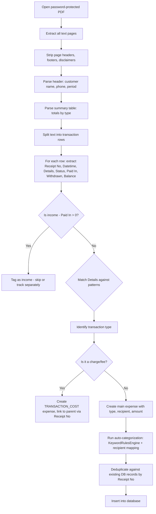

# M-PESA Statement Parser Specification

## Overview

This document specifies the parser for M-PESA PDF statements downloaded from the Safaricom M-PESA app. The parser is a **key data ingestion pathway for the iOS app** (where SMS interception is not possible) and a **valuable Android feature** for bulk-importing historical data.

> **Note:** This parser operates on both iOS and Android. On iOS it's the primary data source; on Android it complements SMS parsing by enabling batch historical imports.

---

## Statement Format Analysis

Based on a real M-PESA statement (12 pages, 3-month period, ~250 transactions).

### PDF Properties

| Property | Value |
|----------|-------|
| **Password protected** | Yes — encrypted with user's national ID number |
| **Generator** | Safaricom M-PESA app |
| **Pages** | Variable — ~20-25 transactions per page |
| **Text extractable** | Yes (not scanned/image-based) — standard PDF text |

### Document Structure

```
┌────────────────────────────────────────┐
│ M-PESA STATEMENT                       │
│ Customer Name: JOEL MUMO NGEI          │
│ Mobile Number: 0705622181              │
│ Email Address: mumo.joel@hotmail.com   │
│ Statement Period: 29 Jan 2026 - ...    │
│ Request Date: 29 Apr 2026             │
├────────────────────────────────────────┤
│ SUMMARY                                │
│ TRANSACTION TYPE    PAID IN  PAID OUT  │
│ SEND MONEY:          0.00   75,037.00  │
│ RECEIVED MONEY:  50,550.00      0.00   │
│ ... (7 categories + TOTAL)             │
├────────────────────────────────────────┤
│ DETAILED STATEMENT                     │
│ Receipt No. | Completion Time | ...    │
│ (transaction rows)                     │
├────────────────────────────────────────┤
│ Disclaimer: ...                        │
│ Page X of Y                            │
│ VERIFICATION_CODE                      │
└────────────────────────────────────────┘
```

### Table Columns

| Column | Type | Description |
|--------|------|-------------|
| Receipt No. | String | 10-character alphanumeric transaction ID (e.g., `UDT042BA3S`) |
| Completion Time | Datetime | Format: `YYYY-MM-DD HH:mm:ss` (e.g., `2026-04-29 12:20:13`) |
| Details | String | Multi-line description — contains transaction type, recipient, account info |
| Transaction Status | String | Always `Completed` for successful transactions |
| Paid In | Double | Income amount (empty or 0 for outflows) |
| Withdrawn | Double | Expense amount shown as negative with dash prefix (e.g., `-8,000.00`) |
| Balance | Double | Running balance after transaction |

### Amount Format

- **Expenses (Withdrawn):** Negative values with dash, no minus sign: `Completed-8,000.00` (the `Completed` status and amount appear concatenated)
- **Income (Paid In):** Positive values with space: `Completed 50,000.00`
- **Number format:** Comma thousands separator, 2 decimal places: `157,083.00`

---

## Transaction Type Patterns

### Outgoing Transactions (Expenses)

#### 1. Send Money (Customer Transfer)

```
Customer Transfer to 
2547******827 JONATHAN NGEI
```

**Pattern:** `Customer Transfer to\s+(\d{4}\*{6}\d{3}|\d{2}\*{6}\d{3})\s+(.+)`

**Fields:**
- Phone: masked number (e.g., `2547******827` or `07******764`)
- Recipient name: everything after the phone number
- PaymentType: `SEND_MONEY`

#### 2. Send Money Charge

```
Customer Transfer of Funds
Charge
```

**Pattern:** `Customer Transfer of Funds\s*Charge`

**Fields:**
- PaymentType: `TRANSACTION_COST`
- Links to the preceding/following Customer Transfer (same Receipt No.)

#### 3. Pay Bill

**Format A — Online with account:**
```
Pay Bill Online to 4034615 
GLADYS TECHNOLOGIES LIMITED
Acc. STREAMS OF
```

**Pattern:** `Pay Bill(?:\s+Online)?\s+to\s+(\d+)\s+(.+?)\s+Acc\.\s*(.+)`

**Format B — Standard with dash:**
```
Pay Bill to 222222 - E-CITIZEN
Acc. MGJWLVVQ
```

**Pattern:** `Pay Bill(?:\s+Online)?\s+to\s+(\d+)\s+-\s+(.+?)\s+Acc\.\s*(.+)`

**Fields:**
- Paybill number: numeric (e.g., `4034615`, `888880`)
- Business name: text after paybill number (e.g., `GLADYS TECHNOLOGIES LIMITED`)
- Account: text after `Acc.` (e.g., `STREAMS OF`, `92106709873`)
- PaymentType: `PAY_BILL`

#### 4. Pay Bill Charge

```
Pay Bill Charge
```

**Pattern:** `Pay Bill Charge`

**Fields:**
- PaymentType: `TRANSACTION_COST`
- Links to the nearest Pay Bill transaction (same Receipt No.)

#### 5. Merchant Payment (Buy Goods)

**Format A — Online with till and dash:**
```
Merchant Payment Online to
905834 - FAIRMART
SUPERMARKET-KIKUYU
```

**Pattern:** `Merchant Payment(?:\s+Online)?\s+to\s*(\d+)\s+-\s+(.+)`

**Format B — Without dash:**
```
Merchant Payment to 7608807 
FAIRMART SUPERMARKET LTD.
```

**Pattern:** `Merchant Payment(?:\s+Online)?\s+to\s+(\d+)\s+(.+)`

**Fields:**
- Till number: numeric (e.g., `905834`)
- Merchant name: text after till number
- PaymentType: `BUY_GOODS`

#### 6. Pay Merchant Charge

```
Pay Merchant Charge
```

**Pattern:** `Pay Merchant Charge`

**Fields:**
- PaymentType: `TRANSACTION_COST`
- Links to the nearest Merchant Payment (same Receipt No.)

#### 7. Airtime Purchase (Self)

```
Airtime Purchase
```

**Pattern:** `^Airtime Purchase$`

**Fields:**
- Recipient: self (use account holder name or phone)
- PaymentType: `AIRTIME`

#### 8. Data Bundle / Recharge

**Bundles:**
```
Customer Bundle Purchase to
826915Safaricom Offers by 
2547******181 JOEL NGEI
```

**Pattern:** `Customer Bundle Purchase to\s*(\d+)(.+?)\s+by\s+(\d{4}\*{6}\d{3}|\d{2}\*{6}\d{3})\s+(.+)`

**Home internet recharge:**
```
Recharge for Customer to
150501SAFARICOMHOME by 
2547******181 JOEL NGEI
```

**Pattern:** `Recharge for Customer to\s*(\d+)(.+?)\s+by\s+(\d{4}\*{6}\d{3}|\d{2}\*{6}\d{3})\s+(.+)`

**Fields:**
- Service ID + name
- Phone number of the customer recharged for
- PaymentType: `AIRTIME` (data bundles/recharge are airtime-like)

#### 9. Agent Withdrawal

```
Customer Withdrawal At Agent
Till 376065 - Maizma Connect
Public toilet shop Nduruma road
agg
```

**Pattern:** `Customer Withdrawal At Agent\s+Till\s+(\d+)\s+-\s+(.+)`

**Fields:**
- Agent till number
- Agent name/location
- PaymentType: `WITHDRAW`

#### 10. Withdrawal Charge

```
Withdrawal Charge
```

**Pattern:** `Withdrawal Charge`

**Fields:**
- PaymentType: `TRANSACTION_COST`

#### 11. Send to Small Business

```
Customer Payment to Small
Business to - 2547******103
SERAH BORO
```

**Pattern:** `Customer Payment to Small\s+Business to\s+-\s+(\d{4}\*{6}\d{3}|\d{2}\*{6}\d{3})\s+(.+)`

**Fields:**
- Phone: masked number
- Recipient name
- PaymentType: `SEND_MONEY` (treated same as person-to-person)

#### 12. M-PESA Card (GlobalPay)

```
Card Pay Bill Online to 903470 
M-PESA GlobalPay Acc. HU HBS
ONLINE            617-496-6355 US
```

**Pattern:** `Card Pay Bill(?:\s+Online)?\s+to\s+(\d+)\s+(.+?)\s+Acc\.\s*(.+)`

**Fields:**
- Paybill number
- Business name (e.g., `M-PESA GlobalPay`)
- Account info (e.g., `HU HBS ONLINE 617-496-6355 US`)
- PaymentType: `MPESA_CARD`

#### 13. M-Shwari Deposit (Savings)

```
M-Shwari Deposit
```

**Pattern:** `M-Shwari Deposit`

**Fields:**
- PaymentType: `PAY_BILL` (or new `SAVINGS` type)
- Auto-categorize to Investment and Savings > Savings

### Incoming Transactions (Income — Skip or Track Separately)

#### 14. Salary Payment

```
Salary Payment from 504900 
NCBA BANK via API. Original
conversation ID is
FTC260402XPWR.
```

**Pattern:** `Salary Payment from\s+(\d+)\s+(.+?)\s+via API`

#### 15. Funds Received

```
Funds received from 
2547******689 COLLINS
NYONGESA
```

**Pattern:** `Funds received from\s+(\d{4}\*{6}\d{3}|\d{2}\*{6}\d{3})\s+(.+)`

#### 16. M-Shwari Withdraw

```
M-Shwari Withdraw
```

**Pattern:** `M-Shwari Withdraw`

#### 17. Offnet B2C Transfer (Cross-Network)

```
Offnet B2C Transfer by
966888AIRTEL MONEY via API to
- 2547******181 JOEL NGEI
```

#### 18. Business Payment (B2C)

```
Business Payment from 807800 
Bank of Africa Kenya Ltd via API.
Original conversation ID is ...
```

### Skip/Ignore Patterns

#### 19. Reversal

```
Pay Utility Reversal by Daraja
Sandbox\darajaapiinitiator
```

**Pattern:** `Reversal|Pay Utility Reversal`

**Action:** Skip entirely — reversal undoes a previous transaction.

---

## Parser Algorithm



### Row Parsing Challenge: Multi-line Details

The main parsing difficulty is that the **Details column wraps across multiple lines**. A single transaction may look like:

```
UDT042BA3S 2026-04-29 12:20:13 Customer Transfer to            Completed-8,000.00 22,523.94
                                2547******827 JONATHAN NGEI
```

Or even:

```
UDB040CVAI 2026-04-11 18:26:29 Pay Bill Online to 800230       Completed-4,200.00 10,611.94
                                BrackenHurst Restaurant 1 Acc.
                                800230
```

**Strategy:** 
1. Identify row boundaries by detecting Receipt No. pattern at line start: `^[A-Z0-9]{10}\s+\d{4}-\d{2}-\d{2}`
2. Concatenate all lines until the next Receipt No. into a single transaction record
3. Extract the structured fields from the concatenated text

### Transaction Cost Linking

Charge transactions share the same Receipt No. as their parent transaction:

```
UDT042BA3S 2026-04-29 12:20:13 Customer Transfer of Funds Charge    Completed-90.00    22,523.94
UDT042BA3S 2026-04-29 12:20:13 Customer Transfer to ...              Completed-8,000.00 22,523.94
```

**Strategy:** Group by Receipt No., separate charges from main transactions, link them.

---

## Implementation Notes

### iOS Implementation

```swift
import PDFKit

class MpesaStatementParser {
    
    /// Parse a password-protected M-PESA statement PDF
    /// - Parameters:
    ///   - url: File URL of the PDF
    ///   - password: User's national ID number
    /// - Returns: Array of parsed transactions
    func parse(url: URL, password: String) throws -> [ParsedTransaction] {
        guard let document = PDFDocument(url: url) else {
            throw ParserError.cannotOpenPDF
        }
        
        if document.isLocked {
            guard document.unlock(withPassword: password) else {
                throw ParserError.wrongPassword
            }
        }
        
        // Extract all text
        var fullText = ""
        for i in 0..<document.pageCount {
            if let page = document.page(at: i),
               let text = page.string {
                fullText += text + "\n"
            }
        }
        
        // Parse the text
        return parseStatementText(fullText)
    }
}
```

### Android Implementation

```kotlin
// Android can use PdfRenderer or a library like Apache PDFBox / iText
// to extract text from the password-protected PDF
class MpesaStatementParser {
    
    fun parse(inputStream: InputStream, password: String): List<ParsedTransaction> {
        // Use PDFBox with password
        val document = PDDocument.load(inputStream, password)
        val stripper = PDFTextStripper()
        val fullText = stripper.getText(document)
        document.close()
        
        return parseStatementText(fullText)
    }
}
```

### Both Platforms: Shared Parsing Logic

The core regex-based parsing logic is identical on both platforms — only the PDF reading layer differs. The parsing logic should be testable with plain text input (no PDF dependency in unit tests).

---

## Mapping to Existing PesaTrack Types

| Statement Pattern | PaymentType | ExpenseSource | Auto-Category |
|-------------------|-------------|---------------|---------------|
| Customer Transfer to | SEND_MONEY | MPESA_STATEMENT | KeywordRulesEngine |
| Customer Transfer of Funds Charge | TRANSACTION_COST | MPESA_STATEMENT | 606 (Mpesa Transaction Cost) |
| Pay Bill Online to | PAY_BILL | MPESA_STATEMENT | KeywordRulesEngine |
| Pay Bill Charge | TRANSACTION_COST | MPESA_STATEMENT | 606 |
| Merchant Payment Online to | BUY_GOODS | MPESA_STATEMENT | KeywordRulesEngine |
| Pay Merchant Charge | TRANSACTION_COST | MPESA_STATEMENT | 606 |
| Airtime Purchase | AIRTIME | MPESA_STATEMENT | 202 (Airtime) |
| Customer Bundle Purchase | AIRTIME | MPESA_STATEMENT | 203 (Data Bundles) |
| Recharge for Customer (SAFARICOMHOME) | PAY_BILL | MPESA_STATEMENT | 1007 (WiFi) |
| Customer Withdrawal At Agent | WITHDRAW | MPESA_STATEMENT | KeywordRulesEngine |
| Withdrawal Charge | TRANSACTION_COST | MPESA_STATEMENT | 606 |
| Customer Payment to Small Business | SEND_MONEY | MPESA_STATEMENT | KeywordRulesEngine |
| Card Pay Bill Online to M-PESA GlobalPay | MPESA_CARD | MPESA_STATEMENT | KeywordRulesEngine |
| M-Shwari Deposit | PAY_BILL | MPESA_STATEMENT | 1801 (Savings) |
| Salary Payment / Funds received | — | — | SKIP (income, not expense) |
| Reversal | — | — | SKIP |

### New ExpenseSource Value

Add `MPESA_STATEMENT` to the `ExpenseSource` enum on both platforms to distinguish statement-imported transactions from SMS-parsed ones.

---

## Password Handling

### UX Flow

1. User selects "Import M-PESA Statement" 
2. File picker opens — user selects the PDF
3. App tries to open the PDF
4. If locked → prompt: "This statement is protected. Enter your National ID number to unlock."
5. User enters ID → app unlocks and parses
6. **Optional:** Save the password hash in Keychain/DataStore for future imports (user opt-in)

### Security

- Never store the plaintext ID number
- If saving for convenience, store only a salted hash and use it to verify before attempting unlock
- Better approach: just ask each time — these imports are periodic (weekly/monthly), not frequent

---

## Test Cases

| Test Case | Input Details | Expected Output |
|-----------|--------------|-----------------|
| Simple send money | `Customer Transfer to 2547******827 JONATHAN NGEI` | PaymentType.SEND_MONEY, recipient="JONATHAN NGEI", phone="2547******827" |
| Send money + charge (same receipt) | Two rows with same Receipt No. | One SEND_MONEY expense + one TRANSACTION_COST |
| Paybill with account | `Pay Bill Online to 888880 - KPLC PREPAID Acc. 92106709873` | PaymentType.PAY_BILL, paybill="888880", name="KPLC PREPAID", account="92106709873" |
| Merchant payment | `Merchant Payment Online to 905834 - FAIRMART SUPERMARKET-KIKUYU` | PaymentType.BUY_GOODS, till="905834", name="FAIRMART SUPERMARKET-KIKUYU" |
| Airtime self | `Airtime Purchase` | PaymentType.AIRTIME, amount from Withdrawn column |
| Agent withdrawal | `Customer Withdrawal At Agent Till 376065 - Maizma Connect...` | PaymentType.WITHDRAW, agent="Maizma Connect..." |
| Income (salary) | `Salary Payment from 504900 NCBA BANK via API` | SKIPPED (income) |
| Received funds | `Funds received from 2547******689 COLLINS NYONGESA` | SKIPPED (income) |
| Reversal | `Pay Utility Reversal by Daraja Sandbox` | SKIPPED |
| M-Shwari deposit | `M-Shwari Deposit` | Amount from Withdrawn, auto-cat Investment > Savings |
| Duplicate detection | Receipt No. already in DB | SKIPPED (deduplication) |
| Multi-line details | Details wrapping across 3 lines | Correctly concatenated and parsed |

---

## Summary

The M-PESA statement parser is a **critical feature for iOS** (primary data source) and a **nice-to-have for Android** (bulk import complement to SMS). The statement format is well-structured, text-extractable, and parseable with regex patterns. The main challenges are:

1. **Password-protected PDF** — need user's national ID to unlock
2. **Multi-line Details field** — requires row boundary detection
3. **Charge linking** — charges share Receipt No. with parent transactions
4. **Amount extraction** — concatenated with "Completed" status text

All of these are solvable with the strategies documented above.
