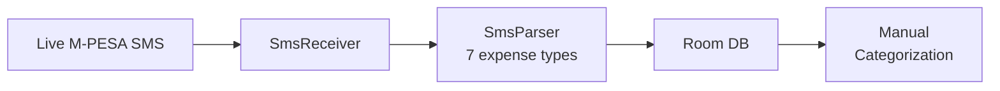
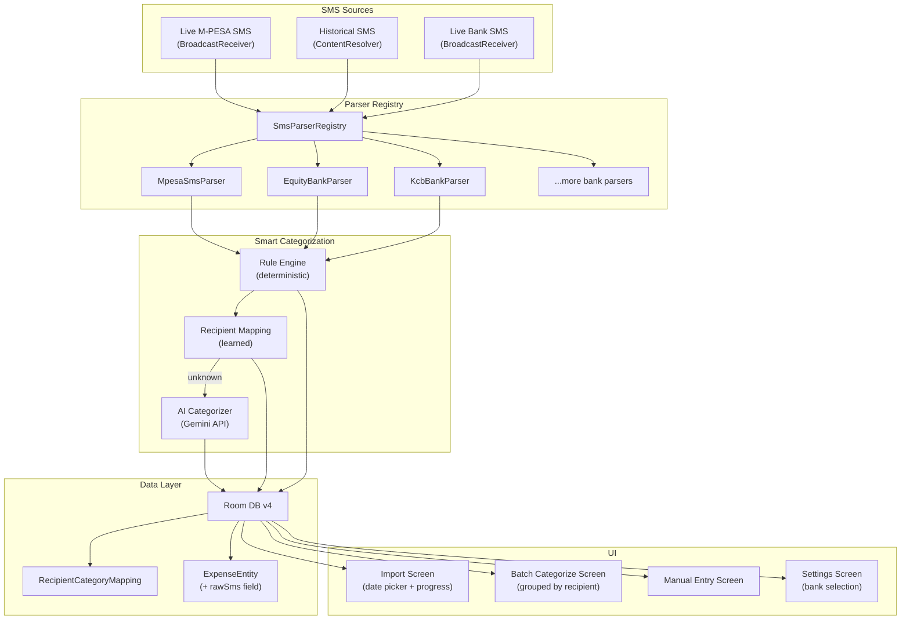
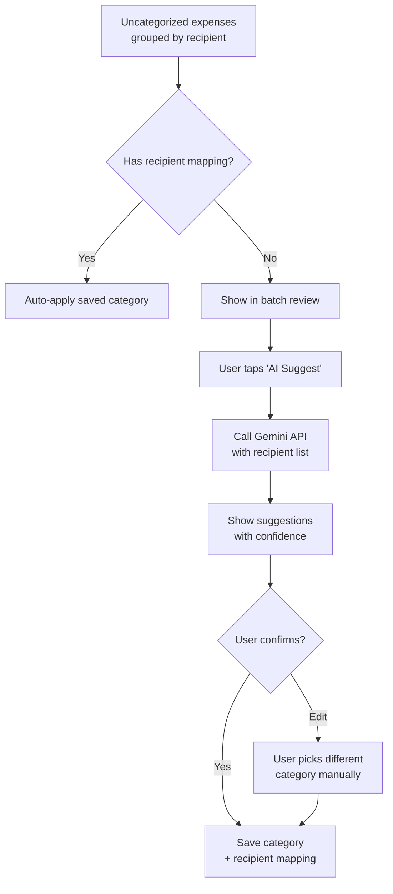

# PesaTrack Phase 2 — Implementation Plan

## Overview

Phase 2 expands PesaTrack from an M-PESA-only passive tracker into a comprehensive expense tracking platform with:
1. **Historical SMS Import** — bulk import past M-PESA transactions with smart batch categorization
2. **Bank SMS Tracking** — expand beyond M-PESA to track bank expenses
3. **AI-Powered Categorization** — auto-categorize expenses using recipient learning + AI
4. **Manual Expense Entry** — add expenses that don't come through SMS

---

## Current State (Phase 1 Complete)



**What exists:**
- [`SmsReceiver.kt`](../android/app/src/main/java/com/pesatrack/services/SmsReceiver.kt:24) — BroadcastReceiver for live SMS
- [`SmsParser.kt`](../android/app/src/main/java/com/pesatrack/utils/SmsParser.kt:56) — M-PESA SMS regex parser (7 types)
- [`ExpenseEntity.kt`](../android/app/src/main/java/com/pesatrack/data/local/database/entities/ExpenseEntity.kt:11) — Room entity with transactionId uniqueness
- [`ExpenseDao.kt`](../android/app/src/main/java/com/pesatrack/data/local/database/dao/ExpenseDao.kt:10) — CRUD + duplicate check
- [`ExpenseRepository.kt`](../android/app/src/main/java/com/pesatrack/data/repository/ExpenseRepository.kt:17) — domain mapping
- 17 category groups, 80+ sub-categories in [`CategoryEntity.kt`](../android/app/src/main/java/com/pesatrack/data/local/database/entities/CategoryEntity.kt:57)
- `READ_SMS` permission already declared in [`AndroidManifest.xml`](../android/app/src/main/AndroidManifest.xml:10)
- No networking dependencies (no Retrofit, no OkHttp)

---

## Phase 2 Target Architecture



---

## Implementation Milestones

### Milestone 1: Historical SMS Import + Recipient Learning ✅ COMPLETE

> **Goal:** Import existing M-PESA SMS from the inbox and auto-categorize using recipient-based learning.
>
> **Status:** All sub-tasks implemented. See files: `RecipientCategoryMappingEntity.kt`, `RecipientCategoryMappingDao.kt`, `RecipientMappingRepository.kt`, `SmsImportService.kt`, `ImportScreen.kt`, `ImportViewModel.kt`, `BatchCategorizeScreen.kt`, `BatchCategorizeViewModel.kt`.

#### 1.1 Data Layer — RecipientCategoryMapping

Create a new Room entity to store learned recipient→category mappings:

```kotlin
// New file: RecipientCategoryMappingEntity.kt
@Entity(tableName = "recipient_category_mapping")
data class RecipientCategoryMappingEntity(
    @PrimaryKey val recipientKey: String,  // normalized: "NAIVAS", "KPLC", "0712XXXXXX"
    val categoryId: Long,
    val recipientDisplayName: String?,     // "Naivas Supermarket"
    val timesUsed: Int = 1,
    val lastUsed: Long = System.currentTimeMillis()
)
```

**Files to create/modify:**
- Create `RecipientCategoryMappingEntity.kt` in `entities/`
- Create `RecipientCategoryMappingDao.kt` in `dao/`
- Update [`PesaTrackDatabase.kt`](../android/app/src/main/java/com/pesatrack/data/local/database/PesaTrackDatabase.kt:16) — add entity + migration 3→4
- Update [`AppModule.kt`](../android/app/src/main/java/com/pesatrack/di/AppModule.kt:19) — provide new DAO

#### 1.2 Data Layer — Add rawSms to ExpenseEntity

Store the raw SMS text so transactions can be re-parsed when parser patterns improve:

```kotlin
// Add to ExpenseEntity.kt
val rawSms: String? = null
```

This requires a Room migration 3→4 (combined with 1.1).

#### 1.3 Data Layer — Bulk Insert Support

Add batch operations to [`ExpenseDao.kt`](../android/app/src/main/java/com/pesatrack/data/local/database/dao/ExpenseDao.kt:10):

```kotlin
@Insert(onConflict = OnConflictStrategy.IGNORE)
suspend fun insertAll(expenses: List<ExpenseEntity>): List<Long>

@Query("SELECT transactionId FROM expenses WHERE transactionId IN (:ids)")
suspend fun getExistingTransactionIds(ids: List<String>): List<String>
```

#### 1.4 Service — SmsImportService

Create a service that reads historical SMS from the inbox via `ContentResolver`:

```kotlin
// New file: SmsImportService.kt
class SmsImportService @Inject constructor(
    @ApplicationContext private val context: Context,
    private val expenseRepository: ExpenseRepository,
    private val recipientMappingRepository: RecipientMappingRepository
) {
    fun importHistoricalSms(
        fromDate: Long?,          // null = all history
        toDate: Long?,            // null = now
        onProgress: (imported: Int, total: Int) -> Unit
    ): ImportResult
}
```

**Key logic:**
1. Query `Telephony.Sms.Inbox.CONTENT_URI` where `address = 'MPESA'`
2. Parse each SMS using existing `SmsParser.parseSms()`
3. Batch deduplicate against existing `transactionId`s
4. Apply deterministic auto-categorization (Airtime→1001, Costs→811)
5. Look up recipient in `RecipientCategoryMapping` for learned categories
6. Return `ImportResult(total, imported, autoCategorized, needsReview)`

#### 1.5 Update CategorizeScreen — Batch Mode

Modify [`CategorizeScreen.kt`](../android/app/src/main/java/com/pesatrack/presentation/screens/categorize/CategorizeScreen.kt:1) to support batch categorization by recipient grouping:

- Group uncategorized expenses by normalized recipient
- Show count + total amount per recipient
- "Apply to all" button saves the mapping to `RecipientCategoryMapping`
- Future transactions from the same recipient are auto-categorized

#### 1.6 UI — Import Screen

Create a new screen accessible from Home or Settings:

- Date range picker (Last 30 days / 3 months / 6 months / All)
- Import progress indicator
- Summary: "Found 150 M-PESA transactions, 45 auto-categorized, 12 recipient groups need review"
- Button to navigate to batch categorize

#### 1.7 Update SmsReceiver — Use Recipient Mapping

Modify [`SmsReceiver.kt`](../android/app/src/main/java/com/pesatrack/services/SmsReceiver.kt:59) to check `RecipientCategoryMapping` before saving. If a mapping exists, auto-categorize the incoming expense (set `categoryId` and `isCategorized = true`).

#### 1.8 Deterministic Auto-Categorization Rules

Add auto-categorization logic beyond just Transaction Costs (category 811):

| PaymentType | Auto-Category | Category ID |
|-------------|--------------|-------------|
| `TRANSACTION_COST` | Mpesa Transaction Cost | 811 |
| `AIRTIME` (self/other) | Airtime | 1001 |

Airtime is always airtime — no user categorization needed.

---

### Milestone 2: Bank SMS Tracking ✅ COMPLETE

> **Goal:** Expand SMS parsing to handle bank transaction SMS, starting with NCBA Bank.
>
> **Status:** All sub-tasks implemented. Parser strategy pattern created with MpesaSmsParser and NcbaBankParser. SmsReceiver and SmsImportService updated for multi-source support. Settings screen added with bank tracking toggles.

#### 2.1 Refactor — Parser Strategy Pattern ✅

Extracted M-PESA logic from `SmsParser.kt` into a strategy pattern:

**Created files:**
- [`SmsParserStrategy.kt`](../android/app/src/main/java/com/pesatrack/utils/parsers/SmsParserStrategy.kt:15) — Strategy interface (`canHandle()`, `parse()`, `senderIds`, `expenseSource`)
- [`MpesaSmsParser.kt`](../android/app/src/main/java/com/pesatrack/utils/parsers/MpesaSmsParser.kt:31) — Extracted all 8 M-PESA patterns
- [`SmsParserRegistry.kt`](../android/app/src/main/java/com/pesatrack/utils/parsers/SmsParserRegistry.kt:17) — Central dispatcher with `findParser()`, `parseTransaction()`, `getAllSenderIds()`
- [`SmsParser.kt`](../android/app/src/main/java/com/pesatrack/utils/SmsParser.kt:20) — Refactored into thin backward-compatible facade

Backward compatibility maintained: `SmsParser.parseSms()`, `SmsParser.isMpesaSms()`, `SmsParser.isTransactionSms()` all continue to work.

#### 2.2 Extend Domain Models ✅

Updated [`Expense.kt`](../android/app/src/main/java/com/pesatrack/domain/models/Expense.kt:30):
- Added `BANK_DEBIT` to `PaymentType` (for non-MPESA bank transactions)
- Added `SMS_BANK` to `ExpenseSource` (for bank SMS-parsed expenses)
- Kept `SMS_PARSED` unchanged (no rename needed — used for M-PESA SMS only)
- No DB migration needed (stored as String in Room)

#### 2.3 Implement NCBA Bank Parser ✅

Created [`NcbaBankParser.kt`](../android/app/src/main/java/com/pesatrack/utils/parsers/NcbaBankParser.kt:38) with sender ID `NCBA_BANK`:

| SMS Type | Pattern | PaymentType | Action |
|----------|---------|-------------|--------|
| Send Money with recipient | `"MPESA transfer of KES to NAME (PHONE)"` | SEND_MONEY | Parse |
| Self-transfer (no recipient) | `"MPESA transfer of KES...processed"` | — | Skip (bank→own M-PESA) |
| Till payment | `"Mpesa Till transfer of KES to TILL NAME"` | BUY_GOODS | Parse |
| Paybill | `"Mpesa Paybill transfer of KES to NAME account"` | PAY_BILL | Parse |
| Generic debit | `"Your account...has been debited"` | — | Skip (duplicate, less info) |

Deduplication: NCBA M-PESA transactions share the same M-PESA ref as direct M-PESA SMS. The existing `transactionId` uniqueness constraint handles cross-source dedup.

#### 2.4 Update SmsReceiver for Multi-Source ✅

Updated [`SmsReceiver.kt`](../android/app/src/main/java/com/pesatrack/services/SmsReceiver.kt:30) to use `SmsParserRegistry`:
- M-PESA SMS always processed (no preference check needed)
- Bank SMS checked against `AppPreferences.isBankEnabled()` before processing
- Uses `SmsParserRegistry.parseTransaction(sender, body)` for parsing

#### 2.5 Settings — Bank Selection ✅

Created Settings screen with bank tracking toggles:
- [`SettingsScreen.kt`](../android/app/src/main/java/com/pesatrack/presentation/screens/settings/SettingsScreen.kt:1) — M-PESA (always on) + bank master toggle + individual bank toggles
- [`SettingsViewModel.kt`](../android/app/src/main/java/com/pesatrack/presentation/screens/settings/SettingsViewModel.kt:1) — Reads from/writes to AppPreferences
- [`SettingsUiState.kt`](../android/app/src/main/java/com/pesatrack/presentation/screens/settings/SettingsUiState.kt:1) — BankToggle data model
- [`AppPreferences.kt`](../android/app/src/main/java/com/pesatrack/data/local/preferences/AppPreferences.kt:1) — Added `bankTrackingEnabled`, `enabledBanks`, `setBankEnabled()`
- Settings gear icon added to HomeScreen header
- Route added to NavGraph and Screen sealed class

#### 2.6 Historical Import — Extend to Banks ✅

Updated [`SmsImportService.kt`](../android/app/src/main/java/com/pesatrack/services/SmsImportService.kt:36):
- Queries all enabled bank sender IDs in addition to MPESA
- Uses `SmsParserRegistry.parseTransaction(sender, body)` for multi-source parsing
- Reads per-sender from ContentResolver, merges and sorts by date

---

### Milestone 3: AI-Powered Categorization ✅ COMPLETE

> **Goal:** Use Gemini API to auto-categorize expenses that can't be handled by rules or recipient mappings.
>
> **Status:** All sub-tasks implemented. Gemini SDK integrated, AiCategorizationService created with prompt engineering and JSON response parsing. BatchCategorize screen updated with "AI Suggest" button, per-recipient confidence chips, and "Apply All" bulk action. Settings screen updated with AI toggle and Gemini API key entry.

#### 3.1 Add Networking Dependencies

Add to [`build.gradle.kts`](../android/app/build.gradle.kts:65):

```kotlin
// Google Generative AI SDK (Gemini)
implementation("com.google.ai.client.generativeai:generativeai:0.9.0")
// or OkHttp for raw API calls
implementation("com.squareup.okhttp3:okhttp:4.12.0")
```

#### 3.2 AI Categorization Service

```kotlin
// New file: AiCategorizationService.kt
class AiCategorizationService @Inject constructor(
    private val categoryRepository: CategoryRepository
) {
    /**
     * Given a list of recipient names, suggest categories for each.
     * Uses Gemini API with the app's category list as context.
     */
    suspend fun suggestCategories(
        recipients: List<RecipientInfo>
    ): Map<String, CategorySuggestion>
}
```

**Prompt design:**
```
You are a Kenyan expense categorizer. Given the following expense categories and recipient names, 
suggest the most appropriate category for each recipient.

Categories: [Food & Dining > Groceries, Food & Dining > Restaurant, Transport > Uber/Bolt, ...]

Recipients to categorize:
1. "NAIVAS SUPERMARKET" (Buy Goods, KES 47,500 total)
2. "JAVA HOUSE LTD" (Buy Goods, KES 12,000 total)
3. "KPLC PREPAID" (Pay Bill, KES 8,000 total)
4. "JOHN KAMAU 0712XXXXXX" (Send Money, KES 30,000 total)

Return JSON: { "NAIVAS SUPERMARKET": { "categoryId": 303, "confidence": 0.95 }, ... }
```

#### 3.3 Integration into Batch Categorize Flow

The batch categorize screen gets an "AI Suggest" button:



#### 3.4 AI for Bank SMS Parsing (Future)

For banks where regex is unreliable or format changes frequently, use AI as a fallback parser:

```kotlin
// In SmsParserRegistry
fun parseTransaction(sender: String, body: String): ParsedTransaction? {
    // 1. Try registered regex parsers first
    for (parser in parsers) {
        if (parser.canHandle(sender, body)) {
            return parser.parse(body)
        }
    }
    
    // 2. If no parser matched but sender looks like a bank, try AI parsing
    if (isKnownBankSender(sender)) {
        return aiParserFallback.parse(sender, body)
    }
    
    return null
}
```

#### 3.5 Secure API Key Storage

- Store Gemini API key in `local.properties` (not committed)
- Access via `BuildConfig.GEMINI_API_KEY`
- Add to [`build.gradle.kts`](../android/app/build.gradle.kts:12):
  ```kotlin
  buildConfigField("String", "GEMINI_API_KEY", "\"${properties["GEMINI_API_KEY"]}\"")
  ```

---

### Milestone 4: Manual Expense Entry ✅ COMPLETE

> **Goal:** Allow users to add expenses that don't come through SMS (cash, card, etc.)
>
> **Status:** All sub-tasks implemented. ManualEntryScreen with full form (amount, recipient, name, payment type dropdown, date picker, category picker, notes), ManualEntryViewModel with validation and recipient mapping, CASH PaymentType added as default for manual entries. Entry points on HomeScreen (card) and ExpenseListScreen (FAB).

#### 4.1 Manual Entry Screen ✅

Created [`ManualEntryScreen.kt`](../android/app/src/main/java/com/pesatrack/presentation/screens/manual_entry/ManualEntryScreen.kt:26):
- Amount input (KES) with decimal keyboard and sanitization
- Recipient text field (phone/till/paybill)
- Recipient name (optional)
- Category picker (reuses [`GroupedCategoryPicker.kt`](../android/app/src/main/java/com/pesatrack/presentation/components/GroupedCategoryPicker.kt:1))
- Material 3 DatePickerDialog
- Notes field (multiline)
- Payment type dropdown (Cash, Buy Goods, Send Money, Pay Bill, Withdraw, Airtime, M-PESA Card, Bank Debit)
- Source = `ExpenseSource.MANUAL`
- Saves recipient→category mapping on save

#### 4.2 Extend PaymentType for Manual Entries ✅

Added `CASH` to [`PaymentType`](../android/app/src/main/java/com/pesatrack/domain/models/Expense.kt:40):
```kotlin
enum class PaymentType {
    // ... existing types ...
    CASH;            // Cash payment (manual entry)
}
```
No DB migration needed — stored as String in Room.

#### 4.3 Navigation Update ✅

- Added `ManualEntry` route to [`Screen.kt`](../android/app/src/main/java/com/pesatrack/presentation/navigation/Screen.kt:15)
- Added composable to [`NavGraph.kt`](../android/app/src/main/java/com/pesatrack/presentation/navigation/NavGraph.kt:17) (8 total routes)
- Added "Add Expense Manually" card on [`HomeScreen.kt`](../android/app/src/main/java/com/pesatrack/presentation/screens/home/HomeScreen.kt:76)
- Added FAB (+) button on [`ExpenseListScreen.kt`](../android/app/src/main/java/com/pesatrack/presentation/screens/expenses/ExpenseListScreen.kt:47)

---

### Milestone 5: Settings & Configuration — Partially Complete

> **Status:** Core settings infrastructure (bank SMS toggles + AI categorization config) built during M2 and M3. Extended settings and onboarding still pending.

#### 5.1 Settings Screen — ✅ Core Done, ⏳ Extended Pending

**✅ Implemented (during M2 & M3):**
- Bank SMS master toggle + individual bank toggles ([`SettingsScreen.kt`](../android/app/src/main/java/com/pesatrack/presentation/screens/settings/SettingsScreen.kt:96))
- M-PESA always-on indicator
- AI-powered categorization toggle
- Gemini API key entry with show/hide, save, external link
- Built-in vs. custom API key status indicator
- DataStore persistence for all settings ([`AppPreferences.kt`](../android/app/src/main/java/com/pesatrack/data/local/preferences/AppPreferences.kt:31))
- Settings gear icon accessible from HomeScreen header

**⏳ Still Pending:**
- **About section** — app version, credits, links
- **Data management** — clear all data, reset categories to defaults, export/backup
- **Notification preferences** — enable/disable expense notifications
- **Category management UI** — view/edit custom categories

#### 5.2 Onboarding Flow (First Launch) — ⏳ Pending

On first launch:
1. Welcome screen explaining PesaTrack
2. Permission requests (SMS, Phone, Notifications)
3. Offer historical SMS import with date range picker
4. Import → auto-categorize → batch review
5. Redirect to home screen

> Currently the app just shows a permission dialog on first launch in [`MainActivity.kt`](../android/app/src/main/java/com/pesatrack/presentation/MainActivity.kt:69) — no guided onboarding.

---

## File Changes Summary

### New Files

| File | Location | Purpose |
|------|----------|---------|
| `RecipientCategoryMappingEntity.kt` | `entities/` | Learned recipient→category mappings |
| `RecipientCategoryMappingDao.kt` | `dao/` | CRUD for mapping table |
| `RecipientMappingRepository.kt` | `repository/` | Repository for mappings |
| `SmsParserStrategy.kt` | `utils/parsers/` | Parser interface |
| `MpesaSmsParser.kt` | `utils/parsers/` | Extracted M-PESA parser |
| `SmsParserRegistry.kt` | `utils/parsers/` | Parser registry |
| `EquityBankParser.kt` | `utils/parsers/` | Equity Bank SMS parser |
| `KcbBankParser.kt` | `utils/parsers/` | KCB SMS parser |
| `SmsImportService.kt` | `services/` | Historical SMS import logic |
| `AiCategorizationService.kt` | `services/` | Gemini AI categorization |
| `ImportScreen.kt` | `screens/import/` | Import history UI |
| `ImportViewModel.kt` | `screens/import/` | Import state management |
| `BatchCategorizeScreen.kt` | `screens/categorize/` | Batch categorize by recipient |
| `BatchCategorizeViewModel.kt` | `screens/categorize/` | Batch categorize state |
| `ManualEntryScreen.kt` | `screens/manual/` | Manual expense entry |
| `ManualEntryViewModel.kt` | `screens/manual/` | Manual entry state |
| `SettingsScreen.kt` | `screens/settings/` | App settings |
| `SettingsViewModel.kt` | `screens/settings/` | Settings state |

### Modified Files

| File | Changes |
|------|---------|
| [`PesaTrackDatabase.kt`](../android/app/src/main/java/com/pesatrack/data/local/database/PesaTrackDatabase.kt:16) | Add RecipientCategoryMappingEntity, migration 3→4, rawSms column |
| [`ExpenseEntity.kt`](../android/app/src/main/java/com/pesatrack/data/local/database/entities/ExpenseEntity.kt:11) | Add `rawSms: String?` field |
| [`ExpenseDao.kt`](../android/app/src/main/java/com/pesatrack/data/local/database/dao/ExpenseDao.kt:10) | Add `insertAll()`, `getExistingTransactionIds()` |
| [`Expense.kt`](../android/app/src/main/java/com/pesatrack/domain/models/Expense.kt:6) | Add rawSms field, new PaymentTypes, rename SMS_PARSED→SMS_MPESA |
| [`ExpenseRepository.kt`](../android/app/src/main/java/com/pesatrack/data/repository/ExpenseRepository.kt:17) | Add bulk insert, rawSms mapping |
| [`SmsParser.kt`](../android/app/src/main/java/com/pesatrack/utils/SmsParser.kt:56) | Delegate to SmsParserRegistry, keep backward-compat API |
| [`SmsReceiver.kt`](../android/app/src/main/java/com/pesatrack/services/SmsReceiver.kt:24) | Use registry, check recipient mapping for auto-categorize |
| [`AppModule.kt`](../android/app/src/main/java/com/pesatrack/di/AppModule.kt:19) | Provide new DAOs and services |
| [`NavGraph.kt`](../android/app/src/main/java/com/pesatrack/presentation/navigation/NavGraph.kt:17) | Add import, manual entry, settings routes |
| [`Screen.kt`](../android/app/src/main/java/com/pesatrack/presentation/navigation/Screen.kt:6) | Add new screen routes |
| [`HomeScreen.kt`](../android/app/src/main/java/com/pesatrack/presentation/screens/home/HomeScreen.kt:24) | Add import button, settings access |
| [`build.gradle.kts`](../android/app/build.gradle.kts:65) | Add Gemini AI SDK dependency |
| [`AppPreferences.kt`](../android/app/src/main/java/com/pesatrack/data/local/preferences/AppPreferences.kt:1) | Add bank tracking prefs, AI prefs, import status |

---

## Implementation Order

```mermaid
gantt
    title PesaTrack Phase 2 Implementation
    dateFormat X
    axisFormat %s
    
    section Milestone 1 - Historical Import
    RecipientCategoryMapping entity + DAO        :m1a, 0, 1
    Add rawSms to ExpenseEntity + migration 3→4  :m1b, 0, 1
    Bulk insert support in ExpenseDao             :m1c, 0, 1
    SmsImportService                              :m1d, 1, 2
    Deterministic auto-categorization rules       :m1e, 1, 2
    Recipient mapping repository                  :m1f, 1, 2
    Update SmsReceiver for auto-categorize        :m1g, 2, 3
    Batch Categorize Screen                       :m1h, 2, 4
    Import Screen with date picker                :m1i, 3, 4
    
    section Milestone 2 - Bank SMS
    SmsParserStrategy interface                   :m2a, 4, 5
    Extract MpesaSmsParser                        :m2b, 4, 5
    SmsParserRegistry                             :m2c, 5, 6
    EquityBankParser                              :m2d, 5, 6
    KcbBankParser                                 :m2e, 6, 7
    Update SmsReceiver for multi-source           :m2f, 6, 7
    Extend domain models                          :m2g, 4, 5
    Settings screen - bank selection              :m2h, 7, 8
    
    section Milestone 3 - AI
    Add Gemini SDK dependency                     :m3a, 8, 9
    AiCategorizationService                       :m3b, 8, 9
    Integrate into batch categorize               :m3c, 9, 10
    API key management                            :m3d, 8, 9
    
    section Milestone 4 - Manual Entry
    ManualEntryScreen + ViewModel                 :m4a, 10, 11
    Navigation updates                            :m4b, 10, 11
    Extend PaymentType                            :m4c, 10, 11
```



---

## Recommended Execution Strategy

### **Start with Milestone 1** (Historical Import + Recipient Learning)
This delivers the most user value immediately:
- Users get their entire M-PESA history in the app from day one
- The recipient mapping table enables auto-categorization for ALL future transactions
- The batch categorize UI reduces manual work by 90%+

### **Then Milestone 2** (Bank SMS)
Once the parser strategy pattern is in place and proven with M-PESA, adding banks is straightforward plug-in work.

### **Then Milestone 4** (Manual Entry)
Simple CRUD screen — low complexity, useful for cash/card expenses.

### **Milestone 3** (AI) can be started in parallel
AI categorization is additive — it enhances the batch categorize flow but isn't blocking.

---

## Key Design Decisions

| Decision | Choice | Rationale |
|----------|--------|-----------|
| Import on first launch vs wait | **Import immediately** | Recipient mapping works from day one; deterministic rules handle ~40% of transactions without any user input |
| AI on-device vs API | **API first (Gemini)** | Gemini Nano requires Android 14+ (minSdk is 26); API works everywhere; can add on-device later |
| One parser per bank vs AI for all banks | **Regex first, AI fallback** | Regex is free, fast, offline; AI is a fallback for unknown formats |
| Rename SMS_PARSED to SMS_MPESA | **Yes, with backward compat** | Cleaner model as we add SMS_BANK; fromString() handles old records |
| Store raw SMS text | **Yes** | Enables re-parsing when patterns improve; useful for debugging |
| Batch categorize vs one-by-one | **Batch by recipient** | 200 transactions = ~15 taps instead of 200 |
