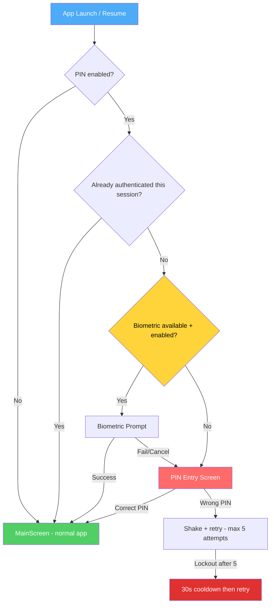

# PIN Lock Feature — Implementation Plan

## Overview

Add app-level security so users can lock PesaTrack with a 4-digit PIN and optionally unlock with biometrics (fingerprint / face). The lock screen appears when the app is opened or resumed from background after a configurable timeout.

---

## Architecture



---

## Design Decisions

### 1. PIN Storage — Hashed, not plaintext

The PIN is hashed with SHA-256 + a random salt before storing in DataStore. We never store the raw PIN.

```
stored = salt + ":" + SHA256(salt + pin)
```

**Why not Android Keystore / EncryptedSharedPreferences?**
- The PIN protects casual access (nosy friends, kids), not nation-state attacks. SHA-256 + salt is sufficient for a 4-digit PIN.
- EncryptedSharedPreferences adds a Tink dependency (~1.5MB) and complexity for minimal gain on a 4-digit space.
- If stronger security is needed later, we can migrate to Keystore without changing the API.

### 2. Lock Trigger — Lifecycle-based with timeout

The app locks when:
- **Cold start** — always requires unlock if PIN is enabled
- **Resume from background** — only if the app was backgrounded for > N seconds (default: 30s, configurable: immediate / 30s / 1min / 5min)

This is tracked via `ProcessLifecycleOwner` in [`PesaTrackApp.kt`](../android/app/src/main/java/com/pesatrack/PesaTrackApp.kt:12). When `ON_STOP` fires, we record the timestamp. When `ON_START` fires, we check elapsed time.

### 3. Biometric — Optional enhancement

If the device supports BiometricPrompt (fingerprint, face):
- Show a "Use biometrics to unlock" toggle in Settings (only visible when PIN is enabled)
- On unlock screen, auto-launch BiometricPrompt first; fall back to PIN on cancel/failure
- Uses `androidx.biometric:biometric:1.2.0-alpha05` (stable API, no Jetpack Compose wrapper needed — called from Activity)

### 4. Lock Screen — Compose overlay in MainActivity

The lock screen is **not** a separate Activity or NavGraph route. It's a Compose overlay in [`MainActivity.kt`](../android/app/src/main/java/com/pesatrack/presentation/MainActivity.kt:32) that sits on top of `MainScreen()` when `isLocked == true`. This approach:
- Prevents back-button bypass (can't pop the lock screen off the nav stack)
- Doesn't interfere with deep links or notification intents
- Keeps the underlying state alive (no data loss on lock)

### 5. Brute Force Protection

| Attempts | Behavior |
|----------|----------|
| 1–5 | Shake animation + "Incorrect PIN" |
| 5 | 30-second cooldown (countdown timer shown) |
| After cooldown | 5 more attempts, then another 30s cooldown |

No data wipe — this is an expense tracker, not a banking app. Wiping data would be disproportionate.

---

## Data Layer Changes

### AppPreferences — New keys

| Key | Type | Default | Description |
|-----|------|---------|-------------|
| `pin_hash` | `String?` | `null` | `"salt:hash"` or null if no PIN set |
| `pin_enabled` | `Boolean` | `false` | Whether PIN lock is active |
| `biometric_enabled` | `Boolean` | `false` | Whether biometric unlock is enabled |
| `lock_timeout_seconds` | `Int` | `30` | Background time before re-lock |
| `last_background_timestamp` | `Long` | `0` | When `ON_STOP` fired |

All stored in the existing DataStore at [`AppPreferences.kt`](../android/app/src/main/java/com/pesatrack/data/local/preferences/AppPreferences.kt:19).

---

## New Files

| File | Purpose |
|------|---------|
| `presentation/screens/pin/PinLockScreen.kt` | Compose PIN entry UI — 4-dot indicator, number pad, biometric button, shake animation |
| `presentation/screens/pin/PinSetupScreen.kt` | PIN setup flow — enter PIN → confirm PIN → saved |
| `presentation/screens/pin/PinViewModel.kt` | PIN verification, attempt counting, cooldown timer, biometric trigger |
| `presentation/screens/pin/PinUiState.kt` | UI state: enteredDigits, isError, attemptsRemaining, cooldownSeconds, mode (UNLOCK/SETUP/CONFIRM/CHANGE) |
| `services/PinManager.kt` | PIN hash/verify logic, timeout checking — pure Kotlin, Hilt-injected |
| `services/AppLockLifecycleObserver.kt` | `LifecycleObserver` on ProcessLifecycleOwner — records background timestamp, sets lock state |

### Modified Files

| File | Change |
|------|--------|
| [`AppPreferences.kt`](../android/app/src/main/java/com/pesatrack/data/local/preferences/AppPreferences.kt:1) | Add PIN-related preference keys and accessors |
| [`PesaTrackApp.kt`](../android/app/src/main/java/com/pesatrack/PesaTrackApp.kt:12) | Register `AppLockLifecycleObserver` with `ProcessLifecycleOwner` |
| [`MainActivity.kt`](../android/app/src/main/java/com/pesatrack/presentation/MainActivity.kt:32) | Wrap `MainScreen()` with lock screen overlay; launch biometric prompt from Activity context |
| [`SettingsScreen.kt`](../android/app/src/main/java/com/pesatrack/presentation/screens/settings/SettingsScreen.kt:1) | Add "Security" section: PIN toggle, change PIN, biometric toggle, timeout picker |
| [`SettingsViewModel.kt`](../android/app/src/main/java/com/pesatrack/presentation/screens/settings/SettingsViewModel.kt:1) | Add PIN/biometric preference management |
| [`SettingsUiState.kt`](../android/app/src/main/java/com/pesatrack/presentation/screens/settings/SettingsUiState.kt:1) | Add `pinEnabled`, `biometricEnabled`, `biometricAvailable`, `lockTimeoutSeconds` fields |
| [`build.gradle.kts`](../android/app/build.gradle.kts:85) | Add `androidx.biometric:biometric` + `androidx.lifecycle:lifecycle-process` dependencies |
| [`NavGraph.kt`](../android/app/src/main/java/com/pesatrack/presentation/navigation/NavGraph.kt:1) | Add PinSetup route (for Settings → Set/Change PIN navigation) |
| [`Screen.kt`](../android/app/src/main/java/com/pesatrack/presentation/navigation/Screen.kt:1) | Add `PinSetup` route object |

---

## UI Design

### PIN Entry Screen (Unlock)

```
┌──────────────────────────────────┐
│                                  │
│          🔒 PesaTrack            │
│                                  │
│          Enter your PIN          │
│                                  │
│          ● ● ○ ○                 │
│                                  │
│      ┌─────┬─────┬─────┐        │
│      │  1  │  2  │  3  │        │
│      ├─────┼─────┼─────┤        │
│      │  4  │  5  │  6  │        │
│      ├─────┼─────┼─────┤        │
│      │  7  │  8  │  9  │        │
│      ├─────┼─────┼─────┤        │
│      │ 👆  │  0  │  ⌫  │        │
│      └─────┴─────┴─────┘        │
│                                  │
│   👆 = biometric button          │
│   (only shown if enabled)        │
│                                  │
└──────────────────────────────────┘
```

- **Filled dots** = digits entered so far
- **Shake animation** on wrong PIN (dots turn red briefly)
- **Auto-submit** when 4th digit is entered (no "OK" button needed)
- **Biometric button** bottom-left launches `BiometricPrompt`

### PIN Setup Screen (Settings flow)

```
Step 1: "Enter a 4-digit PIN"     →  ● ● ● ●
Step 2: "Confirm your PIN"         →  ● ● ● ●  (must match)
Step 3: "PIN set! 🎉"              →  Auto-navigate back to Settings
```

If confirmation doesn't match: "PINs don't match. Try again." → back to Step 1.

### Settings — Security Section

```
┌──────────────────────────────────┐
│  🔐 Security                     │
│                                  │
│  App Lock PIN          [toggle]  │
│  Tap to set up a 4-digit PIN    │
│                                  │
│  ── (shown when PIN enabled) ──  │
│                                  │
│  Change PIN             >        │
│                                  │
│  Unlock with Biometrics [toggle] │
│  Use fingerprint or face unlock  │
│                                  │
│  Lock After             >        │
│  30 seconds                      │
│  (Immediately / 30s / 1m / 5m)   │
│                                  │
└──────────────────────────────────┘
```

---

## Dependency Additions

```kotlin
// build.gradle.kts — new dependencies
implementation("androidx.biometric:biometric:1.2.0-alpha05")
implementation("androidx.lifecycle:lifecycle-process:2.8.7")
```

- `biometric` — for `BiometricPrompt` API (fingerprint/face)
- `lifecycle-process` — for `ProcessLifecycleOwner` to detect app background/foreground transitions

---

## Implementation Steps

### Step 1: Data Layer — PinManager + AppPreferences
- Add PIN preference keys to [`AppPreferences.kt`](../android/app/src/main/java/com/pesatrack/data/local/preferences/AppPreferences.kt:1)
- Create `PinManager.kt` — hash PIN (SHA-256 + salt), verify PIN, check timeout

### Step 2: Lifecycle Observer — AppLockLifecycleObserver
- Create observer that hooks into `ProcessLifecycleOwner`
- Records `lastBackgroundTimestamp` on `ON_STOP`
- Exposes `isLocked` state (checked on `ON_START`)
- Register in [`PesaTrackApp.kt`](../android/app/src/main/java/com/pesatrack/PesaTrackApp.kt:12)

### Step 3: PIN UI — PinLockScreen + PinSetupScreen
- Create `PinUiState.kt` — mode, digits, error, cooldown
- Create `PinViewModel.kt` — verify, setup, change flows
- Create `PinLockScreen.kt` — number pad + dot indicator + biometric button
- Create `PinSetupScreen.kt` — enter → confirm → done flow

### Step 4: Lock Overlay in MainActivity
- Modify [`MainActivity.kt`](../android/app/src/main/java/com/pesatrack/presentation/MainActivity.kt:56) to observe `isLocked` state
- When locked, show `PinLockScreen` overlay on top of `MainScreen`
- On successful unlock, dismiss overlay
- Launch `BiometricPrompt` from Activity context when biometric button tapped

### Step 5: Settings Integration
- Add "Security" section to [`SettingsScreen.kt`](../android/app/src/main/java/com/pesatrack/presentation/screens/settings/SettingsScreen.kt:1)
- PIN enable/disable toggle (enable → navigates to PinSetup; disable → requires current PIN verification)
- Change PIN option (requires current PIN first)
- Biometric toggle (only shown when device supports it + PIN enabled)
- Lock timeout picker

### Step 6: Navigation
- Add `PinSetup` route to [`Screen.kt`](../android/app/src/main/java/com/pesatrack/presentation/navigation/Screen.kt:1) and [`NavGraph.kt`](../android/app/src/main/java/com/pesatrack/presentation/navigation/NavGraph.kt:1)
- Settings → PinSetup for set/change PIN flow

### Step 7: Dependencies
- Add `biometric` and `lifecycle-process` to [`build.gradle.kts`](../android/app/build.gradle.kts:85)

### Step 8: Update docs
- Update [`implementation-status.md`](../_docs/implementation-status.md) to reflect PIN lock completion

---

## Edge Cases

| Scenario | Behavior |
|----------|----------|
| User disables PIN | Requires entering current PIN first, then clears hash from DataStore |
| User changes PIN | Requires entering current PIN, then enter+confirm new PIN |
| User forgets PIN | No recovery — must clear app data (Android Settings → Apps → PesaTrack → Clear Data). This is intentional for security. |
| App killed while locked | Cold start will re-lock (PIN enabled = always lock on cold start) |
| Notification tap while locked | Opens app → lock screen shown → after unlock, navigates to intended screen |
| Biometric fails 3 times | System locks biometric; user must use PIN |
| Screen rotation while entering PIN | ViewModel preserves state |
| Background SMS still works | `SmsReceiver` is a `BroadcastReceiver` — runs independently of Activity lock state. Expenses are still saved while locked. |

---

## What This Does NOT Include

- **Remote wipe** — overkill for an expense tracker
- **PIN recovery** — would require cloud/email, which contradicts the offline-only design
- **Encrypted database** — SQLCipher would add ~5MB and slow queries. The PIN prevents casual UI access, not forensic extraction. Can be added later if needed.
- **Auto-lock on screen off** — Android's own screen lock handles this. PesaTrack only locks on app background, not display off.
