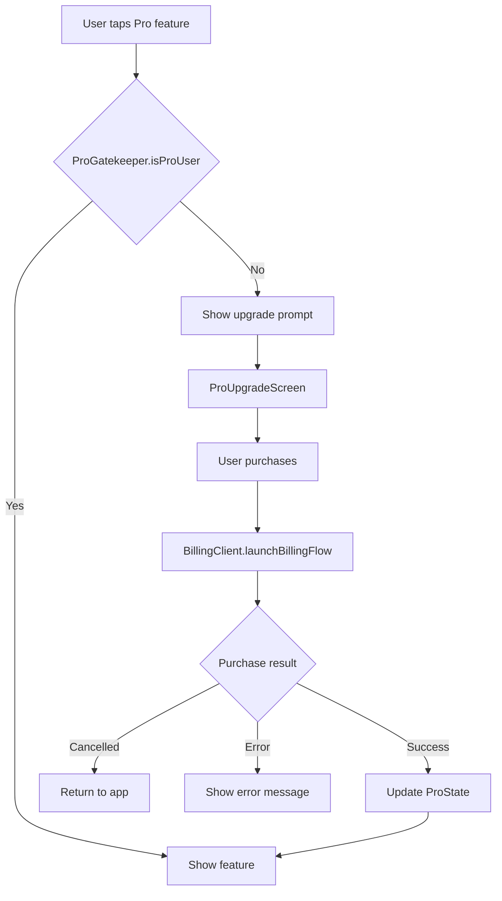

# PesaTrack Pro — Launch Plan

## Overview

PesaTrack Pro is a premium tier that transforms PesaTrack from a passive expense tracker into a **personal financial coach**. The free tier remains fully functional for tracking, budgeting, and basic analytics. Pro adds intelligence: actionable recommendations, deep insights, proactive alerts, and power-user tools.

**Key architectural decision:** Pro v1 uses no server-side infrastructure, no custom identity, and no internet permission. All premium features are on-device, powered by a template-based insight engine. Monetization is via Google Play Billing only.

---

## Positioning

> **Free:** Track everything. See where your money goes.
> **Pro:** Understand everything. Know what to do about it.

---

## Identity Decision

| Question | Answer |
|----------|--------|
| Does Pro v1 need Google Sign-In? | **No** |
| Does Pro v1 need a PesaTrack backend? | **No** |
| Does Pro v1 need INTERNET permission? | **No** |
| How is entitlement managed? | **Google Play Billing** — BillingClient checks purchase state |
| Cross-device Pro portability? | Handled by Google Play automatically — same Google account = same purchases |

**Identity is deferred** to a future phase when Google Drive backup or server-side AI features are built. See `plans/account-identity-policy.md` for the phased identity roadmap.

---

## Free vs Pro Feature Split

### Always Free

| Feature | Rationale |
|---------|-----------|
| SMS expense tracking — unlimited | Core mechanic, never gated |
| Manual expense entry | Core mechanic |
| All category management + custom categories | Core mechanic |
| Auto-categorization — keyword rules engine | Core quality-of-life |
| Budgets — unlimited, all periods | Core mechanic — users need to use budgets before they will pay for coaching |
| Budget alerts at 80% and 100% | Core budget loop |
| Basic analytics — monthly trends, category breakdown, MoM comparison | Proves value — users need to see data before paying for insight |
| Basic forecasting — exhaustion date, projected total | Core budget loop |
| Recurring expense detection + basic reminders | Core insight that makes the app sticky |
| Year-over-year analytics | Attracts long-term users |
| CSV export | Standard data portability |
| PIN lock + biometrics | Security is never paywalled |
| SMS import — historical | Onboarding flow, no barriers |
| Excel import | Already shipped, used by existing users |
| Local backup and restore via SAF | Data safety is not paywalled for a local-only app |
| Onboarding flow | First experience is always free |

### Pro Features

#### 1. Actionable Spending Recommendations

Transforms passive data displays into specific, contextual advice.

| Free | Pro |
|------|-----|
| Projected: KES 87,200 / 80,000 at 109% | Cut daily discretionary spending by KES 480 to stay on track — thats about 1 fewer takeaway meal per day |
| Food and Dining used 92% of budget | Your grocery spending is stable at KES 8K but Eating Out spiked 40% this month. Consider cooking 2 more meals per week to save approximately KES 3,200 |
| Budget exhaustion: March 25 | You have KES 4,800 left for 6 days. Prioritize: Groceries at KES 2,000 needed plus Transport at KES 1,500 needed. Defer: Shopping and Entertainment |
| Rent due tomorrow | Your 3 recurring expenses total KES 43K — thats 54% of your monthly budget committed before discretionary spending |

**Implementation:** `RecommendationEngine` service — pure Kotlin, takes budget/forecast/recurring/trend data, outputs `Recommendation` objects with headline, detail, and action text. Template-based with data interpolation. No AI, no server.

#### 2. Deep Insights and Financial Coaching

Monthly and on-demand financial intelligence that goes beyond charts.

| Insight Type | Example |
|-------------|---------|
| Savings Rate | You saved 18% of income this month at KES 12K. Target: 20%. You are KES 1,600 short. |
| Lifestyle Creep Detection | Your average monthly spending increased 12% over 6 months while income stayed flat. You are spending KES 7,200 per month more than January. |
| Category Volatility Alert | Transport spending varies wildly between KES 2K and 8K per month. Consider setting a KES 5K weekly limit. |
| Recurring Commit Ratio | 68% of your monthly spending is committed or recurring. Only 32% is discretionary. To cut KES 10K you would need to renegotiate a recurring expense. |
| Monthly Financial Health Score | A 0–100 composite score based on budget adherence, savings rate, spending trend, and bill punctuality |
| Spending Velocity Warning | You have spent 65% of your monthly budget in the first 10 days — your spending is front-loaded this month |

**Implementation:** `InsightEngine` service — runs monthly or on demand. Generates `FinancialInsight` objects with type, headline, detail, severity, and optional action. Displayed on a dedicated Insights screen or Coach tab.

**New screen:** `InsightsScreen` — a feed of personalized financial insights, sorted by recency and severity. Each card is expandable with detail text and action suggestion.

#### 3. Category Trend Notifications

Proactive push notifications when spending patterns shift significantly.

| Trigger | Notification |
|---------|-------------|
| Category spending doubles over 3 months | Transport spending has increased 40% over 3 months — from KES 4,200 average to KES 5,900 this month |
| New recurring expense detected | New recurring expense detected: KES 2,500 to NETFLIX every month since January |
| Savings rate declining | Your savings rate dropped from 22% to 14% over 3 months |
| Unusual spending day | You spent KES 12,400 today — thats 3x your daily average of KES 4,100 |

**Implementation:** Extend existing `RecurringReminderWorker` or create a new periodic worker that checks trend data and fires notifications via `NotificationHelper`. New notification channel: Insight Alerts.

#### 4. Custom Date Range Analytics

Power users want to see spending for arbitrary periods — not just calendar months.

| Feature | Description |
|---------|-------------|
| Date range picker | Select any start/end date pair |
| Salary-to-salary view | Automatic range from 25th to 24th — or whatever their month start day is set to |
| Period comparison | Compare any two custom ranges side by side |
| Custom range on all charts | All existing analytics charts work with custom dates |

**Implementation:** Add date range picker to `AnalyticsScreen`. Refactor analytics queries to accept arbitrary start/end timestamps instead of only month/year. The budget reports already support custom period ranges via `monthStartDay` — this extends the pattern.

#### 5. Unlimited Auto-Categorization Rules

| Free | Pro |
|------|-----|
| Up to 10 auto-categorization rules | Unlimited rules |
| Upsell: You have used all 10 rules. Upgrade to Pro for unlimited. | — |

**Implementation:** Add a count check in `CategoryRuleRepository` before saving a new rule. If count >= 10 and not Pro, show upgrade prompt. Trivial gate.

#### 6. PDF Financial Report

Branded monthly financial summary — shareable with spouses, accountants, chama groups.

| Section | Content |
|---------|---------|
| Header | PesaTrack Monthly Report — March 2026 |
| Summary | Total spent, total income, savings rate, budget adherence score |
| Category Breakdown | Pie chart data as table + bar percentages |
| Top 10 Expenses | Largest individual transactions |
| Recurring Expenses | List with amounts and next expected date |
| Budget Status | Each budget with spend vs limit and status |
| Trends | Month-over-month comparison |

**Implementation:** Use Android `Canvas` and `PdfDocument` API — no external library needed. Generate pages programmatically. Share via `Intent.ACTION_SEND` with `application/pdf` MIME type. Alternatively, use a lightweight library like `iText` or build with HTML-to-PDF via `WebView.createPrintDocumentAdapter()`.

---

## Monetization

### Model: Subscription via Google Play Billing

| Plan | Price in KES | Price in USD | Notes |
|------|-------------|-------------|-------|
| Monthly | KES 149 | approximately $1.15 | Low barrier to entry |
| Yearly | KES 999 | approximately $7.70 | 44% discount vs monthly — incentivizes commitment |
| Lifetime | KES 2,499 | approximately $19 | Optional — one-time purchase for users who hate subscriptions |

### Why Subscription Over One-Time

- Recurring revenue funds ongoing development
- Google Play Billing handles subscription lifecycle — renewals, grace periods, account holds
- Users can cancel anytime — low commitment feel
- Lifetime option captures users allergic to subscriptions

### Play Store Setup Required

1. Create subscription products in Play Console — `pesatrack_pro_monthly`, `pesatrack_pro_yearly`
2. Create one-time product — `pesatrack_pro_lifetime`
3. Configure base plans and offers — introductory pricing and free trial optional
4. Set up licensing testing — add test accounts in Play Console for sandbox purchases

---

## Technical Architecture

### New Components

```
app/src/main/java/com/pesatrack/
├── billing/
│   ├── BillingService.kt              # Google Play Billing wrapper — connect, query, purchase, verify
│   ├── ProState.kt                    # Data class: isProUser, expiryDate, planType
│   └── ProGatekeeper.kt              # Central guard: isFeatureAvailable check used by all Pro surfaces
├── services/
│   ├── RecommendationEngine.kt        # Template-based spending recommendations
│   ├── InsightEngine.kt              # Financial coaching insights generator
│   └── PdfReportService.kt           # PDF financial report generator
├── presentation/
│   ├── screens/
│   │   ├── insights/
│   │   │   ├── InsightsScreen.kt      # Financial insights feed
│   │   │   ├── InsightsViewModel.kt   # Insight generation and state
│   │   │   └── InsightsUiState.kt     # UI state model
│   │   ├── pro/
│   │   │   ├── ProUpgradeScreen.kt    # Paywall and feature showcase
│   │   │   └── ProUpgradeViewModel.kt # Billing state management
│   │   └── settings/                  # Existing — add Pro status section
│   └── components/
│       ├── ProBadge.kt                # Small Pro badge shown on gated features
│       └── ProUpgradeCard.kt          # Inline upgrade prompt card
```

### Modified Components

| File | Change |
|------|--------|
| `build.gradle.kts` | Add Google Play Billing dependency |
| `AppModule.kt` | Provide BillingService singleton |
| `Screen.kt` | Add Insights and ProUpgrade routes |
| `NavGraph.kt` | Add Insights and ProUpgrade screen navigation |
| `SettingsScreen.kt` | Add Pro status section — show plan, expiry, manage subscription link |
| `AnalyticsScreen.kt` | Add custom date range picker behind Pro gate |
| `HomeScreen.kt` | Add Pro recommendation cards below forecast card |
| `CategoryManagementScreen.kt` | Add rule count limit with upgrade prompt for free users |
| `MainActivity.kt` | Initialize BillingService on app start |
| `RecurringReminderWorker.kt` | Extend to include trend notification checks for Pro users |
| `NotificationHelper.kt` | Add Insight Alerts notification channel |

### Dependency Addition

```kotlin
// Google Play Billing
implementation("com.android.billingclient:billing-ktx:7.1.1")
```

No INTERNET permission needed — Play Billing uses Google Play Services internal networking.

### No Database Changes

All Pro features operate on existing Room data. No new tables, no schema migration. Pro state is cached in memory via `BillingService` and validated against Play Billing on each app launch.

---

## Pro Gating Strategy

### How Feature Gating Works



### Gating Surfaces

| Surface | Free Behavior | Pro Behavior | Gate Type |
|---------|-------------|-------------|-----------|
| Insights screen | Shows 2 sample insights with blurred rest and upgrade CTA | Full insights feed | Soft gate — tease content |
| Recommendation cards on Home | Not shown | Shown below forecast card | Hard gate — feature hidden |
| Custom date range in Analytics | Date picker disabled, shows Pro badge | Fully functional | Soft gate — visible but locked |
| Auto-rule creation past 10 | Shows upgrade dialog | Creates rule normally | Hard gate — action blocked |
| PDF report in Settings or Export | Shows upgrade dialog | Generates and shares PDF | Hard gate — action blocked |
| Trend notifications | Not sent | Sent when triggers fire | Silent gate — no UI needed |

### Soft Gate vs Hard Gate

- **Soft gate:** User can SEE the feature exists but cannot fully use it. Creates desire. Used for discoverable features like Insights and custom dates.
- **Hard gate:** Feature is hidden or action is blocked. Used for features that would feel broken if partially shown — like rules limit or PDF export.

---

## User-Facing Copy

### Upgrade Prompt — Settings

> **PesaTrack Pro**
> Get personalized spending advice, deep financial insights, custom analytics, PDF reports, and unlimited auto-rules.
> Everything works offline. No account needed.
>
> Monthly: KES 149 | Yearly: KES 999 — save 44%

### Upgrade Prompt — Inline on Home or Analytics

> **Want smarter financial advice?**
> Pro gives you personalized recommendations based on YOUR spending patterns.
> [Try Pro →]

### After Purchase

> **Welcome to PesaTrack Pro!**
> Your financial insights are now generating. Check the new Insights tab for personalized advice.
> Pro works entirely on your device — your data stays private.

### Cancellation

> **Your Pro subscription has ended.**
> All your data is still here. Core tracking, budgets, and alerts continue to work.
> Pro insights and recommendations are paused until you resubscribe.

---

## Play Store Impact

| Area | Change Required |
|------|----------------|
| Data Safety form | No change — no new data collected or shared |
| Privacy Policy | No change — no new data handling |
| Permissions | No change — no new permissions |
| Store listing | Update description to mention Pro features and pricing |
| Screenshots | Add 1-2 screenshots showing Pro insights |
| Content rating | No change |
| Pricing | Set up subscription products in Play Console |

This is the lowest-friction upgrade path possible — no policy changes, no permission changes, no privacy implications.

---

## Pricing Strategy — Kenya Market Context

### Market Research

- **M-PESA float per user:** Average Kenyan has KES 1,500–5,000 in M-PESA at any time
- **App spending:** Kenyan smartphone users spend approximately KES 200–500 per month on app subscriptions — mostly entertainment like Showmax and Netflix
- **Competition:** Most Kenyan expense trackers are free with ads or use a freemium model with server-based features
- **Payment method:** Google Play accepts M-PESA via Carrier Billing in Kenya — users can pay directly from M-PESA balance

### Pricing Rationale

| Plan | Price | Context |
|------|-------|---------|
| Monthly at KES 149 | Less than a Nairobi matatu fare | Impulse-buy territory. Users can try for one month risk-free. |
| Yearly at KES 999 | About the cost of one meal at Java | Significant discount incentivizes commitment. |
| Lifetime at KES 2,499 | About 2 months of Netflix Basic | Captures subscription-averse users. One-time revenue. |

### Free Trial

Consider offering a **7-day free trial** on the monthly plan. Google Play Billing supports this natively. Users experience Pro insights with their own data — this is the strongest conversion tool because the recommendations are personalized.

---

## Implementation Phases

### Phase A: Billing Infrastructure

Build the billing layer and Pro gating mechanism. No premium features yet — just the ability to purchase and verify Pro status.

- `BillingService.kt` — connect to Play Billing, query purchases, handle purchase flow
- `ProState.kt` — data class for Pro status
- `ProGatekeeper.kt` — central feature gate
- `ProUpgradeScreen.kt` — paywall screen with feature showcase
- Play Console product setup

### Phase B: Insight Engine and Recommendations

Build the intelligence layer that makes Pro feel valuable.

- `RecommendationEngine.kt` — template-based spending recommendations
- `InsightEngine.kt` — monthly financial coaching insights
- `InsightsScreen.kt` — dedicated insights feed
- Home screen integration — recommendation cards
- Financial Health Score computation

### Phase C: Power Tools

Add the remaining Pro features.

- Custom date range analytics
- PDF report generation
- Auto-rule count limit for free tier
- Category trend notification worker

### Phase D: Polish and Launch

- Upgrade prompts at all gate surfaces
- Free trial configuration
- Store listing updates
- Play Console subscription product configuration
- Testing with sandbox and internal test accounts

---

## Future Pro Phases — Post-Launch

| Phase | Feature | Requires Identity |
|-------|---------|------------------|
| Pro v2 | Google Drive auto-backup | Yes — Google Sign-In |
| Pro v2 | Server-side AI coaching — LLM narratives and natural language queries | Yes — backend auth |
| Pro v3 | Web dashboard | Yes — full identity |
| Pro v3 | Shared household budgets | Yes — multi-user identity |

Identity implementation is deferred to Pro v2 when a feature that requires it — Google Drive backup — is built. See `plans/account-identity-policy.md`.

---

## Success Metrics

| Metric | Target |
|--------|--------|
| Free-to-Pro conversion rate | 3–5% of active users |
| Trial-to-paid conversion | 40–50% of trial starters |
| Monthly churn | Less than 10% |
| Pro user retention at 6 months | Greater than 50% |
| Revenue per Pro user per year | KES 999–1,200 |

---

## Summary

PesaTrack Pro v1 is a **fully offline, on-device premium tier** that adds financial coaching intelligence to the existing expense tracker. It requires:

- **Google Play Billing** — subscription management, no custom identity
- **Template-based insight engine** — recommendations, coaching, health score
- **Feature gating** — soft and hard gates across existing and new screens
- **No new permissions** — no INTERNET, no identity, no privacy changes
- **No backend** — zero server cost per Pro user

The simplest possible premium upgrade with the highest value-to-complexity ratio.
