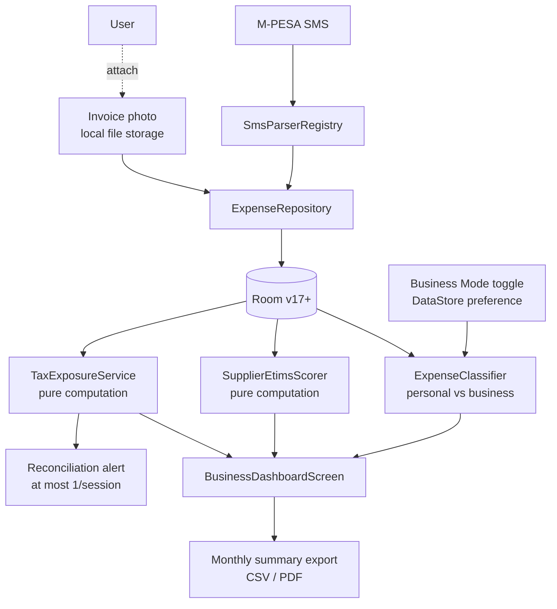

# SME Tax-Readiness Plan (Business Mode)

> **Status:** Draft — not yet implementation-ready. Requires sign-off on the open decisions in the final section before any code is written.
>
> **Owner:** TBD
>
> **Last updated:** 2026-09-11
>
> **Revision history:**
> - 2026-06-16 — Initial draft (Phases A–G, feature decision filter, open decisions)
> - 2026-09-11 — Added: name-reconciliation rules (§ *Reconciliation Matching Rules*), pro-forma / invoice-before-payment workflows (Phase B), seller-side external-invoice tracking (Phase B.5), monetization / free vs paid split (§ *Monetization*), prerequisites bucket list (§ *Prerequisites Before Phase A*), income-transaction `isBusiness` mirror flag, `RecipientMappingEntity.kra_pin` headroom in Phase A. Room version references bumped from v17 to v19 to reflect current schema (v18 in production).

---

## Premise

KRA's 2026 changes turn one mundane fact about PesaTrack into a strategic asset: **the app already sees every M-PESA shilling an SME moves, passively, with no data entry.** The new compliance regime is fundamentally a *reconciliation* problem — every outflow either has an eTIMS invoice behind it or it doesn't, and the gap is taxed as profit. PesaTrack starts with one side of that reconciliation already complete.

This plan defines a **Business Mode** layered into the existing app (not a separate fork) that turns PesaTrack into the **tax-exposure dashboard for M-PESA-first SMEs**, without abandoning the personal-finance product.

The single-sentence positioning:

> *"Every M-PESA shilling you spend, tagged as eTIMS-backed or not — so you see your real taxable income before KRA does."*

---

## Background — KRA 2026 SME Tightening

Two distinct policy changes, with very different certainty:

| Change | Effective | Certainty | Implication for PesaTrack |
|---|---|---|---|
| **Mandatory digital expense validation** | Jan 1, 2026 | **Confirmed / in force** | Expenses without an eTIMS invoice (with buyer PIN) are disallowed → added back as profit. Cross-checked via iTax against eTIMS/TIMS, withholding, customs. |
| **Scrap KSh 5M VAT threshold** | 2026 (proposed) | **Proposed only** | Would force all businesses to register for VAT, charge 16%, file monthly by the 20th. Would expand VAT-registered base from ~230K to ~800K. |

**Design rule for this plan:** build for the *confirmed* change first (eTIMS coverage of expenses). Treat the VAT-threshold scenario as Phase D+, gated on the law actually landing. Do not bet the roadmap on a proposal.

### What KRA cross-checks against

- **eTIMS / TIMS invoices** — electronic tax invoices including the buyer's PIN
- **Withholding tax records**
- **Customs import data**

Anything an SME claims as an expense that doesn't appear in one of those three buckets becomes taxable income. KRA's own worked example: an SME with KSh 1M in expenses but only KSh 400K in eTIMS-backed invoices has KSh 600K added back as profit.

---

## Feature Decision Filter

Per [`AGENTS.md`](../AGENTS.md) and [`plans/product-principles.md`](product-principles.md):

| Question | Answer |
|---|---|
| **Which principle does this serve?** | **#1 Awareness before action** (showing SMEs their disallowed-expense exposure they currently can't see); **#5 Honest numbers** (KES X of your spend will be added back as profit unless you fix it); **#6 Local-first** (Phases A–D need no cloud). |
| **What user behavior does it change?** | Awareness → supplier choice → invoice-collection discipline. Saves real money via tax exposure reduction, not via spending less. |
| **What is the honest downside or failure mode?** | (1) Pushes the product into a prosumer/SMB audience with different support expectations. (2) Manual eTIMS flagging is a workflow burden until/unless KRA API integration arrives. (3) Risk of giving inaccurate tax advice if the surfacing copy isn't carefully scoped. |
| **How is success observable to the user?** | The user can answer, by the 20th of each month: *"How much of my M-PESA spend this month is at risk of being disallowed?"* They could not answer this before. |

---

## Mission Alignment

The existing mission — *"build a better spending and investment culture"* — needs a B2B sibling, not a rewrite:

> *"For SME owners: build a better cashflow and compliance culture, so the business keeps more of what it earns."*

Both missions share the same machinery (awareness from passive M-PESA observation) and the same six principles. Business Mode is an audience extension, not a principle exception. Any conflict with a principle (e.g., supplier scores → privacy, eTIMS API → local-first) must be resolved per the existing tiebreaker rules in [`plans/product-principles.md`](product-principles.md).

---

## Scope

### In scope (this plan)

| Phase | Scope | Cloud needed? |
|---|---|---|
| **A** | Business Mode toggle + business category set + personal/business expense classification | No |
| **B** | eTIMS-backed flag per expense (tri-state: backed / pending / none) + invoice photo attachment | No |
| **C** | Supplier eTIMS reliability score (computed locally from history per recipient) | No |
| **D** | Monthly tax-readiness summary (gross M-PESA income, eTIMS-backed expenses, exposure KES) + export | No |
| **E** | Reconciliation alerts (proactive — at most one per session, per principle #2) | No |
| **F** *(conditional)* | VAT-out / VAT-in ledger + monthly VAT position (only if scrap-threshold proposal passes) | No |
| **G** *(future / 2027)* | Direct eTIMS API integration for auto-pulled invoice records | Yes — opt-in |

### Out of scope (deferred or rejected)

| Item | Reason |
|---|---|
| Generating eTIMS invoices from PesaTrack | KRA certification, accounting-software territory. Not our moat. |
| Filing returns directly to iTax | Same as above; legal exposure on incorrect filings. |
| Full general-ledger / double-entry accounting | Adjacent market; would dilute the M-PESA-first focus. |
| Payroll, PAYE, NHIF, NSSF computation | Out of M-PESA scope. |
| Multi-user / accountant collaboration | Requires cloud sync; revisit per [`plans/cloud-sync-playstore-impact.md`](cloud-sync-playstore-impact.md). |
| Specific tax advice / advisory copy | Legal exposure; framed instead as "estimated exposure," with a disclaimer. |
| Separate "PesaTrack Biz" Play listing | Premature — the parser engine is the moat. One codebase, one listing, Business Mode toggle. Revisit at Phase D exit. |

---

## Architecture Overview



**Key architectural commitments:**

- **No new sync.** All scoring, classification, and exposure math is pure computation over existing Room data — follows the `ForecastService` precedent ([`plans/recurring-expense-detection-plan.md`](recurring-expense-detection-plan.md)).
- **Two Room migrations, both additive.** Current schema is v18 ([`PesaTrackDatabase.kt`](../android/app/src/main/java/com/pesatrack/data/local/database/PesaTrackDatabase.kt)). This plan introduces v19 (Phase A: `isBusiness` on `expenses` + `income_transactions`, `kra_pin` headroom on `recipient_category_mappings`) and v20 (Phase B: `etims_status` + `etims_invoice_number` + `buyer_pin_on_invoice` on `expenses`, new `invoice_attachments` table). No destructive migration.
- **Reuse `RecipientMappingRepository`.** Supplier scores key off the same normalized recipient key already used for category mapping. Extended in Phase A with an optional `kraPin` field so all subsequent phases (B invoice attach, C supplier score, G eTIMS pull) write to the same table without further migrations.
- **Reuse `SmsParserStrategy` / `SmsParserRegistry`.** Business Mode does not change parsing; it changes downstream classification and presentation.

---

## Domain Model Changes

### `ExpenseEntity` additions (v18 → v19, additive only)

```kotlin
// new column in Phase A (Room v19), additive / defaulted so v18 data migrates cleanly
@ColumnInfo(name = "is_business") val isBusiness: Boolean = false,
```

### `ExpenseEntity` additions (v19 → v20, Phase B, additive only)

```kotlin
@ColumnInfo(name = "etims_status") val etimsStatus: String = "NONE", // BACKED | PENDING | NONE | NOT_APPLICABLE
@ColumnInfo(name = "etims_invoice_number") val etimsInvoiceNumber: String? = null,
@ColumnInfo(name = "buyer_pin_on_invoice") val buyerPinOnInvoice: String? = null,
@ColumnInfo(name = "payment_state") val paymentState: String = "PAID", // PAID | PENDING_PAYMENT (for pro-forma-first buyer flow, see Phase B)
```

`NOT_APPLICABLE` covers personal expenses, owner drawings, and transfers between own accounts — things that should never count toward business exposure.

#### `isBusiness` vs `isExcluded` contract (**must be resolved before Phase A**)

The existing `isExcluded` flag on [`ExpenseEntity`](../android/app/src/main/java/com/pesatrack/data/local/database/entities/ExpenseEntity.kt) marks pass-through money (inter-account transfers, own-account topups) that should never count in totals. `isBusiness` is orthogonal to it:

| `isBusiness` | `isExcluded` | Meaning | Counts in personal totals? | Counts in business dashboard? |
|:---:|:---:|---|:---:|:---:|
| false | false | Personal discretionary spend | ✅ | ❌ |
| false | true | Personal pass-through (own-account transfer, savings top-up) | ❌ | ❌ |
| true | false | Business expense | ❌ | ✅ |
| true | true | Owner drawings, inter-business-account transfer | ❌ | ❌ |

**Rule for queries:** business dashboard = `WHERE is_business = 1 AND is_excluded = 0`. Personal totals stay unchanged from today. This preserves backward compatibility with every existing analytics query.

### `IncomeTransactionEntity` mirror flag (v18 → v19, additive only)

Business income (turnover) must be separable from personal income (salary, gifts). Same migration as the expense flag:

```kotlin
@ColumnInfo(name = "is_business") val isBusiness: Boolean = false,
```

Why in the same migration: v17/v18 already added `income_transactions` and `income_sender_rules`. Deferring the `isBusiness` flag on income until Phase D would force a second migration on the same table. Cheaper to ship both sides at once.

### `RecipientCategoryMappingEntity` extension (v18 → v19, additive only)

Add headroom for the KRA-PIN anchor that Phases B (invoice attach), C (supplier score), and G (eTIMS pull) all depend on. Adding it now means one migration, not three.

```kotlin
@ColumnInfo(name = "kra_pin") val kraPin: String? = null,
@ColumnInfo(name = "kra_pin_confidence") val kraPinConfidence: Float? = null, // 0.0–1.0; null = never learned
@ColumnInfo(name = "kra_pin_learned_from_txn_id") val kraPinLearnedFromTxnId: Long? = null,
```

Phase A does not populate these columns — they exist as headroom. Phase B is the first to write to them (from user-attached invoices). Phase G auto-populates them from eTIMS pulls.

### New: `InvoiceAttachmentEntity` (Phase B, v20)

```kotlin
@Entity(
    tableName = "invoice_attachments",
    foreignKeys = [ForeignKey(
        entity = ExpenseEntity::class,
        parentColumns = ["id"],
        childColumns = ["expense_id"],
        onDelete = ForeignKey.CASCADE
    )]
)
data class InvoiceAttachmentEntity(
    @PrimaryKey(autoGenerate = true) val id: Long = 0,
    @ColumnInfo(name = "expense_id", index = true) val expenseId: Long,
    @ColumnInfo(name = "file_path") val filePath: String,        // app-private storage
    @ColumnInfo(name = "captured_at") val capturedAt: Long,
    @ColumnInfo(name = "ocr_invoice_number") val ocrInvoiceNumber: String? = null,
    @ColumnInfo(name = "ocr_total") val ocrTotal: Double? = null
)
```

Images live in app-private storage (`context.filesDir`). They never leave the device unless the user explicitly exports them.

### New: `SupplierEtimsProfile` (in-memory, computed)

Not persisted. Computed on demand by `SupplierEtimsScorer` from `ExpenseDao` + `InvoiceAttachmentDao`. Keyed by `RecipientMappingRepository.normalizeRecipientKey(...)`.

```kotlin
data class SupplierEtimsProfile(
    val recipientKey: String,
    val displayName: String,
    val txnCount: Int,
    val backedCount: Int,
    val coverageRate: Float,       // backedCount / txnCount
    val totalSpend: Double,
    val exposedSpend: Double,      // sum where etimsStatus != BACKED && isBusiness
    val confidence: Confidence     // LOW (<5 txns), MEDIUM (5–14), HIGH (15+)
)
```

### New: `MonthlyTaxReadinessSummary` (in-memory, computed)

```kotlin
data class MonthlyTaxReadinessSummary(
    val periodStart: LocalDate,
    val periodEnd: LocalDate,
    val grossIncome: Double,               // sum of business inflows
    val totalBusinessExpenses: Double,
    val etimsBackedExpenses: Double,
    val pendingExpenses: Double,
    val unbackedExposure: Double,          // the "added back as profit" number
    val estimatedTaxableIncome: Double,    // gross - backed - pending(optimistic) OR gross - backed (conservative)
    val assumptions: List<String>          // per principle #5 — never show a number without its assumptions
)
```

---

## Phased Rollout

### Phase A — Business Mode foundation

**Goal:** User can toggle Business Mode and classify expenses as personal vs business.

- Add Business Mode toggle to Settings, under a new **Business Mode** section (sets the parent surface for Phase B–G settings to nest inside). Persisted in DataStore as `business_mode_enabled_at` (nullable Long — null = never enabled).
- Room v19 migration: add `isBusiness` on `expenses` and `income_transactions`, add `kra_pin` headroom on `recipient_category_mappings`. All additive, no destructive changes.
- Add "Mark as business" / "Mark as personal" action on expense detail. Same for income transactions.
- Add a quick-classify prompt on Home for the most recent N unclassified business candidates (heuristic: paid to a paybill/till, or recipient already classified as business in past).
- New business category set under **reserved group ID 20** (`Business`), sub-IDs 2001–2006: `Cost of Goods Sold` (2001), `Operating Expenses` (2002), `Capital / Equipment` (2003), `Owner Drawings` (2004), `Loan Repayment (Business)` (2005), `Inter-account Transfer` (2006). Coexist with personal categories; classification chooses which set is shown. Owner Drawings and Inter-account Transfer are seeded with `isExcluded = true` by default per the orthogonality contract above.
- Adoption counters (per Stage 1 pattern in [`plans/business-transition-plan.md`](business-transition-plan.md)): reserve `AppPreferences` keys `count_business_classifications`, `count_personal_classifications`, `count_business_dashboard_opens`. Directional only; never transmitted.

**Exit criteria:** A user can turn on Business Mode, classify 20 recent expenses (any mix of expense + income), and see a "Business spend this month: KES X" tile on Home.

---

### Phase B — eTIMS flag + invoice attach + pro-forma workflow

**Goal:** Every business expense has an eTIMS status the user can change in one tap; user can attach an invoice photo; user can capture a supplier's pro-forma invoice **before** paying it, so reconciliation is done at the moment the M-PESA outflow arrives.

- Room v20 migration: add `etimsStatus`, `etimsInvoiceNumber`, `buyerPinOnInvoice`, `paymentState` on `expenses`; add new `invoice_attachments` table.
- Expense detail screen: tri-state chip (Backed / Pending / None) + "Attach invoice" button (camera + gallery).
- Default new business expenses to `PENDING` eTIMS status (sets the right urgency without overclaiming).
- No OCR in this phase — `ocrInvoiceNumber` / `ocrTotal` columns stay null. They exist so Phase G can backfill without a migration.

#### Buyer-side pro-forma workflow (the ideal reconciliation path)

This is a common Kenyan B2B pattern: the buyer receives a pro-forma invoice, then pays via M-PESA days later. Instead of reconciling after the fact:

1. User opens a new **"Capture invoice → pay later"** entry point from the Business Mode home tile.
2. User captures the pro-forma (photo + amount + supplier PIN + invoice number + expected pay-by date).
3. A pending `ExpenseEntity` is written with `paymentState = PENDING_PAYMENT`, `isBusiness = true`, `etimsStatus = BACKED` (invoice already in hand), `amount = <captured>`, `timestamp = <expected pay date>`.
4. When the corresponding M-PESA outflow arrives, `SmsReceiver` → matcher auto-links it to the pending expense using the rules in § *Reconciliation Matching Rules* below. State flips to `PAID`; the SMS-parsed row is merged, not duplicated.
5. If no match arrives within N days after `expected pay date`, the entry surfaces as "invoice captured but never paid — was this cancelled?" One-tap to delete or keep as receivable follow-up.

This path is preferred in copy ("capture the invoice, then pay") because it eliminates the manual-flagging fatigue risk that Phase C otherwise carries.

**Exit criteria:** User can (a) flag any business expense as Backed/Pending/None and attach a photo, (b) capture a pro-forma before paying and see it auto-link to the M-PESA outflow when it arrives.

---

### Phase B.5 — Seller-side external-invoice tracking (optional, opt-in)

**Goal:** The user is the *seller*. A customer needs an invoice before paying. The user issues it externally (via KRA's free eTIMS Lite, or their existing accounting tool) and wants PesaTrack to track collection.

PesaTrack does **not** issue the eTIMS invoice — that would cross into seller-side eTIMS integrator territory (see Phase G notes on certification scope). Instead:

1. User records "Invoice issued externally" from a new **"I invoiced someone…"** entry point: amount, buyer PIN (optional), expected payment date, optional photo of the invoice PDF/screenshot, optional eTIMS control number.
2. A pending `IncomeTransactionEntity` is written with a new `collectionState = AWAITING_PAYMENT`, `isBusiness = true`, `source = MANUAL_INVOICE`.
3. When the corresponding M-PESA inflow arrives, the matcher auto-links using the same rules as Phase B (§ *Reconciliation Matching Rules*). State flips to `COLLECTED`.
4. Receivables tile on Business Mode home: "KES X owed by 3 customers, oldest 18 days."

**Why this stays in our lane:** we are tracking a fact the SME already lived through (issued an invoice, awaiting payment). We are not becoming a fiscal device. Zero KRA API calls, zero certification.

**Exit criteria:** User can log an issued invoice and see it auto-collect when payment arrives; a Receivables tile summarises outstanding invoices.

**Explicitly out of scope for Phase B.5** (candidates for a future dedicated plan, not this one): drafting a pro-forma inside PesaTrack, generating fiscal eTIMS invoices, competing with eTIMS Lite. See the discussion in Phase G below on why full seller-side issuance is a different product commitment.

---

### Phase C — Supplier reliability score

**Goal:** When the user pays a supplier, PesaTrack already knows whether that supplier has historically delivered eTIMS invoices.

- Implement `SupplierEtimsScorer` (pure computation over existing data).
- On expense detail, surface the supplier's `coverageRate` + `confidence`. Example: *"This supplier has provided eTIMS invoices for 2 of your last 8 payments (25%, medium confidence)."*
- New Suppliers screen (gated behind Business Mode): list suppliers by `exposedSpend` desc, with the same coverage stat.
- **Nudge copy** (per principle #2 — at most one per session): *"You've paid Mama Ndizi KES 18,400 over 6 transactions without an eTIMS invoice. Consider requesting one or switching suppliers."* Dismissible, never modal.

#### Reconciliation Matching Rules (shared by Phase B, B.5, C, D, G)

This is the operational core of Business Mode. Merchant names from KRA (legal name on PIN registration) rarely equal the recipient string from M-PESA SMS (trading name or paybill descriptor). Names are the **wrong anchor** to match on.

**Matching keys, in priority order:**

| Priority | Key | Notes |
|:---:|---|---|
| **1** | **Amount + date window** (± 3 days, ± transaction fee) | Primary. Numbers don't lie. Resolves ~80% of matches unambiguously. Transaction-fee tolerance leverages the existing cat-606 sibling-row extraction (match on base amount excluding the cat-606 sibling, not the raw M-PESA total). |
| **2** | **Supplier KRA PIN** (once learned) | Legally unique. Stored in the `kra_pin` column on `RecipientCategoryMappingEntity` (added in Phase A). |
| **3** | **M-PESA identity anchor** — paybill number, till number, or phone number | Unique inside M-PESA. Reuses the existing `RecipientMappingRepository.normalizeRecipientKey` + `composePaybillKey` machinery. |
| **4** | Normalized merchant name (fuzzy: Jaro-Winkler / 4-gram) | **Fallback only.** Never a primary key. Used only to confirm a candidate match already suggested by keys 1–3. |

**Learning loop (runs on first match per supplier):**

1. First encounter — user pays *KWALITY LTD* on paybill `123456` for KES 4,300. No PIN mapping yet.
2. Auto-attempt (Phase B: from attached invoice photo the user captured; Phase G: from eTIMS pull). Candidate found: seller = *KWALITY DISTRIBUTORS LIMITED, PIN P051234567X*, total = KES 4,300, date = today.
3. **User confirms once** — dialog: *"Is KWALITY DISTRIBUTORS LIMITED (P051234567X) the same supplier as KWALITY LTD on paybill 123456?"*. One tap. This is the only human step, and it happens once per supplier per lifetime.
4. On confirm, write the mapping: `RecipientCategoryMappingEntity(kraPin = "P051234567X", kraPinConfidence = 1.0f, kraPinLearnedFromTxnId = <txnId>)`.
5. From now on every M-PESA payment to that paybill inherits the PIN; every KRA record for that PIN is a candidate match for future payments.

**Auto-confirm heuristic (skip step 3):**

If **all** of the following hold, mark the mapping as auto-learned (`kraPinConfidence = 0.9f`) and skip the user dialog:

- Amount + date match is exact (not within tolerance)
- The M-PESA recipient string contains at least one 4-gram of the eTIMS supplier name
- No existing conflicting mapping for the same M-PESA key

Always show the auto-learned mapping in a **"Recently auto-matched (tap to review)"** section on the Business Mode home tile for the first N such matches, honouring principle #5 (never hide numbers, let the user audit).

**Edge cases (documented once here so every phase inherits the answer):**

| Edge case | Handling |
|---|---|
| Same supplier, multiple M-PESA channels (paybill + till + phone number for one shop) | `RecipientCategoryMappingEntity` becomes a **set of M-PESA keys → one PIN**, not 1:1. Each channel row carries its own `kraPin` column with the same value. |
| Shared paybill (property manager, aggregator, banking-as-a-service) — one paybill fronts many taxpayers | Cannot map 1:1. Fall back to per-invoice user confirmation. Flag the paybill as `isShared = true` (new nullable column on the mapping table — defer to Phase C) so auto-confirm never fires. |
| Invoice amount ≠ M-PESA amount because of transaction fees | Match on **base amount excluding the cat-606 sibling** written by the existing parser. Never on raw M-PESA total. |
| Partial payments / installments | Track cumulative paid vs invoice total. Show "KES 12,000 of KES 30,000 paid." Requires no schema change beyond linking multiple `ExpenseEntity` rows to the same invoice attachment. |
| Multiple invoices bundled into one payment | Sum of invoice totals to same PIN within the date window == one M-PESA payment. Same amount-anchored logic. |
| Invoice arrives at eTIMS **after** the M-PESA payment (very common) | Payment starts `etimsStatus = PENDING`. Nightly eTIMS pull (Phase G) resolves it. In Phase B–F, user updates manually. |
| Trading name ≠ legal name (near-universal) | Store both. Display the trading name in UI (what the user recognises). Store the legal name + PIN for reconciliation. |
| Two different suppliers with genuinely similar names | The PIN is the disambiguator. Never collapse on name alone. If two paybills map to two different PINs, keep them separate. |
| Manual expenses (typed name, no paybill/till) | Cannot auto-map. User must associate a supplier record manually. Once done, cached like any other. |

**The one rule to hold onto:**

> Never reconcile on names. Names are display strings. Reconcile on amounts, dates, PINs, and M-PESA identifiers. Names exist to help the human confirm the mapping once, and then they get out of the way.

**Exit criteria:** Suppliers screen lists top exposed suppliers; supplier stat appears on expense detail; reconciliation matcher passes an instrumented-test corpus covering the edge cases above.

---

### Phase D — Monthly tax-readiness summary + export

**Goal:** One screen the SME owner can open on the 19th of every month and know where they stand.

- Implement `TaxExposureService` producing `MonthlyTaxReadinessSummary`.
- New `BusinessDashboardScreen`: this month + last month + 12-month trend.
- **Honest numbers presentation** (per principle #5): every number on the dashboard has its assumption visible — *"Estimated taxable income assumes pending invoices won't materialize. Toggle to optimistic view."*
- Export: CSV (machine-friendly for accountants) + PDF (printable). Exports are user-initiated, written to Downloads via `ACTION_CREATE_DOCUMENT`. Nothing transmitted.
- Disclaimer: *"This is an estimate based on your M-PESA records and the eTIMS status you've recorded. It is not tax advice. Verify with your accountant before filing."*

**Exit criteria:** User can open the dashboard, see this month's exposure, and export a summary for their accountant.

---

### Phase E — Reconciliation alerts

**Goal:** Proactively warn the user *before* the 20th about gaps they can still fix.

- WorkManager job, daily at a user-configurable hour, between the 10th and the 19th of each month.
- Triggers one notification if **all** of:
  - Business Mode is on
  - `unbackedExposure` for the current month exceeds a user-configurable threshold (default: KES 10,000)
  - No reconciliation alert has fired in the last 72 hours
- Copy: factual, no fear framing. *"As of today, KES 42,300 of this month's business expenses don't have eTIMS invoices attached. Tap to review."*
- Honors the notification channel from [`plans/recurring-expense-detection-plan.md`](recurring-expense-detection-plan.md) (`alerts` channel, low importance).

**Exit criteria:** Alert fires correctly in instrumented test; respects throttling; respects Business Mode toggle.

---

### Phase F — VAT ledger *(conditional on threshold scrap landing)*

**Do not start until the law passes.** Spec deferred to a follow-up plan. Outline only:

- Per-expense `vatAmount` and `vatRate` (additive columns).
- Per-income `outputVat` derivation when the SME issues an eTIMS invoice.
- Monthly VAT position: `outputVat - claimableInputVat`, where `claimableInputVat` only counts `etimsStatus == BACKED` expenses.
- Surface on dashboard alongside taxable income.

---

### Phase G — eTIMS API integration *(2027 target)*

**Do not start until at least Phase E is in production and KRA's eTIMS developer program is stable enough for a third-party app to certify.**

#### Scope

- Opt-in cloud bridge — user enters their KRA PIN + eTIMS credentials; PesaTrack queries the eTIMS API for invoices issued against their PIN.
- Auto-match returned invoices to existing M-PESA expenses using the rules in § *Reconciliation Matching Rules* (Phase C). Flip `etimsStatus` to `BACKED` automatically and populate `RecipientCategoryMappingEntity.kraPin` where missing.
- Crosses the local-first line — requires explicit, revocable consent UI per principle #4, scoped to eTIMS data only. INTERNET permission added, but disabled at manifest level until the user opts in (see [`plans/cloud-sync-playstore-impact.md`](cloud-sync-playstore-impact.md) for the Play Store implications).

#### What Phase G is *not* — the buyer-side / seller-side distinction

The eTIMS OSCU/VSCU is a **single API** that exposes both read and write endpoints. One integrator agreement covers both. Phase G is scoped to **buyer-side read only** (`selectTrnsPurchaseSalesList`, `selectItemClassList`, `selectCodeList`, `selectBhfList`).

Seller-side write endpoints (`saveSaleInvoice`, `saveItem`, `saveStockMaster`, `saveCreditNote`, refund/void) are **explicitly out of scope** for Phase G, and likely for this entire plan. Not because a different API opens up, but because the certification scope, liability, and product identity all change dramatically:

| Dimension | Buyer-side read (Phase G) | Seller-side write (out of scope) |
|---|---|---|
| Endpoints touched | 4–5 read | ~15 including item master, stock, credit notes, refunds, voids |
| Certification depth | KRA verifies correct display of read data | KRA verifies full fiscal flow: HS-code classification, inventory adjustments, credit-note issuance, refund handling, cross-branch, void handling, offline queueing |
| Legal exposure | Read-only — worst case is a wrong dashboard | Every emitted invoice is a **fiscal document**. Double-issuance, wrong VAT, wrong HS code = a real tax event PesaTrack is on the hook for |
| Competitor set | Nobody else is doing passive M-PESA buyer-side reconciliation | Direct competition with **free eTIMS Lite**, Zoho, QuickBooks, Sage, 20+ local ERPs |
| Product identity | Extends the "passive M-PESA observer" wedge | Forces users to enter items, prices, tax classes — becomes an accounting app |

Where seller-side pre-payment invoice flows matter to our users, we handle them via Phase B.5 (external-invoice tracking) rather than by becoming an eTIMS integrator on the sales side.

#### Access process

1. Written integration request to `etims@kra.go.ke` with company profile + technical architecture + target user base.
2. Sandbox credentials + integrator documentation issued.
3. Build + test against `https://etims-api-sbx.kra.go.ke/etims-api/...`.
4. UAT session with KRA integration officers.
5. Production certification + signed integrator agreement.

**Recommended immediate action** (does not require Phase A–F to be complete): file the written inquiry now to start the ~30–90-day access clock, so credentials are available when Phase G opens.

---

## UX & Copy Guidelines (Business Mode specific)

All copy must still satisfy the rules in [`AGENTS.md`](../AGENTS.md) under "Copy & UX Writing Guidelines." Additional rules for Business Mode:

- **Never imply legal/tax advice.** Use "estimated exposure," "your records suggest," "consider verifying with your accountant."
- **Always show the assumption next to the number.** *"Estimated taxable income (assumes pending invoices won't be validated): KES 412,000."*
- **Disclaim once per surface,** not on every number — but never zero times.
- **Frame in opportunity, not fear** (principle #2): *"KES 84,300 in invoices to chase before the 20th"* — not *"You're about to lose KES 84,300."*
- **No streaks, no badges, no gamification.** Especially not for "transactions reconciled" — that's the wrong incentive.
- **Currency:** KES with thousands separators, no decimals for tax/exposure numbers.

---

## Privacy & Trust Considerations

Business Mode does not change PesaTrack's foundational privacy posture for Phases A–F:

| Concern | Mitigation |
|---|---|
| Supplier scores could be leaked | Computed in memory, never persisted as a score; persisted only as raw eTIMS flags per expense. |
| Invoice photos contain PII (PINs, names) | Stored in app-private storage (`filesDir`), no MediaStore exposure, only exported on explicit user action. |
| KRA PIN entered for Phase G | Stored encrypted via `EncryptedSharedPreferences`; revocable from Settings; never transmitted except to KRA's official eTIMS endpoint. |
| Backup/restore | Invoice photos included in user-initiated backups only (per existing [`plans/database-backup-restore-plan.md`](database-backup-restore-plan.md) pattern). |
| Privacy policy | Must be updated before Phase B ships — declares local invoice-image storage. Before Phase G ships — declares optional KRA API connection. |

---

## Monetization — Free / Paid Split

### Governing rule

**Never paywall awareness. Always paywall action, automation, deliverables, and integrations.** This is the single principle that keeps Business Mode from violating principle #1 (awareness before action) from [`AGENTS.md`](../AGENTS.md).

| Type of value | Free / Paid | Why |
|---|---|---|
| Seeing a truth about the SME's money they didn't know | **Free** | Principle #1. Also the demo. |
| Deliverables someone else consumes (accountant CSV, PDF report) | **Paid** | Substitution value against accountant fees (KES 5,000+/month) |
| Proactive automation (alerts, reminders, auto-verification) | **Paid** | Ongoing compute + support cost |
| External integration with real operating cost (eTIMS API, KRA PIN lookup) | **Paid, higher tier** | Integrator agreement + opt-in cloud proxy |
| Storage-bounded features (invoice photos beyond N) | **Free tier + paid ceiling** | Bounded by real backup / device cost |

### Phase-by-phase free / paid split

| Phase | Feature | Free / Paid | Why |
|---|---|:---:|---|
| A | Toggle + business/personal classification + Home tile | **Free** | The toggle *is* the awareness surface. Paywalling it kills adoption and referral. |
| B | eTIMS status flag (Backed/Pending/None) | **Free** | Classification, not a service. |
| B | Invoice photo attach | **Free** first 20/month, **Paid** unlimited | Photo storage has real (small) cost. 20 covers a typical small SME. |
| B.5 | External-invoice tracking + Receivables tile | **Free** view; **Paid** Receivables aging PDF export | Awareness stays free; the deliverable is paid. |
| C | Supplier eTIMS coverage score (view) | **Free** | Awareness. This is the moment the user decides the app is worth paying for. |
| D | Business dashboard (headline exposure number) | **Free** | *The* number that justifies the whole product. |
| D | **Accountant-ready CSV + PDF export** | **Paid** | The deliverable. First revenue moment in the plan. |
| E | Reconciliation alerts before the 20th | **Paid** | Proactive automation. |
| F | VAT ledger | **Paid** | High substitution value; complex monthly. |
| G | eTIMS API auto-verification | **Paid, higher tier** | Only phase with real operating cost. |

### Recommended tier structure

Not a merger into the existing single Pro tier from [`plans/pro-launch-plan.md`](pro-launch-plan.md). Two new SKUs alongside the existing Pro:

| Tier | Persona | Monthly | Annual | Unlocks |
|---|---|---:|---:|---|
| Free | Everyone | KES 0 | KES 0 | Everything today + Business Mode toggle + classification + supplier score + exposure dashboard + 20 invoice photos/month |
| Pro *(existing)* | Salaried "NGO Mary" from [`plans/target-customer.md`](target-customer.md) | KES 149 | KES 999 | Personal insights, recommendations, custom date ranges, unlimited rules, PDF personal report, unlimited personal invoice photos |
| **Pro Business** *(new)* | SME owner | **KES 499** | **KES 4,999** | Everything in Pro **plus** accountant-ready monthly export (CSV+PDF), reconciliation alerts, unlimited business invoice photos, Receivables PDF export, Business Mode PDF report |
| **Pro Business + eTIMS** *(2027, Phase G)* | SME owner ready to auto-verify | **KES 999** | **KES 9,999** | Above + eTIMS API auto-verification |

Pro Business at ~3× personal Pro reflects that the SME buyer's comparison is KES 5,000+/month accountant fees, not Spotify. eTIMS is a separate SKU (not an add-on) because its cost floor is real — if it doesn't sell we don't lose money on the base Business tier.

### Sequencing — do not paywall on day 1

Even with the split above, launch Phase A entirely free for the first 3–6 months.

1. **Adoption data before paywall design.** Same Stage-2 fake-door pattern as [`plans/business-transition-plan.md`](business-transition-plan.md).
2. **The paywall lives at Phase D.** Everything before D is awareness infrastructure with no deliverable to charge for.
3. **Free Phase A is the referral engine.** SME owner tells another SME owner "this shows me my KRA exposure" — a paywall there kills that.
4. **Never retro-paywall.** Users who classified 200 transactions expecting free will churn hard if Phase D flips the export to paid retroactively. Better: the paywall exists from the moment the paid feature ships (Phase D), never earlier, never later.

Concrete revenue plan:

```
Phase A + B         : ship free                                 → learn adoption
Phase C             : ship free                                 → learn supplier-score engagement
Phase D dashboard   : ship free                                 → learn dashboard opens/session
Phase D export      : ship as Pro Business paid feature         → first monetization moment
Phase E alerts      : ship as Pro Business                      → confirms subscription retention
```

### Anti-patterns — do not ship any of these

1. **Paywalling the exposure number** — "Upgrade to see how much of your spend is at risk of being disallowed" is dark-pattern framing forbidden by principle #2.
2. **Categorization limits** — "only 10 business expenses/month free" punishes the exact behaviour we want.
3. **Paywalling the toggle itself** — same failure mode as putting the pricing page behind a login wall.

---

## Risks & Open Questions

1. **Audience drift.** Personal-finance reviewers and SME owners want different things from the Play Store listing. Decision: do we update the existing listing to call out Business Mode, or wait until Phase D? *Recommendation: wait until D — until the dashboard ships, the value isn't legible from a screenshot.*
2. **Manual flagging fatigue.** If most SMEs don't have invoices for most cash-paid suppliers, the app risks becoming a list of red flags. Mitigation: pair every exposure number with a supplier-level action, not a per-transaction nag.
3. **VAT proposal volatility.** Building Phase F prematurely is the largest waste-risk in this plan. Hard gate: do not start F until the bill is enacted and the threshold-scrap is in the final Finance Act.
4. **eTIMS for small suppliers.** Many genuine SME suppliers (mama-mboga, boda riders) cannot realistically issue eTIMS invoices. The app should not shame the user for this — it's a structural issue. Possibly add a "supplier cannot provide eTIMS" classification that surfaces honestly in the summary as a separate line item.
5. **Tax accuracy liability.** Even with disclaimers, an incorrect exposure number could mislead a user. Mitigation: conservative defaults (treat `PENDING` as unbacked in the headline number, with an "optimistic view" toggle).
6. **Mission doc update.** [`plans/product-principles.md`](product-principles.md) currently frames mission around individuals. Needs an additive B2B sibling paragraph — see "Mission Alignment" above. Should be a separate PR before Phase A code lands.

---

## Success Criteria

By end of Phase D, a Business Mode user can answer all of the following without leaving PesaTrack:

1. *How much did my business spend this month via M-PESA?*
2. *How much of that has an eTIMS invoice behind it?*
3. *Which suppliers are most responsible for my exposure?*
4. *What's my estimated taxable income if I file today?*
5. *What do I need to chase before the 20th?*

By end of Phase E, the app proactively reminds them of (5) at most once per cycle, factually, in line with principle #2.

By end of Phase G *(conditional, 2027)*, answers (2)–(4) update automatically when the user's suppliers issue eTIMS invoices.

---

## Prerequisites Before Phase A

Three buckets. "Shipped" means merged to `main`; "decided" means written into this plan.

### Bucket 1 — Decisions to write into this document

Engineering blockers unless resolved. See expanded *Decisions Required Before Implementation* table below — items **8–13** are the ones added by the 2026-09-11 revision.

### Bucket 2 — Docs / policy / website ships (one PR before Phase A branches)

Per [`AGENTS.md`](../AGENTS.md) and the Website Sync Check rules in [`plans/website-full-plan.md`](website-full-plan.md).

| Ship | File(s) | Why it blocks Phase A |
|---|---|---|
| B2B mission sibling paragraph | [`plans/product-principles.md`](product-principles.md) | Decision 5 default. Without it, Business Mode has no principled anchor and every subsequent PR has to defend it from scratch. |
| Privacy-policy delta (draft, publish with Phase A release) | [`docs/privacy-policy.html`](../docs/privacy-policy.html) | Phase A changes what's collected (classification flags). Phase B is a bigger delta; draft that too. |
| Website `/features` stub or roadmap entry | [`website/src/content/features/`](../website/src/content/features/), [`website/src/pages/factsheet.json.ts`](../website/src/pages/factsheet.json.ts) | AGENTS.md trigger table row: "New screen or major feature." |
| [`_docs/implementation-status.md`](../_docs/implementation-status.md) — new row for Business Mode | Implementation-status | Repo rule from AGENTS.md — every feature updates this before task complete. |
| Kiswahili mirror check for `/privacy` (and any other of the four mirrored pages that changed) | [`website/src/pages/sw/`](../website/src/pages/sw/) | AGENTS.md website-sync checklist. |

### Bucket 3 — Code prerequisites

Already in place:

- ✅ Room migration framework, additive-only convention (17 prior migrations at [`PesaTrackDatabase.kt`](../android/app/src/main/java/com/pesatrack/data/local/database/PesaTrackDatabase.kt))
- ✅ `isExcluded` pass-through pattern on [`ExpenseEntity.kt`](../android/app/src/main/java/com/pesatrack/data/local/database/entities/ExpenseEntity.kt) (proves additive-Boolean migration works)
- ✅ `RecipientMappingRepository` with normalized keys + composite paybill keys ([`RecipientMappingRepository.kt`](../android/app/src/main/java/com/pesatrack/data/repository/RecipientMappingRepository.kt))
- ✅ Category hierarchy with `isDefault` + `isGroup` ([`CategoryEntity.kt`](../android/app/src/main/java/com/pesatrack/data/local/database/entities/CategoryEntity.kt))
- ✅ `income_transactions` table (v17)
- ✅ `AppPreferences` DataStore — Business Mode toggle host, no new mechanism needed
- ✅ Settings screen — toggle host exists
- ✅ Stage 1 local-instrumentation pattern to reuse for adoption counters

Gaps to close **before** Phase A code starts:

| Gap | Fix | Why block Phase A |
|---|---|---|
| Room migration test coverage on `expenses` | Instrumented test that walks v16 → v17 → v18 with representative data | `expenses` is the hot table. v19 (Phase A) + v20 (Phase B) means two migrations in a row; catch mistakes before they ship. |
| Migration test coverage on `income_transactions` | Similar walk of the v17 → v18 baseline | Phase A adds `isBusiness` here too — same test-harness need. |

**Not blockers, do not conflate:** eTIMS API access, INTERNET permission, invoice photo storage, new Play Store listing, cloud backend, Pro pricing rework. All of these are downstream of Phase D or Phase G.

### Suggested order

```
Week 0     : Bucket 1 decisions written into this plan            (1 PR, docs)
Week 0     : Bucket 2 principles + privacy delta + status + web   (1 PR, docs/site)
Week 0–1   : Bucket 3 gap fixes — migration tests                  (1–2 small PRs)
Week 1+    : Phase A code (v19 migration + toggle + business seed) (feature PR)
```

---

## Decisions Required Before Implementation

These must be resolved (by the owner, in writing in this doc or a successor) before any Phase A code is written. Items 8–13 added by the 2026-09-11 revision.

| # | Decision | Default if not decided |
|---|---|---|
| 1 | Single codebase with Business Mode toggle, or separate `PesaTrack Biz` Play listing? | Single codebase, toggle (current plan assumption) |
| 2 | Phase A category set — use the 6 above, or expand? | The 6 above; expand based on user feedback |
| 3 | `PENDING` counted as backed (optimistic) or unbacked (conservative) in headline exposure? | **Unbacked** (conservative; principle #5) |
| 4 | Reconciliation alert default threshold | KES 10,000 |
| 5 | Mission doc — add B2B sibling paragraph now, or after Phase A ships? | **Now** (sequencing risk if principles drift) |
| 6 | Phase F (VAT) — hard-gated on Finance Act enactment, or speculative build allowed? | **Hard-gated** |
| 7 | Phase G (eTIMS API) — owner-built, or partner with an existing eTIMS aggregator? | Decide at Phase D exit, not before |
| 8 | `isBusiness` vs `isExcluded` semantic contract | **Orthogonal** — business dashboard queries `WHERE is_business = 1 AND is_excluded = 0`; Owner Drawings and Inter-account Transfer seeded with both flags true |
| 9 | Does `income_transactions` get `isBusiness` in the same Phase A migration? | **Yes** — mirror the flag in v19, avoid a second migration on the hot income path |
| 10 | Category ID range for the business group | **Group 20**, sub-IDs 2001–2006 (currently unused, safely above default 1899 ceiling) |
| 11 | Onboarding branching for Business Mode | **Settings-only in Phase A**. Onboarding fork is a separate testable change, not a Phase A blocker |
| 12 | Business Mode UI placement | New **Business Mode** section in Settings — empty until enabled; sets precedent for Phase B–G settings to nest inside |
| 13 | Add `kra_pin` headroom to `RecipientCategoryMappingEntity` in Phase A even though it's not populated until Phase B? | **Yes** — one migration instead of three across Phases B/C/G |
| 14 | First revenue moment | **Phase D export** — not earlier. Phases A–C ship free. See § *Monetization*. |
| 15 | New Pro tier structure | **Two new SKUs**: Pro Business (KES 499/mo, 4,999/yr) and Pro Business + eTIMS (KES 999/mo, 9,999/yr) — do not fold into existing Pro |

---

## References

- [`AGENTS.md`](../AGENTS.md) — Mission, principles, feature decision filter
- [`plans/product-principles.md`](product-principles.md) — Long-form principles
- [`plans/business-transition-plan.md`](business-transition-plan.md) — Existing roadmap (this plan slots into Stage 6: Expansion, or sooner as a parallel track); Stage-2 fake-door pattern for Phase A launch
- [`plans/pro-launch-plan.md`](pro-launch-plan.md) — Existing Pro tier; new Pro Business SKUs sit alongside, not inside it
- [`plans/target-customer.md`](target-customer.md) — Persona anchor for pricing decisions
- [`plans/cloud-sync-playstore-impact.md`](cloud-sync-playstore-impact.md) — Constraints if Phase G needs cloud
- [`plans/recurring-expense-detection-plan.md`](recurring-expense-detection-plan.md) — Architectural precedent for "no new tables, pure computation"
- [`plans/database-backup-restore-plan.md`](database-backup-restore-plan.md) — Backup/restore pattern to extend for invoice attachments
- [`plans/website-full-plan.md`](website-full-plan.md) — Website Sync Check trigger table for Bucket 2
- KRA mandatory digital validation guidance (effective Jan 1, 2026)
- KRA VAT reform proposal (2026)
- KRA eTIMS integrator contact: `etims@kra.go.ke` (sandbox at `https://etims-api-sbx.kra.go.ke/etims-api/`, production at `https://etims-api.kra.go.ke/etims-api/`)
