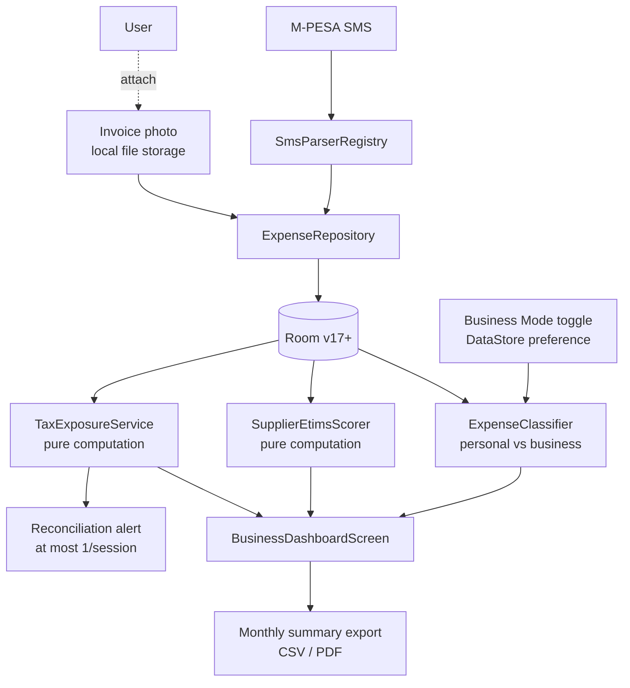

# SME Tax-Readiness Plan (Business Mode)

> **Status:** Draft — not yet implementation-ready. Requires sign-off on the open decisions in the final section before any code is written.
>
> **Owner:** TBD
>
> **Last updated:** 2026-06-16

---

## Premise

KRA's 2026 changes turn one mundane fact about PesaTrack into a strategic asset: **the app already sees every M-PESA shilling an SME moves, passively, with no data entry.** The new compliance regime is fundamentally a *reconciliation* problem — every outflow either has an eTIMS invoice behind it or it doesn't, and the gap is taxed as profit. PesaTrack starts with one side of that reconciliation already complete.

This plan defines a **Business Mode** layered into the existing app (not a separate fork) that turns PesaTrack into the **tax-exposure dashboard for M-PESA-first SMEs**, without abandoning the personal-finance product.

The single-sentence positioning:

> *"Every M-PESA shilling you spend, tagged as eTIMS-backed or not — so you see your real taxable income before KRA does."*

---

## Background — KRA 2026 SME Tightening

Two distinct policy changes, with very different certainty:

| Change | Effective | Certainty | Implication for PesaTrack |
|---|---|---|---|
| **Mandatory digital expense validation** | Jan 1, 2026 | **Confirmed / in force** | Expenses without an eTIMS invoice (with buyer PIN) are disallowed → added back as profit. Cross-checked via iTax against eTIMS/TIMS, withholding, customs. |
| **Scrap KSh 5M VAT threshold** | 2026 (proposed) | **Proposed only** | Would force all businesses to register for VAT, charge 16%, file monthly by the 20th. Would expand VAT-registered base from ~230K to ~800K. |

**Design rule for this plan:** build for the *confirmed* change first (eTIMS coverage of expenses). Treat the VAT-threshold scenario as Phase D+, gated on the law actually landing. Do not bet the roadmap on a proposal.

### What KRA cross-checks against

- **eTIMS / TIMS invoices** — electronic tax invoices including the buyer's PIN
- **Withholding tax records**
- **Customs import data**

Anything an SME claims as an expense that doesn't appear in one of those three buckets becomes taxable income. KRA's own worked example: an SME with KSh 1M in expenses but only KSh 400K in eTIMS-backed invoices has KSh 600K added back as profit.

---

## Feature Decision Filter

Per [`AGENTS.md`](../AGENTS.md) and [`plans/product-principles.md`](product-principles.md):

| Question | Answer |
|---|---|
| **Which principle does this serve?** | **#1 Awareness before action** (showing SMEs their disallowed-expense exposure they currently can't see); **#5 Honest numbers** (KES X of your spend will be added back as profit unless you fix it); **#6 Local-first** (Phases A–D need no cloud). |
| **What user behavior does it change?** | Awareness → supplier choice → invoice-collection discipline. Saves real money via tax exposure reduction, not via spending less. |
| **What is the honest downside or failure mode?** | (1) Pushes the product into a prosumer/SMB audience with different support expectations. (2) Manual eTIMS flagging is a workflow burden until/unless KRA API integration arrives. (3) Risk of giving inaccurate tax advice if the surfacing copy isn't carefully scoped. |
| **How is success observable to the user?** | The user can answer, by the 20th of each month: *"How much of my M-PESA spend this month is at risk of being disallowed?"* They could not answer this before. |

---

## Mission Alignment

The existing mission — *"build a better spending and investment culture"* — needs a B2B sibling, not a rewrite:

> *"For SME owners: build a better cashflow and compliance culture, so the business keeps more of what it earns."*

Both missions share the same machinery (awareness from passive M-PESA observation) and the same six principles. Business Mode is an audience extension, not a principle exception. Any conflict with a principle (e.g., supplier scores → privacy, eTIMS API → local-first) must be resolved per the existing tiebreaker rules in [`plans/product-principles.md`](product-principles.md).

---

## Scope

### In scope (this plan)

| Phase | Scope | Cloud needed? |
|---|---|---|
| **A** | Business Mode toggle + business category set + personal/business expense classification | No |
| **B** | eTIMS-backed flag per expense (tri-state: backed / pending / none) + invoice photo attachment | No |
| **C** | Supplier eTIMS reliability score (computed locally from history per recipient) | No |
| **D** | Monthly tax-readiness summary (gross M-PESA income, eTIMS-backed expenses, exposure KES) + export | No |
| **E** | Reconciliation alerts (proactive — at most one per session, per principle #2) | No |
| **F** *(conditional)* | VAT-out / VAT-in ledger + monthly VAT position (only if scrap-threshold proposal passes) | No |
| **G** *(future / 2027)* | Direct eTIMS API integration for auto-pulled invoice records | Yes — opt-in |

### Out of scope (deferred or rejected)

| Item | Reason |
|---|---|
| Generating eTIMS invoices from PesaTrack | KRA certification, accounting-software territory. Not our moat. |
| Filing returns directly to iTax | Same as above; legal exposure on incorrect filings. |
| Full general-ledger / double-entry accounting | Adjacent market; would dilute the M-PESA-first focus. |
| Payroll, PAYE, NHIF, NSSF computation | Out of M-PESA scope. |
| Multi-user / accountant collaboration | Requires cloud sync; revisit per [`plans/cloud-sync-playstore-impact.md`](cloud-sync-playstore-impact.md). |
| Specific tax advice / advisory copy | Legal exposure; framed instead as "estimated exposure," with a disclaimer. |
| Separate "PesaTrack Biz" Play listing | Premature — the parser engine is the moat. One codebase, one listing, Business Mode toggle. Revisit at Phase D exit. |

---

## Architecture Overview



**Key architectural commitments:**

- **No new sync.** All scoring, classification, and exposure math is pure computation over existing Room data — follows the `ForecastService` precedent ([`plans/recurring-expense-detection-plan.md`](recurring-expense-detection-plan.md)).
- **One Room migration.** Current schema is v16 ([`PesaTrackDatabase.kt`](../android/app/src/main/java/com/pesatrack/data/local/database/PesaTrackDatabase.kt)). This plan introduces v17 with additive columns + one new table (`InvoiceAttachmentEntity`). No destructive migration.
- **Reuse `RecipientMappingRepository`.** Supplier scores key off the same normalized recipient key already used for category mapping.
- **Reuse `SmsParserStrategy` / `SmsParserRegistry`.** Business Mode does not change parsing; it changes downstream classification and presentation.

---

## Domain Model Changes

### `ExpenseEntity` additions (v16 → v17, additive only)

```kotlin
// new columns, all nullable / defaulted so v16 data migrates cleanly
@ColumnInfo(name = "is_business") val isBusiness: Boolean = false,
@ColumnInfo(name = "etims_status") val etimsStatus: String = "NONE", // BACKED | PENDING | NONE | NOT_APPLICABLE
@ColumnInfo(name = "etims_invoice_number") val etimsInvoiceNumber: String? = null,
@ColumnInfo(name = "buyer_pin_on_invoice") val buyerPinOnInvoice: String? = null,
```

`NOT_APPLICABLE` covers personal expenses, owner drawings, and transfers between own accounts — things that should never count toward business exposure.

### New: `InvoiceAttachmentEntity`

```kotlin
@Entity(
    tableName = "invoice_attachments",
    foreignKeys = [ForeignKey(
        entity = ExpenseEntity::class,
        parentColumns = ["id"],
        childColumns = ["expense_id"],
        onDelete = ForeignKey.CASCADE
    )]
)
data class InvoiceAttachmentEntity(
    @PrimaryKey(autoGenerate = true) val id: Long = 0,
    @ColumnInfo(name = "expense_id", index = true) val expenseId: Long,
    @ColumnInfo(name = "file_path") val filePath: String,        // app-private storage
    @ColumnInfo(name = "captured_at") val capturedAt: Long,
    @ColumnInfo(name = "ocr_invoice_number") val ocrInvoiceNumber: String? = null,
    @ColumnInfo(name = "ocr_total") val ocrTotal: Double? = null
)
```

Images live in app-private storage (`context.filesDir`). They never leave the device unless the user explicitly exports them.

### New: `SupplierEtimsProfile` (in-memory, computed)

Not persisted. Computed on demand by `SupplierEtimsScorer` from `ExpenseDao` + `InvoiceAttachmentDao`. Keyed by `RecipientMappingRepository.normalizeRecipientKey(...)`.

```kotlin
data class SupplierEtimsProfile(
    val recipientKey: String,
    val displayName: String,
    val txnCount: Int,
    val backedCount: Int,
    val coverageRate: Float,       // backedCount / txnCount
    val totalSpend: Double,
    val exposedSpend: Double,      // sum where etimsStatus != BACKED && isBusiness
    val confidence: Confidence     // LOW (<5 txns), MEDIUM (5–14), HIGH (15+)
)
```

### New: `MonthlyTaxReadinessSummary` (in-memory, computed)

```kotlin
data class MonthlyTaxReadinessSummary(
    val periodStart: LocalDate,
    val periodEnd: LocalDate,
    val grossIncome: Double,               // sum of business inflows
    val totalBusinessExpenses: Double,
    val etimsBackedExpenses: Double,
    val pendingExpenses: Double,
    val unbackedExposure: Double,          // the "added back as profit" number
    val estimatedTaxableIncome: Double,    // gross - backed - pending(optimistic) OR gross - backed (conservative)
    val assumptions: List<String>          // per principle #5 — never show a number without its assumptions
)
```

---

## Phased Rollout

### Phase A — Business Mode foundation

**Goal:** User can toggle Business Mode and classify expenses as personal vs business.

- Add Business Mode toggle to Settings → persisted in DataStore.
- Add `isBusiness` column (Room v17 migration).
- Add "Mark as business" / "Mark as personal" action on expense detail.
- Add a quick-classify prompt on Home for the most recent N unclassified business candidates (heuristic: paid to a paybill/till, or recipient already classified as business in past).
- New business category set: `Cost of Goods Sold`, `Operating Expenses`, `Capital / Equipment`, `Owner Drawings`, `Loan Repayment (Business)`, `Inter-account Transfer`. These coexist with personal categories; classification chooses which set is shown.

**Exit criteria:** A user can turn on Business Mode, classify 20 recent expenses, and see a "Business expenses this month: KES X" tile on Home.

---

### Phase B — eTIMS flag + invoice attach

**Goal:** Every business expense has an eTIMS status the user can change in one tap; user can attach an invoice photo.

- Add `etimsStatus`, `etimsInvoiceNumber`, `buyerPinOnInvoice` columns.
- Add `InvoiceAttachmentEntity` + DAO + repository.
- Expense detail screen: tri-state chip (Backed / Pending / None) + "Attach invoice" button (camera + gallery).
- Default new business expenses to `PENDING` (sets the right urgency without overclaiming).
- No OCR in this phase — `ocrInvoiceNumber` / `ocrTotal` columns stay null. They exist so Phase G can backfill without a migration.

**Exit criteria:** User can flag any business expense as Backed/Pending/None and optionally attach a photo. Photos render in expense detail.

---

### Phase C — Supplier reliability score

**Goal:** When the user pays a supplier, PesaTrack already knows whether that supplier has historically delivered eTIMS invoices.

- Implement `SupplierEtimsScorer` (pure computation over existing data).
- On expense detail, surface the supplier's `coverageRate` + `confidence`. Example: *"This supplier has provided eTIMS invoices for 2 of your last 8 payments (25%, medium confidence)."*
- New Suppliers screen (gated behind Business Mode): list suppliers by `exposedSpend` desc, with the same coverage stat.
- **Nudge copy** (per principle #2 — at most one per session): *"You've paid Mama Ndizi KES 18,400 over 6 transactions without an eTIMS invoice. Consider requesting one or switching suppliers."* Dismissible, never modal.

**Exit criteria:** Suppliers screen lists top exposed suppliers; supplier stat appears on expense detail.

---

### Phase D — Monthly tax-readiness summary + export

**Goal:** One screen the SME owner can open on the 19th of every month and know where they stand.

- Implement `TaxExposureService` producing `MonthlyTaxReadinessSummary`.
- New `BusinessDashboardScreen`: this month + last month + 12-month trend.
- **Honest numbers presentation** (per principle #5): every number on the dashboard has its assumption visible — *"Estimated taxable income assumes pending invoices won't materialize. Toggle to optimistic view."*
- Export: CSV (machine-friendly for accountants) + PDF (printable). Exports are user-initiated, written to Downloads via `ACTION_CREATE_DOCUMENT`. Nothing transmitted.
- Disclaimer: *"This is an estimate based on your M-PESA records and the eTIMS status you've recorded. It is not tax advice. Verify with your accountant before filing."*

**Exit criteria:** User can open the dashboard, see this month's exposure, and export a summary for their accountant.

---

### Phase E — Reconciliation alerts

**Goal:** Proactively warn the user *before* the 20th about gaps they can still fix.

- WorkManager job, daily at a user-configurable hour, between the 10th and the 19th of each month.
- Triggers one notification if **all** of:
  - Business Mode is on
  - `unbackedExposure` for the current month exceeds a user-configurable threshold (default: KES 10,000)
  - No reconciliation alert has fired in the last 72 hours
- Copy: factual, no fear framing. *"As of today, KES 42,300 of this month's business expenses don't have eTIMS invoices attached. Tap to review."*
- Honors the notification channel from [`plans/recurring-expense-detection-plan.md`](recurring-expense-detection-plan.md) (`alerts` channel, low importance).

**Exit criteria:** Alert fires correctly in instrumented test; respects throttling; respects Business Mode toggle.

---

### Phase F — VAT ledger *(conditional on threshold scrap landing)*

**Do not start until the law passes.** Spec deferred to a follow-up plan. Outline only:

- Per-expense `vatAmount` and `vatRate` (additive columns).
- Per-income `outputVat` derivation when the SME issues an eTIMS invoice.
- Monthly VAT position: `outputVat - claimableInputVat`, where `claimableInputVat` only counts `etimsStatus == BACKED` expenses.
- Surface on dashboard alongside taxable income.

---

### Phase G — eTIMS API integration *(2027 target)*

**Do not start until at least Phase E is in production and KRA's eTIMS developer program is stable enough for a third-party app to certify.** Outline only:

- Opt-in cloud bridge — user enters their KRA PIN + eTIMS credentials; PesaTrack queries the eTIMS API for invoices issued against their PIN.
- Auto-match returned invoices to existing M-PESA expenses by date/amount/supplier; flip `etimsStatus` to `BACKED` automatically.
- Crosses the local-first line — requires explicit, revocable consent UI per principle #4, scoped to eTIMS data only.

---

## UX & Copy Guidelines (Business Mode specific)

All copy must still satisfy the rules in [`AGENTS.md`](../AGENTS.md) under "Copy & UX Writing Guidelines." Additional rules for Business Mode:

- **Never imply legal/tax advice.** Use "estimated exposure," "your records suggest," "consider verifying with your accountant."
- **Always show the assumption next to the number.** *"Estimated taxable income (assumes pending invoices won't be validated): KES 412,000."*
- **Disclaim once per surface,** not on every number — but never zero times.
- **Frame in opportunity, not fear** (principle #2): *"KES 84,300 in invoices to chase before the 20th"* — not *"You're about to lose KES 84,300."*
- **No streaks, no badges, no gamification.** Especially not for "transactions reconciled" — that's the wrong incentive.
- **Currency:** KES with thousands separators, no decimals for tax/exposure numbers.

---

## Privacy & Trust Considerations

Business Mode does not change PesaTrack's foundational privacy posture for Phases A–F:

| Concern | Mitigation |
|---|---|
| Supplier scores could be leaked | Computed in memory, never persisted as a score; persisted only as raw eTIMS flags per expense. |
| Invoice photos contain PII (PINs, names) | Stored in app-private storage (`filesDir`), no MediaStore exposure, only exported on explicit user action. |
| KRA PIN entered for Phase G | Stored encrypted via `EncryptedSharedPreferences`; revocable from Settings; never transmitted except to KRA's official eTIMS endpoint. |
| Backup/restore | Invoice photos included in user-initiated backups only (per existing [`plans/database-backup-restore-plan.md`](database-backup-restore-plan.md) pattern). |
| Privacy policy | Must be updated before Phase B ships — declares local invoice-image storage. Before Phase G ships — declares optional KRA API connection. |

---

## Risks & Open Questions

1. **Audience drift.** Personal-finance reviewers and SME owners want different things from the Play Store listing. Decision: do we update the existing listing to call out Business Mode, or wait until Phase D? *Recommendation: wait until D — until the dashboard ships, the value isn't legible from a screenshot.*
2. **Manual flagging fatigue.** If most SMEs don't have invoices for most cash-paid suppliers, the app risks becoming a list of red flags. Mitigation: pair every exposure number with a supplier-level action, not a per-transaction nag.
3. **VAT proposal volatility.** Building Phase F prematurely is the largest waste-risk in this plan. Hard gate: do not start F until the bill is enacted and the threshold-scrap is in the final Finance Act.
4. **eTIMS for small suppliers.** Many genuine SME suppliers (mama-mboga, boda riders) cannot realistically issue eTIMS invoices. The app should not shame the user for this — it's a structural issue. Possibly add a "supplier cannot provide eTIMS" classification that surfaces honestly in the summary as a separate line item.
5. **Tax accuracy liability.** Even with disclaimers, an incorrect exposure number could mislead a user. Mitigation: conservative defaults (treat `PENDING` as unbacked in the headline number, with an "optimistic view" toggle).
6. **Mission doc update.** [`plans/product-principles.md`](product-principles.md) currently frames mission around individuals. Needs an additive B2B sibling paragraph — see "Mission Alignment" above. Should be a separate PR before Phase A code lands.

---

## Success Criteria

By end of Phase D, a Business Mode user can answer all of the following without leaving PesaTrack:

1. *How much did my business spend this month via M-PESA?*
2. *How much of that has an eTIMS invoice behind it?*
3. *Which suppliers are most responsible for my exposure?*
4. *What's my estimated taxable income if I file today?*
5. *What do I need to chase before the 20th?*

By end of Phase E, the app proactively reminds them of (5) at most once per cycle, factually, in line with principle #2.

By end of Phase G *(conditional, 2027)*, answers (2)–(4) update automatically when the user's suppliers issue eTIMS invoices.

---

## Decisions Required Before Implementation

These must be resolved (by the owner, in writing in this doc or a successor) before any Phase A code is written:

| # | Decision | Default if not decided |
|---|---|---|
| 1 | Single codebase with Business Mode toggle, or separate `PesaTrack Biz` Play listing? | Single codebase, toggle (current plan assumption) |
| 2 | Phase A category set — use the 6 above, or expand? | The 6 above; expand based on user feedback |
| 3 | `PENDING` counted as backed (optimistic) or unbacked (conservative) in headline exposure? | **Unbacked** (conservative; principle #5) |
| 4 | Reconciliation alert default threshold | KES 10,000 |
| 5 | Mission doc — add B2B sibling paragraph now, or after Phase A ships? | **Now** (sequencing risk if principles drift) |
| 6 | Phase F (VAT) — hard-gated on Finance Act enactment, or speculative build allowed? | **Hard-gated** |
| 7 | Phase G (eTIMS API) — owner-built, or partner with an existing eTIMS aggregator? | Decide at Phase D exit, not before |

---

## References

- [`AGENTS.md`](../AGENTS.md) — Mission, principles, feature decision filter
- [`plans/product-principles.md`](product-principles.md) — Long-form principles
- [`plans/business-transition-plan.md`](business-transition-plan.md) — Existing roadmap (this plan slots into Stage 6: Expansion, or sooner as a parallel track)
- [`plans/cloud-sync-playstore-impact.md`](cloud-sync-playstore-impact.md) — Constraints if Phase G needs cloud
- [`plans/recurring-expense-detection-plan.md`](recurring-expense-detection-plan.md) — Architectural precedent for "no new tables, pure computation"
- [`plans/database-backup-restore-plan.md`](database-backup-restore-plan.md) — Backup/restore pattern to extend for invoice attachments
- KRA mandatory digital validation guidance (effective Jan 1, 2026)
- KRA VAT reform proposal (2026)
