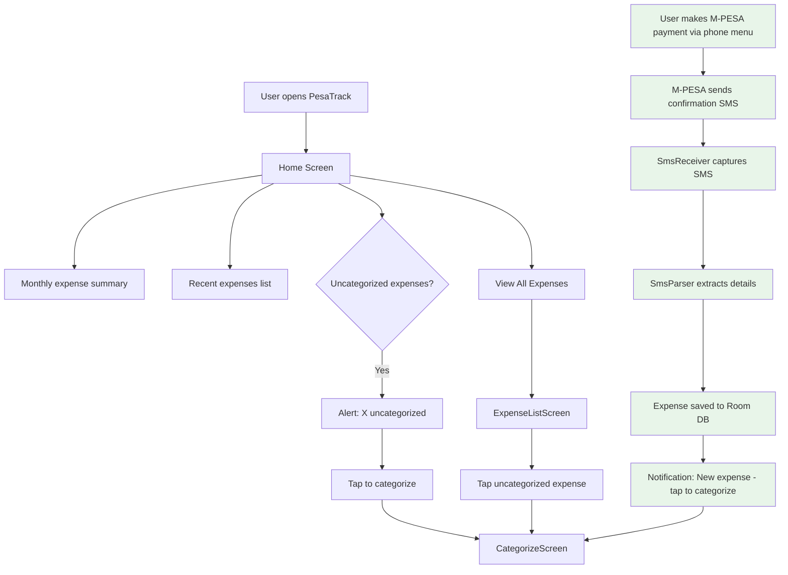

# STK Push Removal & SMS-Focused Redesign Plan

## Why This Change

STK Push (Lipa Na M-PESA Online) can only **collect money INTO your business Till/PayBill**. It cannot send money to another person, pay a different Till, or pay a different PayBill. Since PesaTrack is an **expense tracker** — not a payment collection platform — STK Push is the wrong tool.

The app already has SMS parsing built in ([`SmsReceiver.kt`](../android/app/src/main/java/com/pesatrack/services/SmsReceiver.kt) + [`SmsParser.kt`](../android/app/src/main/java/com/pesatrack/utils/SmsParser.kt)) that captures ALL M-PESA transactions automatically. This is the correct primary mechanism.

## What Changes

### Android App Changes

#### 1. Remove Payment Screen and Navigation

**Files to delete:**
- `android/.../screens/payment/PaymentScreen.kt`
- `android/.../screens/payment/PaymentUiState.kt`
- `android/.../screens/payment/PaymentViewModel.kt`

**Files to modify:**
- [`Screen.kt`](../android/app/src/main/java/com/pesatrack/presentation/navigation/Screen.kt) — Remove `Payment` screen route and `PAY` bottom nav item
- [`NavGraph.kt`](../android/app/src/main/java/com/pesatrack/presentation/navigation/NavGraph.kt) — Remove Payment composable route
- [`HomeScreen.kt`](../android/app/src/main/java/com/pesatrack/presentation/screens/home/HomeScreen.kt) — Remove `onNavigateToPayment` callback. Replace `QuickActionsRow` with SMS-tracking-oriented actions. Update `EmptyExpensesCard` messaging.

#### 2. Remove Payment Repository and API Endpoints

**Files to delete:**
- `android/.../data/repository/PaymentRepository.kt`
- `android/.../data/remote/dto/PaymentRequest.kt`
- `android/.../data/remote/dto/PaymentResponse.kt`
- `android/.../domain/models/PaymentResult.kt`

**Files to modify:**
- [`PesaTrackApi.kt`](../android/app/src/main/java/com/pesatrack/data/remote/api/PesaTrackApi.kt) — Remove `initiatePayment` and `getPaymentStatus` endpoints. Keep `healthCheck` if needed, or remove the entire API interface.
- [`AppModule.kt`](../android/app/src/main/java/com/pesatrack/di/AppModule.kt) — Remove Retrofit, OkHttp, and PesaTrackApi providers if no backend API is needed. Keep database and TelephonyManager providers.

#### 3. Redesign Home Screen

Replace the three payment quick-action buttons with actions relevant to expense tracking:

**Current:**
```
[ Send Money ] [ Buy Goods ] [ Pay Bill ]
```

**New:**
```
[ View Expenses ] [ Categorize ] 
```

Or alternatively, show a prominent info card explaining how PesaTrack works:

> **How PesaTrack Works**  
> Make payments normally via M-PESA menu. PesaTrack automatically reads the confirmation SMS and records your expense. Tap to categorize!

#### 4. Update `HomeScreen.kt` Navigation Callbacks

Remove `onNavigateToPayment: String to Unit` parameter. The HomeScreen should focus on:
- Monthly expense summary
- Recent expenses from SMS parsing
- Uncategorized expense alerts
- Quick link to all expenses

### Backend Changes

The backend (`backend/`) served two purposes:
1. **Daraja STK Push API** — no longer needed
2. **Transaction storage via callbacks** — no longer needed

**Decision: Keep the backend code but don't use it from the app.**

The backend code stays in the repository in case you add payment collection features later, but the Android app will no longer make API calls to it. This means:

- **No files deleted** from `backend/`
- Remove Retrofit/OkHttp from Android if no backend calls are needed
- OR keep the health check endpoint and Retrofit for potential future use

### Files That Stay Unchanged

These are the **core** of the app and remain fully functional:

| File | Purpose |
|------|---------|
| [`SmsReceiver.kt`](../android/app/src/main/java/com/pesatrack/services/SmsReceiver.kt) | Listens for incoming M-PESA SMS, auto-saves expenses |
| [`SmsParser.kt`](../android/app/src/main/java/com/pesatrack/utils/SmsParser.kt) | Parses Send Money, Buy Goods, Pay Bill SMS into expense records |
| [`NotificationHelper.kt`](../android/app/src/main/java/com/pesatrack/services/NotificationHelper.kt) | Shows categorize notification after SMS parse |
| [`ExpenseRepository.kt`](../android/app/src/main/java/com/pesatrack/data/repository/ExpenseRepository.kt) | Saves and queries expenses from Room DB |
| [`CategoryRepository.kt`](../android/app/src/main/java/com/pesatrack/data/repository/CategoryRepository.kt) | Category management |
| [`CategorizeScreen.kt`](../android/app/src/main/java/com/pesatrack/presentation/screens/categorize/CategorizeScreen.kt) | UI for categorizing an expense |
| [`ExpenseListScreen.kt`](../android/app/src/main/java/com/pesatrack/presentation/screens/expenses/ExpenseListScreen.kt) | Full expense history view |
| [`PesaTrackDatabase.kt`](../android/app/src/main/java/com/pesatrack/data/local/database/PesaTrackDatabase.kt) | Room database |

---

## Updated App Flow



---

## Impact Summary

### What Gets Removed
- Payment screen (form with phone number, amount, recipient)
- STK Push initiation flow
- Payment status polling
- PaymentRepository, PaymentRequest/Response DTOs
- Quick action buttons for Send Money / Buy Goods / Pay Bill
- Backend API calls from the Android app

### What Stays
- All SMS parsing and auto-expense-saving logic
- All expense viewing, categorizing, and tracking
- Notification system for new expenses
- Room database with all expense/category data
- Backend code in repository for potential future use

### What Gets Added/Changed
- New Home screen layout focused on viewing and categorizing
- Updated empty state messaging
- Simplified navigation with only Home and Expenses tabs

---

## Implementation Order

1. Remove Payment screen files and navigation routes
2. Update HomeScreen to remove payment-related UI
3. Remove PaymentRepository and related DTOs
4. Clean up AppModule DI - decide on keeping/removing Retrofit
5. Update bottom navigation
6. Test SMS parsing flow end-to-end
