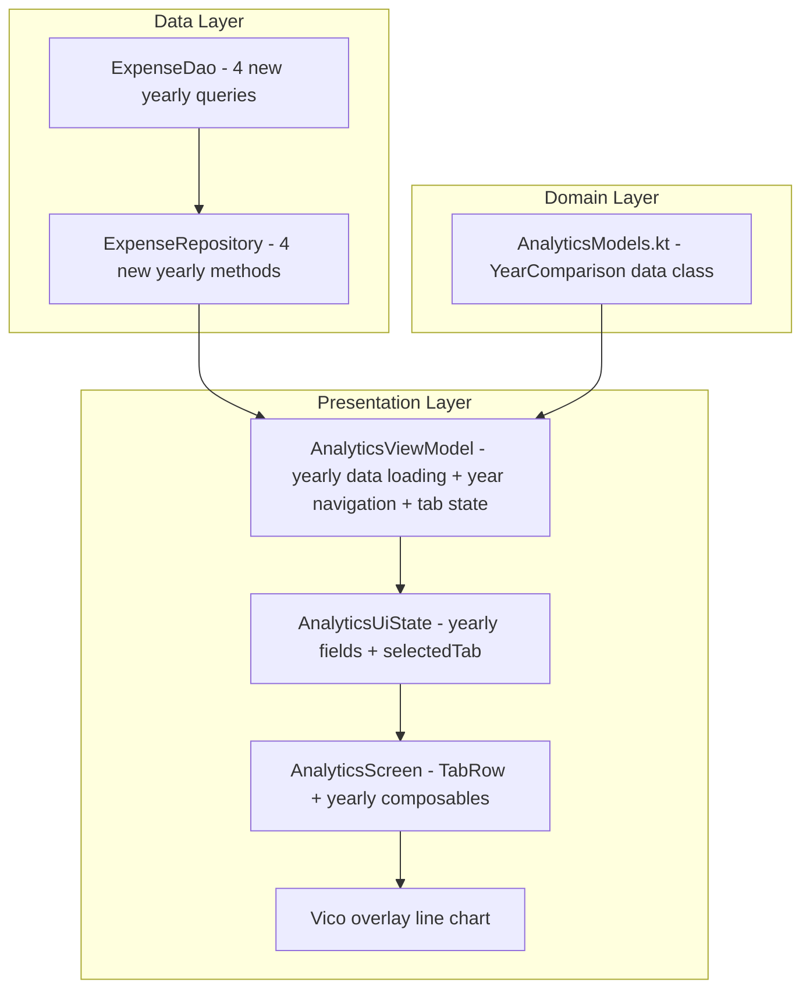
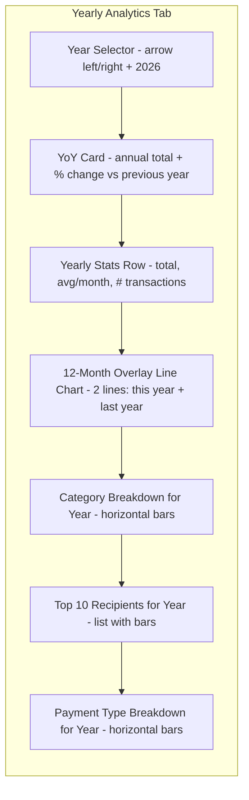

# PesaTrack — Year-over-Year Analytics Plan

## Overview

Add **Year-over-Year (YoY) analytics** to the existing Analytics screen. The feature introduces a **tab-based layout** switching between "Monthly" (existing) and "Yearly" (new) views within the same screen.

### What's Being Added

| Feature | Description |
|---------|-------------|
| Annual Total Spending Card | Total for selected year with YoY % change |
| Monthly Comparison Overlay Chart | Line chart: 12 months of selected year vs previous year |
| Category Breakdown by Year | Horizontal bar chart showing category totals for the full year |
| Top Spenders by Year | Top 10 recipients for the full year |
| Payment Type Breakdown by Year | Bar chart of payment types for the full year |
| Year Selector | Left/right arrows to navigate years (capped at current year) |

### Scope Decisions

| Include | Exclude |
|---------|---------|
| Year selector with arrow navigation | Arbitrary date range picker |
| Annual total + YoY % change card | Multi-year trend beyond 2 years |
| 12-month overlay chart (this year vs last year) | Weekly or quarterly sub-breakdowns |
| Category breakdown for full year | Budget vs actual comparisons |
| Top 10 spenders for full year | Forecasting or projection |
| Payment type breakdown for full year | Export functionality |
| Tab toggle: Monthly / Yearly | Separate screen or route |

---

## Architecture

### Tab-Based Layout

The Analytics screen gains a `TabRow` at the top with two tabs: **Monthly** and **Yearly**. The existing monthly analytics content stays as-is. The yearly tab shows the new YoY content.

```mermaid
flowchart TB
    subgraph Analytics Screen
        direction TB
        TABS[Tab Row: Monthly / Yearly]
        
        subgraph Monthly Tab - existing
            MONTH_SEL[Month Selector]
            MOM[Month-over-Month Card]
            STATS_M[Summary Stats]
            TREND_M[Monthly Trend Line Chart]
            CAT_TRENDS[Spending Trends - CV detection]
            DAILY[Daily Spending Columns]
            CAT_M[Category Breakdown]
            TOP_M[Top Recipients]
            PAY_M[Payment Type Breakdown]
        end
        
        subgraph Yearly Tab - new
            YEAR_SEL[Year Selector]
            YOY_CARD[Annual Total + YoY % Change Card]
            STATS_Y[Yearly Summary Stats]
            OVERLAY[12-Month Overlay Chart - this year vs last year]
            CAT_Y[Category Breakdown for Year]
            TOP_Y[Top Recipients for Year]
            PAY_Y[Payment Type Breakdown for Year]
        end
    end
    
    TABS --> MONTH_SEL
    TABS --> YEAR_SEL
```



### Data Flow



---

## New DAO Queries

Add to [`ExpenseDao.kt`](../android/app/src/main/java/com/pesatrack/data/local/database/dao/ExpenseDao.kt):

### a) Annual total for a year

```kotlin
@Query("""
    SELECT COALESCE(SUM(amount), 0.0)
    FROM expenses
    WHERE isExcluded = 0
      AND timestamp >= :startOfYear AND timestamp < :endOfYear
""")
suspend fun getAnnualTotal(startOfYear: Long, endOfYear: Long): Double
```

### b) Monthly totals for a specific year (12 data points)

Returns one row per month for the overlay chart. Used for both the selected year AND the previous year.

```kotlin
@Query("""
    SELECT
        CAST(strftime('%m', timestamp / 1000, 'unixepoch', 'localtime') AS INTEGER) AS monthNumber,
        COALESCE(SUM(amount), 0.0) AS total
    FROM expenses
    WHERE isExcluded = 0
      AND timestamp >= :startOfYear AND timestamp < :endOfYear
    GROUP BY monthNumber
    ORDER BY monthNumber ASC
""")
suspend fun getMonthlyTotalsForYear(
    startOfYear: Long,
    endOfYear: Long
): List<YearMonthTotal>
```

### c) Category totals for a full year

```kotlin
@Query("""
    SELECT
        c.id AS categoryId,
        COALESCE(c.name, 'Uncategorized') AS categoryName,
        c.color AS categoryColor,
        c.parentId AS parentId,
        COALESCE(SUM(e.amount), 0.0) AS total,
        COUNT(e.id) AS transactionCount
    FROM expenses e
    LEFT JOIN categories c ON e.categoryId = c.id
    WHERE e.isExcluded = 0
      AND e.timestamp >= :startOfYear AND e.timestamp < :endOfYear
    GROUP BY e.categoryId
    ORDER BY total DESC
""")
suspend fun getCategoryTotalsForYear(
    startOfYear: Long,
    endOfYear: Long
): List<CategoryTotal>
```

### d) Top spenders for a full year

```kotlin
@Query("""
    SELECT
        COALESCE(recipientName, recipient) AS recipientKey,
        COALESCE(SUM(amount), 0.0) AS total,
        COUNT(*) AS transactionCount
    FROM expenses
    WHERE isExcluded = 0
      AND timestamp >= :startOfYear AND timestamp < :endOfYear
    GROUP BY recipientKey
    ORDER BY total DESC
    LIMIT :limit
""")
suspend fun getTopSpendersForYear(
    startOfYear: Long,
    endOfYear: Long,
    limit: Int = 10
): List<TopSpender>
```

### e) Payment type breakdown for a full year

```kotlin
@Query("""
    SELECT
        paymentType,
        COALESCE(SUM(amount), 0.0) AS total,
        COUNT(*) AS transactionCount
    FROM expenses
    WHERE isExcluded = 0
      AND timestamp >= :startOfYear AND timestamp < :endOfYear
    GROUP BY paymentType
    ORDER BY total DESC
""")
suspend fun getPaymentTypeBreakdownForYear(
    startOfYear: Long,
    endOfYear: Long
): List<PaymentTypeTotal>
```

---

## New Data Classes

### DAO result class

Add to [`ExpenseDao.kt`](../android/app/src/main/java/com/pesatrack/data/local/database/dao/ExpenseDao.kt) alongside existing result classes:

```kotlin
/**
 * Monthly total within a specific year (for YoY overlay chart).
 * monthNumber is 1-12.
 */
data class YearMonthTotal(
    val monthNumber: Int,
    val total: Double
)
```

### Domain model

Add to [`AnalyticsModels.kt`](../android/app/src/main/java/com/pesatrack/domain/models/AnalyticsModels.kt):

```kotlin
/**
 * Year-over-Year comparison result.
 */
data class YearComparison(
    val currentYearTotal: Double,
    val previousYearTotal: Double,
    /** Positive = spending increased, negative = spending decreased */
    val percentageChange: Double,
    val currentYearLabel: String,    // e.g. "2026"
    val previousYearLabel: String    // e.g. "2025"
)
```

---

## Repository Methods

Add to [`ExpenseRepository.kt`](../android/app/src/main/java/com/pesatrack/data/repository/ExpenseRepository.kt):

```kotlin
// ==================== Yearly Analytics ====================

suspend fun getAnnualTotal(year: Int): Double {
    val (start, end) = getYearRange(year)
    return expenseDao.getAnnualTotal(start, end)
}

suspend fun getMonthlyTotalsForYear(year: Int): List<YearMonthTotal> {
    val (start, end) = getYearRange(year)
    return expenseDao.getMonthlyTotalsForYear(start, end)
}

suspend fun getCategoryTotalsForYear(year: Int): List<CategoryTotal> {
    val (start, end) = getYearRange(year)
    return expenseDao.getCategoryTotalsForYear(start, end)
}

suspend fun getTopSpendersForYear(year: Int, limit: Int = 10): List<TopSpender> {
    val (start, end) = getYearRange(year)
    return expenseDao.getTopSpendersForYear(start, end, limit)
}

suspend fun getPaymentTypeBreakdownForYear(year: Int): List<PaymentTypeTotal> {
    val (start, end) = getYearRange(year)
    return expenseDao.getPaymentTypeBreakdownForYear(start, end)
}

/**
 * Get start and end timestamps for a specific year.
 * Returns Pair(Jan 1 00:00:00, Jan 1 next year 00:00:00).
 */
fun getYearRange(year: Int): Pair<Long, Long> {
    val calendar = Calendar.getInstance()
    calendar.set(Calendar.YEAR, year)
    calendar.set(Calendar.MONTH, Calendar.JANUARY)
    calendar.set(Calendar.DAY_OF_MONTH, 1)
    calendar.set(Calendar.HOUR_OF_DAY, 0)
    calendar.set(Calendar.MINUTE, 0)
    calendar.set(Calendar.SECOND, 0)
    calendar.set(Calendar.MILLISECOND, 0)
    val start = calendar.timeInMillis
    calendar.add(Calendar.YEAR, 1)
    val end = calendar.timeInMillis
    return Pair(start, end)
}
```

---

## UI State Changes

Update [`AnalyticsUiState.kt`](../android/app/src/main/java/com/pesatrack/presentation/screens/analytics/AnalyticsUiState.kt) with new fields:

```kotlin
data class AnalyticsUiState(
    // ... existing fields unchanged ...

    // Tab selection
    val selectedTab: AnalyticsTab = AnalyticsTab.MONTHLY,

    // Yearly analytics
    val selectedYear: Int = 0,          // reuse for yearly tab
    val yearlyIsLoading: Boolean = false,
    val yearComparison: YearComparison? = null,
    val yearlyTotalForYear: Double = 0.0,
    val yearlyTransactionCount: Int = 0,
    val yearlyAvgMonthlySpend: Double = 0.0,
    val currentYearMonthlyTotals: List<YearMonthTotal> = emptyList(),
    val previousYearMonthlyTotals: List<YearMonthTotal> = emptyList(),
    val yearlyCategoryBreakdown: List<CategoryTotal> = emptyList(),
    val yearlyTopSpenders: List<TopSpender> = emptyList(),
    val yearlyPaymentTypeBreakdown: List<PaymentTypeTotal> = emptyList(),
)

enum class AnalyticsTab {
    MONTHLY,
    YEARLY
}
```

---

## ViewModel Changes

Add to [`AnalyticsViewModel.kt`](../android/app/src/main/java/com/pesatrack/presentation/screens/analytics/AnalyticsViewModel.kt):

### New methods

```kotlin
fun selectTab(tab: AnalyticsTab) {
    _uiState.update { it.copy(selectedTab = tab) }
    if (tab == AnalyticsTab.YEARLY && _uiState.value.yearComparison == null) {
        // First time opening yearly tab — load data
        loadYearlyData()
    }
}

fun previousYear() {
    _uiState.update { it.copy(
        selectedYear = it.selectedYear - 1,   // NOTE: selectedYear is shared
        yearlyIsLoading = true
    )}
    loadYearlyData()
}

fun nextYear() {
    val currentYear = Calendar.getInstance().get(Calendar.YEAR)
    if (_uiState.value.selectedYear >= currentYear) return
    _uiState.update { it.copy(
        selectedYear = it.selectedYear + 1,
        yearlyIsLoading = true
    )}
    loadYearlyData()
}

fun canGoNextYear(): Boolean {
    return _uiState.value.selectedYear < Calendar.getInstance().get(Calendar.YEAR)
}

private fun loadYearlyData() {
    val year = _uiState.value.selectedYear
    viewModelScope.launch {
        try {
            val annualTotal = expenseRepository.getAnnualTotal(year)
            val prevTotal = expenseRepository.getAnnualTotal(year - 1)
            val currentMonths = expenseRepository.getMonthlyTotalsForYear(year)
            val prevMonths = expenseRepository.getMonthlyTotalsForYear(year - 1)
            val categories = expenseRepository.getCategoryTotalsForYear(year)
            val topSpenders = expenseRepository.getTopSpendersForYear(year, 10)
            val paymentTypes = expenseRepository.getPaymentTypeBreakdownForYear(year)

            val pctChange = if (prevTotal > 0) {
                ((annualTotal - prevTotal) / prevTotal) * 100.0
            } else if (annualTotal > 0) 100.0 else 0.0

            val yearComparison = YearComparison(
                currentYearTotal = annualTotal,
                previousYearTotal = prevTotal,
                percentageChange = pctChange,
                currentYearLabel = year.toString(),
                previousYearLabel = (year - 1).toString()
            )

            val txCount = categories.sumOf { it.transactionCount }
            // Months elapsed: if current year, use current month; otherwise 12
            val now = Calendar.getInstance()
            val monthsElapsed = if (year == now.get(Calendar.YEAR)) {
                now.get(Calendar.MONTH) + 1  // 1-based
            } else 12
            val avgMonthly = if (monthsElapsed > 0) annualTotal / monthsElapsed else 0.0

            // Fill missing months (1-12) with 0 for both years
            val filledCurrent = fillYearMonths(currentMonths)
            val filledPrev = fillYearMonths(prevMonths)

            _uiState.update { it.copy(
                yearlyIsLoading = false,
                yearComparison = yearComparison,
                yearlyTotalForYear = annualTotal,
                yearlyTransactionCount = txCount,
                yearlyAvgMonthlySpend = avgMonthly,
                currentYearMonthlyTotals = filledCurrent,
                previousYearMonthlyTotals = filledPrev,
                yearlyCategoryBreakdown = categories,
                yearlyTopSpenders = topSpenders,
                yearlyPaymentTypeBreakdown = paymentTypes,
            )}
        } catch (e: Exception) {
            _uiState.update { it.copy(
                yearlyIsLoading = false,
                error = "Failed to load yearly analytics: ${e.message}"
            )}
        }
    }
}

/**
 * Ensure all 12 months are represented (gap-fill with 0).
 */
private fun fillYearMonths(data: List<YearMonthTotal>): List<YearMonthTotal> {
    val map = data.associateBy { it.monthNumber }
    return (1..12).map { m -> map[m] ?: YearMonthTotal(monthNumber = m, total = 0.0) }
}
```

---

## Analytics Screen Layout — Yearly Tab

The yearly tab is a `LazyColumn` with these sections:



### Year Selector
- Same style as month selector: left/right arrows + year label in the center
- Capped at current year (no future)

### YoY Comparison Card
- Large annual total (e.g. "KES 1,234,567.00")
- `↑ 15%` or `↓ 8%` vs previous year
- Color-coded: green = spending less, red = spending more
- Shows previous year total below

### Yearly Summary Stats Row
- Average per month
- Total transaction count

### 12-Month Overlay Chart (Vico)
- **Two line series** on one chart:
  - Solid primary line = selected year (e.g. 2026)
  - Dashed/lighter secondary line = previous year (e.g. 2025)
- X-axis: Jan–Dec (abbreviated month names)
- Y-axis: KES amounts
- Legend showing which line is which year

### Category Breakdown (reuse `CategoryBreakdownChart`)
- Same horizontal bar chart composable as monthly, but fed yearly data

### Top 10 Recipients (reuse `TopSpenderRow`)
- Same list composable as monthly, but fed yearly data

### Payment Type Breakdown (reuse `PaymentTypeBreakdownChart`)
- Same horizontal bar chart composable as monthly, but fed yearly data

---

## Files Changed

| File | Changes |
|------|---------|
| [`ExpenseDao.kt`](../android/app/src/main/java/com/pesatrack/data/local/database/dao/ExpenseDao.kt) | Add 5 new yearly queries + `YearMonthTotal` data class |
| [`ExpenseRepository.kt`](../android/app/src/main/java/com/pesatrack/data/repository/ExpenseRepository.kt) | Add 5 yearly wrapper methods + `getYearRange()` helper |
| [`AnalyticsModels.kt`](../android/app/src/main/java/com/pesatrack/domain/models/AnalyticsModels.kt) | Add `YearComparison` data class |
| [`AnalyticsUiState.kt`](../android/app/src/main/java/com/pesatrack/presentation/screens/analytics/AnalyticsUiState.kt) | Add `AnalyticsTab` enum + yearly state fields |
| [`AnalyticsViewModel.kt`](../android/app/src/main/java/com/pesatrack/presentation/screens/analytics/AnalyticsViewModel.kt) | Add tab management, year navigation, `loadYearlyData()`, `fillYearMonths()` |
| [`AnalyticsScreen.kt`](../android/app/src/main/java/com/pesatrack/presentation/screens/analytics/AnalyticsScreen.kt) | Add `TabRow`, yearly tab content, `YearComparisonCard`, `YearlyOverlayChart`, year selector composables |

No new files needed — all changes extend existing files.

---

## Implementation Order

1. **Add DAO queries** — 5 new Room queries + `YearMonthTotal` result class
2. **Add domain model** — `YearComparison` in `AnalyticsModels.kt`
3. **Add repository methods** — 5 yearly wrappers + `getYearRange()` helper
4. **Update AnalyticsUiState** — Add `AnalyticsTab` enum + yearly state fields
5. **Update AnalyticsViewModel** — Tab management, year navigation, yearly data loading
6. **Update AnalyticsScreen** — Add `TabRow` at top, yearly tab content with all chart sections
7. **Test** — Verify monthly tab unchanged, yearly tab loads correctly, year navigation works
8. **Update implementation status** — Mark YoY analytics as complete in `_docs/implementation-status.md`

---

## Vico Overlay Chart Details

The 12-month overlay is a multi-series line chart with Vico:

```kotlin
// Two line series on one chart
CartesianChartHost(
    chart = rememberCartesianChart(
        rememberLineCartesianLayer(
            lineProvider = LineCartesianLayer.LineProvider.series(
                // Current year — solid primary
                LineCartesianLayer.rememberLine(
                    fill = LineCartesianLayer.LineFill.single(
                        fill(MaterialTheme.colorScheme.primary)
                    )
                ),
                // Previous year — lighter/secondary
                LineCartesianLayer.rememberLine(
                    fill = LineCartesianLayer.LineFill.single(
                        fill(MaterialTheme.colorScheme.outline)
                    )
                ),
            )
        ),
        startAxis = VerticalAxis.rememberStart(),
        bottomAxis = HorizontalAxis.rememberBottom(
            valueFormatter = monthAbbreviationFormatter
        ),
        legend = rememberHorizontalLegend(...)
    ),
    modelProducer = modelProducer,
)

// Model with two series
modelProducer.runTransaction {
    lineSeries {
        series(currentYearMonthlyTotals.map { it.total })  // Series 0: 2026
        series(previousYearMonthlyTotals.map { it.total }) // Series 1: 2025
    }
}
```

---

## Risk & Considerations

| Risk | Mitigation |
|------|-----------|
| Large yearly queries slow on many records | All queries filter by year range; `timestamp` column is indexed |
| No data for previous year | Show "No previous year data" in YoY card; overlay shows single line |
| Tab state lost on config change | State held in ViewModel's `StateFlow` — survives rotation |
| Recomposition cost of tab switch | Yearly data loaded lazily on first tab switch, then cached in `UiState` |
| Vico multi-series compatibility | Vico 2.0.1 supports multiple `series()` calls in `lineSeries {}` block |
